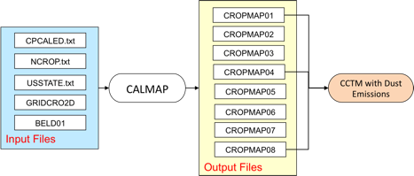
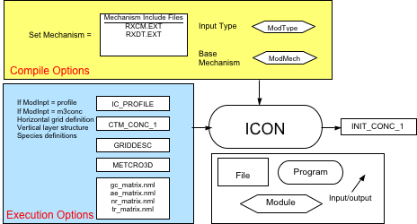
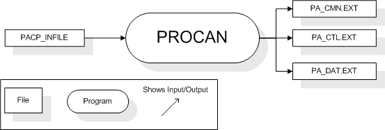

CMAQ Programs and Libraries
===========================

Overview
--------

The core CMAQ programs that are needed to perform a basic air quality model simulation are MCIP, ICON, BCON, JPROC, and CCTM. The relationships among these programs are depicted within the green box in [Figure 7-1](#Figure5-1). The blue boxes represent programs that are not part of the CMAQ distribution package but supply data necessary for an air quality simulation (emissions and meteorology data). The yellow boxes represent the standard CMAQ preprocessors: MCIP, ICON, BCON, and JPROC. The red box represents the CMAQ chemistry-transport model (CCTM), the Eulerian air quality modeling component of CMAQ. Data flows between the CMAQ programs are represented in [Figure 7‑1](#Figure5-1) by arrows. The red arrows illustrate the flow of data from the CMAQ preprocessors and the emissions model to CCTM. The green arrows show the data feedbacks from CCTM to create initial and boundary conditions for nested simulations. The black arrow illustrates the connection between the meteorological model and MCIP. Finally, the blue arrow shows that the output from MCIP can be used to drive an emissions model.

The meteorological model**,** such as MM5 or WRF‑ARW, generates gridded meteorology for input to both CMAQ and the emissions model.

The emissions model converts emissions inventories to gridded, hourly emissions formatted for CMAQ. The SMOKE and CONCEPT emissions models are currently available for preparing emissions data for CMAQ.

CMAQv5 includes two in-line options for emissions: the user can incorporate the processing of biogenic emissions, or of point-source plume rise, or both, directly in a CCTM simulation. Previous versions of CMAQ required that biogenic emissions and point-source plume rise were provided from input files as pre-calculated hourly values. There are several advantages of incorporating these processes directly in a CCTM simulation: (1) the emissions are meteorologically modulated at the synchronization (chemistry) time step rather than being linearly time-interpolated within each simulation hour; (2) disk space may be saved, because a 3‑D emissions file is no longer needed for elevated point sources; and (3) CMAQ can more easily be coupled with a meteorological model, enabling direct emissions modulation by the underlying, freshly computed meteorological variables. In-line emissions are an option in CMAQv5, the traditional approaches of computing biogenic and 3-d point source emissions off-line are still available. Details about configuring CMAQ for in-line emissions are provided in [Section 7.3](#CCTM)

MCIP is the first program in the CMAQ distribution package that a user should run when setting up a new simulation. MCIP is used to preprocess the data from a meteorological model for CMAQ and SMOKE.

**Figure 7‑1.CMAQ core programs**

ICON creates a binary netCDF initial conditions file for input to CCTM. Users have the option to create initial conditions data either from a text file of vertical concentration profiles or from an existing CCTM output file. ICON outputs initial conditions data that are configured for a specific modeling grid and chemical parameterization.

BCON creates a binary netCDF lateral boundary conditions file for input to CCTM. Users have the option to create boundary conditions from either a text file of vertical concentration profiles or from an existing CCTM or larger-scale (e.g., global-scale) output file. BCON outputs boundary conditions data that are configured for a specific modeling grid and chemical parameterization. If derived from an existing CCTM or larger-scale output file, BCON produces dynamic boundary conditions that vary in time and space. When derived from vertical concentration profiles, BCON produces static boundary conditions for input to CCTM.

JPROC converts physical information about photoreactive molecules into clear-sky photolysis rate look-up tables for input to CCTM. CMAQv5 includes a feature for calculating photolysis rates in-line in CCTM. The in-line photolysis approach allows photolysis rates to be adjusted by simulated gas and aerosol concentrations rather than by climatological values in the off-line approach.

CCTM is run last in the sequence of programs. All of the other CMAQ programs and the emissions and meteorological models are used to prepare the inputs to CCTM. By using data that are synchronized for a particular modeling time period, model grid, vertical layer configuration, and chemical parameterization, CCTM can produce estimates of pollutant concentrations, wet and dry deposition rates, and visibility metrics at a time granularity set by the user.

In addition to the core programs shown in [Figure 7‑1](#Figure5-1), the CMAQ distribution package also includes utilities and libraries for utilizing some of the special features in CMAQ and for setting up CCTM for multiprocessor computing. CMAQ includes the PROCAN utility for preparing process analysis simulations, and CHEMMECH for editing existing and preparing new chemical mechanisms for CMAQ. The program LTNG\_2D\_DATA converts monthly lightning flash counts and ratios of cloud-to-cloud and cloud-to-ground flashes into an input file for CCTM. The stencil exchange code library (STENEX) is a module that CCTM uses to control the communication between processors in a multiprocessor computing environment. Similarly, CCTM uses the parallel I/O (PARIO) code library to synchronize the reading and writing of information among multiple processors.

In the remaining sections of this section, we provide detailed descriptions of these programs, utilities, and libraries, in alphabetical order. Information about the third-party libraries used by CMAQ—such as I/O API, netCDF, and MPICH—is available in [Section 6](#Required_Libraries).

When viewing the tables that list each program’s input and output files, recall that the various file formats shown are described in [Table 4-2](#Table4-2).

BCON
----

### Description

The program BCON prepares lateral chemical boundary conditions (BCs) for CCTM from either ASCII vertical profiles or from an existing CCTM output concentration (CONC) file. The BCs created by BCON can be static in both time and space (i.e., time-invariant with uniform concentrations in all boundary grid cells), dynamic in both time and space, or a combination of the two. The ASCII vertical profiles are primarily used to create static BCs. Dynamic BCs can be extracted from CONC files on either the same horizontal grid spacing (i.e., as a windowed modeling domain) or for a finer-resolution model grid (i.e., for a nested simulation), or they can be interpolated from a larger-scale CTM simulation (which is analogous to defining lateral BCs for MM5 or WRF‑ARW).

There are two distinct modes of operation for BCON, and the mode used depends on the nature of the input data. When creating BCON executables, the user must specify whether the input data will be ASCII vertical profiles or a CONC file by selecting either “profile” or “m3conc”, respectively, for the setting of the *ModInpt* variable. This variable determines the input module to use when creating a BCON executable.

CCTM can also be forced with chemical boundary conditions downscaled from global chemistry models (GCMs), such as GEOS-Chem and MOZART. BCON does not support the processing of data from GCMs. BCs derived from GCMs must be calculated with custom codes or scripts that are not available in the CMAQ distribution package. For a correspondence between GEOS-Chem species/tracers and CMAQ species, see [here](http://wiki.seas.harvard.edu/geos-chem/index.php/GEOS-Chem_to_CMAQv5.0).

### Files, configuration, and environment variables

[Figure 7‑2](#Figure5-2) shows the input and output files and configuration options for BCON. A distinction is made between the options that are invoked at compilation versus those invoked at execution of the program. When compiling BCON, the user specifies a chemical mechanism to configure the gas-phase chemistry and aerosol mechanism used to create the chemical BCs. Setting the *ModMech* and *Mechanism* variables in the BCON compile script configures the program to use a specific set of mechanism INCLUDE files to build an executable. Setting the *ModType* variable in the BCON compile script configures the program to input either a text file of static concentrations or a binary netCDF file of time-dependent concentrations for estimating BCs for CCTM. Separate BCON executables must be prepared for different mechanism and input file configurations.

**Figure 7‑2. BCON input and output files**

At execution the user provides a data file of chemical conditions that BCON converts to BCs on a predefined model grid. Through the specification of the *ModInpt* variable in the BCON run script, BCON will input either an ASCII vertical profile file (BC\_PROFILE) or an existing CCTM concentration file (CTM\_CONC\_1); the choice depends on how the user compiled the model. The BC input file provided by the user must have chemical speciation that is consistent with the mechanism configuration of the BCON executable. For example, if BCON was compiled to create BCs using the CB05 mechanism, the input BC profile data must be in terms of the CB05 mechanism. CMAQv5 is distributed with ASCII vertical profiles representing clean continental BCs for North America for the following chemical mechanisms: cb05\_ae6\_aq, saprc07t\_ae6\_aq, and saprc99\_ae6\_aq. It is the user’s responsibility to generate BC inputs for other mechanism configurations.

The horizontal grid and vertical layer structures for BCON are defined at execution through the input of a grid description (GRIDDESC) file and a meteorology cross-point 3‑D (MET\_CRO\_3D) file, respectively. BCON interpolates between the input vertical layer structure and output layer structure if they are different.

#### BCON input files

**Table 7‑1. BCON input files**

|**File Name**|**Format**|**Description**|
|---|---|---|
|BC\_PROFILE|ASCII|Vertical chemical profiles from which to derive boundary conditions; this file is created by the user; used only when the BC environment variable is set to “profile”|
|CTM\_CONC\_1|GRDDED3|CMAQ concentration file from which to derive boundary conditions; this file is output from CCTM; used only when the BC environment variable is set to “m3conc”|
|MET\_CRO\_3D\_CRS|GRDDED3|Name and location of the coarse-grid MET\_CRO\_3D file that is required for creating the vertical grid structure if this structure changes between nested simulations; this file is output by MCIP|
|MET\_CRO\_3D\_FIN|GRDDED3|Name and location of the fine-grid MET\_CRO\_3D file that is required if the vertical grid structure changes between nested simulations; this file is output by MCIP|
|GRIDDESC|ASCII|Horizontal grid description file for defining the model grid; this file is output by MCIP or can be created by the user|
|LAYER\_FILE|GRDDED3|3-D cross-point meteorology (METCRO3D) file for defining the vertical layer structure of the model grid; this file is output by MCIP|
|gc\_matrix.nml|ASCII|Namelist file for defining the gas-phase species that are input to the model through the boundary|
|ae\_matrix.nml|ASCII|Namelist file for defining the aerosol species that are input to the model through the boundary|
|nr\_matrix.nml|ASCII|Namelist file for defining the non-reactive species that are input to the model through the boundary|
|tr\_matrix.nml|ASCII|Namelist file for defining the tracer species that are input to the model through the boundary|

#### BCON compilation options

The configuration options listed here are set during compilation of the BCON executable. When these options are invoked they create a binary executable that is fixed to the specified configuration. To change these options you must recompile BCON and create a new executable.

-   Opt:[default: verbose]
    Defines the action to be taken by the program Bldmake when extracting source code from CVS and compiling an executable.
    -   *compile\_all:* force compile, even if all the object files are current
    -   *clean\_up:* remove all source files upon successful compilation
    -   *no\_compile:* do everything except compile
    -   *no\_link:* do everything except link
    -   *one\_step:* compile and link in one step
    -   *parse\_only:* check configuration file syntax
    -   *show\_only:* show requested commands but do not execute them
    -   *verbose:* show requested commands as they are executed

-   MakeOpt
     Uncomment to build a Makefile to compile the executable.

-   ModType:[default: module profile]
    Defines the format of the boundary conditions input files to be used by BCON.
    -   *m3conc*: input a CCTM CONC file; used for nested simulations or windows of a parent domain
    -   *profile*: input an ASCII vertical profiles file
    -   *tracer*:'' ''

-   ModMech:[default: module cb05]
    Defines the base gas-phase mechanism to use for creating boundary conditions.
    -   *cb05*: Carbon Bond version 05
    -   *saprc99*: SAPRC version 1999
    -   *saprc07t*: SAPRC version 2007 with updated toluene mechanism

-   Mechanism: [default: cb05tucl\_ae6\_aq]
    Specifies the gas-phase, aerosol, and aqueous-phase chemical mechanisms for which to create boundary conditions. The choices for the *Mechanism* variable are the mechanism directory names under the \$M3MODEL/include/release directory. Examples include:
    -   *cb05cl\_ae5\_aq*: CB05 gas-phase mechanism with active chlorine chemistry, fifth-generation CMAQ aerosol mechanism with sea salt, aqueous/cloud chemistry
    -   *cb05tucl\_ae5\_aq*: CB05 gas-phase mechanism with active chlorine chemistry, updated toluene mechanism, fifth-generation CMAQ aerosol mechanism with sea salt, aqueous/cloud chemistry
    -   *cb05tucl\_ae6\_aq*: CB05 gas-phase mechanism with active chlorine chemistry, updated toluene mechanism, sixth-generation CMAQ aerosol mechanism with sea salt and speciated PM Other, aqueous/cloud chemistry
    -   *cb05tump\_ae6\_aq*: CB05 gas-phase mechanism with active chlorine chemistry, updated toluene mechanism, mercury, and air toxics, sixth-generation CMAQ aerosol mechanism with sea salt and speciated PM, aqueous/cloud chemistry; this is the CMAQv5 multipollutant mechanism
    -   *saprc99\_ae5\_aq*: SAPRC-99 gas-phase mechanism, fifth-generation CMAQ aerosol mechanism with sea salt, aqueous/cloud chemistry
    -   *saprc99\_ae6\_aq*: SAPRC-99 gas-phase mechanism, sixth-generation CMAQ aerosol mechanism with sea salt, aqueous/cloud chemistry
    -   *saprc07tb\_ae6\_aq*: SAPRC-07 gas-phase mechanism with toluene updates and sixth-generation CMAQ aerosol mechanism

#### BCON compilation

First, it is assumed that you have already installed and compiled the I/O API and netCDF libraries (see [Section 5.2.3](#Configuring_your_system_for_compiling_CMAQ)).

[Section 5.3](#Benchmarking) provides an overview of how to install and compile the CMAQ programs for the benchmark simulation. Follow the steps outlined in [Section 5.3](#Benchmarking) (summarized below) to compile new versions of BCON:

-   If you have not already done so, compile Bldmake, the CMAQ source code and compilation management program. This needs to be done only once—the first time CMAQ is installed.
-   If needed, configure the BCON build script to use the available I/O API and netCDF libraries.
-   Configure the BCON build script for your application (using the options discussed in [Section 7.2.2.2](#BCON_compilation_options)
-   Invoke the build script to create an executable:

`./bldit.bcon`

#### BCON execution options

The environment variables listed here are invoked during execution of the program and are set in the BCON run script.

-   `EXEC: [default: BCON_${APPL}_${EXECID}]`
    Executable to use for the simulation. The variable CFG is set in the BCON run script. The variable EXECID is set in the config.cmaq configuration file.

-   `GRIDDESC: [default: $M3HOME/scripts/GRIDDESC1]`
    Grid description file for setting the horizontal grid definition.

-   `GRID_NAME: [default:CMAQ-BENCHMARK]`
    Name of the grid definition contained in the GRIDDESC file that specifies the horizontal grid for the current application of the model.

-   `IOAPI_ISPH: [default: 19]`
    I/O API setting for spheroid type. See I/O API documentation for [setsphere](https://www.cmascenter.org/ioapi/documentation/3.1/html/SETSPHERE.html) for more information.

-   `IOAPI_OFFSET_64: [default: NO]`
    I/O API setting for large time-step records. If your output time step is going to produce data that are \>2GB per time step, then this needs to be set to YES.

-   `LAYER_FILE:[default: none]`
    Name and location of a MET\_CRO\_3D file for specifying the vertical layer structure for the current application of the model.

-   `gc_matrix.nml: [default: none]`
    Gas-phase species namelist file. This file is used to configure the gas-phase species that will be output by BCON.

-   `ae_matrix.nml: [default: none]`
    Aerosol-phase species namelist file. This file is used to configure the aerosol-phase species that will be output by BCON

-   `nr_matrix.nml: [default: none]`
    Nonreactive species namelist file. This file is used to configure the nonreactive species that will be output by BCON

-   `tr_matrix.nml: [default: none]`
    Tracer species namelist file. This file is used to configure the tracer species that will be output by BCON

-   `OUTDIR: [default: $M3DATA/bcon]`
    Output data directory.

-   BC:
    Sets the input file type. The setting of this variable determines how the run script sets the input and output environment variables.
    -   *profile*: sets the output file name to include the tag “profile” in the name; uses the variable BC\_PROFILE to point to an ASCII vertical profile file for input to BCON. Also optionally looks for the variable MECH\_CONV\_FILE to point to a user-defined mechanism conversion file.
    -   *m3conc*: used for nested simulations; sets the output file name to include a start date in the name; uses the variable CTM\_CONC\_1 to point to a CCTM CONC file for input to BCON.
-   DATE:
    Sets the Julian date to use in naming the BCON output file for nested runs.

-   `SDATE:[default: ${DATE}]`
    Julian start date for extracting boundary conditions from a CCTM CONC file for a nested simulation. If SDATE is not set, it will be set automatically from the CTM\_CONC\_1 file.

-   `STIME: [default: 000000 ]`
    Start time for extracting boundary conditions from a CCTM CONC file for a nested simulation. If STIME is not set, it will be set automatically from the CTM\_CONC\_1 file.

-   `RUNLEN: [default: 240000]`
    Number of hours of boundary conditions to extract from a CCTM CONC file for a nested simulation. If RUNLEN is not set, it will be set automatically from the CTM\_CONC\_1 file.

#### BCON output files

**Table 7‑2. BCON output files**

|**File Name**|**Format**|**Description**|
|---|---|---|
|`BNDY_CONC_1`|`BNDARY3`|Name and location of the gridded boundary conditions data output on the model grid defined by `GRID_NAME`|

The default location of the BCON output files is the `$M3DATA/bcon` directory, controlled by the `OUTDIR` variable in the run script. The default naming convention for all BCON output files uses the `APPL` and `GRID_NAME` environment variables in the file name. For boundary conditions created from existing `CCTM CONC` files, the Julian date is also used in the file name through the `DATE` environment variable. All of the file-naming variables for `BCON` outputs are set in the run script.

Calmap
------

### Description

The program Calmap produces gridded planting start dates, planting end dates, and harvesting end dates for different crop types for estimating the impacts of agricultural activities on windblown dust emissions. The CMAQ windblown dust emissions module can optionally use the output from Calmap to simulate the effects of crop cycles on dust emissions.

### Files, configuration, and environment variables

Figure 5-3 shows that Calmap reads five input files to produce a eight outputs, only three of which are used by the CCTM. Calmap uses the GRIDCRO2D file, produced by MCIP, to define the modeling grid. The BELD01 file points to a BELD3 “a” file of gridded land cover/land use data containing coverage for several different crop categories. The BELD3 “a” file is an input to the BEIS emissions model and can be [generated by the Spatial Allocator](http://www.ie.unc.edu/cempd/projects/mims/spatial/smoke_bio_inputs.html). The rest of the inputs to Calmap are crop calendar data for the United States that are packaged with CMAQv5. Calmap converts to the data to I/O API GRDDED3 files on the modeling grid defined in the GRIDCRO2D file. The CROPMAP01 file contains planting start dates for specific crops. The CROPMAP04 file contains planting end dates for specific crops. The CROPMAP08 file contains harvesting end dates for specific crops. Each of these files are input to the CCTM when the erodible agricultural land (CTM\_ERODE\_AGLAND) feature is turned on.

**Figure 7‑3.Calmap input and output files**

### Calmap input files

**Table 7‑3. Calmap input files**

|**File Name**|**Format**|**Description**|
|---|---|---|
|GRID\_CRO\_2D|GRDDED3|Name and location of the time-independent 2-D cross-point meteorology file; output by MCIP|
|BELD01|GRDDED3|BELD land use “A” data file for calculating windblown dust emissions; produced with BELD land use tiles and the Spatial Allocator|
|CPCALED|ASCII|Calendar of agricultural activities by state|
|NCROP|ASCII|Number and names of crop species included in the crop calendar|
|USSTATE|ASCII|Two digit US state codes included in the crop calendar|

### Calmap compilation

Calmap is compiled with a Makefile. The configuration options in the Makefile include only the compiler and compiler flags to use for building the executable. The Makefile is located in the directory with the Calmap source code (\$M3HOME/calmap/src). To compile Calmap, source the config.cmaq file and invoke the Makefile at the command line:

`./make`

To port Calmap to different compilers, change the compiler names, locations, and flags in the Makefile

### Calmap execution options

The environment variables listed here are invoked during execution of the program and are set in the Calmap run script.

-   BASE: [default: \$M3HOME/scripts/calmap]

Base Calmap installation location.

-   GRID\_CRO\_2D: [default: none]

Directory path and name of the GRID\_CRO\_2D file for defining the modeling grid.

-   BELD01: [default: none]

Directory path and name of the BELD3 “A” file for defining the gridded land cover/land use in the modeling domain. Note that this is the same file used by the CCTM to compute dust emissions (DUST\_LU\_1).

-   CROPMAP01-08: [default: none]

Directory path and names of Calmap output files. The CROPMAP01, CROPMAP04, and CROPMAP08 are the only files used by the CCTM for the dust calculation.

### Calmap output files

**Table 7‑4. Cropmap output files**

|**File Name**|**Format**|**Description**|
|---|---|---|
|CROPMAP01|GRDDED3|Name and location of the gridded planting start dates file.|
|CROPMAP02|GRDDED3|Name and location of the gridded ??? start dates file; not used by the CCTM.|
|CROPMAP03|GRDDED3|Name and location of the gridded ??? dates file; not used by the CCTM|
|CROPMAP04|GRDDED3|Name and location of the gridded planting end dates file.|
|CROPMAP05|GRDDED3|Name and location of the gridded ??? start dates file; not used by the CCTM|
|CROPMAP06|GRDDED3|Name and location of the gridded ??? start dates file; not used by the CCTM|
|CROPMAP07|GRDDED3|Name and location of the gridded harvesting end dates file.|

CCTM
----

### Description

CCTM is the Eulerian chemistry and transport component of CMAQ. It uses input data produced by the other CMAQ programs and from meteorological and emissions models. CCTM produces multiple output files for each simulation. The basic CCTM outputs include instantaneous and average hourly concentration files, wet and dry deposition files, and visibility estimates. Other CCTM outputs can include diagnostic aerosol and cloud files and processes analysis files.

CCTM contains several science configurations for simulating transport, chemistry, and deposition. All of the science configuration options in CCTM, such as the chemical mechanism to be used, are set when compiling the executable. The model grid and vertical layer structure for CCTM are set at execution. The important distinction between selecting the science configura­tion and the model grid/layer configuration is that CCTM does not need to be recompiled when changing model grids/layers but does need to be recompiled when new science options are invoked.

Optional output files are created when their associated processes are invoked in CCTM. For example, when CCTM is compiled with process analysis turned on, additional output files are created.

CCTM includes options for the in-line processing of emissions and photolysis rates. In-line refers to the handling of processes that had previously been accomplished outside of CCTM, such as emissions processing with SMOKE, with algorithms internal to CCTM. The benefits of in-line emissions processing include the integration of higher time-resolution meteorology in the computation of biogenic emissions and plume rise from point sources and the avoidance of the large data storage burden required for emissions data. The benefit of in-line photolysis rate calculations is the inclusion of predicted gas and aerosol concentrations in the rate calculations.

Both in-line emissions and photolysis are invoked through compile-time configuration options for CCTM. When CCTM is instrumented for in-line emissions calculations, a series of additional input files and environment variables are required at execution. The details of these additional inputs are provided below. In-line photolysis does not require any additional inputs as CCTM includes all of the photolysis rate data internal to the in-line instrumented version of the model.

### Files, configuration, and environment variables

[Figure 7‑4](#Figure7-4) shows the input and output files and configuration options for CCTM. A distinction is made between the options that are invoked at compilation time versus those invoked at execution of the program. When compiling CCTM, the user specifies a chemical mechanism to configure the gas-phase chemistry and aerosol mechanism used for the air quality calculations. Setting the *Mechanism* variable in CCTM compile script configures the program to use a specific set of mechanism INCLUDE files to build an executable. All of the science processes simulated by CCTM must also be selected during the compilation step for CCTM. Separate CCTM executables must be prepared for different mechanism and science configurations. During the execution step, or when CCTM is run, the user sets the horizontal and vertical grid definitions and the input files used for the simulation. Different spatial domains, vertical grid structures and input files can be used with a single CCTM executable, as long as the input files are consistent with the scientific configuration built into the executable. For example, with the gas-phase photochemical mechanism configuration built into a CCTM executable, different modeling domains can be simulated with the executable as long as the emissions and IC/BC files are consistent with the photochemical mechanism configuration built into the executable.

**Figure 7‑4. CCTM input and output files**

#### CCTM input files

**Table7‑5. Required CCTM input files**

|**File Name**|**Format**|**Description**|
|---|---|---|
|GRIDDESC|ASCII|Map projection and grid definitions|
|OCEAN\_1|GRDDED3|Name and location of the time-independent 2-D file for defining the fraction of each model grid cell covered by open ocean|
|EMIS\_1|GRDDED3|Name and location of the time-dependent 2-D or 3-D emission file speciated for a particular gas-phase chemical mechanism and PM model; output from an emission model, such as SMOKE or CONCEPT|
|INIT\_[GASC/AERO/NONR/TRAC]\_1|GRDDED3|Name and location of the time-dependent, single-time-step, 3-D initial conditions file speciated for a particular gas-phase chemical mechanism and PM model; output from ICON|
|BNDY\_[GASC/AERO/NONR/TRAC]\_1|BNDARY3|Name and location of the time-dependent, either single-time-step or multi-time-step, 3-D boundary conditions file speciated for a particular gas-phase chemical mechanism and PM model; output from BCON|
|GRID\_CRO\_2D|GRDDED3|Name and location of the time-independent 2-D cross-point meteorology file; output by MCIP|
|GRID\_DOT\_2D|GRDDED3|Name and location of the time-independent 2-D dot-point meteorology file; output by MCIP|
|MET\_CRO\_2D|GRDDED3|Name and location of the time-dependent 2-D cross-point meteorology file; output by MCIP|
|MET\_DOT\_3D|GRDDED3|Name and location of the time-dependent 3-D dot-point meteorology file; output by MCIP|
|MET\_CRO\_3D|GRDDED3|Name and location of the time-dependent 3-D cross-point meteorology file; output by MCIP|
|MET\_BDY\_3D|BNDARY3|Name and location of the time-dependent 3-D boundary meteorology file; output by MCIP|
|XJ\_DATA|ASCII|Name and location of the daily clear-sky photolysis rates file speciated for a particular gas-phase chemical mechanism; output from JPROC|
|OMI|ASCII|Ozone Mapping Instrument vertical ozone column data by latitude for different years|
|gc\_matrix.nml|ASCII|Namelist file for defining the gas-phase species that are input to the model through the boundary|
|ae\_matrix.nml|ASCII|Namelist file for defining the aerosol species that are input to the model through the boundary|
|nr\_matrix.nml|ASCII|Namelist file for defining the non-reactive species that are input to the model through the boundary|
|tr\_matrix.nml|ASCII|Namelist file for defining the tracer species that are input to the model through the boundary|

**Table 7‑6. Optional CCTM input files**

|File Name|Format|Description|
|---------|------|-----------|
|STK\_GRPS|GRDDED3|Stack parameter file for point source emissions; produced by the SMOKE program Elevpoint|
|GSPRO|ASCII|Speciation profile file. Contains the factors that are used to separate aggregated inventory pollutant emissions totals into emissions of model species required by CCTM|
|B3GRD|GRDDED3|Normalized biogenic emissions for input to BEIS3; produced by the SMOKE program Normbeis3.|
|BIOSEASON|GRDDED3|Indicates the biogenic emissions factors to use for each day in a given year. This file can be created using the SMOKE utility program Metscan. The BIOSEASON file is time-dependent and usually contains data for an entire year (365 or 366 days). It uses one variable, SEASON, which is either 0 (grid cell should use winter factors for current day) or 1 (grid cell should use summer factors for current day.|
|DUST\_LU\_1|GRDDED3|BELD land use “A” data file for calculating windblown dust emissions; produced with BELD land use tiles and the Spatial Allocator|
|DUST\_LU\_2|GRDDED3|BELD land use “TOT” data file for calculating windblown dust emissions; produced with BELD land use tiles and the Spatial Allocator|
|CROPMAP01|GRDDED3|Gridded planting start dates for estimating dust emissions from erodible cropland; produced by the CMAQ preprocessor Cropcal|
|CROPMAP04|GRDDED3|Gridded planting end dates for estimating dust emissions from erodible cropland; produced by the CMAQ preprocessor Cropcal|
|CROPMAP08|GRDDED3|Gridded harvesting end dates for estimating dust emissions from erodible cropland; produced by the CMAQ preprocessor Cropcal|
|LTNGNO|GRDDED3|Name and location of a lightning NO emissions file with rate of production (moles/sec) for each model layer at each time step|
|LTNGPARM\_FILE|GRDDED3|Name and location of the time-independent, gridded lightning parameters file that includes monthly flash count totals, scaling factors for calculating flashes using the convective precipitation rate, ratio of intercloud to cloud-to-ground flashes, and moles of NO per flash|
|B4LU\_file|GRDDED3|BELD4 land use file with fractional crop distributions gridded to the modeling domain|
|E2C\_Soilfile|GRDDED3|EPIC soil properties file for each crop type gridded to the modeling domain. This time-independent file contains the soil pH for each agricultural crop being modeled for the 1‑cm surface layer and 10-cm tilled layer|
|E2C\_Fertfile|GRDDED3|EPIC crop type file gridded to the modeling domain. This file contains the initial soil ammonium concentrations for the first day of the simulation estimated by EPIC and the fertilizer application depth and rate|
|INIT\_MEDC\_1|GRDDED3|Previous day ASXfile to initialize the agricultural soil ammonium concentration and pH|

#### CCTM compilation options

The configuration options listed here are set during compilation of the CCTM executable. When these options are invoked they create a binary executable that is fixed to the specified configuration. To change these options you must recompile CCTM and create a new executable.

-   `Opt: [default: verbose]`
    Defines the action to be taken by the program Bldmake when extracting source code from CVS and compiling an executable.
    -   *compile\_all:* force compile, even if all the object files are current
    -   *clean\_up:* remove all source files upon successful compilation
    -   *no\_compile:* do everything except compile
    -   *no\_link:* do everything except link
    -   *one\_step:* compile and link in one step
    -   *parse\_only:* check configuration file syntax
    -   *show\_only:* show requested commands but does not execute them
    -   *verbose:* show requested commands as they are executed

-   `MakeOpt`
    Uncomment to build a Makefile to compile the executable.

-   `ParOpt`
    Uncomment to build an executable for running on multiple processors. Invoking this command requires the availability of a parallel STENEX library file, a PARIO library file, and the MPI library/INCLUDE files.

-   `ModDriver: [default: ctm_wrf]`
    The CCTM generalized -coordinate driver module.
    -   *ctm\_wrf*: use WRF-based scheme for mass-conserving advection; select this option when using WRF meteorology
    -   *ctm\_yamo*: use Yamartino scheme for mass-conserving advection

-   `ModGrid: [default: Cartesian]`
    The CCTM model grid configuration module. Currently only Cartesian coordinates are supported by CMAQ.

-   `ModInit: [default: init_yamo]`
    The CCTM time-step initialization module that uses a Yamartino scheme for mass-conserving advection

-   `ModAdjc: [default: // Yamartino option]`
    Mass conservation error adjustment scheme. Corrects for mass inconsistencies arising from how the input meteorology treats density and wind fields. This adjustment is required only if the air-density-based scheme for mass-conserving advection is selected. Not used in CMAQv5 because the Yamartino advection scheme is mass conserving.

-   `ModCpl: [default: gencoor_wrf]`
    Unit conversion and concentration coupling module.
    -   ''gencoor\_wrf: ''Coupling scheme compatible with the WRF-based advection scheme; select this option when ModDriver is set to *ctm\_wrf*
    -   *gencoor*: Coupling scheme compatible with the Yamartino advection scheme; select this option when ModDriver is set to *ctm\_yamo*.

-   `ModHadv: [default: hyamo]`
    The only option in CMAQv5 for the horizontal advection module is the'' hyamo'' global mass-conserving scheme.

-   `ModVadv: [default: vwrf]`
    Vertical advection module.
    -   *vwrf*: use the WRF omega calculation with the Piecewise Parabolic Method (PPM) to calculate vertical advection; this module should be used only with WRF meteorology
    -   *vyamo*: use the global mass-conserving scheme to calculate vertical advection

-   `ModHdiff: [default: multiscale]`
    The only option in CMAQv5 for the horizontal diffusion module is *multiscale*, which uses a diffusion coefficient based on local wind deformation.

-   `ModVdiff: [default: acm2]`
    Vertical diffusion module.
    -   *acm2*: calculate vertical diffusion using the Asymmetric Convective Model version 2 (ACM2)
    -   *acm2\_mp*: use ACM2 vertical diffusion instrumented for multipollutant modeling

-   `ModDepv: [default: m3dry]`
    Deposition velocity calculation module.
    -   *m3dry*: CMAQ dry deposition velocity routine
    -   *m3dry\_mp*: CMAQ dry deposition velocity routine instrumented for multipollutant modeling
-   `ModEmis: [default: emis]`
    CMAQ in-line emissions module.

-   `ModBiog: [default: beis3]`
    Calculate biogenic emissions in-line with the BEIS3 model.

-   `ModPlmrs: [default: smoke]`
    Calculate in-line plume rise for large point sources using the Briggs algorithm as it is implemented in SMOKE.

-   `ModCgrds: [default: cgrid_specs_nml]`
    CMAQ model species configuration module.
    -   *cgrid\_spcs\_nml*: namelist files used to configure CMAQ model species
    -   *cgrid\_specs\_icl*: Fortran INCLUDE files used to configure CMAQ model species

-   `ModPhot: [default: phot_inline]`
    Photolysis calculation module.
    -   *phot\_table*: calculate clear-sky photolysis rates off-line using the CMAQ program JPROC; provide daily photolysis rate look-up tables to CCTM
    -   *phot\_inline*: calculate photolysis rates in-line using simulated aerosols and ozone concentrations

-   `ModChem: [default: ebi_cb05tucl`]
    Gas-phase chemistry solver module.
    -   *smvgear*: use the SMVGEAR chemistry solver
    -   *ros3*: use the Rosenbrock chemistry solver
    -   *ebi\_cb05cl*: use the Euler Backward Iterative solver optimized for the Carbon Bond-05 mechanism with chlorine
    -   *ebi\_cb05tucl*: use the Euler Backward Iterative solver optimized for the Carbon Bond-05 mechanism with chlorine and updated toluene chemistry
    -   *ebi\_cb05tump*: use the Euler Backward Iterative solver optimized for the Carbon Bond-05 mechanism with updated toluene chemistry and air toxics; this is the multipollutant mechanism in CMAQv5'' ''
    -   *ebi\_saprc99*: use the Euler Backward Iterative solver optimized for the SAPRC-99 mechanism
    -   *ebi\_saprc07tb*: use the Euler Backward Iterative solver optimized for the SAPRC-07 mechanism with updated toluene chemistry version B
    -   *ebi\_saprc07tc*: use the Euler Backward Iterative solver optimized for the SAPRC-07 mechanism with updated toluene chemistry version C

-   `ModAero: [default: aero6]`
    CMAQ aerosol module.
    -   *aero5*: fifth-generation modal CMAQ aerosol model with extensions for sea salt emissions and thermodynamics; includes a new formulation for secondary organic aerosol yields
    -   *aero6*: sixth-generation modal CMAQ aerosol model with extensions for sea salt emissions and thermodynamics; includes a new formulation for secondary organic aerosol yields
    -   *aero6\_mp*: sixth-generation CMAQ aerosol model including air toxics; this is the multipollutant mechanism in CMAQv5
-   `ModCloud: [default: cloud_acm_ae6]`
    CMAQ cloud module for modeling the impacts of clouds on deposition, mixing, photolysis, and aqueous chemistry.
    -   *cloud\_acm\_ae5*: ACM cloud processor that uses the ACM methodology to compute convective mixing with heterogeneous chemistry for AERO5
    -   *cloud\_acm\_ae6*: ACM cloud processor that uses the ACM methodology to compute convective mixing with heterogeneous chemistry for AERO6
    -   *cloud\_acm\_ae6\_mp*: ACM cloud processor that uses the ACM methodology to compute convective mixing with heterogeneous chemistry for AERO6 and air toxics; this is the multipollutant mechanism in CMAQv5

-   `ModPa: [default: pa]`
    Process analysis module.
    -   *pa*: only configuration option at the module level; to turn process analysis on/off in CMAQ, use the PAOpt variable (see below).

-   `ModUtil: [default: util]`
    CMAQ utility modules.
    -   *util*: only configuration option at the module level

-   `Mechanism: [default: cb05tucl_ae6_aq]`
    Specifies the gas-phase, aerosol, and aqueous-phase chemical mechanisms to use for modeling air quality. The choices for the Mechanism variable are the mechanism directory names under the \$M3MODEL/include/release directory. Examples include:
    -   *cb05cl\_ae5\_aq*: CB05 gas-phase mechanism with active chlorine chemistry, fifth-generation CMAQ aerosol mechanism with sea salt, aqueous/cloud chemistry
    -   *cb05tucl\_ae5\_aq*: CB05 gas-phase mechanism with active chlorine chemistry, updated toluene mechanism, fifth-generation CMAQ aerosol mechanism with sea salt, aqueous/cloud chemistry
    -   *cb05tucl\_ae6\_aq*: CB05 gas-phase mechanism with active chlorine chemistry, updated toluene mechanism, sixth-generation CMAQ aerosol mechanism with sea salt and speciated PM Other, aqueous/cloud chemistry
    -   *cb05tump\_ae6\_aq*: CB05 gas-phase mechanism with active chlorine chemistry, updated toluene mechanism, mercury, and air toxics, sixth-generation CMAQ aerosol mechanism with sea salt and speciated PM, aqueous/cloud chemistry; this is the CMAQv5 multipollutant mechanism
    -   *saprc99\_ae5\_aq*: SAPRC-99 gas-phase mechanism, fifth-generation CMAQ aerosol mechanism with sea salt, aqueous/cloud chemistry
    -   *saprc99\_ae6\_aq*: SAPRC-99 gas-phase mechanism, sixth-generation CMAQ aerosol mechanism with sea salt, aqueous/cloud chemistry
    -   *saprc07tb\_ae6\_aq*: SAPRC-07 gas-phase mechanism with version “B” toluene updates and the sixth-generation CMAQ aerosol mechanism
    -   *saprc07tc\_ae6\_aq*: SAPRC-07 gas-phase mechanism with version “C” toluene updates and the sixth-generation CMAQ aerosol mechanism.
-   `Tracer [default trac0] `
    Specifies tracer species to use from the emissions, IC, or BC input files. Invoking inert tracer species in CMAQ requires defining the tracers using INCLUDE files and compiling CCTM with these files. The setting for this module corresponds to the directory name in the \$M3MODEL/include/release directory that contains the INCLUDE files for the tracer configuration to implement in CCTM. The default setting is to not use tracers in CCTM.

-   `PABase = $GlobInc`
    Specifies the base directory location of the process analysis INCLUDE files to use when compiling CCTM.

-   `PAOpt: [default: pa_noop]`
    Specifies the process analysis configuration to use for CMAQ. The choices for the PAOpt variable are the available directories for process analysis INCLUDE files under the \$M3MODEL/include/release directory.

#### CCTM compilation

First, it is assumed that you have already installed and compiled the I/O API, netCDF, and MPICH libraries (see Section 3.2.3), or that these are already available from a previous CMAQ compilation.

Section 3.3 provides an overview of how to install and compile the CMAQ programs for the benchmark simulation. Follow the steps outlined in Section 3.3 (summarized below) to compile new versions of CCTM:

-   If you have not already done so, compile Bldmake, the CMAQ source code and compilation management program. This needs to be done only once—the first time CMAQ is installed.
-   If needed, configure the CCTM build script to use the available I/O API, netCDF, and MPICH libraries.
-   If you have not already done so, compile the STENEX and PARIO libraries.
-   Configure the CCTM build script for your application (using the options discussed in Section 5.3.2.2)
-   Invoke the build script to create an executable:

`./bldit.cctm`

#### CCTM execution options

The environment variables listed here are invoked during execution of the program and are set in the CCTM run script.

-   `EXEC [default: CCTM_$APPL_$EXECID]`

Executable to use for the simulation.

-   `NPCOL_NPROW [default: 1 1]`

Domain decomposition for parallel mode; recommended configuration is for the number of columns to be larger than the number of rows. For example, if running with 8 processors, the recommended setting is “4 2”.

-   `NPROCS [default: 1]`

Number of processors for parallel execution; equal to the product of NPCOL x NPROW.

-   `STDATE:`

Simulation start date in Julian format (YYYYDDD).

-   `STTIME:`

Simulation start time (HHMMSS).

-   `NSTEPS [default: 240000]`

Number of simulation time steps (HHMMSS).

-   `TSTEP [default: 010000]`

Simulation output time step interval (HHMMSS).

-   `LOGFILE [default: $BASE/$APPL.log]`

Uncomment to capture CCTM standard output to a log file; the LOGFILE variable sets the name and location of the log.

-   `IOAPI_LOG_WRITE [default: F]`

`[T|F]; set to “T” to turn on excess WRITE3 logging by the I/O API.`

-   `FL_ERR_STOP [default: F]`

[T|F|Y|N]; set to “T” or “Y” to configure the program to exit if inconsistent headers are found in the input files.

-   `DISP [default: keep]`
    Controls the maintenance of existing log files.
    -   *delete:* delete output log if it already exists
    -   *keep:* abort simulation if output log exists

-   `OUTDIR [default: $M3DATA/cctm]`</nowiki>
    CCTM output file directory location.

-   `CTM_APPL [default: $APPL]`

CCTM log file naming extension.

-   `GRIDDESC [default: $M3HOME/scripts/GRIDDESC1]`

Grid description file for setting the horizontal grid definition.

-   `GRID_NAME [default: CMAQ-BENCHMARK]`

Name of the grid definition contained in the GRIDDESC file that specifies the horizontal grid for the current application of the model.

-   `AVG_CONC_SPCS [default: `if not defined, output all species]

Model species for calculating integral average concentrations for each output time step. Options can be any of the standard output species that are written to the CCTM CONC file. The species in this list will be written to the ACONC output file.

-   `ACONC_BLEV_ELEV [default: if not defined, all layers]`

Vertical model layer range for integral average concentrations; this variable sets the lower and upper layers over which to calculate integral average concentrations. For example, setting this variable to “1 5” will produce integral average concentrations for model layers 1 through 5.

-   `ACONC_END_TIME [default: N|F]`

Change the time stamp of the ACONC file output time step from the default of the beginning of the hour to the end of the hour. Set to Y or T to set the time stamp to the end of each hour or set to N or F to set the time stamp to the beginning of the hour.

-   `CONC_SPCS [default: if not defined, all species]`

Model species to be written to the CCTM CONC file.

-   `CONC_BLEV_ELEV [default: if not defined, all layers]`

Vertical model layer range for the CONC-file concentrations; this variable sets the lower and upper layers over which to output the CONC file.

-   `CTM_MAXSYNC [default: 720]`

Maximum synchronization time step in seconds.

-   `CTM_MINSYNC [default: 60]`

Minimum synchronization time step in seconds.

-   `CTM_CKSUM [default: Y|T]`

`[Add content]`

-   `CLD_DIAG [default: N|F]`

Setting to output an hourly wet deposition diagnostic file (CTM\_WET\_DEP\_2) that includes convective wet deposition estimates. Set to Y or T to turn on; comment out variable or set to N or F to turn off.

-   `CTM_AERDIAG [default: N|F]`

Setting to output an instantaneous hourly aerosol diagnostic file (CTM\_DIAM\_1) with the geometric mean diameters and the geometric standard deviations for the lognormal aerosol modes. Set to Y or T to turn on; comment out variable or set to N or F to turn off.

-   `CTM_SSEMDIAG [default: N|F]`

Setting to output the calculated sea salt emissions to a diagnostic netCDF output file (CTM\_SSEMIS\_1). Set to Y or T to turn on; comment out variable or set to N or F to turn off.

-   `CTM_PHOTDIAG [default: N|F]`

Setting to output the in-line photolysis rates and associated data to diagnostic netCDF output files. The file CTM\_RJ\_1 contains gridded photolysis rates for O3 (JO3O1D) and NO2 (JNO2) that include both clear-sky and cloud effects, total downward irradiance at the surface (ETOT\_SFC\_W), aerosol optical depth (TAU\_AERO\_W), total optical depth (TAU\_TOT\_W), optical depth of ozone above the model domain (TAUO3\_TOP\_W), Rayleigh optical depth above the model domain (TAU\_RAY\_W), and surface albedo (ALBEDO\_W). The file CTM\_RJ\_2 contains gridded photolysis rates for all other photolysis reactions in the selected chemical mechanism. Set to Y or T to turn on; comment out variable or set to N or F to turn off.

-   `CTM_WB_DUST [default: Y|T]`

Setting to calculate in-line windblown dust emissions in CCTM. Setting this variable to Y or T requires the availability of gridded land use input files that include the following BELD USGS land use classifications: shrubland, shrubgrass, and sprsbarren. See Section 5.3.2.1 for a description of the DUST\_LU\_1 and DUST\_LU\_2 input files. Comment out variable or set to Y or T to turn on; set to N or F to turn off.

-   `CTM_ERODE_AGLAND [default: N|F]`

Setting to use optional erodible agricultural land classifications for computing windblown dust emissions from agricultural land. Setting this variable to Y or T requires the availability of gridded crop timing data that describe planting start dates, planting end dates, and harvesting end dates for 18 crop types. See Section 5.3.2.1 for a description of the CROPMAP01, CROPMAP04, and CROPMAP08 input files. If CTM\_WB\_DUST is set to N or F, this setting will be ignored. Set to Y or T to turn on; comment out variable or set to N or F to turn off.

-   `CTM_DUSTEM_DIAG [default: N|F]`

Setting to output the in-line dust emissions to a diagnostic netCDF output file (CTM\_DUST\_EMIS\_1). The diagnostic file includes not only the total dust emissions, but also dust emissions by land use category and dust model parameters, such as gridded erodible land use fractions. Set to Y or T to turn on; comment out variable or set to N or F to turn off.

-   `CTM_LTNG_NO [default: N|F]`

Setting to activate lightning NO emissions. Setting this variable to Y or T requires additional variables to define the configuration of the lightning NO emissions calculation. See the settings for LTNGNO, LTNGPARAM, and LTNGDIAG below. Set to Y or T to turn on; comment out variable or set to N or F to turn off.

-   `LTNGNO`

Setting to define whether the lightning emissions calculation will be in-line or off-line. This variable can be set to a gridded netCDF file of lightning NO emissions to use emissions calculated with a preprocessor outside of CCTM. Setting this variable to “inline” activates the in-line emissions calculation in CCTM and requires the LTNGPARM variable (see below) to define the configuration of the in-line emissions.

-   `LTNGPARAM [default: Y|T]`

Setting to define the configuration of in-line lightning NO emissions. When the variable LTNGNO is set to “inline”, this setting is used to define how the in-line emissions will be calculated. Commenting out this variable or setting it to Y or T will compute lightning NO from input flash count observations. Setting this variable to N or F will compute lightning NO strictly from convective precipitation rates in the input meteorology data. When this variable is set to Y or T, an additional input lightning parameter file (LTNGPARM\_FILE) will need to be available that includes gridded monthly flash counts, intercloud to cloud-to-ground flash ratios, scaling factors for calculating flashes using the convective precipitation rate, and the moles of NO per flash.

-   `LTNGDIAG [default: N|F]`

Setting to output the in-line lightning NO emissions to a diagnostic netCDF output file (LTNGOUT). The diagnostic file includes gridded, hourly average NO produced from lightning. Set to Y or T to turn on; comment out variable or set to N or F to turn off.

-   `CTM_WVEL [default: N|F]`

Setting to output the CCTM-calculated vertical velocities to the CONC file. Set to Y or T to turn on; comment out variable or set to N or F to turn off.

-   `KZMIN [default: Y]`

If KZMIN is set to Y, CCTM will read the urban land use fraction variable (PURB) from the GRID\_CRO\_2D meteorology file and use this information to determine the minimum eddy diffusivity in each grid cell. In CMAQv5, grid cells that are predominantly urban use a KZMIN value of 1.0 m2/s and nonurban cells use a value of 0.01 m2/s. If this variable is set to N, the PURB variable will not be used and a uniform KZMIN value of 1.0 m2/s will be used throughout the modeling domain.

-   `CTM_ILDEPV [default: Y|T]`

Calculate in-line deposition velocities. Comment out variable or set to Y or T to turn on; set to N or F to turn off.

-   `CTM_ABFLUX [default: N|F]`

Setting to activate fertilizer ammonia bidirectional flux for in-line emissions and deposition velocities. If CTM\_ILDEPV is set to N or F this variable is ignored. Setting this variable to Y or T requires four additional input files that include gridded fractional crop distributions (B4LU\_file), soil properties (E2C\_Soilfile), fertilizer conditions (E2C\_Fertfile), and an agricultural soil initial conditions file (INIT\_MEDC\_1). Activation of this setting will produce additional variables in the output dry deposition file. See Section 5.3.2.1 for a description of the required input files. Set to Y or T to turn on; comment out or set to N or F to turn off.

-   `CTM_HGBIDI [default: N|F]`

Setting to activate mercury bidirectional flux for in-line emissions and deposition velocities. If CTM\_ILDEPV is set to N or F this variable is ignored. Activation of this setting will produce additional variables in the output dry deposition file. Set to Y or T to turn on; comment out or set to N or F to turn off.

-   `CTM_SFC_HONO [default: Y|T]`

Calculate surface HONO interactions. If CTM\_ILDEPV is set to N or F this variable is ignored. Comment out or set to Y or T to turn on; set to N or F to turn off.

-   `CTM_DEPV_FILE [default: N`|F]

Generate an hourly diagnostic file (CTM\_DEPV\_DIAG) for the in-line deposition velocity calculations. If CTM\_ILDEPV is set to N or F this variable is ignored. Set to Y or T to turn on; comment out or set to N or F to turn off.

-   `CTM_BIOGEMIS [default: Y|T]`
    Calculate biogenic emissions. Comment out or set to Y or T to turn on; set to N or F to turn off.
    If the option to calculate in-line biogenic emissions is activated (i.e., CTM\_BIOGEMIS is set to Y or T), the following variables must be set.
    -   `GSPRO`
        Directory path and file name for input speciation profiles.
    -   `B3GRD`
        Directory path and file name for grid-normalized biogenic emissions input file.
    -   `BIOSW_YN [default: Y|T]`
        Use the frost dates switch file to determine whether to use winter or summer biogenic emissions. Comment out or set to Y or T to turn on; set to N or F to turn off.
    -   `BIOSEASON`
        Directory path and file name for the frost date switch file.
    -   `SUMMER_YN [default: Y|T]`
        Use summer season normalized biogenic emissions. This variable is ignored if BIOSW\_YN is set to Y. Comment out or set to Y or T to turn on; set to N or F to turn off.
    -   `BIOG_SPRO`
        Profile ID for speciating biogenic VOCs. This profile ID must be present in the GSPRO file.
    -   `B3GTS_DIAG [default: N|F]`
        Setting to write the calculated biogenic emissions (mass units) to a diagnostic netCDF output file (B3GTS\_S). Set to Y or T to turn on; comment out or set to N or F to turn off.
    -   `B3GTS_S`
        Directory path and file name for the diagnostic output biogenic emissions. This variable is ignored if B3GTS\_DIAG is turned off.
    -   `INITIAL_RUN`
        Set to Y or T if this is the first time that biogenic NO soil emissions will be calculated. If there is a previously created file, set to N or F.
    -   `PX_VERSION [Default: N|F]`
        Setting to indicate whether the Pleim-Xiu land-surface model was used for the input meteorology. If this setting is set to Y or T the input meteorology data must include soil moisture (SOILM), soil temperature (SOILT), and soil type (ISLTYP) variables for use in the calculation of soil NO emissions.
    -   `SOILINP`
        Directory path and file name of biogenic NO soil emissions file. If INITIAL\_RUN is set to N or F, the soil NO emissions file from the previous day’s simulation will be a required input file.

-   `CTM_PT3DEMIS [default: N|F]`
    Calculate plume rise for elevated point sources. Set to Y or T to turn on; comment out or set N or F to turn off.
    If the option to calculate in-line plume rise is activated (i.e., CTM\_PT3DEMIS is set to Y or T), the following variables must be set.
    -   `NPTGRPS [default: 1]`
        The number of input point-source emission sector file groups. A maximum of 9 sectors is allowed.
    -   `STK_GRPS_## `
        Directory path and file name of the stack groups file for sector \#\#, where \#\# = 01, 02,…,NPTGRPS. Each \#\# refers to one of the plume rise point-source sectors.
    -   `STK_EMIS_##`
        Directory path and file name of the point emissions file for sector \#\#, where \#\# = 01, 02,…,NPTGRPS. Each \#\# refers to the one of the plume rise point-source sectors.
    -   `LAYP_STDATE [HHMMSS]`
        Start date for calculating elevated-point-source emissions.
    -   `LAYP_STTIME [HHMMSS]`
        Start time for calculating elevated-point-source emissions.
    -   `LAYP_NSTEPS [HHHHHH]`
        Number of time steps for calculating elevated-point-source emissions.
    -   `CTM_EMLAYS [##]`
        Number of emissions layers for calculating elevated-point-source emissions.
    -   `PT3DDIAG [default: N]`
        Setting to write the in-line 3-D point-source emissions to a diagnostic netCDF output file (CTM\_PT3D\_DIAG). Set to Y to turn on; comment out or set to N to turn off.
    -   `PT3DFRAC [default: N]`
        Setting to write the in-line 3-D point-source layer fractions to a diagnostic netCDF output file (PLAY\_SRCID\_NAME). Set to Y to turn on; comment out or set to N to turn off.

-   `ASKfile`

Directory path and location for the output surface media mercury concentrations. This variable is used only when CCTM is compiled to calculate the bidirectional surface exchange for mercury.

-   `ASXfile`

Directory path and location for the output soil ammonia emission potential and pH for the surface and tilled soil layers.

-   `OCEAN_1`

Directory path and file name for the ocean mask file to be used for calculating sea salt emissions.

-   `EMIS_1`

Directory path and file name for the input emissions file.

-   `TR_EMpath`
-   `TR_Emfile`

Directory path and file name for the input tracer emissions file.

-   `INIT_[GASC|AERO|NONR|TRAC]_1 `

Directory path and file name for the input initial conditions file for gases, aerosols, nonreactive species, and tracers; generated by ICON.

-   `$INIT_MEDC_1`

Directory path and file name for the input initial conditions for the bidirectional surface exchange model. These variables are used only when CCTM is compiled to calculate the bidirectional surface exchange for mercury.

-   `BNDY_[GASC|AERO|NONR|TRAC]_1`

Directory path and file name for the input boundary conditions file for gases, aerosols, nonreactive species, and tracers; generated by BCON.

-   <tt>GRID\_DOT\_2D
-   GRID\_CRO\_2D
-   MET\_CRO\_2D
-   MET\_CRO\_3D
-   MET\_DOT\_3D
-   MET\_BDY\_3D</tt>

Directory path and file names for the input meteorology files; generated by MCIP.

-   `XJDATA`

Directory path and file name of input clear-sky photolysis rate files; generated by JPROC.

-   `OMI`

Directory path and file name for ozone monitoring instrument look-up table.

#### CCTM output files

[Table 7-7](#Table7-7) lists the logical file names, formats, and descriptions of the output files that are produced by the base configuration of CCTM. Activating different science modules, in-line deposition, and in-line emissions processing produces additional output files from CCTM. [Table 7-8](#Table7-8) lists the logical file names, formats, and descriptions of the output files that are produced by optional configurations of CCTM.

**Table 7‑7. CCTM base output files**

|File Name|Format|Description|
|---------|------|-----------|
|CTM\_CONC\_1|GRDDED3|Name and location of hourly 3-D instantaneous gas- and aerosol-phase pollutant estimates|
|CTM\_CGRID\_1|GRDDED3|Name and location of simulation-ending 3-D full CGRID (gas- and aerosol-phase pollutants) concentrations for use as a restart file|
|CTM\_ACONC\_1|GRDDED3|Name and location of hourly 2-D or 3-D integral average gas- and aerosol-phase pollutant estimates|
|CTM\_DRY\_DEP\_1|GRDDED3|Name and location of hourly 3-D gas- and aerosol-phase dry deposition estimates|
|CTM\_WET\_DEP\_1|GRDDED3|Name and location of hourly 3-D gas- and aerosol-phase wet deposition estimates|
|CTM\_VIS\_1|GRDDED3|Name and location of hourly 3-D visibility metrics|

**Table 7‑8. CCTM optional output files**

|File Name|Format|Description|
|---------|------|-----------|
|CTM\_SSEMIS\_1|GRDDED3|Name and location of hourly 2-D sea salt emissions; set the variable CTM\_SSEMDIAG to “T” or “Y” in the CCTM to run script to write this file|
|CTM\_WET\_DEP\_2|GRDDED3|Name and location of hourly 2-D cloud diagnostics file; set the variable CLD\_DIAG to “T” or “Y” in the CCTM run script to write this file|
|CTM\_DEPV\_DIAG|GRDDED3|Name and location of hourly 2-D in-line deposition diagnostics file; output when in-line deposition is activated by setting CTM\_ILDEPV to “T” or “Y” and the variable CTM\_DEPV\_FILE is set to “T” or “Y” in the CCTM run script|
|CTM\_DIAM\_1|GRDDED3|Name and location of hourly 3-D aerosol diagnostics; dp and sigmas for Aitken and accumulation mode aerosol species; set the variable CTM\_AERODIAG to “T” or “Y” in the CCTM run script to write this file|
|CTM\_IPR\_[1-3]|GRDDED3|Name and location of hourly 2-D or 3-D integrated process rate (IPR) files; multiple files written when CCTM is configured to run with IPR|
|CTM\_IRR\_[1-3]|GRDDED3|Name and location of hourly 2-D or 3-D integrated reaction rate (IRR) files; multiple files written when CCTM is configured to run with IRR|
|CTM\_RJ\_[1-2]|GRDDED3|Name and location of hourly photolysis diagnostic output file; multiple files written when there are a large number of photolytic reactions in a chemical mechanism; set the variable CTM\_PHOTDIAG to “T” or “Y” in the CCTM run script to write this file|
|B3GTS\_S|GRDDED3|Name and location of hourly biogenic emissions file; output when in-line biogenic emissions processing is activated by setting CTM\_BIOGEMIS to “T” or “Y” and the variable B3GTS\_DIAG is set to “T” or “Y” in the CCTM run script|
|SOILOUT|GRDDED3|Name and location of hourly soil NO emissions file; output when in-line biogenic emissions processing is activated by setting CTM\_BIOGEMIS to “T” or “Y”|
|CTM\_DUST\_EMIS\_1|GRDDED3|Name and location of hourly 2-D dust emissions file; output when the CCTM dust module is activated by setting CTM\_WB\_DUST to “T” or “Y” and the variable CTM\_DUSTEM\_DIAG is set to T” or “Y” in the CCTM run script|
|LTNGOUT|GRDDED3|Name and location of hourly 3-D lighting emissions file; output when the CCTM lightning module is activated by setting CTM\_LTNG\_NO to “T” or “Y” and the variable LTNGDIAG is set to “Y” in the CCTM run script|
|CTM\_PT3D\_DIAG|GRDDED3|Name and location of hourly 3-D point-source emissions file; output when in-line emissions processing is activated by setting CTM\_PT3DEMIS to “T” or “Y” and the variable PT3DDIAG is set to “Y” in the CCTM run script|
|PLAY\_SRCID\_NAME|GRDDED3|Name and location of hourly 3-D layer fractions file; output when in-line emissions processing is activated by setting CTM\_PT3DEMIS to “T” or “Y” and the variable PT3DFRAC is set to “Y” in the CCTM run script|
|INIT\_MEDC\_1|GRDDED3|Name and location of hourly mercury deposition output file; output when bidirectional mercury flux is activated by setting the variable CTM\_HGBIDI to “T” or “Y” in the CCTM run script|

The default location of the CCTM output files is the `$M3DATA/cctm` directory, controlled by the `OUTDIR` variable in the run script. The default naming convention for all CCTM output files uses the `EXEC` and `APPL` environment variables in the file name. All of the variables for naming the CCTM outputs are set in the run script.

CHEMMECH and CSV2NML
--------------------

### Description

The program CHEMMECH generates mechanism INCLUDE files for all chemical mechanism-dependent CMAQ programs. Using an ASCII mechanism definition file as input, the Fortran program CHEMMECH creates all of the Fortran INCLUDE files that define the gas-phase chemical mechanisms for the CMAQ programs. The C-Shell script CSV2NML converts a comma-delimited text file that defines the processes (e.g., input as emissions, input through boundary conditions, transport, deposition) impacting the concentrations of each model species to a NAMELIST file for input to the CMAQ programs. In combination the INCLUDE and NAMELIST files define chemical mechanisms in the CMAQ programs.

Implementing new mechanisms created by CHEMMECH and CSV2NML in the CMAQ programs is a two-step process. CHEMMECH generates mechanism INCLUDE files that must be included in the compilation of CMAQ source code into an executable. CSV2NML generates species NAMELIST files that are input to the CMAQ programs during execution. Care must be taken to ensure that the INCLUDE and NAMELIST files are consistent with each other in order to correctly update or implement new mechanisms in CMAQ.

CHEMMECH reads in a mechanism definition (mech.def) text file that lists the stoichiometry and kinetics of a photochemical reaction mechanism. The program converts the mech.def file to two INCLUDE files, RXDT.EXT and RXCM.EXT, that get compiled with the CMAQ source code into a new executable. The INCLUDE files created by CHEMMECH must be manually moved to the correct location in the CMAQ source code directories to be available during compilation of the CMAQ programs.

CSV2NML reads in a series of CSV files that define the processes that impact the concentrations of all of the CMAQ species. The CSV files are converted to NAMELIST files that are invoked at execution of the various CMAQ programs. Environment variables in the run scripts for ICON, BCON, and CCTM must be set to point to the NAMELIST files for a particular mechanism.

See Section 9.4 for details on how to update existing mechanisms or create new mechanisms in CMAQ.

### Files, configuration, and environment variables

[Figure 7‑5](#Figure5-4) shows the input and output files and configuration options for CHEMMECH and CSV2NML. The full set of mechanism INCLUDE files required by the CMAQ programs is generated in two steps. In the first step, the program CHEMMECH is run with the mechanism definition file, mech.def, provided as input. The resulting RXDT.EXT and RXCM.EXT INCLUDE files are then input to the CMAQ build scripts to compile CMAQ with a new chemical mechanism configuration. CSV2NML is used to convert the species definition files from CSV format to NAMELIST files. The NAMELIST files are used as inputs to the CMAQ programs ICON, BCON, or CCTM to define the processes that will impact each model species. Three NAMELIST files define the processes for gas-phase species (GC.nml), aerosol species (AE.nml), and nonreactive species (NR.nml).

**Figure 7‑5. CHEMMECH and CSV2NML input and output files**

 

To implement a new mechanism in CMAQ, start with a mechanism definition (mech.def) file and CSV species files from an existing mechanism in the model. Edit the mech.def file to include the new reactions, species, and reaction rates and provide this new mech.def file as input to CHEMMECH. Edit the CSV species files to include the new species and provide these files as input to CSV2NML. Detailed examples of updating an existing mechanism and adding a new mechanism to CMAQ are provided in Section 7.4. Neither CHEMMECH nor CSV2NML requires horizontal grid, vertical layer, or temporal settings.

#### CHEMMECH input files

**Table 7-9. CHEMMECH input files**

|**File Name**|**Format**|**Description**|
|---|---|---|
|MCFL (mech.def)|ASCII|CMAQ mechanism definition file; photochemical mechanism listing with both mechanistic and kinetic information about all reactions that compose a chemical mechanism|

#### CHEMMECH compilation

CHEMMECH is compiled with a Makefile. The configuration options in the Makefile include only the compiler and compiler flags to use for building the executable. The Makefile is located in the directory with the CHEMMECH source code. To compile CHEMMECH, invoke the Makefile at the command line:

`./make`

To port CHEMMECH to different compilers, change the compiler names, locations, and flags in the Makefile.

#### CHEMMECH execution options

The environment variables listed here are invoked during execution of the program and are set in the **CHEMMECH** run script. The default run script is called MP.saprc99.csh.

-   `BASE: [default: $cwd]`

Working directory path

-   `Xpath: [default: $BASE]`

Executable directory path

-   `Mpath: [default: ../mech]`

Directory path to the mech.def file

-   `Opath: [default: ../exts]`

Output file directory path

-   `APPL:`

Simulation identifier

-   `EXEC: [default: CHEMMECH]`

Executable name

-   `MCFL: [default: mech.def.saprc99]`

Mechanism definition file name

-   `SPCSDATX: [default: $Opath/SPECIES.ext]`

Name of output species INCLUDE file

-   `RXNSDATX: [default: $Opath/RXDT.EXT]`

Name of output mechanism data INCLUDE file

-   `RXNSCOMX: [default: $Opath/RXCM.EXT]`

Name of output mechanism common INCLUDE file

#### CHEMMECH output files

**Table 7‑10. CHEMMECH output files**

|File Name|Format|Description|
|---------|------|-----------|
|RXCM.EXT|ASCII|Mechanism common INCLUDE file; lists all of the chemical mechanism variables and parameters|
|RXDT.EXT|ASCII|Mechanism data INCLUDE file; chemical mechanism definition formatted as DATA blocks to be read in as CMAQ source code|
|SPCS.EXT|ASCII|Species INCLUDE file; not used|

The location of the CHEMMECH output files is set in the run script by the variable Opath. To compile a version of the CMAQ programs that use the INCLUDE files created by CHEMMECH, these output INCLUDE files need to be moved to a new directory under the \$M3HOME/models/mechs/release directory. Point the CMAQ build scripts to this new directory through the “Mechanism” variable.

#### CSV2NML input files

Detailed descriptions of the formats of the files shown in [Table 7-11](#Table5-9) are provided in Section 8. 

**Table 7‑11. CSV2NML input files**

|**File Name**|**Format**|**Description**|
|---|---|---|
|GC.csv|ASCII|Gas-phase species process parameters. This file defines the source and sink processes that impact the concentrations of every gas-phase species in the chemical mechanism.|
|AE.csv|ASCII|Aerosol-phase species process parameters. This file defines the source and sink processes that impact the concentrations of every aerosol-phase species in the chemical mechanism.|
|NR.csv|ASCII|Nonreactive species process parameters. This file defines the source and sink processes that impact the concentrations of every nonreactive species in the chemical mechanism.|

#### CSV2NML usage

The CSV2NML script is configured to read in a CSV file from the command line and output a NAMELIST file that can be used with CMAQ. An example of how to use CSV2NML to create a gas-phase species NAMELIST file is include below:

`./csv2nml.csh GC.CSV`

#### CSV2NML output files

**Table 7‑12. CSV2NML output files**

|**File Name**|**Format**|**Description**|
|---|---|---|
|GC.nml|ASCII|Gas-phase species process parameters. This file defines the source and sink processes that impact the concentrations of every gas-phase species in the chemical mechanism|
|AE.nml|ASCII|Aerosol-phase species process parameters. This file defines the source and sink processes that impact the concentrations of every aerosol-phase species in the chemical mechanism|
|NR.nml|ASCII|Nonreactive species process parameters. This file defines the source and sink processes that impact the concentrations of every nonreactive species in the chemical mechanism|

ICON
----

### Description

The program ICON prepares chemical initial conditions (ICs) for CCTM from either ASCII vertical profiles or from an existing CCTM output concentration (CONC) file. ICON creates an output file with a single time step that represents the chemical conditions in each grid cell at the beginning of a CCTM simulation. The ICs can be either spatially uniform or variable across the model grid, depending on the source of the initial chemical concentration data. If deriving ICs from the ASCII vertical profiles, ICON can create only spatially uniform ICs *within* each model layer; it can create different ICs *across* model layers. From CONC files, ICON can extract spatially varying ICs, either on the same grid cell resolution, as a windowed modeling domain, or for a finer-resolution model grid (as for a nested simulation).

There are two distinct modes of operation for ICON, depending on the nature of the input data. When creating ICON executables, the user must specify whether the input data will be ASCII vertical profiles or a CONC file by selecting either “profile” or “m3conc”, respectively, for the setting of the *ModInpt* variable. This variable determines the input module to use when creating an ICON executable.

CCTM can also be forced with initial conditions downscaled from global chemistry models (GCMs), such as GEOS-Chem and MOZART. ICON does not support the processing of data from GCMs. ICs derived from GCMs must be calculated with custom codes or scripts that are not available in the CMAQ distribution package.

### Files, configuration, and environment variables

[Figure 7‑6](#Figure7-6) shows the input and output files and configuration options for ICON. A distinction is made between the options that are invoked at compilation versus those invoked at execution of the program. When compiling ICON, the user specifies a chemical mechanism to determine the gas-phase chemistry and aerosol mechanism for which to calculate chemical ICs. Setting the *ModMech* and Mechanism variables in the ICON compile script configures the program to use a specific set of mechanism INCLUDE files to build an executable. Separate ICON executables are required for each mechanism configuration. Setting the *ModType* variable in the ICON compile script configures the program to input either a text file of static concentrations or a binary netCDF file of time-dependent concentrations for estimating ICs for CCTM. Separate ICON executables must be prepared for different mechanism and input file configurations.

**Figure 7‑6. ICON input and output files**

At execution the user provides a data file of chemical conditions that ICON converts to ICs on a predefined model grid. Through the specification of the *ModInpt* variable in the ICON run script, ICON will input either an ASCII vertical profile file (IC\_PROFILE) or an existing CCTM concentration file (CTM\_CONC\_1); the choice depends on how the user compiled the model. The IC input file provided by the user must have chemical speciation that is consistent with the mechanism configuration of the ICON executable. For example, if ICON was compiled to create ICs using the CB05 mechanism, the input IC profile data must be in terms of the CB05 mechanism. CMAQv5 is distributed with ASCII vertical profiles representing clean continental ICs for North America for the following chemical mechanisms: cb05\_ae6\_aq, saprc07t\_ae6\_aq, and saprc99\_ae6\_aq. It is the user’s responsibility to generate IC inputs for other mechanism configurations.

The horizontal grid and vertical layer structures for ICON are defined at execution through the input of a grid description (GRIDDESC) file and a meteorology cross-point 3‑D (MET\_CRO\_3D) file, respectively. ICON interpolates between the input vertical layer structure and output layer structure if they are different.

#### ICON input files

**Table 7‑13. ICON input files**

|**File Name**|**Format**|**Description**|
|---|---|---|
|IC\_PROFILE|ASCII|Vertical chemical profiles from which to derive initial conditions; this file is created by the user; used only when the IC environment variable is set to “profile”|
|CTM\_CONC\_1|GRDDED3|Name and location of the CMAQ concentration file from which to derive initial conditions; this file is output from CCTM; used only when the BC environment variable is set to “m3conc”|
|MET\_CRO\_3D\_CRS|GRDDED3|Name and location of the coarse-grid MET\_CRO\_3D file that is required for creating the vertical grid structure if this structure changes between nested simulations; this file is output by MCIP|
|MET\_CRO\_3D\_FIN|GRDDED3|Name and location of the fine grid MET\_CRO\_3D file that is required if the vertical grid structure changes between nested simulations; this file is output by MCIP|
|GRIDDESC|ASCII|Horizontal grid description file for defining the model grid; this file is output by MCIP or can be created by the user|
|LAYER\_FILE|GRDDED3|3-D cross-point meteorology file for defining the vertical layer structure of the model grid; this file is output by MCIP|
|gc\_matrix.nml|ASCII|Namelist file for defining the gas-phase species that are input to the model through the boundary|
|ae\_matrix.nml|ASCII|Namelist file for defining the aerosol species that are input to the model through the boundary|
|nr\_matrix.nml|ASCII|Namelist file for defining the nonreactive species that are input to the model through the boundary|
|tr\_matrix.nml|ASCII|Namelist file for defining the tracer species that are input to the model through the boundary|

#### ICON compilation options

The configuration options listed here are set during compilation of the ICON executable. When these options are invoked they create a binary executable that is fixed to the specified configuration. To change these options you must recompile ICON and create a new executable.

-   `Opt: [default: verbose]`
    Defines the action to be taken by the program Bldmake when extracting source code from CVS and compiling an executable.
    -   *compile\_all:* force compile, even if all the object files are current
    -   *clean\_up:* remove all source files upon successful compilation
    -   *no\_compile:* do everything except compile
    -   *no\_link:* do everything except link
    -   *one\_step:* compile and link in one step
    -   *parse\_only:* check configuration file syntax
    -   *show\_only:* show requested commands but do not execute them
    -   *verbose:* show requested commands as they are executed
-   `MakeOpt`
    Uncomment to build a Makefile to compile the executable.

-   `ModType: [default: profile]`
    Defines the format of the initial conditions input files to be used by ICON.
    -   *m3conc*: input a CCTM CONC file; used for nested simulations or windows of a parent domain
    -   *profile*: input an ASCII vertical profiles file
    -   *tracer*:
-   `ModMech: [default: cb05]`
    Defines the base gas-phase mechanism to use for creating boundary conditions.
    -   *cb05*: Carbon Bond version 05
    -   *saprc99*: SAPRC version 1999
    -   *saprc07t*: SAPRC version 2007 with updated toluene mechanism
-   `Mechanism: [default: cb05tucl_ae6_aq]`
    Specifies the gas-phase, aerosol, and aqueous-phase chemical mechanisms for which to create initial conditions. The choices for the *Mechanism* variable are the mechanism directory names under the \$M3MODEL/include/release directory. Examples include:
    -   *cb05cl\_ae5\_aq*: CB05 gas-phase mechanism with active chlorine chemistry, fifth-generation CMAQ aerosol mechanism with sea salt, aqueous/cloud chemistry
    -   *cb05tucl\_ae5\_aq*: CB05 gas-phase mechanism with active chlorine chemistry, updated toluene mechanism, fifth-generation CMAQ aerosol mechanism with sea salt, aqueous/cloud chemistry
    -   *cb05tucl\_ae6\_aq*: CB05 gas-phase mechanism with active chlorine chemistry, updated toluene mechanism, sixth-generation CMAQ aerosol mechanism with sea salt and speciated PM Other, aqueous/cloud chemistry
    -   *cb05tump\_ae6\_aq*: CB05 gas-phase mechanism with active chlorine chemistry, updated toluene mechanism, mercury, and air toxics, sixth-generation CMAQ aerosol mechanism with sea salt and speciated PM, aqueous/cloud chemistry; this is the CMAQv5 multipollutant mechanism
    -   *saprc99\_ae5\_aq*: SAPRC-99 gas-phase mechanism, fifth-generation CMAQ aerosol mechanism with sea salt, aqueous/cloud chemistry
    -   *saprc99\_ae6\_aq*: SAPRC-99 gas-phase mechanism, sixth-generation CMAQ aerosol mechanism with sea salt, aqueous/cloud chemistry
    -   *saprc07tb\_ae6\_aq*: SAPRC-07 gas-phase mechanism with toluene updates and sixth-generation CMAQ aerosol mechanism

#### ICON compilation

First, it is assumed that you have already installed and compiled the I/O API and netCDF libraries (see Section 3.2.3), or that these are already available from a previous CMAQ compilation.

Section 3.3 provides an overview of how to install and compile the CMAQ programs for the tutorial simulation. Follow the steps outlined in Section 3.3 (summarized below) to compile new versions of ICON:

-   If you have not already done so, compile Bldmake, the CMAQ source code and compilation management program. This needs to be done only once—the first time CMAQ is installed.
-   If needed, configure the ICON build script to use the available I/O API and netCDF libraries.

-   If you have not already done so, compile the STENEX library.
-   Configure the ICON build script for your application (using the options discussed in Section 5.5.2.2)
-   Invoke the build script to create an executable:

`./bldit.icon`

#### ICON execution options

The environment variables listed here are invoked during execution of the program and are set in the ICON run script.

-   `EXEC: [default: ICON_${APPL}_${EXECID}]`

Executable to use for the simulation. The variable CFG is set in the ICON run script. The variable EXECID is set in the config.cmaq configuration file.

-   `GRIDDESC: [default: $M3HOME/scripts/GRIDDESC1]`
    Grid description file for setting the horizontal grid definition.

-   `GRID_NAME: [default: [CMAQ-BENCHMARK]`
    Name of the grid definition contained in the GRIDDESC file that specifies the horizontal grid for the current application of the model.

-   `IOAPI_ISPH: [default: 19]`
    I/O API setting for spheroid type. See I/O API documentation for [setsphere](https://www.cmascenter.org/ioapi/documentation/3.1/html/SETSPHERE.html) for more information.

-   `IOAPI_OFFSET_64: [default: NO]`
    I/O API setting for large time step records. If your output time step is going to produce data that are \>2GB per time step, then this needs to be set to YES.

-   `LAYER_FILE:[default: `none]
    Name and location of a MET\_CRO\_3D file for specifying the vertical layer structure for the current application of the model

-   `gc_matrix.nml: [default: none]`
    Gas-phase species namelist file. This file is used to configure the gas-phase species that will be output by ICON.

-   `ae_matrix.nml: [default: none]`
    Aerosol-phase species namelist file. This file is used to configure the aerosol-phase species that will be output by ICON

-   `nr_matrix.nml: [default: none]`
    Nonreactive species namelist file. This file is used to configure the nonreactive species that will be output by ICON

-   `tr_matrix.nml: [default: none]`
    Tracer species namelist file. This file is used to configure the tracer species that will be output by ICON

-   `OUTDIR: [default: $M3DATA/icon]`
    Output data directory

-   `IC:`
    Sets the input file type. The setting of this variable determines how the run script sets the input and output environment variables.
    -   *profile*: sets the output file name to include the tag “profile” in the name; uses the variable IC\_PROFILE to point to an ASCII vertical profile file for input to **ICON**. Also optionally looks for the variable MECH\_CONV\_FILE to point to a user-defined mechanism conversion file.
    -   *m3conc*: used for nested simulations; sets the output file name to include a start date in the name; uses the variable CTM\_CONC\_1 to point to a CCTM CONC file for input to **ICON**.
-   `DATE:`
    Sets the Julian date to use in naming the **ICON** output file for nested runs.

-   `SDATE: [default: ${DATE}]`
    Julian start date for extracting initial conditions from a CCTM CONC file for a nested simulation. If SDATE is not set, ICON will use the first hour of the CTM\_CONC\_1 file.

-   `STIME: [default: 000000]`
    Start time for extracting initial conditions from a CCTM CONC file for a nested simulation. If SDATE is not set, ICON will use the first hour of the CTM\_CONC\_1 file.

#### ICON output files

**Table 7‑14. ICON output files**

|**File Name**|**Format**|**Description**|
|---|---|---|
|INIT\_CONC\_1|`GRDDED3`|Name and location of the gridded initial conditions data output on the model grid defined by `GRID_NAME`|

The default location of the ICON output files is the \$M3DATA/icon directory, controlled by the `OUTDIR` variable in the run script. The default naming convention for all ICON output files uses the `APPL` and `GRID_NAME` environment variables in the file name. For initial conditions created from existing CCTM CONC files, the Julian date is also used in the file name through the `DATE` environment variable. All of the file-naming variables for ICON outputs are set in the run script.

JPROC
-----

### Description

The program JPROC calculates daily clear-sky photolysis rates from look-up tables of molecular absorption cross-section and quantum yield (CSQY) data, and climatologically derived ozone-column and optical depth data. The outputs from JPROC are ASCII look-up tables of daily clear-sky photolysis rates for photochemical reactions in a selected gas-phase photochemical mechanism at different altitudes, latitudes, and hours from noon. The photochemical mechanism from which these rates are derived is selected during compilation of JPROC. The altitudes (meters), latitudes (degrees), and hour angles (from noon) for which the rates are derived are hardwired in the JPROC source code.

CCTM includes an in-line photolysis option that calculates photolysis rates using predicted ozone and aerosols. JPROC is not needed if the in-line photolysis option is selected in CCTM (*ModPhot* set to phot\_inline). JPROC is required to produce daily photolysis rate look-up tables if CCTM is compiled with *ModPhot* set to phot\_table.

### Files, configuration, and environment variables

[Figure 7‑7](#Figure7-7) shows the input and output files for JPROC. Some options are invoked at compilation, while others are invoked with execution of the program. When compiling JPROC, the user specifies a chemical mechanism to indicate the gas-phase chemistry for which to calculate photolysis rates. Setting the *Mechanism* variable in the JPROC compile script configures the program to use a specific set of mechanism INCLUDE files to build an executable. JPROC executables are hard-wired to a specific mechanism configuration.

**Figure 7‑7. JPROC input and output files**

While JPROC does not require any technical configuration at execution, such as domain specifications,, there are several required and optional input files that the user must provide to the program. For the selected photochemical mechanism, the user must provide a set of molecular absorption CSQY data files that are consistent with the photolysis reactions in the mechanism. CMAQ is distributed with a full set of CSQY files for the CB05, SAPRC-99, and SAPRC-07 mechanism versions supported by the model. If new mechanisms are added to CMAQ, the user must produce the appropriate CSQY data files for the added mechanism. The user also has the option of using the default atmospheric profiles contained in the PROFILES input file or using Total Ozone Mapping Spectrometer (TOMS) data to replace the climatologically derived ozone column data in the PROFILES file.

#### JPROC input

**Table 7‑15. JPROC input files**

|**File Name**|**Format**|**Description**|
|---|---|---|
|ET|ASCII|Extraterrestrial radiation as a function of wavelength|
|PROFILES|ASCII|Seasonal vertical profiles of ozone concentrations, aerosol attenuation, temperature, air density and Dobson values|
|TOMS|ASCII|Total ozone column measurements from the Total Ozone Mapping Spectrometer instrument aboard the sun-synchronous polar orbiting Nimbus satellite|
|O2ABS|ASCII|Absorption CSQY data for molecular oxygen as a function of wavelength|
|O3ABS|ASCII|Absorption CSQY data for ozone as a function of wavelength|
|CSQY|ASCII (directory path)|Directory path containing absorption CSQY data for gas-phase photolysis reactions as a function of wavelength|

#### JPROC compilation options

The configuration options listed here are set during compilation of the JPROC executable. When these options are invoked they create a binary executable that is fixed to the specified configuration. To change these options it is necessary to recompile JPROC and create a new executable.

-   `Opt: [default: verbose]`
    Defines the action to be taken by the program Bldmake when extracting source code from CVS and compiling an executable.
    -   *compile\_all:* force compile, even if all the object files are current
    -   *clean\_up:* remove all source files upon successful compilation
    -   *no\_compile:* do everything except compile
    -   *no\_link:* do everything except link
    -   *one\_step:* compile and link in one step
    -   *parse\_only:* check configuration file syntax
    -   *show\_only:* show requested commands but do not execute them
    -   *verbose:* show requested commands as they are executed
-   `MakeOpt`
    Uncomment to build a Makefile to compile the executable.

-   `Mechanism: [default: cb05tucl_ae6_aq]`
    Specifies the gas-phase, aerosol, and aqueous-phase chemical mechanisms for which to create photolysis rates. The choices for the *Mechanism* variable are the mechanism directory names under the \$M3MODEL/include/release directory. Examples include:
    -   *cb05cl\_ae5\_aq*: CB05 gas-phase mechanism with active chlorine chemistry, fifth-generation CMAQ aerosol mechanism with sea salt, aqueous/cloud chemistry
    -   *cb05tucl\_ae5\_aq*: CB05 gas-phase mechanism with active chlorine chemistry, updated toluene mechanism, fifth-generation CMAQ aerosol mechanism with sea salt, aqueous/cloud chemistry
    -   *cb05tucl\_ae6\_aq*: CB05 gas-phase mechanism with active chlorine chemistry, updated toluene mechanism, sixth-generation CMAQ aerosol mechanism with sea salt and speciated PM Other, aqueous/cloud chemistry
    -   *cb05tump\_ae6\_aq*: CB05 gas-phase mechanism with active chlorine chemistry, updated toluene mechanism, mercury, and air toxics, sixth-generation CMAQ aerosol mechanism with sea salt and speciated PM, aqueous/cloud chemistry; this is the CMAQv5 multi-pollutant mechanism
    -   *saprc99\_ae5\_aq*: SAPRC-99 gas-phase mechanism, fifth-generation CMAQ aerosol mechanism with sea salt, aqueous/cloud chemistry
    -   *saprc99\_ae6\_aq*: SAPRC-99 gas-phase mechanism, sixth-generation CMAQ aerosol mechanism with sea salt, aqueous/cloud chemistry
    -   *saprc07tb\_ae6\_aq*: SAPRC-07 gas-phase mechanism with toluene updates and sixth-generation CMAQ aerosol mechanism

#### JPROC compilation

First, it is assumed that you have already installed and compiled the I/O API and netCDF libraries (see Section 3.2.3), or that these are already available from a previous CMAQ compilation.

Section 3.3 provides an overview of how to install and compile the CMAQ programs for the tutorial simulation. Follow the steps outlined in Section 3.3 (summarized below) to compile new versions of JPROC:

-   If you have not already done so, compile Bldmake, the CMAQ source code and compilation management program. This needs to be done only once—the first time CMAQ is installed.
-   If needed, configure the JPROC build script to use the available I/O API and netCDF libraries.
-   Configure the JPROC build script for your application (using the options discussed in Section 5.6.2.2)
-   Invoke the build script to create an executable:

`./bldit.jproc`

#### JPROC execution options

The environment variables listed here are invoked during execution of the program and are set in the JPROC run script.

-   EXEC: [default: JPROC\_\${CFG}]

Executable to use for the simulation

#### JPROC output files

**Table 7‑16. JPROC output files**

|**File Name**|**Format**|**Description**|
|---|---|---|
|`JTABLE_$Date`|`ASCII`|Daily clear-sky photolysis rates file|

The default location of the JPROC output files is the `$M3DATA/jproc` directory, controlled by the `OUTDIR` variable in the run script. The default naming convention for all JPROC output files uses the Date environment variable in the file name, which is aliased to the `STDATE` environment variable in the run script.

LTNG\_2D\_DATA
--------------

### Description

Lightning is the largest source of nitrogen in the upper troposphere. NOx produced by lightning influences ambient nitrogen concentrations and wet deposition of total nitrates within the boundary layer. To simulate the impacts of lightning NOx emissions on ambient gas and particle concentrations and on deposition, CMAQv5 is instrumented with a lightning NOx module. CCTM can either read in an input file of lightning NOx emissions that were calculated off-line or it can compute lightning NO emissions in-line during a simulation. The in-line emissions can be calculated either directly from lightning flash counts estimated from the convective precipitation field in the input meteorology or by using a combination of observed flash counts and simulated convective precipitation. The former approach is recommended for hemispheric-scale simulations or when no flash count data are available, while the latter approach is recommended for all simulations at less than 50-km horizontal grid resolutions. The [National Lightning Detection Network](http://gcmd.nasa.gov/records/GCMD_NLDN.html) (NLDN) is a source of flash count data for North America.

This section describes how to prepare input parameter files for calculating lightning NOx emissions in-line in CCTM. If off-line lightning NOx emissions are preferred, it is the responsibility of the user to prepare a 4-D (row x col x layer x hour) I/O API netCDF file of lightning NO emissions with units of moles/s.

The program LTNG\_2D\_DATA prepares the input parameter file for estimating lightning NO emissions in-line with CCTM. The statistical package [R](http://en.wikipedia.org/wiki/R_%28software%29) is used as a preprocessor to LTNG\_2D\_DATA to prepare two input files to the program:

-   a land/ocean mask file
-   a file with ratios of intercloud to cloud-to-ground flashes

LTNG\_2D\_DATA reads those input files, plus

-   A [MET\_CRO\_2D](#MET_CRO_2D:_Two-dimensional_meteorological_cross-point_fields) file from MCIP
-   An I/O API netCDF file of monthly flash densities gridded to your modeling domain. 12-km continental U.S. monthly flash densities are available from the [CMAS Data Clearinghouse](https://www.cmascenter.org/download/data/nldn.cfm).
-   If those are not available, the program NLDN\_2D (packaged with LTNG\_2D\_DATA) can produce them from raw hourly flash counts from the [NLDN](http://gcmd.nasa.gov/records/GCMD_NLDN.html).

LTNG\_2D\_DATA outputs [a parameters file](#LTNG_2D_DATA_output_files).

[Figure 7-8](#Figure7-8) shows the input and output files for LTNG\_2D\_DATA. The preprocessor Fortran program NLDN\_2D inputs a text file of NLDN flash count data and a MET\_CRO\_2D file and outputs an I/O API netCDF file for input to LTNG\_2D\_DATA. The R batch script ocean\_mask.R reads a MET\_CRO\_2D file to create an ocean mask CSV file on the modeling grid. The R batch script iccg.R reads a MET\_CRO\_2D file and a flash ratio text file and outputs a CSV-formatted flash ratio file on the modeling grid. The outputs of these processes are used by LTNG\_2D\_DATA, along with a MET\_CRO\_2D file, to produce a lightning NOx parameters file for input to CCTM. The MET\_CRO\_2D file must be consistent across all of the programs associated with LTNG\_2D\_DATA.

**Figure 7‑8. LTNG\_2D\_DATA input and output files**

### LTNG\_2D\_DATA input files

**Table 7‑17. LTNG\_2D\_DATA input files**

|**File Name**|**Format**|**Description**|
|---|---|---|
|NLDNFILE|GRDDED3|NLDN monthly flash totals, aka monthly average strike density; contains the variable, NLDNstrk, that is the number of flashes per month in each grid cell|
|OCEANMASK|CSV|Ocean mask file; 1 = land, 0 = open ocean. Can be built by `ocean_mask.R` from [MET\_CRO\_2D](#MET_CRO_2D:_Two-dimensional_meteorological_cross-point_fields)|
|ICCG|CSV|Intercloud to cloud-to-ground ratios by model grid cell. Example ICCG files are in the [CMAQ distribution](#Installing_CMAQ_on_your_system) @ `$M3DATA/raw/lnox/input/`|
|METFILE|GRDDED3|MET\_CRO\_2D file from MCIP; must include convective precipitation (RC) and cloud-top variables (CLDT)|

Example LTNG\_2D\_DATA inputs for North America can be found at the [CMAS Data Clearinghouse](https://www.cmascenter.org/download/data/nldn.cfm): the NLDN monthly flash total files there are named `NLDN.$YYYY.$MM.ioapi`. To rebuild them,

1.  Obtain raw hourly flash counts from the [NLDN](http://gcmd.nasa.gov/records/GCMD_NLDN.html)
2.  [Install CMAQ](#Installing_CMAQ_on_your_system)
3.  Follow the directions in `$M3HOME/scripts/lnox/README`
    1.  Build `NLDN_2D` using `$M3HOME/scripts/lnox/src/Makefile.NLDN_2D`
    2.  Run `$M3HOME/scripts/lnox/src/run.NLDN_2D.csh`
    3.  Copy the resulting output to `$M3DATA/raw/lnox/flash_data/monthly_flash_density/`

### LTNG\_2D\_DATA compilation options

All model configuration options for LTNG\_2D\_DATA and NLDN\_2D are set during execution. System compiler options must be set in the provided Linux Makefile to build the program for different operating system/compiler combinations. Example compiler paths, flags, and library locations are provided in the default. The R scripts ocean\_mask.R and iccg.R require that the netCDF and RGDAL packages be compiled and linked in with your R installation.

### LTNG\_2D\_DATA execution options

The environment variables listed here are invoked during execution of the program and are set in the LTNG\_2D\_DATA run script.

-   `CREATE_OCEANMASK: [default: Y]`
    Setting to run the R script that generates the ocean mask file for the modeling domain. This time-independent file needs to be generated only once per modeling domain.

-   `CREATE_FLASHRATIOS: [default: Y]`
    Setting to run the R script that generates the flash ratios file for the modeling domain. This time-independent file needs to be generated only once per modeling domain.

-   `CREATE_NLDN2DDATA: [default: Y]`
    Setting to run the LTNG\_2D\_DATA program to prepare a monthly lightning NOx file for input to CCTM.

-   `CREATE_PLOTS: [default: Y]`
    Setting to run the R script that generates plots of the lightning NOx variables in the LTNG\_2D\_DATA output file.

-   `BASE: [default: $cwd]`
    Base directory for the LTNG\_2D\_DATA installation.

-   `RScript: [default: $BASE/R-scripts]`
    Base directory for the installation of the R scripts used to support LTNG\_2D\_DATA.

-   `OUTDIR: [default: $M3DATA/lnox]`
    Directory for the LTNG\_2D\_DATA output files.

-   `months: [example: 06]`
    Array of months (\#\#) for which to create flash count data.

-   `year: [example: 2006]`
    Year (\#\#\#\#) for which to create flash count data.

-   `METFILE: [default: none]`
    Meteorology data file containing hourly convective precipitation (RC) and cloud-top (CLDT) variables. This file can be either the MCIP output file MET\_CRO\_2D or an extraction of this file that contains only those two variables.

-   `OCEANMASKIMG: [default: $BASE/R-out/ocean_mask.png]`
    Ocean mask image file. Produced only if CREATE\_OCEANMASK = Y.

-   `OCEANMASKFILE: [default: $BASE/R-out/ocean_mask.csv]`
    Ocean mask file for input to LTNG\_2D\_DATA. Produced only if CREATE\_OCEANMASK = Y.

-   `ICCGIN: [default: $BASE/input/iccg.Boccippio.summer.txt]`
    Seasonal (summer/winter) intercloud to cloud-to-ground ratio file. Needed only if CREATE\_FLASHRATIOS = Y.

-   `ICCG: [default: $BASE/R-out/iccg.interpolate.csv]`
    Intercloud to cloud-to-ground ratio file for input to LTNG\_2D\_DATA. Produced only if CREATE\_FLASHRATIOS = Y.

-   `ICCGIMG: [default: $BASE/R-out/iccg.png]`
    Intercloud to cloud-ground ratios image file. Produced only if CREATE\_FLASHRATIOS = Y.

-   `NLDNFILE: [default: none]`
    Monthly flash density file output from the program NLDN\_2D gridded to the same modeling domain as METFILE. Needed only if CREATE\_NLDN2DDDATA = Y.

-   `STRIKE_FACTOR: [default: 147.0]`
    Needed only if CREATE\_NLDN2DDDATA = Y

-   `MOLES_N_CG: [default: 500.0]`
    Moles of nitrogen per cloud-to-ground flash. Needed only if CREATE\_NLDN2DDDATA = Y

-   `MOLES_N_IC: [default: 500.0]`
    Moles of nitrogen per intercloud flash. Needed only if CREATE\_NLDN2DDDATA = Y

-   `OUTFILE: [default: $OUTDIR/LTNG_RATIO.$year.$month.ioapi]`
    Lightning NOx parameters output from the program LTNG\_2D\_DATA. Produced only if CREATE\_NLDN2DDATA = Y.

-   `PLOTNOx: [default: $BASE/R-out/plot_LNOx_params.pdf]`
    Lightning NOx parameters image file. Produced only if CREATE\_NLDN2DDATA = Y and CREATE\_PLOTS = Y.

### LTNG\_2D\_DATA output files

**Table 7‑18. LTNG\_2D\_DATA output files**

|**File Name**|**Format**|**Description**|
|---|---|---|
|`OUTFILE`|`GRDDED3`|Monthly lightning NOx parameters file for input to CCTM simulations with in-line lightning emissions; the default naming convention of this file is LTNG\_RATIO.\$YEAR.\$MM.ioapi.|

The output files have the following fields (with units):

1.  STRKCNT (unitless): Lightning flash count
2.  NLDNstrk (km2/day): Monthly flash totals (normalized to day-1) from NLDN input data
3.  LTstrk (km2/day): Monthly flash totals (normalized to day-1) in each CMAQ grid cell calculated as the convective precipitation rate (RC) x STRKCNT
4.  NLDNstrk (km2/day): Monthly flash totals from the input NLDN data
5.  LTratio (unitless): Grid-cell scaling factors for calculating flashes using the convective precipitation rate. These scaling factors ensure that the calculated flash count matches the monthly total.
6.  ICCG (unitless): Ratio of intercloud to cloud-to-ground flashes
7.  OCNMASK (unitless): Land/water mask to remove spurious flashes over the ocean.
8.  MOLSN (molN): moles of N per cloud-to-ground flash
9.  MOLSNIC (molN): moles of N per intercloud flash

The default location of the LTNG\_2D\_DATA output files is the `$M3DATA/lnox` directory, controlled by the `OUTDIR` variable in the run script. To build these CCTM parameter files,

1.  [Install CMAQ](#Installing_CMAQ_on_your_system)
2.  Obtain or build [NLDN gridded monthly flash counts](#LTNG_2D_DATA_input_files)
3.  Follow the directions in `$M3HOME/scripts/lnox/README`
    1.  Build `LTNG_2D_DATA` using `$M3HOME/scripts/lnox/src/Makefile.LTNG_2D_DATA`
    2.  Run `$M3HOME/scripts/lnox/run.LTNG_2D.csh`
    3.  Compare your output to reference results in `$M3DATA/ref/lnox`

MCIP
----

### Description

The Meteorology-Chemistry Interface Processor (MCIP) processes meteorological model output from either MM5 or WRF‑ARW model into I/O API-formatted files that are compatible with CMAQ and SMOKE. MCIP automatically determines whether an input file is generated by MM5 or WRF‑ARW by trying to open the file as a netCDF file. If the file can be read as netCDF, MCIP assumes the input is a WRF‑ARW dataset; otherwise, MM5 is assumed.

Many of the fields that are simulated by the meteorological model are not modified by MCIP for the emissions model and CCTM, and they are written to I/O API files. Fields that are required for the transformation to CMAQ’s generalized coordinate system are calculated within MCIP. The dry deposition velocities are no longer calculated by the current version of MCIP. CMAQv5 can now calculate all deposition velocities, MCIPv3.4 will be the last version of MCIP to calculate those velocities internally.

MCIP can extract both temporal and spatial subsets of the input meteorology files. The run script allows the user to specify the beginning and end dates/times of the MCIP simulation; these dates/times can fall anywhere within the range of the input meteorological time period, but must be consistent with the time granularity of the meteorological files. MCIP cannot perform temporal interpolations to artificially increase the temporal resolution of the meteorology fields. Two types of horizontal domain windowing are allowed with MCIP. The boundary trim option (“BTRIM”) uniformly trims grid cells off each of the four lateral boundaries of the input meteorology grid. The nonuniform trim option specifies an offset from the lower left corner of the input meteorology domain and the number of cells in the X and Y directions from the revised origin to extract from the input domain. More information about how to invoke these options is provided in Section 5.7.2.4, “MCIP execution options.” MCIP also provides the capability to reconfigure the vertical layer structure in the input meteorology through interpolation from the input structure to an output structure defined through sigma coordinates in the run script. Commonly referred to as “layer collapsing,” this option should be exercised with caution as it can significantly impact the conservation of energy assumption inherent in the meteorology through its effects on the predicted wind fields.

### Files, configuration, and environment variables

[Figure 7‑9](#Figure7-9) shows the input and output files and configuration options for MCIP. All MCIP configurations are accomplished at execution (rather than at compile time) and via Fortran namelist variables, a distinction from the rest of the CMAQ programs. The user does not need to directly edit the MCIP namelist file. All configuration settings are contained in the MCIP run script, which automatically creates a new namelist file each time the script is executed.

**Figure 7‑9. MCIP input and output files**

#### MCIP input files

**Table 7‑19. MCIP input files**

|**File Name**|**Format**|**Description**|
|---|---|---|
|InMetFiles|binary (MM5) or netCDF (WRF‑ARW)|List of MM5 or WRF‑ARW output files for input to MCIP|
|InTerFile|binary|MM5 Terrain file with fractional land use categories; used for calculating land-use-dependent vertical diffusivity. Not necessary with WRF‑ARW; this information is included in the WRF-ARW met file.|
|InSatFiles||GOES satellite cloud data|

#### MCIP compilation options

All model configuration options for MCIP are set during execution. System compiler options must be set in the provided Linux Makefile to build the program for different operating system/compiler combinations. Example compiler paths, flags, and library locations are provided in the default Makefile.

#### MCIP compilation

First, it is assumed that you have already installed and compiled the I/O API and netCDF libraries (see Section 3.2.3), or that these are already available from a previous CMAQ compilation.

Section 3.3 provides an overview of how to install and compile the CMAQ programs for the tutorial simulation. Follow the steps outlined in Section 3.3 (summarized below) to compile new versions of **MCIP**:

-   Configure the Makefile for the current operating system/compiler combination. Comment out the configuration that does not apply to the current system. Uncomment the configuration that is closest to that of the current system and make the necessary changes to point to the compiler path, I/O API location, and netCDF locations on the current system.
-   Invoke the Makefile to create an executable by typing the following command in the directory that contains the Makefile and **MCIP** source code:

./make

#### MCIP execution options

The environment variables listed here are invoked during execution of the program and are set in the MCIP run script.

-   APPL:

Application name; scenario ID for file naming

-   CoordName:

Coordinate system name of the MCIP output grid that is written to the GRIDDESC file

-   GridName:

Model grid name of the MCIP output grid that is written to the GRIDDESC file

-   DataPath:

Input/output data directory path

-   InMetDir:

Path of the input data directory containing the MM5 or WRF‑ARW output data files

-   InTerDir:

Path of the input data directory containing the MM5 TERRAIN file; not compatible with WRF‑ARW.

-   InSatDir:

Path of the input data directory containing the GOES satellite files.

-   OutDir: [default: \$M3DATA/mcip]

Path of the **MCIP** output data directory

-   ProgDir:[default: \$cwd]

Working directory containing the **MCIP** executable

-   WorkDir:

Temporary working directory for Fortran links and the namelist file

-   InMetFiles:

List of input meteorology files, including the directory path for each file; without modifying MCIP, up to 300 meteorological model output files are allowed as input to a single **MCIP** execution

-   InSatFiles:

List of input GOES satellite cloud data files.

-   IfTer:[default: T]

Binary flag indicating the availability of an input MM5 TERRAIN file; options include T (true) or F (false)

-   InTerFile:

Name and location of input MM5 TERRAIN file

-   LPV: [default: 0]

Determines whether MCIP will compute and output potential vorticity.

-   -   *0*: Do not compute and output potential vorticity
    -   *1*: Compute and output potential vorticity
-   LWOUT:[default: 0]

Determines whether MCIP will output vertical velocity.

-   -   *0*: Do not output vertical velocity
    -   *1*: Output vertical velocity

-   LUVCOUT [default: 0]:

Determines whether MCIP will output u- and v-component winds on C-grid.

-   -   *0*: Do not output u- and v-component winds on C-grid
    -   *1*: Output u- and v-component winds on C-grid

-   LSAT [default: 0]:

Determines whether GOES satellite cloud observations will replace model-derived input on clouds

-   -   *0*: No satellite data are available
    -   *1*: Use GOES observed cloud information to replace model-derived input
-   MCIP\_START:[format: YYYY-MM-DD-HH:MM:SS.SSSS]

Beginning date and time (UTC) of data to output from **MCIP**. The start date and time must be contained within the input data from MM5 or WRF‑ARW.

-   MCIP\_END:[format: YYYY-MM-DD-HH:MM:SS.SSSS]

End date and time (UTC) of data to output from **MCIP**. The end date and time must be contained within the input data from MM5 or WRF‑ARW.

-   INTVL: [default: 60]

Output interval in minutes. This setting determines the amount of model time contained in each output time step. The output interval for MCIP can be less frequent than the incoming meteorological model output (e.g., process 30-minute data for CCTM from 15-minute WRF‑ARW output).

-   CTMLAYS: [default: “-1.0” ]

Sigma values of the vertical layers in the 3-D **MCIP** output. Comma-delimited values for each sigma value must be in descending order starting at 1 and ending with 0. There are a maximum of 100 layers allowed. To use the all of the layers from the input meteorology without collapsing (or explicitly specifying), set CTMLAYS = ‑1.0.

-   MKGRID: [default: T]

Determines whether to output static (GRID) meteorology files

-   BTRIM: [default: 5]

The number of boundary points to remove on each of the four horizontal sides of the MCIP domain. Setting BTRIM = 0 will specify the maximum extent of the input meteorology domain. To remove the MM5 or WRF‑ARW lateral boundaries, set BTRIM = 5 (recommended).

This setting affects the output MCIP horizontal domain by reducing the input meteorology domain by 2\*BTRIM + 2\*NTHIK + 1, where NTHIK is the lateral boundary thickness (from the BDY files). The extra point reflects the conversion from the grid points (dot points) to grid cells (cross points).

For windowing a subset domain of the input meteorology, set BTRIM = -1; this setting causes BTRIM to be replaced by the information provided by X0, Y0, NCOLS, and NROWS (see below).

-   X0: [used only if BTRIM = -1]

The *x*-coordinate of the lower-left corner of the full MCIP cross-point domain (including the MCIP lateral boundary) based on the input MM5 or WRF‑ARW domain. X0 refers to the east-west direction.

-   Y0: [used only if BTRIM = -1]

The *y*-coordinate of the lower-left corner of the full MCIP cross-point domain (including the MCIP lateral boundary) based on the input MM5 or WRF‑ARW domain. Y0 refers to the north-south direction.

-   NCOLS: [used only if BTRIM = -1]

Number of columns in the output MCIP domain (excluding MCIP lateral boundaries)

-   NROWS: [used only if BTRIM = -1]

Number of rows in the output MCIP domain (excluding MCIP lateral boundaries)

-   LPRT\_COL: [default: 0]

Column cell coordinate for diagnostic outputs on the MCIP modeling domain

-   LPRT\_ROW: [default: 0]

Row cell coordinate for diagnostic outputs on the MCIP modeling domain

-   WRF\_LC\_REF\_LAT: [default: -999.0]

WRF Lambert Conformal reference latitude. Use this setting to force the reference latitude in the output MCIP data. If not set, MCIP will use the average of the two true latitudes. This setting is useful for matching WRF grids to existing MM5 grids.

#### MCIP output files

**Table 7‑20. MCIP output files**

|**File Name**|**Format**|**Description**|
|---|---|---|
|GRIDDESC|ASCII|Grid description file with coordinate and grid definition information|
|GRID\_BDY\_2D|BNDARY3|Time-independent 2-D boundary meteorology file|
|GRID\_CRO\_2D|GRDDED3|Time-independent 2-D cross-point meteorology file|
|GRID\_CRO\_3D|GRDDED3|Time-independent 3-D cross-point meteorology file|
|GRID\_DOT\_2D|GRDDED3|Time-independent 2-D dot-point meteorology file|
|MET\_BDY\_3D|BNDARY3|Time-dependent 3-D boundary meteorology file|
|MET\_CRO\_2D|GRDDED3|Time-dependent 2-D cross-point meteorology file|
|MET\_CRO\_3D|GRDDED3|Time-dependent 3-D cross-point meteorology file|
|MET\_DOT\_3D|GRDDED3|Time-dependent 3-D dot-point meteorology file|
|mmheader|ASCII|Content of MM5 header including configuration information; not generated for WRF‑ARW input|

The default location of the MCIP output files is the \$M3DATA/mcip3/\$GridName directory. Since the default file names do not have any information about the model grid that they are simulating, the name of the grid is set in the output directory path. The default naming convention for all MCIP output files uses only the APPL environment variable in the file name. All of the file-naming variables for the MCIP outputs are set in the run script.

PARIO
-----

### Description

The parallel input/output (PARIO) library contains modules for controlling the model input and output in parallel multiprocessor computing environments. In addition to a series of CMAQ-specific routines, it contains special implementations of several of the I/O API modules for multiprocessor computing environments.

The PARIO library is necessary only when compiling CCTM for parallel multiprocessor environments; single-processor versions of CCTM and the other CMAQ programs do not use the PARIO library.

### Files, configuration, and environment variables

#### PARIO input files

**PARIO** does not require any input files.

#### PARIO compilation options

Other than configuring the build script for the current system (i.e., compiler and library locations), **PARIO** does not require any configuration at compilation.

#### PARIO compilation

First, it is assumed that you have already installed and compiled the I/O API, netCDF, and MPICH libraries (see Section 3.2.3), or that these are already available from a previous CMAQ compilation.

Section 3.3 provides an overview of how to install and compile the CMAQ programs for the tutorial simulation. Follow the steps outlined in Section 3.3 (summarized below) to compile new versions of PARIO:

-   -   -   If you have not already done so, compile Bldmake, the CMAQ source code and compilation management program. This needs to be done only once—the first time CMAQ is installed.
        -   If needed, configure the PARIO build script to use the available I/O API and MPICH libraries.
        -   Invoke the build script to create an executable:

./bldit.pario

#### PARIO execution options

Because PARIO is not a program, it does not have an associated run script.

#### PARIO output files

Successful compilation of PARIO will produce the library file libpario.a. along with several module files in the \$M3LIB/pario/\$OS directory.

PROCAN
------

### Description

Process analysis is a diagnostic tool that captures model-generated data not routinely output by models and provides quantitative information on the contributions of individual physical and chemical processes to model predictions. This quantitative information can then be used to form a picture of how the model obtains its predictions. In the CMAQ modeling system, two types of process analysis data can be captured during a CCTM simulation: integrated process rates (IPRs) and integrated reaction rates (IRRs). IPRs give the contributions of individual physical processes and the net effect of chemical reactions to the overall model concentrations. For example, IPR analysis can be used to determine the quantitative contribution of horizontal transport, vertical transport, chemistry, and emissions to the predicted hourly concentration of ozone in a particular grid cell. IRRs give the contributions of individual chemical reactions to the net effects of chemical reaction on species concentrations. As an example, IRR can be used to calculate the mass throughput for a particular reaction sequence in a photochemical mechanism for a particular grid cell and time period. Because the amount of IPR and IRR data that can be obtained may be large and the analysis of such data can be fairly complex, the user is advised to read Section 18 in Byun and Ching (1999) before attempting to use this tool. The discussion here focuses primarily on the procedures that must be followed to capture process analysis data, rather than on what data should be captured and how they might be analyzed.

### Files, configuration, and environment variables

The program PROCAN creates a set of three output INCLUDE files needed to instrument CCTM to produce process analysis output (See [Figure 7-10](#Figure7-10). This program reads and interprets instructions from a command file and then generates three Fortran INCLUDE files used by CCTM to produce the process analysis outputs that were requested in the commands. The process analysis commands themselves are formatted according to a simple set of rules and a free-form format. Nevertheless, each command has a special syntax that must be followed, and each command makes use of special keywords and/or operators that have specific meaning to PROCAN. The commands are of three major types: global commands, IPR commands, and IRR commands. The discussion begins first, however, with a description of some general rules for configuring PROCAN.

'''Figure 7‑10. PROCAN input and output files '''

#### PROCAN input files

**Table 7‑21. PROCAN input files**

|**File Name**|**Format**|**Description**|
|---|---|---|
|PACP\_INFILE|ASCII|PROCAN command file specifies configuration options for the program|

#### PROCAN compilation options

The configuration options listed here are set during compilation of the PROCAN executable. When these options are invoked they create a binary executable that is fixed to the specified configuration. To change these options, it is necessary to recompile PROCAN and create a new executable.

-   `Opt: [default: verbose]`
    Defines the action to be taken by the program Bldmake when extracting source code from CVS and compiling an executable.
    -   *compile\_all:* force compile, even if all the object files are current
    -   *clean\_up:* remove all source files upon successful compilation
    -   *no\_compile:* do everything except compile
    -   *no\_link:* do everything except link
    -   *one\_step:* compile and link in one step
    -   *parse\_only:* check configuration file syntax
    -   *show\_only:* show requested commands but do not execute them
    -   *verbose:* show requested commands as they are executed
-   MakeOpt
    Uncomment to build a Makefile to compile the executable.

-   `Mechanism: [default: cb05tucl_ae6_aq]`
    Specifies the gas-phase, aerosol, and aqueous-phase chemical mechanisms for which to create photolysis rates. The choices for the *Mechanism* variable are the mechanism directory names under the \$M3MODEL/include/release directory. Examples include:
    -   *cb05cl\_ae5\_aq*: CB05 gas-phase mechanism with active chlorine chemistry, fifth-generation CMAQ aerosol mechanism with sea salt, aqueous/cloud chemistry
    -   *cb05tucl\_ae5\_aq*: CB05 gas-phase mechanism with active chlorine chemistry, updated toluene mechanism, fifth-generation CMAQ aerosol mechanism with sea salt, aqueous/cloud chemistry
    -   *cb05tucl\_ae6\_aq*: CB05 gas-phase mechanism with active chlorine chemistry, updated toluene mechanism, sixth-generation CMAQ aerosol mechanism with sea salt and speciated PM Other, aqueous/cloud chemistry
    -   *cb05tump\_ae6\_aq*: CB05 gas-phase mechanism with active chlorine chemistry, updated toluene mechanism, mercury, and air toxics, sixth-generation CMAQ aerosol mechanism with sea salt and speciated PM, aqueous/cloud chemistry; this is the CMAQv5 multi-pollutant mechanism
    -   *saprc99\_ae5\_aq*: SAPRC-99 gas-phase mechanism, fifth-generation CMAQ aerosol mechanism with sea salt, aqueous/cloud chemistry
    -   *saprc99\_ae6\_aq*: SAPRC-99 gas-phase mechanism, sixth-generation CMAQ aerosol mechanism with sea salt, aqueous/cloud chemistry
    -   *saprc07tb\_ae6\_aq*: SAPRC-07 gas-phase mechanism with toluene updates and sixth-generation CMAQ aerosol mechanism

#### PROCAN compilation

First, it is assumed that you have already installed and compiled the I/O API and netCDF libraries (see Section 3.2.3).

Section 3.3 provides an overview of how to install and compile the CMAQ programs for the tutorial simulation. Follow the steps outlined in Section 3.3 (summarized below) to compile new versions of PROCAN:

-   If you have not already done so, compile Bldmake, the CMAQ source code and compilation management program. This needs to be done only once—the first time CMAQ is installed.
-   If needed, configure the PROCAN build script to use the available I/O API and netCDF libraries.
-   Configure the PROCAN build script for your application (using the options discussed in Section 5.10.2.2)
-   Invoke the build script to create an executable:

`./bldit.procan`

#### PROCAN configuration

PROCAN configuration is implemented through the command file PACP\_INFILE. The free-form format of the PROCAN command file is similar to that used by the general mechanism processor, CHEMMECH. In general, white spaces are ignored and line wrap is allowed (i.e., commands can be continued on a subsequent line after a hard return). The free-form format also allows embedded comments and makes use of special symbols to indicate the type of input data. Special rules for naming species, entering labels, and specifying numerical values, such as stoichiometric coefficients and rate constant parameters, are also used. Each major component of the command file is discussed below.

-   *Comments.* All lines that have an exclamation point in column 1 are treated as comment lines and are ignored by PROCAN. Any text enclosed in braces ({ }) or parentheses (( )) is also treated as comment and ignored by PROCAN.
-   *Species names*. PROCAN recognizes two types of species names: model species and user-defined process analysis species. “Model species” refer to species names in the mechanism species tables. These names must be spelled exactly as they appear in that table. For user-defined species names, the following special rules have been established:
    -   The process analysis species names must not contain any blanks and can be up to 16 characters long.
    -   The name must begin with an alphabetic character but may contain any alphanumeric character (i.e., "A-Z", "a-z", and "0-9") or the characters ":" and "\_" after the first position.
    -   The name is case sensitive. Thus, NO2 and no2 would represent two different species.
    -   A name can have embedded comments but cannot span two lines.
-   *Label names*. For some of the IRR commands, reaction labels appearing in the chemical mechanism reaction list input file can be referenced. These labels would normally be spelled exactly as they appear in the chemical mechanism reaction list input file, except embedded comments and their delimiters should be omitted. However, any embedded blanks in those label names should be omitted, and the label name should contain no more than 16 nonblank characters.
-   *Numbers.* Numerical inputs in the command file can be either integer (e.g., 5), floating point (e.g., 5.0), or exponential (e.g., 5.0E+00). With the exponential format, the "E" may be either upper or lowercase; a positive exponent will be assumed if the sign of the exponent is missing.
-   *Command line terminator.* Terminate input command lines with a semicolon.

#### PROCAN commands

This section describes the individual process analysis commands that are used to construct a PROCAN command file. In the description of these commands, the following conventions are used: bold type is used for PROCAN keywords, and normal type for user-supplied inputs. Alternative inputs are separated by vertical bars (|), and optional inputs are enclosed in braces ({}). The PROCAN commands fall into three general categories:

1.  *Process Analysis Global Commands*. These commands ([Table 7-22](#Table7-22) include general specifications that are applicable throughout the configuration.
2.  *Integrated Process Rate Command*. This command ([Tables 7-23](#Table7-23) and [7-24](#Table7-24) is specific to the configuration of the integrated process rates. There is only one command for IPRs, and it controls the specific IPRs that are output. Note that one command can cause many IPR outputs to be generated. For example, if one species or family is specified in a command but no process codes are specified, then one IPR will be generated for each science process for that species. Similarly, if the keyword ALL is used for the species name and no process code is specified, 12 IPRs will be generated for every model species. This would generate an output file that would be approximately 12 times as large as the corresponding concentration file. Also, the impact on the CCTM memory requirements would be substantial, since adding a single IPR output has roughly the same effect as adding a model species. Thus, caution should be exercised when formulating the commands to request IPR outputs. The IPR outputs are written to an I/O API output file in exactly the same format and with the same number of time steps as the concentration output file. Since the I/O API currently has a limit of 120 output variables in a file, multiple files will be output if this limit is exceeded.
3.  *Integrated Reaction Rate Commands.* These commands ([Table 7-25](#Table7-25) are specific to the configuration of the IRRs. The same considerations regarding file size and memory usage detailed in item 2 above should be considered when using these commands.

**Table 7‑22. Process analysis global commands**

|**Command**|**Description**|
|---|---|
|**DEFINE FAMILY** familyname **=** {c1**\***}species1 {**+** {c2**\***}species2 **+** ...}**;**|The DEFINE FAMILY command is used to define a group of species as members of a family. The user-specified "familyname" must be unique, and can be referenced in subsequent commands. The ci are numerical coefficients that default to 1 if not specified; "speciesi" represents the model species names.|
|**ENDPA;**|The ENDPA command signifies the end of the command input in the PROCAN command file.|

**Table 7‑23. Integrated process rate output commands**

|**Command**|**Description**|
|---|---|
|**IPR\_OUTPUT** species/familyname/**ALL** **=** {pcode1 **+** pcode2 **+** ...}**;**|The IPR\_OUTPUT command defines specific IPR outputs to be generated during a CMAQ CTM simulation. A model species name, family name, or the keyword “ALL” must follow the IPR\_OUTPUT keyword. The keyword ALL refers to all model species. IPRs are generated for the selected species or family, and they are controlled by the specified values of pcodei, where pcodei corresponds to one of the process codes listed below. If no process codes are specified, IPRs will be generated for every science process (i.e., the first 12 codes shown in [Table 7-24](#Table7-24). The output variables that are generated are named either species\_pcodei or familyname\_pcodei.|

**Table 7‑24. Integrated process rates process codes**

|**Yamo Process**|**PPM Process**|**Definition**|
|:---:|:---:|:---|
|**—**|**XADV**|Advection in the E-W direction for the PPM scheme|
|**—**|**YADV**|Advection in the N-S direction for the PPM scheme|
|**ZADV**|**ZADV**|Vertical advection|
|**HADV**|**ADV2**|Total horizontal advection (XADV+YADV)|
|**MADV**|**ADV3**|Total advection (XADV+YADV+ZADV)|
|**—**|**TADV**|Total advection for the PPM scheme (ADV3+ADJC)|
|**—**|**ADJC**|Mass adjustment for the PPM scheme|
|**HDIF**|**HDIF**|Horizontal diffusion|
|**VDIF**|**VDIF**|Vertical diffusion|
|**EMIS**|**EMIS**|Emissions|
|**DDEP**|**DDEP**|Dry deposition|
|**CHEM**|**CHEM**|Chemistry|
|**AERO**|**AERO**|Aerosols|
|**CLDS**|**CLDS**|Cloud processes and aqueous chemistry|
|**TDIF**|**TDIF**|Total diffusion (HDIF+VDIF)|
|**TRNM**|**TRAN**|Total transport (advection + diffusion)|

**Table 7‑25. Integrated reaction rate output commands**

|**Command**|**Description**|
|---|---|
|**IRRTYPE =** **FULL**/**PARTIAL**/**NONE;**|The **IRRTYPE** command defines the type of IRR analysis. With the type set to FULL, IRRs for each individual reaction will be calculated and written to the IRR output file, and all other IRR commands will be ignored. **IRRTYPE** set to PARTIAL indicates that the IRR commands following this command are to be processed to produce user-defined IRR outputs. Type set to NONE causes all IRR commands to be ignored and no IRR output to be generated. If the command is omitted, type PARTIAL is assumed.|
|**DEFINE CYCLE** cyclename **=** species1**;**|The **DEFINE CYCLE** command is used to compute the net of all chemical production and loss of a species. Thus, this quantity is computed by summing the IRRs for all reactions in which a species is consumed, and then subtracting that sum from the sum of the IRRs for all reactions in which the species is produced. The "cyclename" is a user-defined name that must be unique, and can be referenced in subsequent IRR\_OUTPUT commands.|
|**DEFINE RXNSUM** sumname **=** {c1**\***}**\<**rxlabl1**\>** { **±** {c2**\***} **\<**rxlabl2**\> ±** ...}**;**|The **DEFINE RXNSUM** command is used to compute a linear combination of the IRRs for individual reactions that can then be referenced in a subsequent IRR\_OUTPUT command; "sumname" is user-defined and must be unique. The linear combination of IRRs is defined according to the expressions following the equal sign that specify which reaction’s IRRs to sum. The "rxlabli" is the reaction label that is used in the generalized mechanism. The "ci" are optional numerical coefficients that default to 1 if not specified.|
|**IRR\_OUTPUT** irrname **=** {c1**\***}op1/cyclname{qual1}/ sumname{qual1}/ **\<**rxlabl1**\>**{ *'± **{c2**\**'}op2/ cyclname{qual2}/ sumname{qual2}/ **\<**rxlabl2**\> +** ...}**;**|The **IRR\_OUTPUT** command defines a specific IRR output to be generated during a CMAQ simulation. It is constructed by specifying a linear combination of IRR operators, IRR global definitions, or IRRs for specified reactions. Each individual term in the combination must include either one of the five IRR operators (i.e., opi), a cycle name, a reaction sum name, or a reaction label enclosed in “greater than” and “less than” signs. The optional qualifiers (quali) for cycle name or reaction sum name can be either POSONLY or NEGONLY. With these qualifiers, the defined quantity is included as a term only when it is positive or negative, respectively. If the name is not qualified, the quantity is included regardless of sign. The numerical coefficients for each term (ci) are assumed to be 1 unless they are explicitly included. The irrname that is supplied by the user will be assigned as the variable name in the I/O API IRR output file.|
|*'DESCRIPTION = **'description**';*'|The **DESCRIPTION** command is provided to allow the user to specify a long description of the output variable that will be included on the I/O API IRR output name. If a description is not specified for an IRR\_OUTPUT variable, the irrname (or short name) will be used in the output file. If the description command is used, it should be located immediately following the IRR\_OUTPUT command to which it applies.|
|**PROD [**species1**]** {**FROM[**species2**]** {**AND**/**OR [**species3**]** }}|The **PROD** operator is used to compute the total production of a species by summing the IRRs of all reactions in which species1 appears as a product. The optional qualifiers FROM and AND/OR restrict the sum to include only those reactions in which species2 and/or species3 are reactants. The “speciesi” can be any gas-phase mechanism species or a family of gas-phase species; “species2” or “species3” may also be the keyword HV to restrict the selection to photolytic reactions.|
|**NETP [**species1**]** {**FROM[**species2**]** {**AND**/**OR [**species3**]** }}|The **NETP** operator is very similar to the **PROD** operator, as it also is used to compute the production of a species. Whereas the **PROD** operator includes every reaction in which species1 occurs as a product, the **NETP** operator includes only those reactions in which the net production of species1 is greater than zero. Thus, if species1 or any member of the species family appears as both a reactant and a product with equal stoichiometry in a reaction, the **PROD** operator will include it, but the **NETP** operator will not. This operator is useful for getting the net production of a family, for example.|
|**LOSS[**species1**]** {**AND**/**OR [**species2**]** }|The **LOSS** operator is used to compute the total loss of a species by summing the IRRs of all reactions in which species1 appears as a reactant. The optional qualifier AND restricts the sum to include only those reactions in which both species1 and species2 are reactants. Similarly, the OR qualifier includes all reactions in which either "species1" or "species2" appears as a reactant, where "species1" or "species2" can be any gas-phase species in the mechanism, a family name that includes only gas-phase mechanism species, or the keyword HV to restrict the selection of reactions to those that are photolytic.|
|**NETL[**species1**]** {**AND**/**OR [**species2**]** }}|The '''NETL '''operator is very similar to the **LOSS** operator, as it also is used to compute the loss of a species. However, it includes only those reactions in which there is a net loss of "species1" and/or "species2". Thus, if species1 or any member of the species family appears as both a reactant and a product with equal stoichiometry in reaction, the **NETL** operator will not include it in summing the loss of that species, whereas the **LOSS** operator will include the IRR for that reaction.|
|**NET[**species1**]**|The '''NET '''operator gives the net of the production and the loss of a species for all reactions in which "species1" appears either as reactant or a product; "species1" may be any gas-phase, mechanism species or any family consisting wholly of gas-phase mechanism species.|

#### PROCAN execution options

The environment variables listed here are invoked during execution of the program and are set in the PROCAN run script.

-   `EXEC: [default: PACP_${CFG}]`

Executable to use for the simulation

-   `PACP_INFILE: [default: $M3DATA/procan/pacp.inp]`

PROCAN control file for setting process analysis configuration

#### PROCAN output files

**Table 7‑26. PROCAN output files**

|**File Name**|**Format**|**Description**|
|---|---|---|
|PA\_CTL.EXT|ASCII|Process analysis control parameters file. Controls whether IPR or IRR is activated in the CCTM simulation.|
|PA\_CMN.EXT|ASCII|Common process analysis variables needed by CCTM.|
|PA.DAT.EXT|ASCII|Process analysis data statements that define the IPR and IRR configuration for CCTM.|
|PA\_REPORT|ASCII|Summary report describing the process analysis configuration produced by PROCAN.|

The default location of the PROCAN output files is the directory where the program PROCAN is run. After the process analysis INCLUDE files (\*.EXT) have been created with PROCAN, they must be copied to a process analysis directory in the \$M3HOME/models/includes/release directory before they can be used to configure CCTM for a process analysis simulation. For example, after creating new process analysis INCLUDE files with PROCAN, create a new directory under \$M3HOME/models/includes/release called pa\_example and copy the INCLUDE files to that directory:

`mkdir $M3HOME/models/includes/release/pa_example`
`cp $M3HOME/scripts/procan/*EXT $M3HOME/models/includes/release/pa_example`

After installing the INCLUDE files in the correct location, configure CCTM for a new process analysis simulation by building a new CCTM executable with these INCLUDE files. To do this, edit the CCTM build script and set the PAOpt variable to the name of the new process analysis INCLUDES file directory, pa\_example. Execute the CCTM build script to create a new executable that is instrumented to produce process analysis diagnostic output files.

STENEX
------

### Description

The stencil exchange (**STENEX**) library contains modules for controlling the communication between processors in parallel multiprocessor computing environments. A “noop” version of the library is required for single-processor versions of CCTM; the parallel version is required when compiling for parallel multiprocessor versions of CCTM.

### Files, configuration, and environment variables

#### STENEX input files

**STENEX** does not require any input files.

#### STENEX compilation options

Other than configuring the build script for your system (i.e., compiler and library locations), STENEX does not require any configuration at compilation.

#### STENEX compilation

First, it is assumed that you have already installed and compiled the I/O API, netCDF, and MPICH libraries (see Section 3.2.3), or that these are already available from a previous CMAQ compilation.

Section 3.3 provides an overview of how to install and compile the CMAQ programs for the tutorial simulation. Follow the steps outlined in Section 3.3 (summarized below) to compile new versions of STENEX:

-   If you have not already done so, compile Bldmake, the CMAQ source code and compilation management program. This needs to be done only once—the first time CMAQ is installed.
-   If needed, configure the STENEX build script to use the available I/O API and MPICH libraries.
-   Invoke the single-processor build script to create serial executables:

`./bldit.se_noop`

-   Invoke the multiprocessor build script to create parallel executables:

`./bldit.se.Linux`

#### STENEX execution options

Because STENEX is not a program, it does not have an associated run script.

#### STENEX output files

Successful compilation of STENEX will produce the library files libsef90\_noop.a for serial compilations and libse\_snl.a for parallel compilations, along with several module files in the `$M3LIB/stenex/$OS` directory.

References for Section: CMAQ Programs and Libraries
---------------------------------------------------

Arya, P., 1984: Parametric relations for the atmospheric boundary layer. Bound.-Layer Meteor., 30, 57–73.

Byun, D. W., and J. K. S. Ching, 1999: Science Algorithms of the EPA Models-3 Community Multiscale Air Quality (CMAQ) Modeling System. U. S. Environmental Protection Agency Rep. EPA‑600/R‑99/030, 727 pp. [Available from Office of Research and Development, EPA, Washington, DC 20460.]

Hanna, S. R., G. A. Briggs, and R. P. Hosker, 1982: Handbook on atmospheric diffusion, U.S. DOE, DOE/TIC-11223, DE82002045, National Technical Info. Center, Springfield, VA.

Hicks, B.B., 1985: Behavior of turbulence statistics in the convective boundary layer. J. Clim. Appl. Meteor., 24, 607–614.

Irwin, J. S., 1979: Scheme for estimating dispersion parameters as a function of release height, EPA-600/4-79-062, Research Triangle Park, NC.

Niewstadt, F. T. M., 1984: Some aspects of the turbulent stable boundary layer. Bound.-Layer Meteor., 30, 31–55.

Pleim, J. E., A. Xiu, P. L. Finkelstein, and T. L. Otte, 2001: A coupled land-surface and dry deposition model and comparison to field measurements of surface heat, moisture, and ozone fluxes. Water Air Soil Pollut. Focus, 1, 243–252.

Venkatram, A., 1988: Dispersion in the stable boundary layer. Chapter 5, in Lectures on Air Pollution Modeling, A. Venkatram and J. Wyngaard, Eds., American Meteorology Society, Boston, MA.

Weil. J. C., 1988: Dispersion in the convective boundary layer. Chapter 4, in Lectures on Air Pollution Modeling, A. Venkatram and J. Wyngaard, Eds., American Meteorology Society, Boston, MA.

Wesely, M. L., 1989: Parameterization of surface resistances to gaseous dry deposition in regional-scale numerical models. *Atmos. Environ.,* **23**, 1293–1304.
