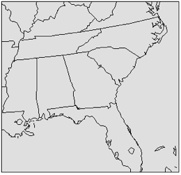

DEFINING GRIDS, LAYERS, DOMAINS, AND CHEMISTRY
==============================================

This chapter describes how to define new horizontal grids, vertical layers, and chemical mechanisms in CMAQ. These specifications apply to multiple programs in the CMAQ modeling system, including ICON, BCON, JPROC, and CCTM. When configuring new simulations, users must define the location, extent, and structure of the horizontal and vertical grids, and the chemical mechanism for representing pollutant chemical transformations. CMAQ contains several default options for these parameters that can be used as templates for setting up new configurations. Before deciding to create definitions for new grids and mechanisms, check to see whether the existing options are sufficient for your model simulation. If a predefined choice is not appro­priate, then follow the steps described in this section to create a new definition.

Once you have configured a simulation that is suitable for your purposes in terms of the horizontal grid, vertical layers, and chemical mechanism, proceed to Chapter 8 to learn how to develop new model executables for running a CMAQ simulation.

Grids and coordinate systems
----------------------------

CMAQ is a three-dimensional Eulerian air quality model. The *domain* of a model run (the extent of its area of interest) is divided into three-dimensional cells (or [*voxels*](http://en.wikipedia.org/wiki/Voxel)), the boundaries of which (the *grid* of the domain) must be rigorously and consistently defined for all functional components of the model (e.g., chemistry, emissions, meteorology). Mathematical algorithms describing atmospheric transport and air/surface exchange govern the flow of material into and out of each grid cell. Mathematical algorithms describing chemical reactions and aerosol dynamics govern the production and loss of material contained in each grid cell.

Horizontal (or *2D*) and vertical components of a model run's grid are treated differently. The horizontal grid specification (setting the *x* and *y* dimensions) must be *regular*: the horizontal projection of each grid cell (sometimes referred to as a *pixel*) has the same resolution, and the boundaries of each pixel are time-invariant. By contrast, the vertical grid specification (setting the *z* dimension) need not be regular; it can vary in space and time.

After determining the horizontal and vertical extent of the domain of interest, a meteorological model must be run for a horizontal domain slightly larger than the CMAQ domain. A larger meteorology domain is necessary for distinguishing the meteorological boundary conditions from the CMAQ boundary conditions.

### Supported CMAQ Coordinate Systems

Specifications for CMAQ and [MCIP](#Meteorology-Chemistry_Interface_Processor_.28MCIP.29) grids are governed by [I/O API](#Input.2FOutput_Applications_Programming_Interface_.28I.2FO_API.29) [grid conventions](https://www.cmascenter.org/ioapi/documentation/3.1/html/GRIDS.html). The choice of horizontal coordinate system, or map projection, for CMAQ is governed by the input emissions inventories and meteorological model fields, which must agree. [MM5](http://en.wikipedia.org/wiki/MM5_%28weather_model%29) and [WRF/ARW](https://en.wikipedia.org/wiki/Weather_Research_and_Forecasting_model) support the [Lambert conformal](https://en.wikipedia.org/wiki/Lambert_conformal_conic_projection), [polar stereographic](https://en.wikipedia.org/wiki/Universal_polar_stereographic_coordinate_system), and [Mercator projection](https://en.wikipedia.org/wiki/Mercator_projection)s, which can be directly passed to CMAQ.

### Horizontal Grids

Available horizontal grids for a given CMAQ run are defined at runtime by setting the GRIDDESC and GRID\_NAME environment variables to point to an existing grid definition file and to one of the grids defined in the file, respectively. Horizontal grids are defined by the [grid definition file](#GRIDDESC:_Horizontal_domain_definition), which can be edited by the user (more below).

The extent of the horizontal grid used in CMAQ is limited by the size of the domain of the input meteorology. [MCIP](#Meteorology-Chemistry_Interface_Processor_.28MCIP.29) and the [I/O API](#Input.2FOutput_Applications_Programming_Interface_.28I.2FO_API.29) utilities can be used to *window* subsets of meteorology data. Choosing the appropriate horizontal grid scale and extent for a [CCTM](#CMAQ_Chemistry-Transport_Model_.28CCTM.29) run is largely dependent on the issues to be addressed by the modeling. However, practical consideration should also be paid to the relationship between grid size, output file size, and execution times.

#### CMAQ horizontal grid conventions

Grid conventions are specified (at length) by [I/O API](#Input.2FOutput_Applications_Programming_Interface_.28I.2FO_API.29) [here](https://www.cmascenter.org/ioapi/documentation/3.1/html/GRIDS.html). In summary, users should be aware that CMAQ uses both "cross-point" and "dot-point" grids.

 **Figure 9-1. relating cross and dot grids**

Hence, a user interested in a particular grid should be aware of its type. "Cross-point" is often abbreviated *CRO*, as in [`GRID_CRO_2D`](#GRID_CRO_2D:_Two-dimensional_grid_cross-point_fields). "Dot-point" is often abbreviated *DOT*, as in [`MET_DOT_3D`](MET_DOT_3D:_Three-dimensional_meteorological_dot-point_fields).

Similarly, the user should be aware of the grid's

-   [projection](https://en.wikipedia.org/wiki/Map_projection)
-   units. Usually meters, except when using [lat-lon coordinate systems](https://en.wikipedia.org/wiki/Geographic_coordinates#Geographic_latitude_and_longitude).

Regarding both grid types, the terms with which most users must be concerned are

origin  
lower left corner of the cell at column=row=1

`X_ORIG`  
X coordinate of the grid origin (in projection units)

`Y_ORIG`  
Y coordinate of the grid origin (in projection units)

`X_CELL`  
horizontal resolution parallel to the X coordinate axis (in projection units)

`Y_CELL`  
horizontal resolution parallel to the Y coordinate axis (in projection units)

`NCOLS`  
number of grid columns

dimensionality in the X direction

`NROWS`  
number of grid rows

dimensionality in the Y direction

#### Using predefined horizontal grids

CMAQv5 is distributed with a GRIDDESC file that contains a definition for a grid covering the southeastern U.S. that uses a Lambert Conformal Conic coordinate. A picture of the grid and the grid definition, in the GRIDDESC format, is shown in [Figure 9-2](#Figure9-1).

|---|---|
||Coordinate: Lambert Conformal

Latitude 0: 40.0

Longitude 0: -97.0

Standard Parallel 1: 33.0

Standard Parallel 2: 45.0

X origin = 504,000

Y origin = -1,488,000

Rows: 122

Columns: 127

dX = 12,000

dY = 12,000

Layers = 35|

**Figure 9-2. CMAQ benchmark grid**

#### Creating or modifying horizontal grids

Creating a grid in CMAQ involves simply adding a few lines of text to the GRIDDESC file. Using a combination of the file format documentation in Chapter 6 and existing grid definitions as examples, new grids can be defined for CMAQ by adding a coordinate and grid description to the GRIDDESC file. Set the GRID\_NAME environment variable in the CMAQ run scripts to point to the name of the new grid. The most common situation for creating a new CMAQ grid definition is encountered when using meteorology and/or emissions data that have not yet been modeled with CMAQ. MM5 or WRF‑ARW outputs can be run through MCIP to generate a GRIDDESC file that can be input directly to both CMAQ and SMOKE. If the meteorology data have already been processed by MCIP and the GRIDDESC file is missing, the grid definition of the input meteorology (and emissions) can be determined by using the netCDF utility *ncdump* to view the header of one of the I/O API files and then use that information to manually create a GRIDDESC file.

#### Further information on horizontal grids

-   Horizontal grid dimensions should be no smaller than 30 rows and 30 columns.
-   External boundary thickness should be set to “1”.
-   A CMAQ grid should be smaller than its parent meteorology grid by at least four grid cells on a side, and preferably by six.
-   Horizontal grid spacing for the parent meteorology grid often has a 3:1 ratio, although other ratios have been employed.

### Vertical Layers

The vertical structure of CMAQ is inherited from the model used to prepare the meteorological information. Both MM5 and WRF-ARW use a sigma coordinate that is based upon surface pressure, not sea level pressure, and a pressure at the top boundary (e.g., 100 hecto-Pascals). The sigma coordinate is terrain following. Because MM5 and WRF-ARW are nonhydrostatic models, the vertical coordinate is time varying.

#### Vertical layer resolution

Resolving the surface boundary layer requires high resolution near the surface for meteorological simulations. To determine mass exchange between the boundary layer and free troposphere, good resolution near the boundary layer top is preferable. In addition, different cloud parameter­izations may perform differently depending on the layering structure. Layer definitions should be appropriate for the topographic features of the simulation domain. Aerodynamic resistance, which influences dry deposition velocities, is a function of layer thickness and the boundary layer stability. For emissions processing, the layer thickness affects the plume rise from major stacks. The vertical extent of the surface-based emission effects is determined by the thickness of the lowest model layer for CCTM. For consistency, CCTM should use the same vertical resolution as the meteorological model used to prepare the input data.

#### Further information on vertical layers

-   CMAQ redefines the vertical coordinates to monotonically increase with height, a capability necessary to handle a generalized coordinate system.
-   Although MCIP may be used to reduce the number of vertical layers by collapsing layers, this is ***not recommended,*** as dynamical inconsistencies can develop and lead to misleading results. This is particularly true when cloud processes are important.
-   Increasing the number of vertical layers increases the CPU time and the computational complexity.
-   Computational limits arise from the Courant number limitation of vertical advection and diffusion processes. When using K-theory, a very shallow layer definition increases CPU time tremendously under the convective conditions.

### References for grid and coordinate system topics

The definitive technical reference for CMAQ grid conventions is [*On The Definition of Horizontal and Vertical Grids and Coordinates for Models-3*](https://www.cmascenter.org/ioapi/documentation/3.1/html/GRIDS.html). Other useful works include

-   [chapter 12 (MCIP) of the 1999 Models-3/CMAQ Science document](http://www.cmascenter.org/cmaq/science_documentation/pdf/ch12.pdf)
-   [Otte and Pleim 2009 (in GMD) on MCIP](http://www.geosci-model-dev.net/3/243/2010/gmd-3-243-2010.html)

Chemical Mechanism
------------------

The CMAQ modeling system accounts for chemistry in three phases: a gas phase, aerosols (solid or liquid), and an aqueous phase. The CMAQ modeling system’s existing modules for gas‑phase chemistry are the 2005 update to the Carbon Bond mechanism (CB05), and the Statewide Air Pollution Research Center-2007 (SAPRC-07) gas-phase mechanism. Several variations of the base gas-phase mechanisms, with and without chlorine, mercury, and toxic species chemistry, are distributed with CMAQ. The modularity of CMAQ makes it possible to create or modify the gas-phase chemical mechanism. This procedure is described in Sections 5.4 and 7.4.2.

Gas-phase chemical mechanisms are defined in CMAQ as a series of Fortran INCLUDE files. Located in subdirectories of the \$M3MODEL/mechs/release directory (each correspond­ing to a mechanism name), these INCLUDE files define the source, reaction parameters, and atmospheric processes (e.g., diffusion, deposition, advection) of the various mechanism species. The species definitions are contained in namelist files that are read in during execution of the CMAQ programs. The CMAQ mechanism configuration is more similar to the science module configuration than to the horizontal grid or vertical layer configuration in that the mechanism is defined at compilation, resulting in executables that are hard-wired to a specific gas-phase mechanism. To change chemical mechanisms between simulations, a new executable that includes the desired mechanism configuration must be compiled.

### Using predefined chemical mechanisms

To select a predefined mechanism configuration in CMAQ, set the *Mechanism* variable in the build scripts to the name of one of the mechanism directories located under \$M3MODEL/mechs/release. Table 7‑1 lists the available chemical mechanisms in CMAQv4.7 and what is included with each mechanism. Set the *Mechanism* variable in the CMAQ build script to the Mechanism ID in Table 7‑1 to select a particular mechanism. Detailed descriptions of some of these mechanisms can be found in Byun and Ching (1999).

**Table 7-1. CMAQ chemical mechanisms**

|---|---|---|---|---|---|---|
|

**Mechanism ID**

|

**cb05**

|

**saprc07**

|

**saprc99**

|

**CMAQ Aerosols**

|

**Aqueous Chemistry**

|

**Additional species**

|
|

**5rd gen.**

|

**6th gen.**

|
|cb05cl\_ae5\_aq|

x

|||

x

||

x

|

Cl

|
|cb05tucl\_ae5\_aq|

x

|||

x

||

x

|

Cl, updated toluene

|
|cb05tucl\_ae6\_aq|

x

||||

x

|

x

|

Cl, updated toluene

|
|cb05tump\_ae6\_aq|

x

||||

x

|

x

|

Cl, updated toluene, air toxics, Hg

|
|saprc07tb\_ae6\_aq||

x

|||

x

|

x

|

Updated toluene

|
|saprc07tc\_ae6\_aq||

x

|||

x

|

x

|

Updated toluene

|
|saprc99\_ae5\_aq|||

x

|

x

||

x

||
|saprc99\_ae6\_aq|||

x

||

x

|

x

||

### Creating or modifying chemical mechanisms

Creating or modifying mechanisms in CMAQ requires the use of the CMAQ chemical mecha­nism compiler, CHEMMECH, to produce the required Fortran INCLUDE files. CHEMMECH translates an ASCII mechanism listing to the INCLUDE files required by CMAQ. Like all of the CMAQ preprocessors, CHEMMECH is a Fortran program that must be compiled by the user prior to use. Distributed with a Makefile for compilation and run scripts for execution, CHEMMECH reads a mechanism definition (mech.def) file and outputs the mechanism INCLUDE files. See Section 5.4 for a description of CHEMMECH.

To modify an existing mechanism, copy the mech.def file that is contained in one of the existing mechanism INCLUDE file directories to a new directory and modify the mechanism accordingly. Provide this modified mechanism definition file to CHEMMECH as input to produce the mechanism INCLUDE files needed to compile CMAQ. Put these mechanism INCLUDE files in a new directory under the \$M3MODEL/mechs/release directory. To invoke this new mechanism, set the *Mechanism* variable in the CMAQ build scripts to the name of the new mechanism directory and compile new executables.

To create a new mechanism for CMAQ, follow a procedure similar to the above for modifying mechanisms. Use an existing mech.def file as a template to format the new mechanism for inclusion in CMAQ. After formatting the mechanism in the form of the mech.def file, provide this file as an input to CHEMMECH to create the required INCLUDE files for CMAQ. Move the resulting INCLUDE files to a new directory under \$M3MODEL/mechs/release. To invoke this new mechanism, set the *Mechanism* variable in the CMAQ build scripts to the name of the new mechanism directory and compile new executables. See Section 5.4 for additional details about the CHEMMECH program.

### Using species namelist files

New to CMAQv5 are species namelist files that define the parameters of the gas, aerosol, non-reactive, and tracer species simulated by the model. The CMAQ programs read the namelist files during execution to define the sources and processes that impact the simulated concentrations of each of the model output species. The namelist files can be used to apply uniform scaling factors by model species for major model processes. For example, emissions of NO can be reduced by 50% across the board by applying a factor of 0.5 to the emissions scalar column of the gas-phase species namelist file. Similarly, the boundary conditions of O3 can be increased by 50% by applying a factor of 1.5 to the boundary conditions scalar column of the gas-phase species namelist file.

When mechanisms are modified or created in CMAQ, new namelist files must be created that include the new species in the mechanism. Existing namelist files can be used as templates to guide the creation of the new files.

### Further information on chemical mechanisms

-   The versions of each chemical mechanism that include both aerosols and aqueous chemistry represent the most comprehensive modeling approach.
-   The same chemical mechanism must be used for CCTM and all of the mechanism-dependent input processors that are part of the CMAQ system.
-   The Euler Backward Iterative (EBI) chemistry solver is mechanism-dependent. If a chemical mechanism is modified, then the default EBI solver cannot be used for the new mechanism. The Rosenbrock and SMVGEAR solvers are the only mechanism-independent choices of chemistry solvers with CCTM.
-   When adding new species to CMAQ, it is important to check that the sources of these new species into the modeling domain are accounted for correctly in the mechanism INCLUDE files. If species are added to the domain through the emissions files, the namelist files that define the mechanism species must contain these new species.

