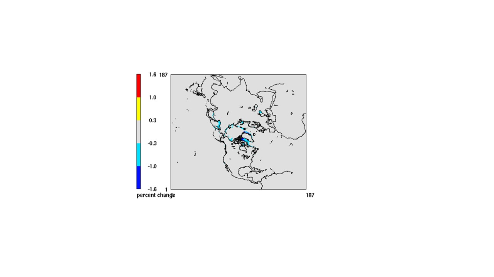
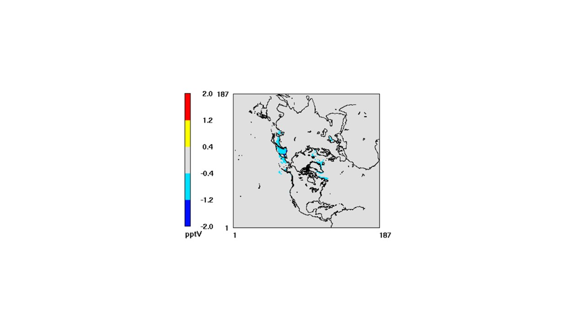
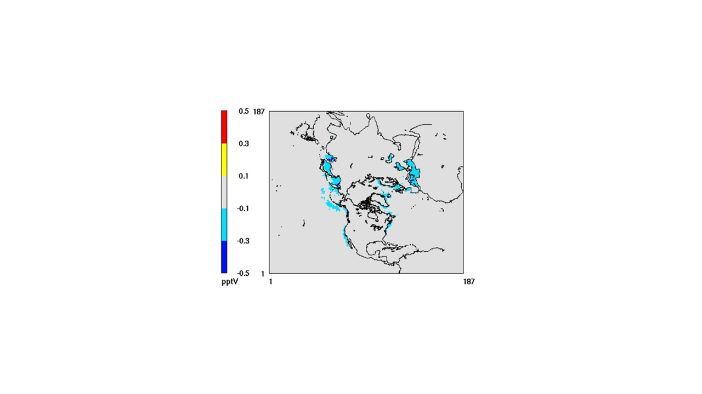
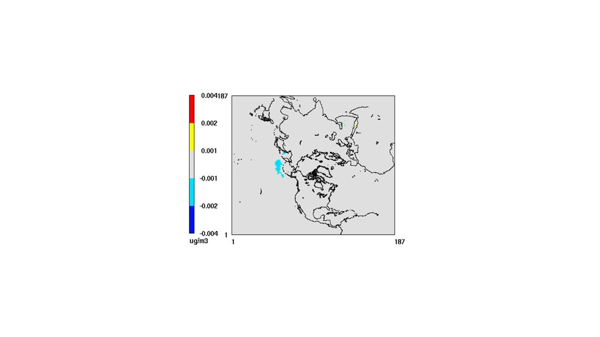
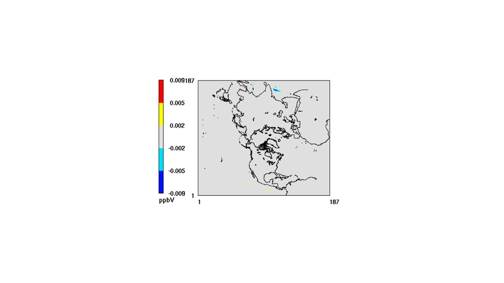

# DMS chemistry bug fix

[Golam Sarwar](mailto:sarwar.golam@epa.gov), U.S. Environmental Protection Agency

## Brief Description

Dimethyl sulfide (DMS) emissions and chemistry was previously combined with CB6r3 and implemented into CMAQv53. It calculates DMS emissions using water-side DMS gas-transfer velocity (KW) following Liss and Merlivat (1986). However, the parameterization for KW at low wind speed (≤ 3.6 m/s) contains an error. The current model uses the following parameterization: 
KW = 0.17 × WSPD10 / SQRT(SCN / 600.0)

Where, KW = water-side DMS gas-transfer velocity, WSPD10 = wind speed, SCN = Schmidt number of DMS. The updated model is corrected and uses the following parameterization:
KW = 0.17 × WSPD10 / (SCN / 600.0)^0.667

## Significance and Impact

Model simulations were completed using the CB6r3m with the existing and updated parameterization for KW for the year of 2016. It lowers DMS emissions by small margins (Figure 1). Its impact is <0.3% over most areas but reduces emissions by 0.3-1.0% over some areas and 1.0-1.6% over an isolated area. Its impact on DMS concentrations is also marginal (Figure 2). It reduces DMS concentration by <0.4 pptv over most areas and 0.4-1.2 pptv over some areas. It reduces annual mean SO2 by <0.1 pptv over most areas and 0.1-0.3 pptv over some areas (Figure 3). It reduces annual mean sulfate by < 0.002 microgramg/m3 (Figure 4). Its impact on annual mean ozone is negligible (Figure 5).

 

Figure 1: Impact of updated KW on annual DMS emission (Percent difference between the updated and existing annual emission)
 
 

Figure 2: Impact of updated KW on annual mean DMS concentration (Absolute difference between the updated and existing annual mean DMS concentration)

 

Figure 3: Impact of updated KW on annual mean SO2 concentration (Absolute difference between the updated and existing annual mean SO2 concentration)

 

Figure 4: Impact of updated KW on annual mean sulfate concentration (Absolute difference between the updated and existing annual mean sulfate concentration)

 

Figure 5: Impact of updated KW on annual mean ozone concentration (Absolute difference between the updated and existing annual mean ozone concentration)

It does not affect model run time.
 
## Affected Files

* CCTM/src/emis/emis/MGEMIS.F

References:
Liss, P.S., Merlivat, L., 1986. Air-Sea Gas Exchange Rates: Introduction and Synthesis, in: Buat-Ménard, P. (Ed.), The Role of Air-Sea Exchange in Geochemical Cycling. Springer Netherlands, Dordrecht, pp. 113-127.

# Internal Records
#### Relevant Pull Requests:
[PR #666](https://github.com/usepa/cmaq_dev/pull/666)

#### Commit IDs:
f6acae33ae08f38c1de91361c3fbbfca10626ec9

-----------------------
