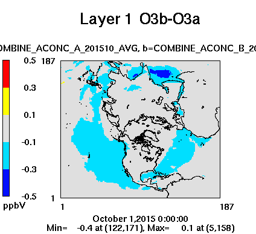
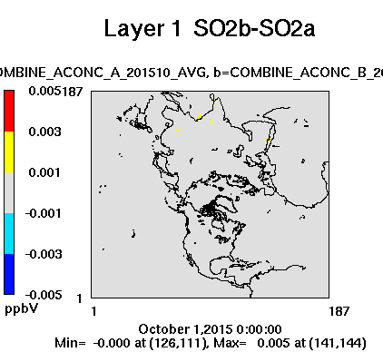
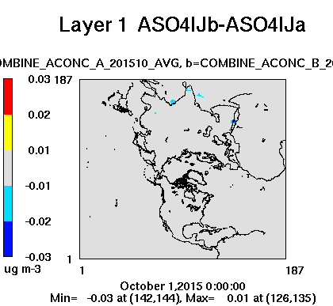

# Update to the DMS chemistry with CB6r3

[Golam Sarwar](mailto:sarwar.golam@epa.gov), U.S. Environmental Protection Agency

## Brief Description

Dimethyl sulfide (DMS) chemistry was previously combined with CB6r3 and implemented into CMAQv53. An extra "HO2" is present in one of the chemical reactions (Reaction # DMS2); this update removes the extra "HO2" from the chemical reaction. An updated EBI solver is also developed since the DMS chemistry is revised. The current EBI solver successfully solves the chemistry. However, it writes too many warnings in the "LOG" files when it encounters converge failures and takes appropriate corrective actions. The current EBI solver uses an initial time step of 2.5 minutes. To reduce the frequency of converge failures, the initial time step was set to 1.25 minutes. 

## Significance and Impact

Model sensitivity runs were completed with the existing CB6r3m (halogen and DMS chemistry) and revised CB6r3m over the Northern Hemisphere for October 2015. It reduces ozone by 0.1-0.3 ppbv over a large area of seawater and 0.3-0.5 ppbv over a small area of Indian ocean (Figure 1). It increases sulfur dioxide by 0.001-0.003 ppbv for a few isolated grid-cells (Figure 2) and reduces sulfate by -0.01 to -0.02 ?g/m3 (Figure 3) for a few isolated grid-cells.

 

Figure 1: Impact of DMS chemistry update on ozone (one-month average).
 
 

Figure 2: Impact of DMS chemistry update on sulfur dioxide (one-month average).

 

Figure 3: Impact of DMS chemistry update on sulfate (one-month average)
 
It successfully reduces the frequency of converge failures and number of warnings in the "LOG" files. It also reduces model run time by ~10%.

## Affected Files

* CCTM/src/MECHS/cb6r3m_ae7_kmtbr/mech_cb6r3m_ae7_kmtbr.def
* CCTM/src/MECHS/cb6r3m_ae7_kmtbr/RXNS_DATA_MODULE.F90
* CCTM/src/MECHS/cb6r3m_ae7_kmtbr/RXNS_FUNC_MODULE.F90

* CCTM/src/gas/ebi_cb6r3m_ae7_kmtbr/hrdata_mod.F
* CCTM/src/gas/ebi_cb6r3m_ae7_kmtbr/hrdriver.F
* CCTM/src/gas/ebi_cb6r3m_ae7_kmtbr/hrg1.F
* CCTM/src/gas/ebi_cb6r3m_ae7_kmtbr/hrg2.F
* CCTM/src/gas/ebi_cb6r3m_ae7_kmtbr/hrg3.F
* CCTM/src/gas/ebi_cb6r3m_ae7_kmtbr/hrg4.F
* CCTM/src/gas/ebi_cb6r3m_ae7_kmtbr/hrinit.F
* CCTM/src/gas/ebi_cb6r3m_ae7_kmtbr/hrno.F
* CCTM/src/gas/ebi_cb6r3m_ae7_kmtbr/hrprodloss.F
* CCTM/src/gas/ebi_cb6r3m_ae7_kmtbr/hrrates.F
* CCTM/src/gas/ebi_cb6r3m_ae7_kmtbr/hrsolver.F

# Internal Records
#### Relevant Pull Requests:
[PR #606](https://github.com/usepa/cmaq_dev/pull/606)

#### Commit IDs:
f5223e20090e0beb7b5b9c643c77e7c24dec4fae

-----------------------
