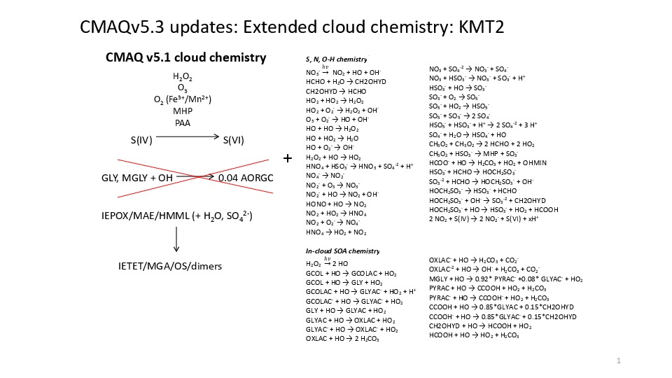

# AQCHEM-KMT2: Extended Inorganic and Organic Cloud Chemistry using the Kinetic PreProcessor

[Kathleen M. Fahey](mailto:fahey.kathleen@epa.gov), U.S. Environmental Protection Agency

## Brief Description

This is an updated version of AQCHEM-KMT(I) (Fahey et al., 2017) that was built using the Kinetic PreProcessor v2.2.3 (Damian et al., 2002).
It builds upon CMAQ's existing in-cloud S oxidation chemistry and replaces the yield parameterization of in-cloud SOA formation from GLY/MGLY+OH with the more mechanistic representation of small dicarboxylic acid formation from the reactions of OH with glyoxal, methylglyoxal, glycolaldehyde, and acetic acid (Lim et al., 2005; Lim et al., 2010, 2013; Sareen et al., 2013). It also includes additional aqueous chemistry for S, N, C, and O-H species based on the aqueous mechanism of ReLACS-AQ (Leriche et al., 2013), which is a reduced cloud chemistry mechanism built from and tested against more extensive models. 

Figure 1: KMT2 in-cloud mechanism updates

## Significance and Impact

The species impacted and magnitude of effect depend heavily on season and domain. Previous simulations over the Eastern U.S. during June 2013 using CMAQv5.2 showed a surface-level increase in in-cloud SOA from small carbonyl compounds (AORGC) of 150-300+% compared to CMAQ's standard yield-based parameterization for GLY and MGLY+OH.  While the June 2013 average AORGC was <0.2&nbsp;&#956;g&nbsp;m&#8209;3, max hourly change reached 3&nbsp;&#956;g&nbsp;m&#8209;3. KMT2 shows elevated cloud SOA at the surface and aloft. For the June 2013 simulation, AORGC made up ~2&#8209;6% of average surface SOA over much of the Eastern U.S., with the percentage increasing aloft. A recent hemispheric simulation showed monthly average changes in in-cloud SOA up to ~1&nbsp;&#956;g&nbsp;m&#8209;3 in regions/seasons where oxidant levels and biogenic emissions were high and increased by at least a factor of 5 in much of the SE U.S. 

In the winter, sulfate seems to be the most significantly impacted species. Recent hemispheric simulations for January 2016 saw a monthly average SO4 increase of up to 17% in China and up to 34% in the United States. Nitrate decreased with a similar pattern to SO4 increase. Monthly average O3, HCHO, and NOx saw small impacts over CONUS (typically within ~3%), but one can see larger absolute impacts over shorter time periods and in other regions (e.g., change in average O3 up to -11% in Asia). 

Impacts on CMAQ runtime also depend heavily on domain, season, and chemical mechanism, and they can be ~20-30% for some hemispheric applications, increasing from there.                  

## Affected Files

CCTM/src/cloud/acm_ae7_kmt2/*
CCTM/src/MECHS/cb6r3_ae7_aqkmt2/GC_cb6r3_ae7_aq.nml 
CCTM/src/MECHS/cb6r3_ae7_aqkmt2/AE_cb6r3_ae7_aq.nml  
CCTM/src/MECHS/saprc07tic_ae7i_aqkmt2/GC_saprc07tic_ae7i_aq.nml 
CCTM/src/MECHS/saprc07tic_ae7i_aqkmt2/AE_saprc07tic_ae7i_aq.nml        

## References

Damian, V., Sandu, A., Damian, M., Potra, F., and G.R. Carmichael, The Kinetic PreProcessor KPP - A software environment for solving chemical kinetics, *Computers & Chemical Engineering*, **26**, 1567-1579, 2002.

Fahey K., Carlton, A.G., Pye, H.O.T., Baek, J., Hutzell, W.T., Stanier, C.O., Baker, K.R, Appel, K.W, Jaoui, M., and J.H. Offenberg (2017) A framework for expanding aqueous chemistry in the Community Multiscale Air Quality (CMAQ) model version 5.1. *Geoscientific Model Development*, **10**, 1587–1605, 2017.

Leriche, M., J.-P. Pinty, C. Mari, and D. Gazen, A cloud chemistry module for the 3-D cloud-resolving mesoscale model Meso-NH with application to idealized cases, *Geoscientific Model Development*, **6**, 1275-1298, 2013

Lim, H.-J., A.G. Carlton, and B.J. Turpin, Isoprene forms secondary organic aerosol through cloud processing: model simulations, *Environmental Science & Technology*, **39**, 4441-4446, 2005 

Lim, Y.B., Tan, Y., Perri, M.J., Seitzinger, S.P., and B.J. Turpin, Aqueous chemistry and its role in secondary organic aerosol (SOA) formation, *Atmospheric Chemistry and Physics*, **10**, 10521-
10539, 2010.

Lim, Y.B., Tan, Y., and B.J. Turpin, Chemical insights, explicit chemistry, and yields of secondary organic aerosol from OH radical oxidation of methylglyoxal and
glyoxal in the aqueous phase, *Atmospheric Chemistry and Physics*, **13**, 8651-8667, 2013
                 
Sareen, N., Fahey, K., Hutzell, W., and A.G. Carlton, Implementing explicit secondary organic aerosol (SOA) aqueous chemistry in CMAQ. (Poster) 12th Annual CMAS Conference, Chapel Hill, NC, 2013.

-----
## Internal Records:
#### Relevant Pull Requests:
[PR #363](https://github.com/USEPA/CMAQ_Dev/pull/363)

#### Commit 
IDs: ba43d39067e6a6256010f2864196d1712107e757

-----

