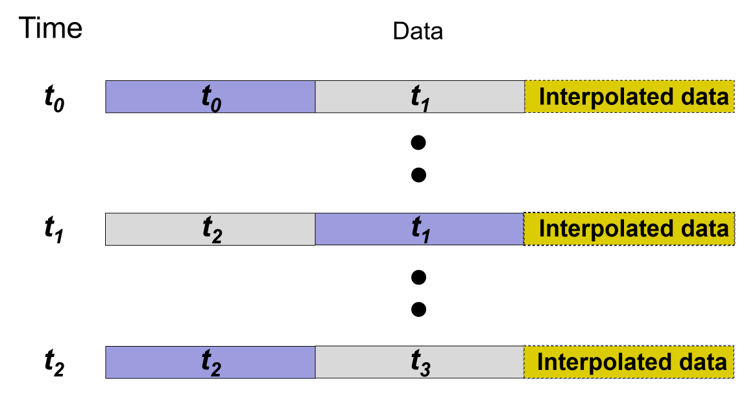
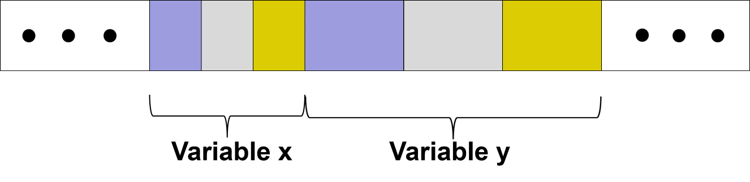

# New Centralized Input/Output Module (CIO)
 

[David Wong](wong.david-c@epa.gov), Computational Exposure Division, U.S. EPA

 
## Brief Description

The idea behind the new centralized I/O (CIO) module in CMAQv5.3 is to put all the OPEN3, DESC3, EXTRACT3, and interpolation functions (INTERPX and INTERPB) into one location. This is consistent with with object-oriented programming practices to encapsulate the I/O process in the model. The highlights of this implementation includes:

* Encapsulation is done in two new modules: CENTRALIZED_IO_MODULE and CENTRALIZED_IO_UTIL_MODULE.
* Variables are categorized as either time-dependent or time-independent. Two timesteps of data of a time dependent 
variable are stored within a circular buffer structure, and an interpolated result is stored in the extra storage space.

* Three 1D arrays are used to hold gridded file, boundary file and stack group file data, respectively.
* Each variable consists of three sections: two timesteps of data and an interpolated result. All variables are stored 
in a contiguous 1D array to promote vectorization. A special marker is used to distinguish various types of gridded 
files: 2 (two dimensional), 3 (three dimensional), d (dotted file), e (two-dimensional emission file), E (three-dimensional 
emission file), l (lightning file), wb (wind blown dust file), and bs (bio season file). Similarly, a marker is used to 
distinguish two types of boundary files: mb (meteorological boundary file) and b (boundary condition file).

* Memory usage comparison (IOAPI / CIO): 2 × NF × V × p / (3 × ∑ 𝑣𝑘) where NF and V are the predefined maximum number 
of files and variables, respectively in IOAPI_3; p is the number of processors; and, nf and vk are the actual number of files 
and number of variables in an input file k. In an IOAPI_3 setup, NF = 200 and V = 2048, and the total number of input variables 
is typically < 500. Memory usage in IOAPI implementation grows proportional to the number of processors, p, but CIO 
implementation memory usage is independent of p. 

* CMAQ version 5.3 allows multiple gridded emision files, and each file name ends with a three digit “_xxx” suffix. 
CIO implementation tags each emission file variable with the same three-digit number as a distinctive method to associate 
an emision data variable with a particular emission file.

* A boundary condition file is provided as an input in a typical CMAQ simulation. CMAQ does support a scenario in which a 
larger domain concentration file can be used to specify the lateral boundary conditions. Such configuration is called WINDOW 
scenario. CIO implementation also considers this special case with appropriate adjustment in memory management.

* Variable names are stored in a linear list in ascending order. Variable name (N variables) searching is done with binary search, 
which has O(logN) computational performance.

## Significance and Impact

* Preparing for the next generation model development, centralizing the I/O helps reduce its impact on model structure and 
potential modifications associated with alternate approaches to I/O.

* Potentially reduces memory footprint of the model.

## Affected Files

#### Files modified:

advbc_map.F                   
advstep.F                     
aero_driver.F                 
ASX_DATA_MOD.F                
cldproc_acm.F                 
concld_prop_acm.F             
conv_cgrid.F                  
convcld_acm.F                 
couplewrf.F                   
deform.F                      
driver.F                      
DUST_EMIS.F                   
EMIS_DEFN.F                   
hcdiff3d.F                    
hcontvel.F                    
hrdriver.F                    
hrno.F                        
hveloc.F                      
load_cgrid.F                  
LTNG_DEFN.F                   
m3dry.F                       
MGEMIS.F                      
pa_update.F                   
phot.F                        
PHOT_MET_DATA.F               
PHOTOLYSIS_ALBEDO.F           
PT3D_DEFN.F                   
PTMET.F                       
rdbcon.F                      
rddepv.F                      
rescld.F                      
rho_j.F                       
tmpbeis.F                     
wr_conc.F                     
WVEL_DEFN.F                   
zadvppmwrf.F 

#### Files added:

centralized_io_module.F

centralized_io_util_module.F

#### Files deleted:

None
 

## References

  None   

-----

## Internal Records:

#### Relevant Pull Requests:

* [PR #462](https://github.com/USEPA/CMAQ_Dev/pull/462)
* [PR #503](https://github.com/USEPA/CMAQ_Dev/pull/503) 
* [PR #510](https://github.com/USEPA/CMAQ_Dev/pull/510)  

#### Commit IDs:

Here are the commit IDs corresponding to those pull requests
* [26ab6c65c8d7a0d661a266fd32937ddf41ba130a](https://github.com/USEPA/CMAQ_Dev/commit/26ab6c65c8d7a0d661a266fd32937ddf41ba130a),
* [1cd0101136305aef7236d73b7f2db17ff7997b68](https://github.com/USEPA/CMAQ_Dev/commit/1cd0101136305aef7236d73b7f2db17ff7997b68),
* [c22b6e876adbec31578cf34a16d9ac6078af6d4c](https://github.com/USEPA/CMAQ_Dev/commit/c22b6e876adbec31578cf34a16d9ac6078af6d4c), 
respectively

