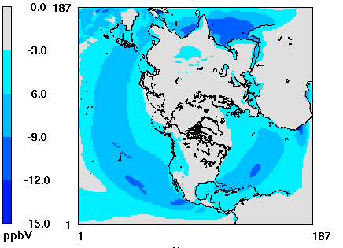
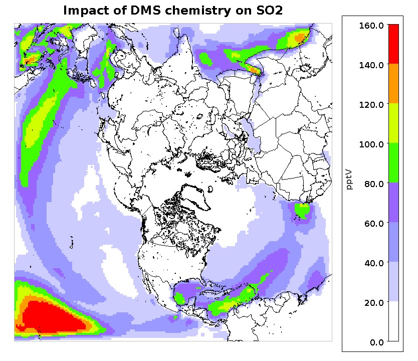
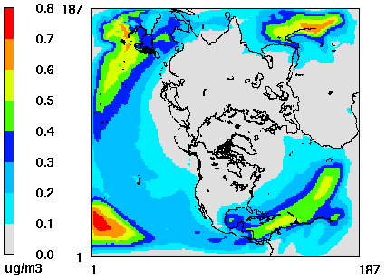

# Adding detailed halogen and DMS chemistry to CB6r3

[Golam Sarwar](mailto:sarwar.golam@epa.gov), U.S. Environmental Protection Agency

**>>COMMENT<<** I think this one needs a fair amount of work.  TLS 25 Jun 2019

## Brief Description

**>>COMMENT<<** What are the "Initial" and "Revised" implementations?  If these are at different stages of development for this release, suggest combining them into a single summary in the Brief Description and in the Significance and Impact.  Otherwise, this is very confusing, and I'm not sure what to make of this.  TLS 25 Jun 2019

**Initial implementation**

**>>COMMENT<<** Double-check that I did not misinterpret the point of implementation.  Here, I replaced "the CMAQ model" with "CMAQv5.3" by assuming that this is all new for this release of CMAQ.  TLS 25 Jun 2019

Detailed chemistry for the halogens, bromine and iodine, was incorporated into the CB05 chemical mechanism in a previous release of CMAQ. In CMAQv5.3, the detailed halogen chemistry is extended for CB6r3. It contains 38 gas-phase reactions and 8 heterogeneous reactions for bromine chemistry, and 44 gas-phase reactions and 20 heterogeneous reactions for iodine chemistry. Dimethyl sulfide (DMS) chemistry is also combined with CB6r3 and implemented into CMAQv5.3. It contains 7 gas-phase reactions involving DMS and oxidants. The combined chemical mechanism containing CB6r3, detailed halogen and DMS chemistry is named as CB6r3m. The halogen chemistry is more beneficial in the hemispheric CMAQ model where there is a larger influence on the intercontinental transport over oceans.  However, it can also be used in the regional version of the model.

**Revised implementation**

The detailed halogen chemistry is revised for following changes: (1) removing several heterogeneous reactions over coarse-mode aerosols, (2) implementing dry deposition of several halogen species, and (3) fixing several molecular diffusivities, Le Bas molar volume, and calculation for temporal allocation of halocarbon emissions. An updated EBI solver is also developed since the halogen chemistry is revised.  

## Significance and Impact

**>>COMMENT<<** I think the "V" in "ppbV" should be capitalized.  Also, I cannot figure out how to make Greek mu in Markdown.  TLS 25 Jun 2019

**Initial implementation**

Model sensitivity runs were completed with CB6r3 (without detailed halogen and DMS chemistry) and CB6r3m (with detailed halogen and DMS chemistry) over the Northern Hemisphere for three months in 2015 (October-December). It reduces ozone by 3-15 ppbV (Figure 1) and increases sulfur dioxide by 20-160 pptV (Figure 2) and sulfate by 0.1-0.8 ug m-3 (Figure 3) over much of the sea water. It reduces ozone and increases sulfate over land by much smaller margins than over sea water.

**Revised implementation**

**>>COMMENT<<** Please confirm that I correctly clarified the sentence where I added "Without including halogen chemistry."  It is unclear, as originally written.  I also removed "performance" and replaced it with "bias"; double-check that this is the correct statistical terminology.  TLS 25 Jun 2019

Model sensitivity runs were completed with the existing and revised CB6r3m over the Northern Hemisphere for a winter (January 2016) and a summer month (August 2016). Over the sea water, the revised halogen chemistry increases wintertime monthly mean ozone by up to 4.0 ppbV and summertime ozone by up to 6.0 ppbV. Over the U.S., the revised halogen chemistry increases wintertime ozone by <1.5 ppbV and summertime ozone by <0.5 ppbV. Without including halogen chemistry, CMAQv5.3 underestimates wintertime ozone and overestimates summertime ozone. The revised halogen chemistry increases ozone over the U.S., which contributes to the improvement of wintertime model bias without substantially affecting the summertime bias. 

The revised halogen chemistry minimally changes both wintertime and summertime sulfate in some locations (<0.13 ug m-3). However, the impacts over the U.S. are small. 

**>>COMMENT<<** The figure captions sometimes align under the figure, and sometimes they seem to wrap.  Needs to be fixed. TLS 25 Jun 2019

 
Figure 1: Impact of halogen chemistry on ozone (three-month average).

 
Figure 2: Impact of halogen chemistry on sulfur dioxide (three-month average).

 
Figure 3: Impact of halogen chemistry on sulfate (three-month average).

## Affected Files

Initial implementation

* CCTM/scripts/bldit_cctm.csh
* CCTM/src/MECHS/cb6r3m_ae7_kmtbr/AE_cb6r3m_ae7_kmtbr.nml
* CCTM/src/MECHS/cb6r3m_ae7_kmtbr/CSQY_DATA_cb6r3m_ae7_kmtbr
* CCTM/src/MECHS/cb6r3m_ae7_kmtbr/GC_cb6r3m_ae7_kmtbr.nml
* CCTM/src/MECHS/cb6r3m_ae7_kmtbr/NR_cb6r3m_ae7_kmtbr.nml
* CCTM/src/MECHS/cb6r3m_ae7_kmtbr/RXNS_DATA_MODULE.F90
* CCTM/src/MECHS/cb6r3m_ae7_kmtbr/RXNS_FUNC_MODULE.F90
* CCTM/src/MECHS/cb6r3m_ae7_kmtbr/SpecDef_Dep_cb6r3m_ae7_kmtbr.txt
* CCTM/src/MECHS/cb6r3m_ae7_kmtbr/SpecDef_cb6r3m_ae7_kmtbr.txt
* CCTM/src/MECHS/cb6r3m_ae7_kmtbr/mech_cb6r3m_ae7_kmtbr.def
* CCTM/src/aero/aero6/AEROSOL_CHEMISTRY.F
* CCTM/src/aero/aero6/AERO_DATA.F
* CCTM/src/aero/aero6/SOA_DEFN.F
* CCTM/src/cloud/acm_ae6/hlconst.F
* CCTM/src/cloud/acm_ae7_kmtbr/AQ_DATA.F
* CCTM/src/cloud/acm_ae7_kmtbr/acmcld.f
* CCTM/src/cloud/acm_ae7_kmtbr/aq_map.F
* CCTM/src/cloud/acm_ae7_kmtbr/aqchem_Function.F90
* CCTM/src/cloud/acm_ae7_kmtbr/aqchem_Global.F90
* CCTM/src/cloud/acm_ae7_kmtbr/aqchem_Initialize.F90
* CCTM/src/cloud/acm_ae7_kmtbr/aqchem_Integrator.F90
* CCTM/src/cloud/acm_ae7_kmtbr/aqchem_Jacobian.F90
* CCTM/src/cloud/acm_ae7_kmtbr/aqchem_JacobianSP.F90
* CCTM/src/cloud/acm_ae7_kmtbr/aqchem_LinearAlgebra.F90
* CCTM/src/cloud/acm_ae7_kmtbr/aqchem_Model.F90
* CCTM/src/cloud/acm_ae7_kmtbr/aqchem_Parameters.F90
* CCTM/src/cloud/acm_ae7_kmtbr/aqchem_Precision.F90
* CCTM/src/cloud/acm_ae7_kmtbr/aqchem_Rates.F90
* CCTM/src/cloud/acm_ae7_kmtbr/aqchem_kmt.F90
* CCTM/src/cloud/acm_ae7_kmtbr/cldproc_acm.F
* CCTM/src/cloud/acm_ae7_kmtbr/convcld_acm.F
* CCTM/src/cloud/acm_ae7_kmtbr/getalpha.F
* CCTM/src/cloud/acm_ae7_kmtbr/hlconst.F
* CCTM/src/cloud/acm_ae7_kmtbr/indexn.f
* CCTM/src/cloud/acm_ae7_kmtbr/opwdep.F
* CCTM/src/cloud/acm_ae7_kmtbr/rescld.F
* CCTM/src/cloud/acm_ae7_kmtbr/scavwdep.F
* CCTM/src/depv/m3dry/DEPVVARS.F
* CCTM/src/emis/emis/BIOG_EMIS.F
* CCTM/src/emis/emis/EMIS_DEFN.F
* CCTM/src/emis/emis/MGEMIS.F
* CCTM/src/emis/emis/SSEMIS.F
* CCTM/src/gas/ebi_cb6r3m_ae7_kmtbr/DEGRADE_SETUP_TOX.F
* CCTM/src/gas/ebi_cb6r3m_ae7_kmtbr/degrade.F
* CCTM/src/gas/ebi_cb6r3m_ae7_kmtbr/degrade_data.F
* CCTM/src/gas/ebi_cb6r3m_ae7_kmtbr/final_degrade.F
* CCTM/src/gas/ebi_cb6r3m_ae7_kmtbr/find_degraded.F
* CCTM/src/gas/ebi_cb6r3m_ae7_kmtbr/hrdata_mod.F
* CCTM/src/gas/ebi_cb6r3m_ae7_kmtbr/hrdriver.F
* CCTM/src/gas/ebi_cb6r3m_ae7_kmtbr/hrg1.F
* CCTM/src/gas/ebi_cb6r3m_ae7_kmtbr/hrg2.F
* CCTM/src/gas/ebi_cb6r3m_ae7_kmtbr/hrg3.F
* CCTM/src/gas/ebi_cb6r3m_ae7_kmtbr/hrg4.F
* CCTM/src/gas/ebi_cb6r3m_ae7_kmtbr/hrinit.F
* CCTM/src/gas/ebi_cb6r3m_ae7_kmtbr/hrprodloss.F
* CCTM/src/gas/ebi_cb6r3m_ae7_kmtbr/hrrates.F
* CCTM/src/gas/ebi_cb6r3m_ae7_kmtbr/hrsolver.F
* CCTM/src/gas/ebi_cb6r3m_ae7_kmtbr/init_degrade.F
* CCTM/src/vdiff/acm2_m3dry/ASX_DATA_MOD.F
* UTIL/inline_phot_preproc/photolysis_CSQY_data/COHBR_JPL2010
* UTIL/inline_phot_preproc/photolysis_CSQY_data/IBR_IUPAC10
* UTIL/inline_phot_preproc/photolysis_CSQY_data/IONO2_06

Revised implementation

* CCTM/src/MECHS/cb6r3m_ae7_kmtbr/GC_cb6r3m_ae7_kmtbr.nml
* CCTM/src/MECHS/cb6r3m_ae7_kmtbr/RXNS_DATA_MODULE.F90
* CCTM/src/MECHS/cb6r3m_ae7_kmtbr/RXNS_FUNC_MODULE.F90
* CCTM/src/MECHS/cb6r3m_ae7_kmtbr/mech_cb6r3m_ae7_kmtbr.def
* CCTM/src/cloud/acm_ae6/hlconst.F
* CCTM/src/depv/m3dry/DEPVVARS.F
* CCTM/src/emis/emis/MGEMIS.F
* CCTM/src/vdiff/acm2_m3dry/ASX_DATA_MOD.F

## References

**>>COMMENT<<** Also cite Sarwar et al. (2019) here?

1.	Sarwar, G., Gantt, B.; Schwede, D.; Foley, K.; Mathur, R.; Saiz-Lopez, A. Impact of enhanced ozone deposition and halogen chemistry on tropospheric ozone over the Northern Hemisphere, _Environmental Science & Technology_, 2015, **49**(15):9203-9211.
2.	Saiz-Lopez, A.; Fernandez, R. P.; Ordóñez, C.; Kinnison, D. E.; Gómez Martín, J. C.; Lamarque, J.-F.; Tilmes, S. Iodine chemistry in the troposphere and its effect on ozone. _Atmospheric Chemistry and Physics_, 2014, **14**, 13119-13143.
3.	Fernandez, R. P.; Salawitch, R. J.; Kinnison, D. E.; Lamarque, J.-F.; Saiz-Lopez, A. Bromine partitioning in the tropical tropopause layer: implications for stratospheric injection. _Atmospheric Chemistry and Physics_, 2014, **14**, 13391-13410. 
4.	Sherwen, T., Evans, M. J., Carpenter, L. J., Andrews, S. J., Lidster, R. T., Dix, B., Koenig, T. K., Sinreich, R., Ortega, I., Volkamer, R., Saiz-Lopez, A., Prados-Roman, C., Mahajan, A. S., and Ordóñez, C.: Iodine's impact on tropospheric oxidants: a global model study in GEOS-Chem. _Atmospheric Chemistry and Physics_, 2016, **16**, 1161-1186.
5.	Sherwen, T., Schmidt, J. A., Evans, M. J., Carpenter, L. J., Großmann, K., Eastham, S. D., Jacob, D. J., Dix, B., Koenig, T. K., Sinreich, R., Ortega, I., Volkamer, R., Saiz-Lopez, A., Prados-Roman, C., Mahajan, A. S., and Ordóñez, C. Global impacts of tropospheric halogens (Cl, Br, I) on oxidants and composition in GEOS-Chem, _Atmospheric Chemistry and Physics_, 2016, **16**, 12239-12271.
6.	Yarwood, Y., Sakulyanontvittaya, T., Nopmongcol, O., and Koo, K. Ozone Depletion by Bromine and Iodine over the Gulf of Mexico, Final Report for the Texas Commission on Environmental Quality, November 2014.
7.	Sarwar, G., J. Xing, K. Fahey, K. Foley, D. Wong, R. Mathur, C. M. Gan, B. Gant, H. Simon, 2016. Dimethylsulfide chemistry: seasonal and spatial impacts on sulfate, Chapter 55, Clemens Mensink, George Kallos (ed.), _Air Pollution Modeling and its Application XXV_. Springer, 347-352. 

-----
## Internal Records:
#### Relevant Pull Requests:
[PR #362](https://github.com/usepa/cmaq_dev/pull/362)

[PR #433](https://github.com/usepa/cmaq_dev/pull/433)

#### Commit IDs:
Initial Implementation

e071d336de4e98b37e7d0d7b23b73f81f4daf79b
66f076fbb441e4d75e9ee55821da1cd63bf4a4d9
4e95eac60e9c78b27faf0c5e6d1c51b0b15cf7db
81edc0a978469bf9ea4e917f9de592921431134d

Revised Implementation

2d7d094b1cfa8b5432950d3719e0ce94082eba50

-----
