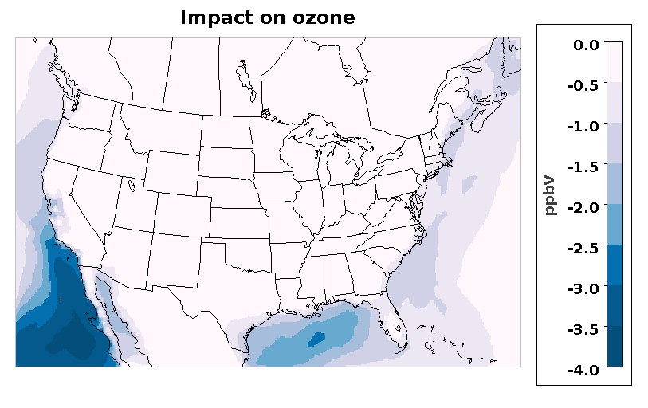

# Revision of halogen-mediated first-order ozone loss (all mechanisms)

[Golam Sarwar](mailto:sarwar.golam@epa.gov), U.S. Environmental Protection Agency

## Brief Description
Halogen chemistry can be an important sink for ozone over oceanic areas from interactions with sea spray. A simple halogen-mediated first-order ozone loss was initially developed by using hemispheric CMAQ results obtained with and without detailed bromine/iodine chemistry for summer months. The detailed bromine/iodine chemistry has recently been updated and hemispheric model simulations were completed with and without the updated bromine/iodine chemistry for an entire year. The simple halogen-mediated first-order ozone loss is developed using the annual hemispheric CMAQ results obtained with and without full bromine/iodine chemistry. The revised halogen-mediated first-order rate constant for ozone loss (units=s&#8209;1) as a function of atmospheric pressure P (units=atm) is:  

These reactions are applied to grid cells over oceanic areas.
 
## Significance and Impact

Model sensitivity runs were completed with the existing and updated simple first order ozone loss (continental U.S. domain) for a 10-day summer period. The updated simple first-order ozone loss reduces 10-day average ozone by up to 4.0 ppbV over sea water and by up to 2.0 ppbV over some coastal areas. There is no impact on model run time.

 
Figure 1: Impact of updated simple first-order ozone loss.

## Affected Files
CCTM/src/MECHS/cb05e51_ae6_aq/RXNS_DATA_MODULE.F90
CCTM/src/MECHS/cb05e51_ae6_aq/RXNS_FUNC_MODULE.F90
CCTM/src/MECHS/cb05e51_ae6_aq/mech_cb05e51_ae6_aq.def

CCTM/src/MECHS/cb05e51_ae6nvPOA_aq/RXNS_DATA_MODULE.F90
CCTM/src/MECHS/cb05e51_ae6nvPOA_aq/RXNS_FUNC_MODULE.F90
CCTM/src/MECHS/cb05e51_ae6nvPOA_aq/mech_cb05e51_ae6nvPOA_aq.def

CCTM/src/MECHS/cb05tucl_ae6_aq/RXNS_DATA_MODULE.F90
CCTM/src/MECHS/cb05tucl_ae6_aq/RXNS_FUNC_MODULE.F90
CCTM/src/MECHS/cb05tucl_ae6_aq/mech_cb05tucl_ae6_aq.def

CCTM/src/MECHS/cb6r3_ae6_aq/RXNS_DATA_MODULE.F90
CCTM/src/MECHS/cb6r3_ae6_aq/RXNS_FUNC_MODULE.F90
CCTM/src/MECHS/cb6r3_ae6_aq/mech_cb6r3_ae6_aq.def

CCTM/src/MECHS/cb6r3_ae6nvPOA_aq/RXNS_DATA_MODULE.F90
CCTM/src/MECHS/cb6r3_ae6nvPOA_aq/RXNS_FUNC_MODULE.F90
CCTM/src/MECHS/cb6r3_ae6nvPOA_aq/mech_cb6r3_ae6nvPOA_aq.def

CCTM/src/MECHS/cb6r3_ae7_aq/RXNS_DATA_MODULE.F90
CCTM/src/MECHS/cb6r3_ae7_aq/RXNS_FUNC_MODULE.F90
CCTM/src/MECHS/cb6r3_ae7_aq/mech_cb6r3_ae7_aq.def

CCTM/src/MECHS/racm2_ae6_aq/RXNS_DATA_MODULE.F90
CCTM/src/MECHS/racm2_ae6_aq/RXNS_FUNC_MODULE.F90
CCTM/src/MECHS/racm2_ae6_aq/mech_racm2_ae6_aq.def

CCTM/src/MECHS/saprc07tb_ae6_aq/RXNS_DATA_MODULE.F90
CCTM/src/MECHS/saprc07tb_ae6_aq/RXNS_FUNC_MODULE.F90
CCTM/src/MECHS/saprc07tb_ae6_aq/mech_saprc07tb_ae6_aq.def

CCTM/src/MECHS/saprc07tc_ae6_aq/RXNS_DATA_MODULE.F90
CCTM/src/MECHS/saprc07tc_ae6_aq/RXNS_FUNC_MODULE.F90
CCTM/src/MECHS/saprc07tc_ae6_aq/mech_saprc07tc_ae6_aq.def

CCTM/src/MECHS/saprc07tc_ae6nvPOA_aq/RXNS_DATA_MODULE.F90
CCTM/src/MECHS/saprc07tc_ae6nvPOA_aq/RXNS_FUNC_MODULE.F90
CCTM/src/MECHS/saprc07tc_ae6nvPOA_aq/mech_saprc07tc_ae6nvPOA_aq.def

CCTM/src/MECHS/saprc07tic_ae6i_aq/RXNS_DATA_MODULE.F90
CCTM/src/MECHS/saprc07tic_ae6i_aq/RXNS_FUNC_MODULE.F90
CCTM/src/MECHS/saprc07tic_ae6i_aq/mech_saprc07tic_ae6i_aq.def

CCTM/src/MECHS/saprc07tic_ae6invPOA_aq/RXNS_DATA_MODULE.F90
CCTM/src/MECHS/saprc07tic_ae6invPOA_aq/RXNS_FUNC_MODULE.F90
CCTM/src/MECHS/saprc07tic_ae6invPOA_aq/mech_saprc07tic_ae6invPOA_aq.def

UTIL/chemmech/src/wrt_reactions_module.f

## References

Sarwar, G.; Gantt, B.; Schwede, D.; Foley, K.; Mathur, R.; Saiz-Lopez, A., 2015: Impact of enhanced ozone deposition and halogen chemistry on tropospheric ozone over the Northern Hemisphere, _Environmental Science & Technology_, **49**(15):9203-9211.

Sarwar, G.; Gantt, B.; Foley, K.; Fahey, K.; Spero T. L.; Kang, D., Mathur, Rohit M., Hosein F.; Xing, J.; Sherwen, T.; Saiz-Lopez, A., 2019: Influence of bromine and iodine chemistry on annual, seasonal, diurnal, and background ozone: CMAQ simulations over the Northern Hemisphere, _Atmospheric Environment_, 213, 395-404.

-----
## Internal Records
#### Relevant Pull Requests:
[PR #328](https://github.com/usepa/cmaq_dev/pull/328)
#### Commit IDs:
5dd2890b6743bc1c0c6f94542f2565a517d8daeb

-----
