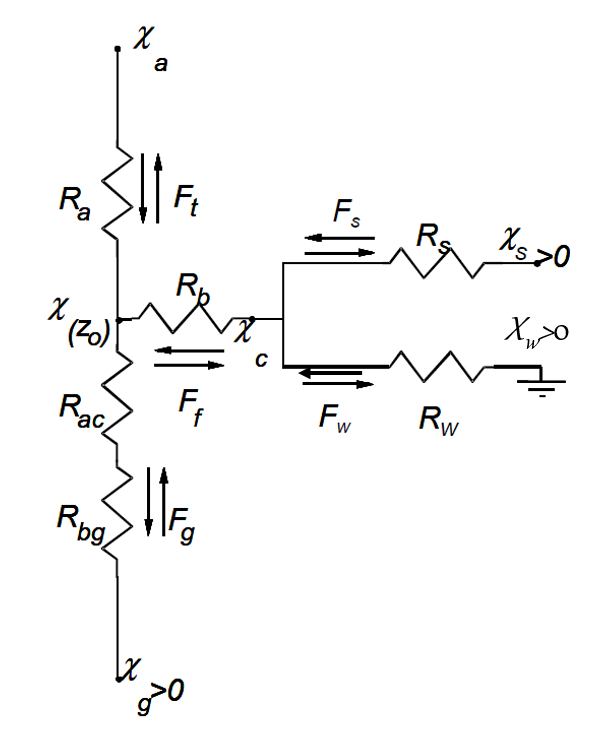
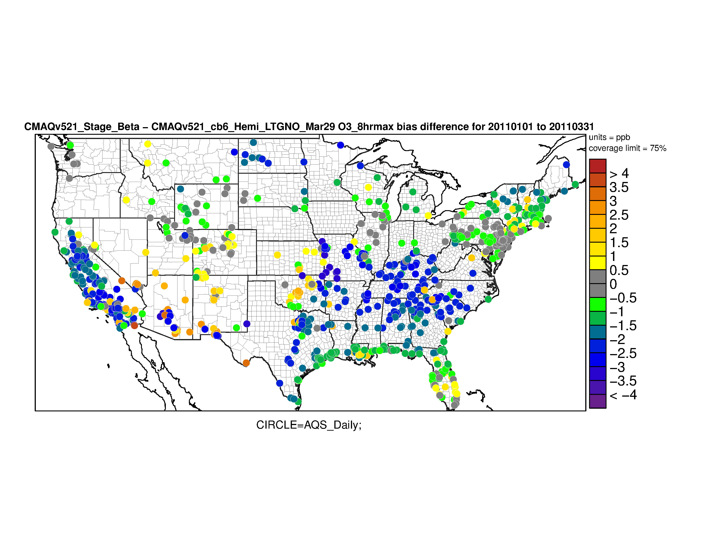

# STAGE: *Surface Tiled Aerosol and Gaseous Exchange* Dry Deposition Option

[Jesse O. Bash](mailto:bash.jesse@epa.gov), U.S. Environmental Protection Agency

The STAGE deposition option estimates fluxes from sub-grid cell fractional land use values, aggregates the fluxes to the model grid cell, and unifies the bidirectional and unidirectional deposition schemes using the resistance model frameworks of Massad et al. (2010) and Nemitz et al. (2001). The MOSAIC option has been modified to work with this module to output the land use specific fluxes and deposition velocities. The following general changes to model processes and resistances have been made. 

Bidirectional NH3 utilizes the widely used resistance model framework of Nemitz et al. (2001) with the cuticular resistance from Massad et al. (2010). Additionally, the nitrification rates are now estimated from EPIC model output, as well as NH4 input from organic nitrogen mineralization. Soil resistances were updated to be more consistent with the measurements that they were parameterized from. This included changing the maximum diffusive depth to be consistent with Kondo et al. (1990) and Swenson and Lawrence (2014).  Soil moisture at plow depth, 5 cm, is now estimated from gravitational draining rather than a weighted mean of the 0.01-m and 1-m soil layers. ABFLUX_MOD.F is now replaced with NH3_BIDI_MOD.F as the resistance model in STAGE now only needs the soil NH3 concentration and not a parallel resistance model. 

The bidirectional Hg code was simplified and modified to provide soil, vegetation, and water Hg concentrations, and to integrate the fluxes from the STAGE model. 

The form of the quasi-boundary layer resistance has been changed to the leaf-specific parameterization from Jensen and Hummelshoj (1995) and the quasi-boundary layer resistance of soil parameterization from Nemitz et al. (2000). This form of quasi-laminar boundary layer resistance for soil was previously used in the ABFLUX_MOD.F module and the parameterization of friction velocity at the soil surface was changed to be consistent with Yi (2008). 

A new form of the in-canopy aerodynamic resistance was derived by integrating the in-canopy eddy diffusivity as parameterized by Yi (2008) from 0 to the full canopy leaf area index. 

The parameterization of deposition to snow has been changed. It is now assumed that when snow is present, it covers vegetation and soil, thus eliminating the deposition pathways to those surfaces. 

Ozone deposition to soil has been updated based on under-canopy measurements from Fares et al. (2014) and Fumagalli et al. (2016). Here, an asymptotic function was applied to set lower and upper bounds in the resistance as reported by Fumagalli et al. (2016).

The resistance to deposition to wet terrestrial surfaces was modified following Fahey et al. (2017) to be consistent with the AQCHEM-KMT2 aqueous parametrization. This added an additional diffusive rate that occasionally becomes the limiting resistance when the surface is wet and the aerodynamic resistance is low.  

The cuticular resistance of non-ionic organic species is now modeled similarly to the processes involving the partitioning of semi-volatile gases to organic aerosols. Bulk leaf wax properties and composition are taken from the observations of Schreiber and Schoenherr (2009), and the vapor pressure or C* is used to estimate the partitioning following Raoult’s law. This is then used to estimate a relative reactivity used for the cuticular resistance. 

Aerosol deposition followed the changes in M3dry, but with the following changes. Aerosol impaction for vegetated surfaces is parameterized following Slinn (1982) for vegetated surfaces using the characteristic aerodynamic leaf radius for plant functional types from Zhang et al. (2001) and Giorgi (1986) for soil and water surfaces.  Aerosol deposition velocities are then estimated for both smooth and vegetated surfaces and area weighted by the vegetation coverage. 

Figure 1: Resistance schematic for STAGE. Adapted from Massad et al. (2010) and Nimitz et al. (2001).

## Significance and Impact

Ozone deposition increases for soil surfaces and forests during the summer due to the new soil resistance parameterization and in-canopy resistance, respectively, and it decreases to snow surfaces. This generally results in a reduced model biases. This is particularly evident in the winter where the reduction to the deposition velocity to snow was large. 

Figure 2: Change in the January through February 2011 O3 bias from CMAQ v5.2.1. Cool colors indicate a reduction in bias and warm colors indicate an increase. Biases and errors were reduced at 75.5% and 80.0% of AQS sites respectively. 

The changes in the NH3 bidirectional exchange model increased NH3 concentrations in winter and the Western U.S. and decreased the model overprediction in the East when using FEST-C 1.3 output for 2011.
A large reduction in the coarse-mode aerosol deposition velocities tended to increase wet deposition fluxes throughout the year. This has generally reduced the model wet deposition biases. 
The additional diffusive resistance in deposition to wetted surfaces results in lower maximum deposition velocities for soluble compounds. This impacts soluble species that participate in nighttime chemistry the most, e.g., N2O5, and results in higher concentrations. 
The revised cuticular resistance for organics tends to reduce the deposition velocity of species with a vapor pressure greater than approximately 1.7e&#8209;8&nbsp;atm and increase deposition velocities for lower vapor pressures. This results in deposition velocities that exhibit a similar relationship to vapor pressure as the gas aerosol partitioning in CMAQ. Organic aerosol concentrations were reduced by approximately 5% due to these changes on a CONUS 12-km domain. 

## Affected Files

CCTM/src/depv/stage/BIDI_MOD.F

CCTM/src/depv/stage/DEPV_DEFN.F

CCTM/src/depv/stage/HGSIM.F

CCTM/src/depv/stage/LSM_MOD.F

CCTM/src/depv/stage/MOSAIC_MOD.F

CCTM/src/depv/stage/NH3_BIDI_MOD.F

CCTM/src/depv/stage/STAGE_DATA.F

CCTM/src/depv/stage/STAGE_MOD.F

CCTM/src/depv/stage/gas_depv_map.F

CCTM/src/depv/stage/opdepv_diag.F

CCTM/src/depv/stage/opdepv_fst.F

CCTM/src/depv/stage/opdepv_mos.F

CCTM/src/vdiff/acm2_stage/ASX_DATA_MOD.F

CCTM/src/vdiff/acm2_stage/opddep.F

CCTM/src/vdiff/acm2_stage/opddep_fst.F

CCTM/src/vdiff/acm2_stage/opddep_mos.F

CCTM/src/vdiff/acm2_stage/vdiffacmx.F

CCTM/src/vdiff/acm2_stage/vdiffproc.F

## References

Fahey, K. M., Carlton, A. G., Pye, H. O. T., Baek, J., Hutzell, W. T., Stanier, C. O., Baker, K. R., Appel, K. W., Jaoui, M., and Offenberg, J. H.: A framework for expanding aqueous chemistry in the Community Multiscale Air Quality (CMAQ) model version 5.1, *Geoscientific Model Development*, **10**, 1587-1605, 2017

Fares, S., Savi, F., Muller, J., Matteucci, G., Paoletti, E., Simultaneous measurements of above and below canopy ozone fluxes help partitioning ozone deposition between its various sinks in a Mediterranean Oak Forest, *Agriculture and Forest Meteorology*, **198-199**, 181-191, 2014

Fumagalli, I., Gruening, C., Marzouli, R., Cieslik, S., Gerosa, G., Long-term measurements of NOx and O3 soil fluxes in a temperate deciduous forest, *Agriculture and Forest Meteorology*, **228-229**, 205-216, 2016

Giorgi, F., A particle dry-deposition parameterization scheme for use in tracer transport models, *Journal of Geophysical Research Atmospheres*, **91**, D9, 9794-9806, 1986

Jenson, N.O. and Hummelshoj, P., Derivation of canopy resistance for water vapor fluxes over a spruce forest, using a new technique for the viscous sublayer resistance, *Agricultural and Forest Meteorology*, **73**, 339-352, 1995

Kondo, J., N. Saigusa, and T. Sato , A parameterization of evaporation from bare soil surfaces, *Journal of Applied Meteorology*, **29**, 385–389, 1990

Massad, R.-S., Nemitz, E., and Sutton, M. A.: Review and parameterisation of bi-directional ammonia exchange between vegetation and the atmosphere, *Atmospheric Chemistry and Physics*, **10**, 10359-10386, 2010

Nemitz, E., Milford, C., and Sutton, M. A.: A two-layer canopy compensation point model for describing bi-directional biosphere-atmosphere exchange of ammonia, *Quarterly Journal of the Royal Meteorological Society*, **127**, 815–833, 2001

Nemitz, E., Sutton, M. A., Schjoerring, J. K., Husted, S., and Wyers, G. P.: Resistance modelling of ammonia exchange over oilseed rape, *Agriculture and Forest Meteorolology*, **105**, 405–425, 2000

Schreiber, L., and Schoenherr, J., *Water and solute permeabilities of plant cuticles: measurements and data analysis*, Springer, 299 pp, 2009

Slinn, W.G.N., Predictions for particle deposition to vegetative canopies, *Atmospheric Environment*, **16**, 1785-1794, 1982 

Swenson, S.C. and Lawrence, D.M., Assessing a dry surface layer-based soil resistance parameterization for the Community Land Model using GRACE and FLUXNET-MTE data, *Journal of Geophysical Research Atmospheres*, **119**, 10299-10312, 2014

Yi, C., Momentum transfer within canopies, *Journal of Applied Meteorology and Climatology*, **47**, 262-275, 2008 

-----
## Internal Records:
#### Relevant Pull Requests:
[PR #340](https://github.com/USEPA/CMAQ_Dev/pull/340)
[PR #345](https://github.com/USEPA/CMAQ_Dev/pull/345)
[PR #361](https://github.com/USEPA/CMAQ_Dev/pull/361)
[PR #368](https://github.com/USEPA/CMAQ_Dev/pull/368)
[PR #370](https://github.com/USEPA/CMAQ_Dev/pull/370)
[PR #375](https://github.com/USEPA/CMAQ_Dev/pull/375)
[PR #385](https://github.com/USEPA/CMAQ_Dev/pull/385)
#### Commit 
IDs: 2add0b1fb7fd8538718736ee3c9c7c7b51c63ca8
IDs: 4810f5870162c495843e5af393345184d656b661
IDs: 07c80ada44967bd5e964190d32512bb8496de5aa
IDs: 525e175f52a6d87d1f3d9e03179206016cc15946
IDs: 11259eb91aaaedca9dadf5ca2c93361a8017745f
IDs: b8e9f4685c930338e887b2291865c6c1f17652cc
IDs: ba4e413d4f38bb332e468df6bfaa8437f5910b60

-----

