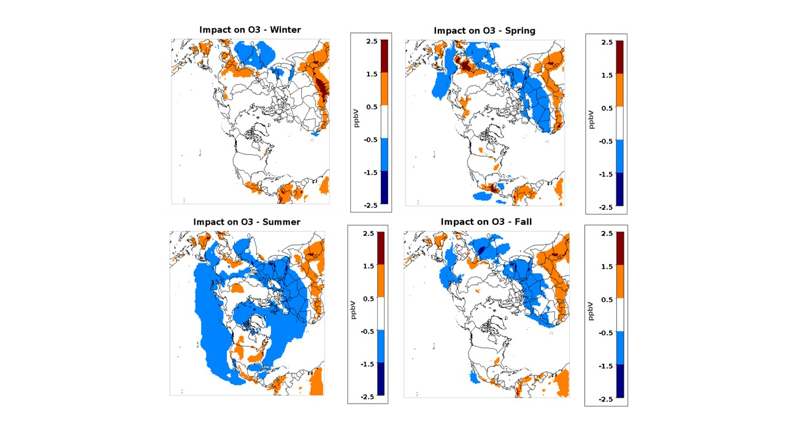
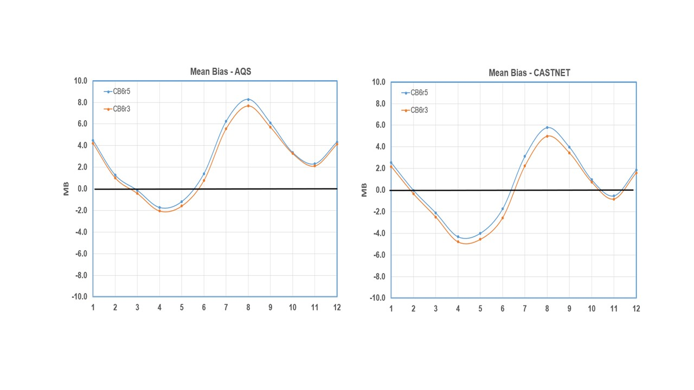

# Updating CBR65M_AE7_AQ  

[Golam Sarwar](mailto:sarwar.golam@epa.gov), U.S. Environmental Protection Agency

## Brief Description

Ramboll, the developer of the Carbon Bond chemical mechanism, recently updated the chemical mechanism (CB6r5) and implemented it into the Comprehensive Air quality Model with extensions (CAMx) (Yarwood et al., 2020). The Carbon Bond chemical mechanism in CMAQ has recently been updated into CB6r5 (PR #731). This pull request incorporates updates related to CB6r5 into the combined chemical mechanism containing the Carbon Bond chemical mechanism and the detailed halogen chemistry (CB6r5m_ae7_aq). The pull request does not include any changes to the detailed halogen chemistry. 
 
## Significance and Impact

Two separate annual simulations were performed for 2016. One simulation used CB6r3m_ae7_aq and the other simulation used CB6r5m_ae7_aq. The update changes mean ozone in each season (Figure 1). It increases ozone in some areas while decreasing ozone over other areas. The update affects Model Bias both at AQS and CASTNET sites (Figure 2) by small margins.

Figure 1: Impact of CB6r5m on seasonal mean ozone

Figure 2: Impact of CB6r5m on mean Model Bias at AQS and CASTNET sites

## Affected Files

CCTM/scripts/bldit_cctm.csh
CCTM/scripts/bldit_mech.csh
CCTM/CCTM/scripts/run_cctm_2011_12US1.csh
CCTM/CCTM/scripts/run_cctm_2014_12US1.csh
CCTM/CCTM/scripts/run_cctm_2016_12US1.csh
CCTM/scripts/run_cctm_2015_HEMI.csh
CCTM/CCTM/scripts/run_cctm_Bench_2016_12SE1.csh
CCTM/CCTM/scripts/run_cctm_Bench_2011_12SE1.csh

CCTM/src/MECHS/README.md

CCTM/src/MECHS/cb6r5m_ae7_aq/AE_cb6r5m_ae7_aq.nml
CCTM/src/MECHS/cb6r5m_ae7_aq/GC_cb6r5m_ae7_aq.nml
CCTM/src/MECHS/cb6r5m_ae7_aq/NR_cb6r5m_ae7_aq.nml
CCTM/src/MECHS/cb6r5m_ae7_aq/mech_cb6r5m_ae7_aq.def
CCTM/src/MECHS/cb6r5m_ae7_aq/RXNS_DATA_MODULE.F90
CCTM/src/MECHS/cb6r5m_ae7_aq/RXNS_FUNC_MODULE.F90
CCTM/src/MECHS/cb6r5m_ae7_aq/CSQY_DATA_cb6r5m_ae7_aq
CCTM/src/MECHS/cb6r5m_ae7_aq/EmissCtrl_cb6r5m_ae7_aq.nml
CCTM/src/MECHS/cb6r5m_ae7_aq/SpecDef_Dep_cb6r5m_ae7_aq.txt
CCTM/src/MECHS/cb6r5m_ae7_aq/SpecDef_cb6r5m_ae7_aq.txt
CCTM/src/MECHS/cb6r5m_ae7_aq/SpecDef_cb6r5m_ae7_aq_ELMO.txt
CCTM/src/MECHS/mechanism_information/cb6r5m_ae7_aq/AE7_species_table.md
CCTM/src/MECHS/mechanism_information/cb6r5m_ae7_aq/NR7_species_table.md
CCTM/src/MECHS/mechanism_information/cb6r5m_ae7_aq/cb6r5m_ae7_aq_species_table.md
CCTM/src/MECHS/mechanism_information/cb6r5m_ae7_aq/mech_cb6r5m_ae7_aq.md

CCTM/src/aero/aero6/AEROSOL_CHEMISTRY.F
CCTM/src/aero/aero6/AERO_DATA.F
CCTM/src/aero/aero6/DOS_DEFN.F
CCTM/src/biog/megan3/megan_gspro.F 
CCTM/src/cio/centralized_io_module.F 

CCTM/src/cloud/acm_ae6/convcld_acm.F
CCTM/src/emis/emis/BIOG_EMIS.F
CCTM/src/emis/emis/EMIS_DEFN.F
CCTM/src/isam/SA_DEFN.F
CCTM/src/spcs/cgrid_spcs_nml/CGRID_SPCS.F
CCTM/src/util/util/RUNTIME_VARS.F

CCTM/src/gas/ebi_cb6r5m_ae7_aq/DEGRADE_SETUP_TOX.F 
CCTM/src/gas/ebi_cb6r5m_ae7_aq/degrade.F  
CCTM/src/gas/ebi_cb6r5m_ae7_aq/degrade_data.F 
CCTM/src/gas/ebi_cb6r5m_ae7_aq/final_degrade.F 
CCTM/src/gas/ebi_cb6r5m_ae7_aq/find_degraded.F 
CCTM/src/gas/ebi_cb6r5m_ae7_aq/hrdata_mod.F 
CCTM/src/gas/ebi_cb6r5m_ae7_aq/hrdriver.F 
CCTM/src/gas/ebi_cb6r5m_ae7_aq/hrg1.F 
CCTM/src/gas/ebi_cb6r5m_ae7_aq/hrg2.F 
CCTM/src/gas/ebi_cb6r5m_ae7_aq/hrg3.F 
CCTM/src/gas/ebi_cb6r5m_ae7_aq/hrg4.F 
CCTM/src/gas/ebi_cb6r5m_ae7_aq/hrinit.F 
CCTM/src/gas/ebi_cb6r5m_ae7_aq/hrprodloss.F 
CCTM/src/gas/ebi_cb6r5m_ae7_aq/hrrates.F 
CCTM/src/gas/ebi_cb6r5m_ae7_aq/hrsolver.F 
CCTM/src/gas/ebi_cb6r5m_ae7_aq/init_degrade.F 

## References

1.	Yarwood, G.; Shi, Y.; Beardsley, R., 2020. Impact of CB6r5 mechanism changes on air pollutant modeling in Texas. Final Report for the Texas Commission on Environmental Quality, Work Order No. 582-20-11221-014.
2.	Amedro, D., Berasategui, M., Bunkan, A. J. C., Pozzer, A., Lelieveld, J., and Crowley, J. N.: Kinetics of the OH + NO2 reaction: effect of water vapour and new parameterization for global modelling, Atmos. Chem. Phys., 20, 3091–3105, https://doi.org/10.5194/acp-20-3091-2020, 2020.

-----
## Internal Records
#### Relevant Pull Requests:
[PR #738](https://github.com/usepa/cmaq_dev/pull/738)
#### Commit IDs:
908cf37d7fa5b4400d83e3f204188d7c440d51c8
16130c78779fc4a8cbf914ca327238547822ebf5
457d78f3b78f9536d48e1c2de2f27a142b0451d9

-----
