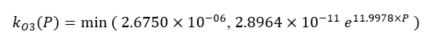

# Halogen mediated first order ozone loss is revised for all mechanisms

**Author/P.O.C.:** [Golam Sarwar](mailto:sarwar.golam@epa.gov), Computational Exposure Division, U.S. EPA

## Brief Description
A simple halogen mediated first order ozone loss was previously developed by using hemispheric CMAQ results obtained without and with detailed bromine/iodine chemistry for summer months. The detailed bromine/iodine chemistry has recently been updated and hemispheric model simulations were completed without and with the updated bromine/iodine chemistry for an entire year. The simple halogen mediated first order ozone loss is developed using the annual hemispheric CMAQ results obtained without and with full bromine/iodine chemistry. The revised halogen mediated first-order rate constant for ozone loss (units= 1/s) as a function of atmospheric pressure P (units=atm):

## Significance and Impact
Model sensitivity runs were completed with the existing and updated simple first order ozone loss (continental US domain) for a 10-day period in summer. The updated simple first order ozone loss reduces average ozone by up to 4.0 ppbv over seawater and by up to 2.0 ppbv over some coastal areas. No impact on model run time.

 
Figure 1: Impact of updated simple first order ozone loss.

## Affected Files
CCTM/src/MECHS/cb05e51_ae6_aq/RXNS_DATA_MODULE.F90
CCTM/src/MECHS/cb05e51_ae6_aq/RXNS_FUNC_MODULE.F90
CCTM/src/MECHS/cb05e51_ae6_aq/mech_cb05e51_ae6_aq.def

CCTM/src/MECHS/cb05e51_ae6nvPOA_aq/RXNS_DATA_MODULE.F90
CCTM/src/MECHS/cb05e51_ae6nvPOA_aq/RXNS_FUNC_MODULE.F90
CCTM/src/MECHS/cb05e51_ae6nvPOA_aq/mech_cb05e51_ae6nvPOA_aq.def

CCTM/src/MECHS/cb05tucl_ae6_aq/RXNS_DATA_MODULE.F90
CCTM/src/MECHS/cb05tucl_ae6_aq/RXNS_FUNC_MODULE.F90
CCTM/src/MECHS/cb05tucl_ae6_aq/mech_cb05tucl_ae6_aq.def

CCTM/src/MECHS/cb6r3_ae6_aq/RXNS_DATA_MODULE.F90
CCTM/src/MECHS/cb6r3_ae6_aq/RXNS_FUNC_MODULE.F90
CCTM/src/MECHS/cb6r3_ae6_aq/mech_cb6r3_ae6_aq.def

CCTM/src/MECHS/cb6r3_ae6nvPOA_aq/RXNS_DATA_MODULE.F90
CCTM/src/MECHS/cb6r3_ae6nvPOA_aq/RXNS_FUNC_MODULE.F90
CCTM/src/MECHS/cb6r3_ae6nvPOA_aq/mech_cb6r3_ae6nvPOA_aq.def

CCTM/src/MECHS/cb6r3_ae7_aq/RXNS_DATA_MODULE.F90
CCTM/src/MECHS/cb6r3_ae7_aq/RXNS_FUNC_MODULE.F90
CCTM/src/MECHS/cb6r3_ae7_aq/mech_cb6r3_ae7_aq.def

CCTM/src/MECHS/racm2_ae6_aq/RXNS_DATA_MODULE.F90
CCTM/src/MECHS/racm2_ae6_aq/RXNS_FUNC_MODULE.F90
CCTM/src/MECHS/racm2_ae6_aq/mech_racm2_ae6_aq.def

CCTM/src/MECHS/saprc07tb_ae6_aq/RXNS_DATA_MODULE.F90
CCTM/src/MECHS/saprc07tb_ae6_aq/RXNS_FUNC_MODULE.F90
CCTM/src/MECHS/saprc07tb_ae6_aq/mech_saprc07tb_ae6_aq.def

CCTM/src/MECHS/saprc07tc_ae6_aq/RXNS_DATA_MODULE.F90
CCTM/src/MECHS/saprc07tc_ae6_aq/RXNS_FUNC_MODULE.F90
CCTM/src/MECHS/saprc07tc_ae6_aq/mech_saprc07tc_ae6_aq.def

CCTM/src/MECHS/saprc07tc_ae6nvPOA_aq/RXNS_DATA_MODULE.F90
CCTM/src/MECHS/saprc07tc_ae6nvPOA_aq/RXNS_FUNC_MODULE.F90
CCTM/src/MECHS/saprc07tc_ae6nvPOA_aq/mech_saprc07tc_ae6nvPOA_aq.def

CCTM/src/MECHS/saprc07tic_ae6i_aq/RXNS_DATA_MODULE.F90
CCTM/src/MECHS/saprc07tic_ae6i_aq/RXNS_FUNC_MODULE.F90
CCTM/src/MECHS/saprc07tic_ae6i_aq/mech_saprc07tic_ae6i_aq.def

CCTM/src/MECHS/saprc07tic_ae6invPOA_aq/RXNS_DATA_MODULE.F90
CCTM/src/MECHS/saprc07tic_ae6invPOA_aq/RXNS_FUNC_MODULE.F90
CCTM/src/MECHS/saprc07tic_ae6invPOA_aq/mech_saprc07tic_ae6invPOA_aq.def

UTIL/chemmech/src/wrt_reactions_module.f

## References
1.	Sarwar, G.; Gantt, B.; Schwede, D.; Foley, K.; Mathur, M.; Saiz-Lopez, A., 2015: Impact of enhanced ozone deposition and halogen chemistry on tropospheric ozone over the Northern Hemisphere, Environmental Science & Technology, 49(15):9203-9211.

-----
## Internal Records:
#### Relevant Pull Requests:
[PR #328](https://github.com/usepa/cmaq_dev/pull/328)
#### Commit IDs:
5dd2890b6743bc1c0c6f94542f2565a517d8daeb

-----
