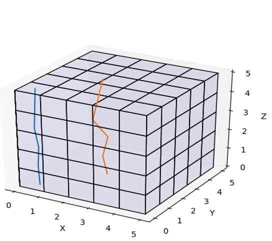

# Vertical Profile Extraction: extend CCTM to output vertical profiles at specified locations

**Author/P.O.C.:**, [Barron Henderson](mailto:bhenderson.barron@epa.gov), Office of Air Quality Planning & Standards, U.S. EPA

## Brief Description

This update allows users to save vertical profiles of multiple species at selected locations specified by a custom set of latitude / longitude coordinates. These profiles are written to a new optional output file, CTM_VEXT_1. The species written to this new output file are identical to those written to the 3D CONC file which in turn are controlled either by the setting of CONC_SPCS in the run script or the last column in the GC, AE, NR, and TR namelist files.

The creation of this optional output file is enabled by the following run script setting:  
  
    setenv DOVERTEXT Y  
 
The coordinates at which the profiles are to be extracted are specified in a new text input file that also needs to be specified in the run script as follows:  
  
    setenv VERTLONLATPATH /path/to/lonlat.txt 
  
This text input file has N+1 lines where N is the number of desired locations specified as (lon,lat) pairs. The following example is provided under CCTM/scripts/lonlat.csv.  

    4 # number of lon/lat pairs that follow
    -84.5684 32.8372
    -83.1034 33.7499
    -81.603 34.6438
    -80.0667 35.5179

## Significance and Impact

This new feature incorporates a post-processing step needed for evaluation of 3D model data directly into the CMAQ run script. Previously the user would need to work with the 3D CONC output file to compare model output to vertical observations (Figure 1). The new CTM_VEXT_1 file contains model output for only the vertical columns of interest (Figure 2). The addition of this new diagnostic file allows the user the ability to delete the full 3D CONC file after the model simulation is complete, thus dramatically reducing storage space required for model outputs when specific columns (e.g., sonde locations or aircraft or satellite) are all that are required.

Note that the new feature can be used to extract columns for boundaries on a perimeter. However, the BCON tool does not currently support the creation of boundary conditions from the diagnostic profile files created by this option.  The addition of this option into the BCON preprocessor may be considered for a future release. 

 

Figure 1: 3D CONC file needed for two vertical column extractions.

 

Figure 2: New CTM_VEXT_1 file containing model output for only the two vertical columns of interest.

## Affected Files  

CCTM/src/diag/vertext_module.F  
CCTM/src/ICL/fixed/filenames/FILES_CTM.EXT  
CCTM/src/driver/yamo/driver.F  
CCTM/src/init/yamo/initscen.F  
CCTM/scripts/lonlat.csv  
CCTM/scripts/bldit_cctm.csh  
CCTM/scripts/run_cctm.csh
bldit_project.csh

## References

N/A  

-----
## Internal Records:
#### Relevant Pull Requests:
[PR #319](https://github.com/USEPA/CMAQ_Dev/pull/319)

#### Commit IDs:
     7846c28ba3e9b497c59512f153ac6a49459ee397  
     581a6dff34be5ff82aa9fc6e94bc1b38baca7c51  
     a2283e6bc8dfd41eea9c3b6f7501f90fb443da21  
     1d12fc91c91c3b296f4d2fdeefa8568d46b580b6  
     14bb07b1631123c8964abacc383ffc41ef4efb6d  
     2f3ec2c862317b713830ce6ae2e538db839efa9f  
     971b06b26197f7e02dc55ae66a911443515dd2d7  
     133b3ffb113d888267b2741324aaed417da96b5e  
     11b8456fbe26aad23cd4509c1bcb5d02a7a413b8  
     43890c14207a639a48e6fd39b7607338c58b1f71  
     6c26acfa4d57640aa40b787af00a8738668effeb  
     a970fe6078b377b33e8cb302836bfeb235f89575  

-----

