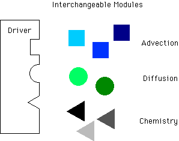
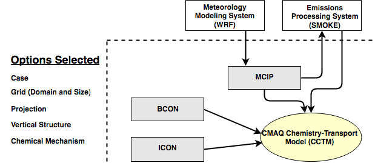
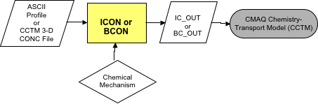
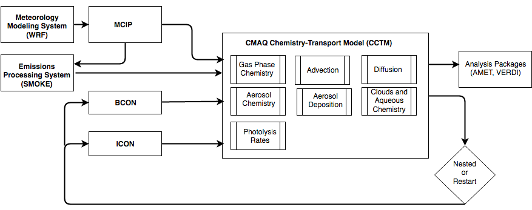
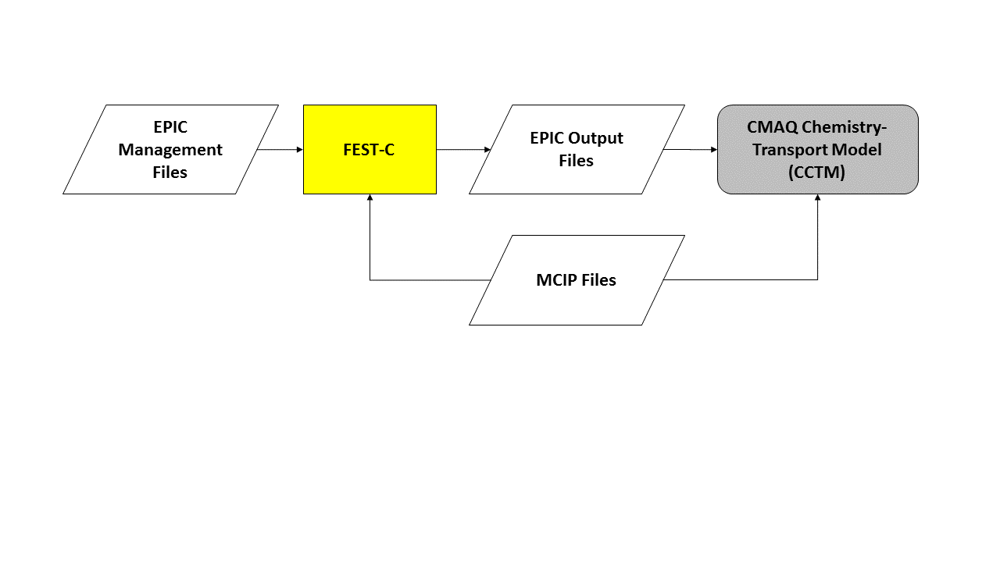

<!-- BEGIN COMMENT -->

[<< Previous Chapter](CMAQ_OGD_ch03_features.md) - [Home](README.md) - [Next Chapter >>](CMAQ_OGD_ch05_sys_req.md)

<!-- END COMMENT -->

# Science Overview #

As discussed in [Chapter 1](CMAQ_OGD_ch01_intro.md), CMAQ is a multipollutant, multiscale air quality modeling system that estimates the transport and chemistry of ozone, PM, toxic airborne pollutants (referred to as “air toxics”), acidic and nutrient pollutant species as well as estimates of visibility degradation and deposition totals. CMAQ includes state-of-the-art technical and computational techniques to simulate air quality from urban to global scales. It can model complex atmospheric processes affecting transformation, transport, and deposition of air pollutants using a system architecture that is designed for fast and efficient computing. While superceded by several science updates since its release, the [Science Algorithms of the EPA Models-3 Community Multiscale Air Quality Modeling System](https://www.cmascenter.org/cmaq/science_documentation/) continues to be important reference for the science and design of CMAQ. [Chapter 3](CMAQ_OGD_cho03_features.md) of this guide includes links to descriptions of the updates made to CMAQ by release version.

CMAQ has been developed to meet the needs of both the research and application communities. The CMAQ system allows users to easily construct model variations with different characteristics, such as different chemical mechanisms or alternative cloud treatments, in order to address a specific air quality issue (illustrated schematically in [Figure 4-1](#Figure4-1)). This modeling configuration allows CMAQ to retain its state-of-the-science status over time because it facilitates the implementation of new science modules as appropriate.

**Figure 4‑1. CMAQ Modeling Framework**

CMAQ can be employed for regulatory applications by using approved standard configurations of the modeling platform that represent the best available modeling technology at a given time. At the same time, the CMAQ modeling system is also a useful tool for the model developer. It is unique in that its components are designed in a flexible, modular fashion with a user interface; model developers can use these design features to create complex modeling situations and scenarios, or to develop entirely new models using a standardized coding framework. Model developers can also perform sensitivity analyses on newly developed modules and perform comparisons with existing systems.

This chapter summarizes the CMAQ modeling system framework and science features in various components of the CMAQ system, including MCIP, ICON, BCON, CHEMMECH, and CCTM. More detailed discussions on these features can be found in [Byun and Ching (1999)](https://www.cmascenter.org/cmaq/science_documentation/) and Byun and Schere (2006). The [next chapter](CMAQ_OGD_ch05_sys_req.md) discusses the CMAQ user interface for building and running CMAQ.

## Features Implemented to Achieve the Goals of CMAQ

As noted previously, early air quality model development resulted in separate air quality models that addressed single pollutants or issues, such as ozone or acid deposition. These models had little or no flexibility to be updated with advances in science or to accommodate new regulations. CMAQ was therefore designed to have more adaptability and flexibility for different applications and for changing or improving the modeling methodology. Within the context of the model’s science, the following subsections discuss CMAQ’s design in terms of (1) accommodating multiple pollutants and multiple scales, (2) providing flexibility through modularity, and (3) reducing the potential for model simulation error.

As a community model, CMAQ is able to leverage the expertise of model developers in many areas of atmospheric science. This facilitates improving and enhancing the CMAQ modeling system as the state-of-the-science evolves.

### Multiple pollutants and multiple scales

With its “one-atmosphere” design, which allows modelers to address the complex interactions among multiple pollutants/air quality issues simultaneously, CMAQ is a dramatic improvement over the earlier, single-pollutant models. The CMAQ system provides state-of-the-science capabilities for modeling multiple air quality pollutants/issues in a single simulation, including tropospheric ozone, PM, air toxics, visibility, and acidic and nutrient pollutant species. The “one-atmosphere” approach is important because the various chemical species interact. For example, ozone and hydroxyl radicals react with emitted species such as anthropogenic and biogenic organics to generate secondary PM species. These PM species can interact with solar radiation to alter photolysis rates, temperature, ventilation, winds, thermal reactions, and temperature- and windspeed-dependent emission rates.

The multiple spatial scale (multiscale) capabilities of CMAQ enable applications from local to hemispheric scales. By combining this multiscale feature with the temporal flexibility of the model, users can perform simulations to evaluate annual and interannual pollutant climatology, as well as shorter-term transport from localized sources. To implement multiscale capabilities in CMAQ, several different issues have been addressed, such as scalable atmospheric dynamics and generalized coordinates that depend on the desired model resolution. Meteorological models may assume hydrostatic conditions for large regional scales, where the atmosphere is assumed to have a balance of vertical pressure and gravitational forces with no net vertical acceleration on larger scales. However, on smaller scales such as urban scales, the hydrostatic assumption cannot be made. A set of governing equations for compressible nonhydrostatic atmospheres is available to better resolve atmospheric dynamics at smaller scales; these are more appropriate for finer-regional-scale and urban-scale meteorology. CMAQ’s generalized coordinate system is used so that meteorological fields on different horizontal and vertical coordinates can easily be accommodated and multiple scales can be simulated with the same CTM. The Jacobian used by the generalized coordinate system controls the necessary grid and coordinate transformations (consult Byun, 1999).

### Modular flexibility

CMAQ’s current coding structure is based on a modularity level that distinguishes from each other CCTM’s main driver, science modules, data estimation modules, and control/utility subroutines. Also distinguished from each other are the science models (including submodels for meteorology, emissions, chemistry-transport modeling) and the analysis and visualization subsystems.

In CCTM, the process modules that affect the pollutant concentration fields are classified as listed below. Each bullet contains a description of the process followed by *module name* in parentheses. These modules, with the exception of gencoor, are discussed further later in this section.

Science Modules:

-   Horizontal advection (*hadv*)
-   Vertical advection (*vadv*)
-   Mass conservation adjustments for advection processes (*adjc*)
-   Horizontal diffusion (*hdiff*)
-   Vertical diffusion (*vdiff*)
-   Gas-phase chemical reaction solver (*gas*)
-   Aqueous-phase reactions and cloud mixing (*cloud*)
-   Aerosol dynamics and size distributions (*aero*)
-   Potential vorticity scaling for stratosphere/troposphere exchange (*pv_o3*)
-   Meteorology-chemistry coupling (*twoway*)

Control/Utility Modules:

-   Model data flow and synchronizing of fractional time steps (*driver*)
-   Model horizontal grid system (*grid*)
-   Unit conversion (*couple*)
-   Initialization (*init*)
-   MPI/parallelization (*par*)
-   CGRID configuration (*cgrds*)
-   Process analysis (*procan*)
-   Species namelist utilities (*spcs*)
-   Miscellaneous functions (*util*)

Data Estimation Modules:

-   Deposition velocity estimation (*depv*)
-   Photolytic rate computation (*phot*)

In-line Emissions Modules:

-   Calculate emissions (biogenics, dust, lightning, sea salt, plume rise) in-line (*emis*)
-   In-line BEIS3 biogenic emissions (*biog*)
-   In-line plume rise (*plrise*)

The CMAQ modularity makes it easy to modify or introduce a specific scientific process in CCTM. For example, the *gas* module contains several options for different gas-phase chemistry solvers that can be used to optimize model performance. Without the modular structure, changes to just one scientific process could entail having to modify source code throughout CCTM, thereby greatly increasing the risk of human error.

### Quality control features

The CMAQ system was designed to minimize the potential for model simulation error in several significant ways:

- The [formal CMAQ peer review process](https://www.epa.gov/cmaq/cmaq-publications-and-peer-review) implemented by the EPA ensures that the model retains scientific credibility. Also, informal “review” of the modeling system occurs day-to-day as the broad international user community applies CMAQ for a wide variety of scientific questions and in locations other than North America.
- The modularity of the scientific processes in CMAQ makes modifications and adaptations to the user’s needs more straightforward. The potential for error is minimized because the user is not required to change code or declare variables within program modules outside the one of immediate interest.

## CMAQ Input Processors

CCTM uses data from other models and CMAQ input processing programs as input for model simulations [Figure 4-2](#Figure4-2).

**Figure 4-2. CMAQ Chemistry-Transport Model (CCTM) and pre-processors**

The input data for CCTM are developed using the three pre-processors shown in grey in [Figure 4-2](#Figure4-2). All of the CMAQ programs shown in [Figure 4-2](#Figure4-2) (bordered by the broken line) require five basic configuration options:

-   Case – a unique character string that identifies the simulation
-   Grid (Domain and size) – a definition of the horizontal modeling grid that includes the location relative to a fixed map projection and the size of the domain
-   Projection –defines a horizontal plane on the spherical surface of the earth, used to specify the general location of the modeling grid on the globe
-   Vertical Structure – a definition of the layer boundaries for the vertical grid
-   Chemical Mechanism – the name of the photochemical mechanism, aerosol chemistry mechanism, and aqueous chemistry mechanism used for the CMAQ simulation

The choices for these options and how they are selected for each of the CMAQ programs are detailed in [Chapter 7](CMAQ_OGD_ch07_programs_libraries.md).

CMAQ uses the MCIP software to prepare the meteorological fields for CCTM. The ICON and BCON processors generate the initial and boundary conditions for a CCTM simulation. Emissions for CMAQ must be prepared with an emissions data processing system (SMOKE) that generates emissions for direct input to CCTM. Brief descriptions of the various CMAQ pre-processors are presented in this section. Also described is the CHEMMECH processor, not shown in [Figure 4.2](#Figure4-2).

### MCIP: Meteorology-Chemistry Interface Processor

MCIP ingests output files from meteorological models, including the <a href="http://www.wrf-model.org">Weather Research and Forecasting Model (WRF)</a> and the <a href="http://www2.mmm.ucar.edu/mm5/">Fifth-Generation Penn State/NCAR Mesoscale Model (MM5)</a>, to create meteorology files that are used within the CMAQ Modeling System.  The goal of MCIP is to use as much of the data directly from the meteorological model to ensure physical consistency in the atmospheric state used by the CMAQ Modeling System.  The output from MCIP is in the standard I/O API format that is used within the CMAQ Modeling System.  MCIP output files can be used by the emissions processor (e.g., for meteorologically varying temperatures for mobile emissions) and by the CCTM to define the atmospheric conditions.  An overview of MCIP can be found in Otte and Pleim (2010).

**Figure 4‑3. Meteorology preprocessing for CMAQ with MCIP**

Using output fields from the meteorological model, MCIP performs the following functions:

-   Processes all required meteorological fields for CCTM and the emissions model.  Meteorological fields such as atmospheric temperature, pressure, humidity, and winds are taken directly from the meteorological model (i.e., "passed through").  Additional fields that are required by the CCTM but are not part of the meteorological model's output stream are computed within MCIP from the available meteorological fields.
-    Extracts meteorological model output on the computational domain that is prescribed for the CCTM.  The CCTM typically uses a smaller computational domain than the meteorological model, and the lateral boundaries from the meteorological model are generally not used by CCTM.
-   Optionally reduces the number of vertical layers from the meteorological model to the CCTM using "layer collapsing".  To do this, MCIP uses mass-weighted averaging on higher-vertical-resolution meteorological model output.
-   Computes cloud top, cloud base, liquid water content, and cloud coverage for cumuliform clouds using simple convective schemes. The cloud parameters influence CCTM aqueous-phase chemistry and cloud mixing (Walcek and Taylor, 1986; Chang et al., 1987).
-   Outputs several files in I/O API format that contain meteorological and geospatial information used by emissions processing and the CCTM.

MCIP is written in FORTRAN, and it runs on a single processor in a Unix/Linux environment.  MCIP is driven by a C-shell script with several run-time options that are defined through a FORTRAN namelist.  It is typical to use MCIP to process hourly output fields from the meteorological model for each one-day period.

MCIP is often updated concurrently with the CCTM.  The changes to MCIP are documented with each update to the software, and a "Frequently Asked Questions" (FAQ) file exists that is specific to MCIP.

### ICON and BCON: The initial and boundary conditions processors

To perform air quality simulations, both initial and boundary conditions are required. Initial conditions (calculated in ICON) are needed to provide concentrations of individual chemical species for the first time step throughout the modeling domain. Boundary conditions (calculated in BCON) are needed to provide concentrations of individual chemical species at the lateral boundaries of the modeling domain. In a single run ICON and BCON can generate these concentrations for all of the chemical species required by CMAQ. ICON and BCON require a file that specifies the concentrations of various chemical species in the troposphere and specification of the photochemical chemical and aerosol mechanisms that will be used in the supported CCTM simulation. These processors require two inputs [Figure 4‑4](#Figure4-4): a concentration file for the chemical species to be simulated, and the chemical mechanism.

***Concentration file:*** The concentration file used in ICON and BCON can come from one of two sources:

-   A time-independent set of vertical concentration profiles that are dependent upon the chemical mechanism being used. This approach is usually taken when no other information about the initial and boundary concentrations is available. CMAQ is currently distributed with IC and BC profiles for the CB05, RACM2, and SAPRC-07T photochemical mechanisms and the CMAQ AERO6 aerosol module. These files are set at the four boundaries (north, east, south, west) of the computational grid and are thus fixed in space.

-   Existing CCTM 3-D concentration fields. Usually, this option is selected when performing a nested model simulation and modeling results from a previous CCTM simulation are available from a coarser-grid-resolution simulation. Existing CCTM concentration fields are also used when a CCTM simulation is extended in time in a separate run step. Unlike the profiles discussed in the previous bullet, these CCTM concentration files are spatially and temporally resolved.

**Figure 4‑4. Initial and boundary conditions preprocessing for CMAQ**

***Chemical mechanism:*** Both the vertical concentration profiles and the CCTM concentration fields have specific chemical mechanisms associated with them, which are a function of how the files were originally generated. Either a generic ASCII input profile or an existing CCTM 3-D concentration file can be used to generate initial and boundary conditions for the CCTM. The user must consider the gas-phase chemical mechanism and aerosol module being used for the CCTM simulation when configuring ICON and BCON. CMAQ includes ASCII input profiles for the RACM2, CB05,and SAPRC-07T photochemical mechanisms and the CMAQ AERO6 aerosol module. Existing CCTM 3‑D concentration fields could have been generated using several different chemical mechanisms.

The chemical mechanism used in the CCTM and the CMAQ input processors must be consistent with the mechanism used to generate the concentration fields input to ICON and BCON. In other words, users must generate separate initial and boundary conditions using the same chemical mechanism that will be used for the CCTM simulation.

ICON and BCON can linearly interpolate input concentration profiles from the horizontal or vertical coordinate system used in the profiles to the one needed for the model simulation, if the input data are in the standard I/O API format. If the interpolation is between two different vertical coordinate systems, the mid-layer height of each vertical layer must also be available.

The current ICON and BCON processors cannot generate initial and boundary conditions for the CMAQ model from hemispheric and global model results.  A separate processor (GEOS2CMAQ) is available for generating boundary conditions for the CMAQ model using the GEOSSCHEM model results.  Another processor is also available for generating boundary conditions for the regional CMAQ model using the hemispheric CMAQ model results.  These processors are under development and will be released at a later date. Please contact us if you need the processors now.

### CHEMMECH: Chemical mechanism compiler

The release version of CMAQ includes all necessary chemical mechanism information for the pre-configured atmospheric chemistry reactions sets or mechanisms in a released version of CMAQ. Users choose which mechanism to use for compiling and runing the CCTM executable. CCTM  implements a chemical mechanism by using its namelist and FORTRAN modules. The files are in ASCII format and include the mechanism parameters required such as the species, reaction stoichiometry, and kinetics information. The module files are used to compile the CCTM executable while the namelists are read by CCTM at run time. 

Advanced users who wish to generate a new chemical mechanism have to use the CHEMMECH utility to convert the mechanism into the files needed by the CCTM program. CHEMMECH uses a mechanism definition file, often named “mech.def”, and optionally the mechanism namelist files to generate  FORTRAN modules. The “mech.def” is an ASCII file that uses a rigid syntax to define reactions and their rate constants. 

This approach defining the CMAQ chemical mechanisms allows the chemical reactions and their species to be a fixed part of the executable code. Modifications to the namelists can change predictions saved to the output files, deposition processes of species, emissions inputs and other options for species without recompiling the executable. The namelists defining a chemical mechanism are used by CCTM as well as the ICON and BCON pre-processors. The FORTRAN modules are required to run  utility programs such as create_ebi and inline_phot_preproc and JPROC.

### Lightning NO processing in CMAQ

CMAQ is instrumented to estimate the impacts of NO emissions from lightning on air quality. Details of the CCTM lightning NO capability are described in [Chapter 7](CMAQ_OGD_ch07_programs_libraries.md) and in the [CMAQv52 Release Notes](../../CCTM/docs/Release_Notes/Lightning_NOx.md). Emissions of lightning NO can either be generated inline or read in as an external input file that contains 3-D NO data. There are two ways to estimate lightning NO emissions in the CCTM: 
* Use observed hourly lightning flash count data from National Lightning Detection Network (NLDN); NLDN flash counts for the years 2002-2016 gridded to 12 km resolution are available from the CMAS center. A lightning parameter file also contains the ocean mask and ICCG data (climatological data for the ratio between inter-cloud to cloud-to-ground flashes); the ocean mask and ICCG data are used in both inline production schemes. The parameter file is available with the NLDN hourly flash data. The default lightning NO production rate is set to 350 moles per flash for both CG and IC flashes, but these values can be modified through the CCTM environment variables (MOLSNCG and MOLSNIC). [Download hourly NLDN data and a parameter file for the U.S.](https://www.cmascenter.org/download/data/nldn.cfm)
* Use linear (log-linear) parameters derived from historical NLDN data and model predicted convective precipitation from the Kain-Fritsch convective scheme. This options is available when observed hourly flash count data (e.g., NLDN) are not available, such as air quality forecasts and future climate applications. 

### CALMAP: Crop calendar map preprocessor

CMAQ has the capability to estimate windblown dust emissions in-line in the CCTM. The CMAQ dust emissions module uses land cover/land use data to identify dust source regions. The dust module includes a feature to estimate dust blown off by the wind (as opposed to anthropogenic dust emissions) from agricultural areas and the impacts of planting and harvesting cycles on available erodible lands that affect dust emissions. Calmap is a preprocessor to the CCTM that uses crop calendar information to produce gridded crop planting and harvesting dates for input to the CMAQ dust module. 

[Figure 4-5](#Figure4-9) is a Calmap schematic showing the data flow through the software. CALMAP reads grid information from the GRIDCRO2D meteorology file (MCIP output), land cover/land use data from [BELD3](https://www.epa.gov/air-emissions-modeling/biogenic-emissions-landuse-database-version-3-beld3), and crop calendar data to produce files of planting start dates, planting end dates, and harvesting end dates for different crop types interpolated to the modeling grid. These files are input to the CCTM when it is configured to estimate windblown dust and simulate the impacts of agricultural activity on the windblown dust emissions.

**Figure 4‑5. Crop calendar data preprocessor for the CCTM**

## CCTM: The CMAQ Chemistry-Transport Model

[Figure 4‑6](#Figure4-10) illustrates the CMAQ modeling system used to simulate the chemistry and transport of pollutants. This figure also shows how CMAQ relates to other parts of an air quality modeling system: the meteorological model, emissions model, and analysis software. To perform a model simulation, CMAQ needs input data, including meteorological and emissions data. Using this information, CCTM simulates each of the atmospheric processes that affect the transport, transformation, and removal of ozone, particulate matter, and other pollutants. CMAQ uses state-of-the-science techniques to simulate these processes, as described below.

**Figure 4-6. CMAQ chemistry-transport model and associated preprocessors**

### Gas-Phase Chemistry

See the [CMAQv5.2 release notes](../../CCTM/docs/Release_Notes/README.md#chemistry) for updates on the chemistry algorithms in CMAQ. 

#### Gas-phase chemistry solvers

To determine the time dependent concentrations of species described by a chemical mechanism, the CCTM uses numerical methods to solve ordinary differential equations representing the chemical transformations. Three solution methods are available and differ in terms of accuracy, generalization, and computational efficiency, i.e. model run times . They include the Rosenbrock (ROS3) solver (Sandu et al., 1997), the Euler Backward Iterative (EBI) solver (Hertel et al., 1993), and the Sparse Matrix Vectorized GEAR (SMVGEAR) solver (Jacobson and Turco, 1994). SMVGEAR and ROS3 are considered more accurate, in the order listed. Both solutions are labeled as “generalized” because using either only requires the mechanism’s namelist and FORTRAN modules. The EBI solver is more computationally efficient but is less accurate and is not a “generalized” solver so each chemical mechanism requires its own EBI solver. CMAQ includes EBI solvers for each mechanism definitions file releases with a model version. Consult the CMAQ release notes for what mechanisms are in a specific version. If a user creates or modifies a chemical mechanism , they have to create a new EBI solver by the using the create_ebi utility.  

#### Photolysis

Photolysis or photodissociation energize and break apart compounds in several key of chemical  processes in the atmosphere. It plays in the formation of ozone and particular material that affect human health. Computing the rate of photolysis reactions therefore strongly influences how well an air quality model simulates reality. 

The calculation of a photolysis rate must include multiple influences. Clouds, surface features, atmospheric gas and aerosols affect photolysis rates because each scatter and absorb light. A given photolysis reaction depends on molecular properties of the compound involved. Two properties describe the dependence. The absorption cross section represents the effective molecular area of a compound for absorbing solar radiation. The quantum yield gives the chance that the molecule that dissociates after absorbing the radiation.  Each property depends on the wavelength of the incident radiation, as well as air temperature and density. 

The in-line method (Binkowski et al., 2007) is the preferred method for calculating photolysis rates in the CCTM program of CMAQ model system. The method uses aerosol and ozone predicted within a simulation to calculate the solar radation. Two input files support the calculation. The PHOT_OPTICS file describe the optical properties of clouds, aerosols, and the earth’s surface. The OMI file is used to determine how much light is absorbed by atmosphere above the model domain. Both files are included in the released version of CMAQ. Calculating photolysis rates uses an additional input file called the CSQY_DATA file. It contains the cross sections and quantum yields of photolysis rates in a given chemical mechanism.  CSQY_DATA files are provided for all chemical mechanisms in a released version of CMAQ. If a user creates a mechanism using new or additional photolysis rates, they have to create a new CSQY_DATA file. The inline_phot_preproc utility produces this file based on the Fortran modules describing the mechanism (see the section on the CHEMMECH utility) and individual files describing the absorption cross-section and quantum yields described for each photolysis reaction.  

The CMAQ modeling system includes an additional method to calculate photolysis rates based on look-up tables. The tables gives a mechanism’s photolysis rates under cloud free conditions based on a fixed meridional cross-sections of atmospheric composition, temperature, density and aerosols. Each table represents rates as a function altitude, latitude and the hour angle of the sun on a specified Julian date. In model simulations, the method interpolates rates in the table for the date and corrects them to account for clouds described by the meteorological input files. The JPROC utility program creates the table based on the FORTRAN modules describing the chemical mechanism. The utility program also requires files describing each photolysis rates.

### Pollution Transport

See the [CMAQv5.2 release notes](../../CCTM/docs/Release_Notes/README.md#transport) for updates on the transport algorithms in CMAQ. 

Pollutant transport includes both advection and sub-grid-scale diffusion. Advection has to do with pollutant transport that is due to the mean wind fields, while diffusion involves sub-grid-scale turbulent mixing of pollutants. If a pollutant plume is transported primarily by advection, then it may travel a long distance without much change in pollutant concentrations. On the other hand, if a plume is transported primarily by diffusion, then the pollutants will mix more quickly and nearer to the source, which will result in substantial changes to pollutant concentrations.

#### Advection ####
In CCTM, the advection process is divided into horizontal and vertical components. This distinction is possible because mean atmospheric motion is mostly horizontal. Often, the vertical motion is related to the interaction of dynamics and thermodynamics. The advection process relies on the mass conservation characteristics of the continuity equation. Data consis­tency is maintained for air quality simulations by using dynamically and thermodynamically consistent meteorology data from MCIP. When the meteorological data and the numerical advection algorithms are not exactly mass consistent, one needs to solve a modified advection equation (Byun, 1999).

The horizontal advection scheme for CMAQ is the piecewise parabolic method (PPM) (Colella and Woodward, 1984). This algorithm is based on the finite-volume subgrid definition of the advected scalar. In PPM, the subgrid distribution is described by a parabola in each grid interval. PPM is a monotonic and positive-definite scheme. Positive-definite schemes maintain the sign of input values, which in this case means that positive concentrations will remain positive and cannot become negative. These codes are implemented in a global mass-conserving scheme introduced in v4.6 that is similar to the one used in the air quality forecasting version of CMAQ. Inspired by discussions with Robert Yamartino of Cambridge Environmental, the method uses the PPM scheme for horizontal advection, deriving a vertical velocity component at each grid cell that satisfies the continuity equation using the driving meteorological model’s air density.

The vertical advection modules solve for the vertical advection with no mass-exchange boundary conditions at the bottom or top of the model. CMAQ also uses PPM as its vertical advection module. Starting in CMAQv5.0, a new method for computing the vertical velocity was implemented that follows the omega calculation in WRF but uses PPM to compute horizontal mass divergence. The two-step process first integrates the continuity equation through the vertical column to get the change in column mass and then solves for omega layer by layer using the horizontal mass divergence (see equation 2.27 in [the WRF ARWv3 Technical Note](http://www2.mmm.ucar.edu/wrf/users/docs/arw_v3.pdf)). In CCTM, the PPM algorithm with a steepening procedure is implemented for vertical advection as the default because of the strong gradients in the tracer species that are observed in photochemical air quality conditions.

#### Diffusion ####
In CCTM, vertical diffusion is represented by the Asymmetric Convective Method (ACM) of Pleim and Chang (1992). ACM2 (Pleim, 2007), an updated version of ACM, was implemented starting in CMAQv5.0. This method recognizes that under convective conditions (when the surface is warming), heated air is transported vertically by buoyancy and mixes with ambient air at each level above the surface until the temperature of the rising air equals the ambient temperature. This process results from fast-moving air in narrow updrafts and slower-moving air in broader downdrafts. Thus, under convective conditions, vertical diffusion is asymmetric. An in-line method for treating biogenic and point-source emissions uses ACM to vertically distribute these emissions during a CMAQ calculation.

Under non-convective conditions (when the surface is cooling), vertical diffusion is represented by an eddy diffusivity approach. Eddy diffusivity is a local mixing scheme and is estimated using the same planetary boundary layer (PBL) similarity-based algorithm as in the Regional Acid Deposition Model (Chang et al., 1987, 1990). In CCTM, the deposition process is simulated as a flux boundary condition that affects the concentration in the lowest vertical model layer. By treating the deposition process as the loss of mass due to the diffusion flux at the bottom of the model, one can relate the bottom boundary condition in the generalized coordinate system to that in the Cartesian coordinate system. CMAQv5 has an improved version of the minimum allowable vertical eddy diffusivity scheme. The new version interpolates between urban and nonurban land cover, allowing a larger minimum vertical diffusivity value for grid cells that are primarily urban.

Horizontal diffusion is implemented with a single eddy diffusion algorithm that is based on local wind deformation and is scaled to the grid cell size. The horizontal eddy diffusivity is assumed to be uniform but dependent on the grid resolution of the model. This diffusivity is larger for a higher-resolution run where the numerical diffusion due to the advection process is smaller.

### Particulate matter (aerosols) ###

See the [CMAQv5.2 release notes](../../CCTM/docs/Release_Notes/README.md#chemistry) for updates on the aerosol chemistry algorithms in CMAQ. 

Within the air quality community, atmospheric aerosol particles are referred to as particulate matter (PM). PM can be either primary (directly emitted) or secondary (formed in the atmosphere) and from natural or anthropogenic (man-made) sources. Secondary sources include gas-phase oxidation of SO2 to sulfate, condensation of ammonia and nitrate, and oxidation of gas-phase VOCs such as isoprene, monoterpenes, aromatics, and alkanes. Cloud processes also contribute to the formation of PM; for example, aqueous oxidation of sulfur dioxide in cloud droplets is a significant pathway for production of particulate sulfate. CCTM represents PM using three interacting lognormal distributions, or modes. Two modes (Aitken and accumulation) are generally less than 2.5 microns in diameter while the coarse mode contains significant amounts of mass above 2.5 microns. PM2.5 and PM10, species aggregate metrics within the NAAQS, can be obtained from the model mass concentration and size distribution information.

Particulate matter is removed from the atmosphere by wet scavenging, settling, or by dry deposition at the surface, all of which are modeled by CMAQ. In dry deposition, the transfer is by turbulent air motion and by direct gravitational sedimentation of larger particles. The deposition velocity for particles must be calculated from the aerosol size distribution and from meteorological and land use information. CMAQ’s dry deposition module calculates the size distribution from the mass and number concentration for each of the three modes and then calculates the dry deposition velocity. Particles in the coarse mode are so large that CMAQ explicitly accounts for their gravitational settling as well. In wet deposition, PM is transferred by rainfall. Wet deposition is calculated within CMAQ’s cloud module. Starting in CMAQv4.7, the wet deposition algorithm was modified to include an impaction term in the coarse and accumulation modes. 

The 6th generation CMAQ aerosol module (AERO6) expands the chemical speciation of PM. Eight new PM species are added to CMAQ in AERO6: Al, Ca, Fe, Si, Ti, Mg, K, and Mn. Four species that were explicitly treated in previous versions of CMAQ but were not modeled can now be treated as primary anthropogenic species: H2O, Na, Cl, and NH4. The PM emissions mass that remains after speciation into the new components is now input to the model as PMOTHER. AERO6 requires 18 PM emissions species: OC, EC, sulfate, nitrate, H2O, Na, Cl, NH4, NCOM, Al, Ca, Fe, Si, Ti, Mg, K, Mn, and Other (Reff et al., 2009).

CMAQ includes two options for representing POA: nonvolatile or semivolatile. For the nonvolatile POA configuration, mass is tracked separately in terms of its carbon (OC) and non-carbon (NCOM) content. With this approach, mass can be added to the non-carbon species to simulate the aging of POA in response to atmospheric oxidants. Simon and Bhave (2011) document the implementation of the second-order reaction between primary organic carbon and OH radicals. The semivolatile POA configuration segregates POA into several model species based on a combination of volatility and oxidation state (Murphy et al., 2017). There are five POA species at low oxidation state representing low volatility, semivolatile and intermediate volatility compounds (LVPO1, SVPO1, SVPO2, SVPO3, IVPO1). As the gas-phase species (e.g. VLVPO1) oxidize with OH they form species with higher oxidation state (i.e. LVOO1, LVOO2, SVOO1, SVOO2, SVOO3). The multigenerational aging chemistry for the semivolatile POA configuration is derived from the approach of Donahue et al. (2012) which takes into account the functionalization and fragmentation of organic vapors upon oxidation. The semivolatile POA configuration also includes the option (on by default) of potential secondary organic aerosol from combustion sources (pcSOA). This species is emitted as a VOC (pcVOC) and forms SOA after reaction with OH. The emissions of pcVOC may be zeroed out by the user.

AERO6 uses ISORROPIA in the “reverse mode” to calculate the condensation/evaporation of volatile inorganic gases to/from the gas-phase concentrations of known coarse particle surfaces. It also uses ISORROPIA in the “forward mode” to calculate instantaneous thermodynamic equilibrium between the gas and fine-particle modes. The mass transfer of all semivolatile organic species is calculated assuming equilibrium absorptive partitioning, although some nonvolatile species do exist (e.g. cloud-processed organic aerosol, oligomers, nonvolatile POA (if selected)).

CMAQ can output the reduction in visual range caused by the presence of PM, perceived as haze. CCTM integrates Mie scattering (a generalized particulate light-scattering mechanism that follows from the laws of electromagnetism applied to particulate matter) over the entire range of particle sizes to obtain a single visibility value for each model grid cell at each time step. More detailed descriptions of the PM calculation techniques used in CCTM can be found in Binkowski and Shankar (1995),Binkowski and Roselle (2003), and Byun and Schere (2006).

For easier comparison of CMAQ’s output PM values with measurements, time-dependent cutoff fractions may be output by the model (e.g. Jiang et al., 2006). These include quantities for describing the fraction of each mode that would be categorized as PM2.5 (i.e. PM25AT, PM25AC, and PM25CO) and PM1.0 (i.e. PM1AT, PM1AC, and PM1CO) as well as the fraction of particles from each mode that would be detected by an AMS (i.e AMSAT, AMSAC, and AMSCO). . There is also a surface interaction module in the multipollutant version of CMAQ that calculates the flux of mercury to and from the surface (rather than just depositing mercury).

Further discussion on the scientific improvements to the CMAQ PM treatment is available in the release notes for each version of the model.

### Clouds and aqueous-phase chemistry ###

See the [CMAQv5.2 release notes](../../CCTM/docs/Release_Notes/README.md#chemistry) for updates on the heterogeneous chemistry algorithms in CMAQ. 

Clouds are an important component of air quality modeling and play a key role in aqueous chemical reactions, vertical mixing of pollutants, and removal of pollutants by wet deposition. Clouds also indirectly affect pollutant concentrations by altering the solar radiation, which in turn affects photochemical pollutants (such as ozone) and the flux of biogenic emissions. The cloud module in
CMAQ performs several functions related to cloud physics and chemistry. Three types of clouds are modeled in CMAQ: sub-grid convective precipitating clouds, sub-grid nonprecipitating clouds, and grid-resolved clouds. The meteorological model provides information about grid-resolved clouds, with no additional cloud dynamics considered in CMAQ. For the two types of sub-grid clouds, the cloud module in CCTM vertically redistributes pollutants, calculates in-cloud and precipitation scavenging, performs
aqueous chemistry calculations, and accumulates wet deposition amounts. An important improvement in the CMAQv5 convective cloud mixing algorithm corrects a tendency to predict excessive transport from upper layers in the cloud to sub-cloud layers.

CMAQ’s standard cloud chemistry treatment estimates sulfate production from five sulfur oxidation reactions, as well as secondary organic aerosol formation from the reaction of glyoxal and methylglyoxal with the hydroxyl radical.  The distribution between gas and aqueous phases is determined by instantaneous Henry’s law equilibrium, and the bisection method is used to estimate pH (and the distribution of ionic species) assuming electroneutrality.  Beginning with CMAQv5.1, two additional cloud chemistry module options, AQCHEM-KMT and AQCHEM-KMTI, were made available along with standard AQCHEM (Fahey et al., 2017).  These modules employ a Rosenbrock solver generated using the Kinetic PreProcessor (KPP), version 2.2.3 (Damian et al., 2002) to solve cloud chemistry, ionic dissociation, wet deposition, and kinetic mass transfer between the gas and aqueous phases (Schwartz, 1986).  AQCHEM-KMTI also includes an expanded aqueous-phase chemical mechanism that treats SOA formation from biogenic-derived epoxides (Pye et al., 2013) in cloud, in addition to the standard sulfur and -dicarbonyl oxidation reactions.  In all cloud chemistry modules, the parameters for cation content of coarse species have been updated to be consistent with the rest of CMAQ.

### Deposition

See the [CMAQv5.2 release notes](../../CCTM/docs/Release_Notes/README.md#exchange) for updates on the air-surface exchange algorithms in CMAQ. 

CMAQ optionally calculates the wet and dry deposition of chemical species.  Information on the algorithms used can be found in Pleim and Ran (2011), Bash et al (2013), and Pleim et al (2013).  For deposition to be considered in a model run, the entry in the namelist file must indicate a deposition surrogate species and a deposition factor.  The default namelist files contain the standard configuration for known deposition of species.  For wet deposition, the scavenging factor (SCAV_FAC) should be set to 1 and the surrogate species (SCAV_SUR) must be one of the chemicals listed in the HLCONST.F subroutine.  If the chemical does not have an appropriate surrogate species listed in the HLCONST.F subroutine, one may be added to the model source code.  For dry deposition, the deposition factor (DEPV_FAC) should be set to 1 and the deposition velcoity surrogate (DEPV_SUR) should be set to one of the species listed in the DEPVDEFN.F subroutine.  The species listed in this file are further cross-referenced to a table in ASX_DATA_MOD.F where the diffusivity in air, reactivity, mesophyll resistance, LeBas molar volume, and wet surface scavenging surrogate are specified. The wet surface scavenging surrogate must be a chemical in the HLCONST.F subroutine and is typically the same species that is used for wet deposition of the chemical.  If a proper deposition velocity surrogate species does not exist in the tables, one can be added to the model source code.

A runtime flag in the CMAQ model controls whether the bidirectional modeules for ammonia and mercury are invoked.  The bidirectional modules simulate two-way exchange between the atmosphere and the surface for these species (as opposed to only deposition). The mercury bidirectional module (Bash 2010) is part of the CMAQv5 multipollutant configuration. To use the bidirectional option for ammonia, additional input file are required.  The files are created from the Environmental Policy Integrated Climate (EPIC) model (Cooter et al., 2012). There are two time independent files which provide information on the soil and the landcover.  A time dependent file contains information on fertilizer application method and amount. 

**Figure 4‑7. Data flow between EPIC, the meteorological model, and CMAQ from Cooter et al. (2012)**

An additional configuration option related to deposition is the CMAQ_MOSAIC runtime option.  This option outputs land use specific deposition velocities and fluxes.

In previous versions of CMAQ, the effects of HONO heterogeneous chemistry on deposition velocities were included.  These effects were removed in CMAQv5.0.

### Emissions

See the [CMAQv5.2 release notes](../../CCTM/docs/Release_Notes/README.md#emissions) for updates on the emissions algorithms in CMAQ. 

CMAQ includes several in-line options for calculating and processing emissions in the CCTM. The in-line emissions options in CMAQv5 include the following:

-   The BEIS3 biogenic emissions model can be used to calculate emissions from vegetation and soils.   This biogenic model is based on the same model that is included in SMOKE.  User documentation for BEIS can be found in [Chapter 6.17 of the SMOKE manual](https://www.cmascenter.org/smoke/documentation/4.5/html/ch06s17.html). The temporal allocation of the biogenic emissions in included in CMAQ. However, the calculation of the gridded normalized emissions for winter and summer is a time independent calculation and must be done with normbeis3 prior to running the inline biogenic option in CMAQ. The user must either provide a BIOSEASON file for simulations that are not summer only or winter only (e.g. multiple seasons, spring, fall) or set the SUMMER_YN flag to Y for summer or N for winter. Without the BIOSEASON file, all biogenic emissions will be calculated using summer factors or winter factors.  Additional, when using the inline biogenic option, the user must point to the SOILOUT file from one day’s simulation as the SOILINP file for the next day. The user must also decide whether to write over SOILOUT files from previous days or create a uniquely named SOILOUT file for each day. The latter approach is recommended if the user wishes to retain the capability to restart simulations in the middle of a sequence of simulations.
-    Plume rise can be calculated for large point sources.  Plume rise can be calculated in-line within CMAQ provided the emission files have been processed with SMOKE for in-line processing.  The NPTGRPS sets the number of “sectors” for which the user wishes to provide a stack_groups file and an inline emissions file.  Optionally, the user can request 2 optional output diagnostic files that include a 3-D file the emissions with plume rise included and a layer fractions (PLAY) file that includes the fractional amount of emission per model layer.
-   Windblown dust emissions can be estimated using meteorology and land-cover data
-   Updated sea salt emissions. In AERO6 sea salt emissions in the accumulation mode are speciated into Na, Cl, SO4, Ca, K, and Mg. All cations in the coarse-mode sea salt (i.e., Na, Ca, K, and Mg) are lumped into a species called ASEACAT.

### Process analysis

See the [CMAQv5.2 release notes](../../CCTM/docs/Release_Notes/README.md#procan) for updates on the process analysis algorithms in CMAQ. 

Process analysis (PA) is a technique for separating out and quantifying the contributions of individual physical and chemical processes to the changes in the predicted concentrations of a pollutant.  PA does not have to be activated in a CMAQ simulation but including PA provides additional information that can be useful in interpreting CMAQ results. PA has two components:  Integrated process rate (IPR) analysis and Integrated Reaction Rate (IRR) analysis.  IPR analysis quantifies the individual physical processes of advection, diffusion, emissions, dry deposition, aerosol processes, and cloud processes) and the overall impact of chemical processes.  IRR analysis allows the output of individual chemical reaction rates or user-specified combinations of chemical reactions and species cycling.  

PA variables are computed by saving the differential operators associated with each process or reaction, integrated over the model synchronization time step –  the same variables that are used in solving the continuity equations within the model. For processes that are solved simultaneously in the same operator, PA uses mass balance to compute the contribution of each process.  

As a tool for identifying the relative importance of individual chemical and physical processes, PA has man applications, including:
- When attempting to identify the major contributors to the concentration of a chemical species, PA helps to unravel the large number of complex processes that control species concentrations.  This is also useful for species that have both production and decay processes occurring in the same time step, because the final concentration may show little change, but individual decay and production rates may be large.   
- To characterize the chemical “state” of a particular grid cell, IRR can be used to calculate quantifies such as the production of odd oxygen, the production of new radicals and the termination of radicals. (for example, see Tonnesen and Dennis, 2000). 
- As a tool for model development, PA can help evaluate the effect of modifications made to a model or process module
- For QA purposes, PA can be used to help identify compensating or unresolved errors in the model or input data which may not be reflected in the total change in concentration. For example, if an error in the emissions input data causes the model to calculate negative concentration values in an intermediate step, this could be masked in the final predicted concentrations if compensated for by larger positive values resulting from the chemistry calculations.

If the user activates PA during CMAQ runtime (CTM_PROCAN=Y), the PA input file (PACM_INFILE) specifies whether IPR, IRR or both analyses are performed, and defines which variables are required for each analysis. The IRR parameters are highly customizable and can be easily modified for new chemical mechanisms, but must be checked carefully before running to ensure that they correspond to the mechanism being used.  The PA_REPORT output file should always be reviewed to verify that the calculations are being performed correctly. Note that while the IPR option can be run with any of the chemical solvers, use of IRR in CMAQ requires either the Rosenbrock or the SMVGEAR solvers.

## The CMAQ User Interface

The CMAQ user interface that is distributed with the model source code consists of a series of C-shell scripts for building and running the various CMAQ programs on Linux operating systems. These scripts function primarily to set environment variables that are required by the program Bldmake or by the CMAQ program executables. The scripts can be adapted to work with any Linux shell scripting language (e.g., Bash, Bourne).

CMAQ source code can be viewed and downloaded from the [EPA CMAQ GitHub repository](https://github.com/USEPA/CMAQ). Alternatively, tarballs can be downloaded from [the CMAS Center website](https://www.cmascenter.org/cmaq/index.cfm). Each of CMAQ’s programs has separate build and run scripts. The build scripts are used to compile the source code into binary executables. The run scripts are used to set the required environment variables and execute the CMAQ programs. The user can manipulate the CMAQ scripts using a Linux text editor such as [emacs](https://en.wikipedia.org/wiki/Emacs), [gedit](https://en.wikipedia.org/wiki/Gedit), [nano](https://en.wikipedia.org/wiki/GNU_nano), or [vi](https://en.wikipedia.org/wiki/Vi). There are certain options that need to be set at compilation, and some that can be set before running a simulation. Details about using the scripts to build and run CMAQ are described in [Section 5](#CMAQ_System_Requirements_and_Installation), with further details in [Section 7](#CMAQ_Programs_and_Libraries).

The CMAS Center currently supports CMAQ on Linux systems using the Gnu, Portland Group, and Intel Fortran compilers. Community members are encouraged to share their experiences porting CMAQ to other operating systems and compilers.

**CMAQ users are strongly urged** to use the *same* Fortran compiler for *all* components of the CMAQ system, including the netCDF and I/O API libraries on which CMAQ depends.

## References for Chapter 4: Science Overview

Bash, J. O., E. J. Cooter, R. L. Dennis, J. T. Walker, and J. E. Pleim, 2013: Evaluation of a regional air-quality model with bidirectional NH3 exchange coupled to an agroecosystem model. *Biogeosciences*, **10**, 1635-1645.

Bash, J.O., 2010, Description and initial simulation of a dynamic bi-directional air-surface exchange model for mercury in CMAQ, *J. Geophys. Res.*, **115**, D06305

Binkowski, F.S., and U. Shankar, 1995: The Regional Particulate Model: Part I. Model description and preliminary results. *J. Geophys. Res*., **100**, 26 191–26 209.

Binkowski, F. S., and S. J. Roselle, 2003: Models-3 Community Multiscale Air Quality (CMAQ) model aerosol component. 1. Model description. ''J. Geophys. Res., **108**, 4183, <doi:10.1029/2001JD001409>.

Binkowski, F.S, , S. Arunachalam, Z. Adelman, and J. Pinto, Examining photolysis rates with a prototype on-line photolysis module in CMAQ, 2007, *J. Appl. Meteor. and Clim.*. **46**, 1252-1256, doi: 10.1175/JAM2531.1

Byun, D. W., 1999: Dynamically consistent formulations in meteorological and air quality models for Multiscale atmospheric studies. Part I: Governing equations in a generalized coordinate system. *J. Atmos. Sci*., **56**, 3789–3807.

Byun, D. W., and J. K. S. Ching, 1999: Science Algorithms of the EPA Models-3 Community Multiscale Air Quality (CMAQ) Modeling System. U. S. Environmental Protection Agency Rep. EPA‑600/R‑99/030, 727 pp. [Available from Office of Research and Development, EPA, Washington, DC 20460.]

Byun, D., and K. L. Schere, 2006: Review of the governing equations, computational algorithms, and other components of the Models-3 Community Multiscale Air Quality (CMAQ) modeling system. *Appl. Mech. Rev.*, **59**, 51–77. <doi:10.1115/1.2128636>

Carlton, A.G., B. J. Turpin, K. Altieri, S. Seitzinger, R. Mathur, S. Roselle, R. J. Weber, 2008. CMAQ model performance enhanced when in-cloud SOA is included: comparisons of OC predictions with measurements, Environ. Sci. Technol. , 42, (23), 8799-8802,

Carlton, A.G., P.V. Bhave, S.L. Napelenok, E.O. Edney, G. Sarwar, R.W. Pinder, G.A. Pouliot, M. Houyoux, 2010: Model Representation of Secondary Organic Aerosol in CMAQv4.7. *Env. Sci. & Techno*. **44 (22)**, 8553-8560.

Chang, J. S., P. B. Middleton, W. R. Stockwell, C. J. Walcek, J. E. Pleim, H. H. Lansford, F. S. Binkowski, S. Madronich, N. L. Seaman, D. R. Stauffer, D. Byun, J. N. McHenry, P. J. Samson, and H. Hass, 1990: The regional acid deposition model and engineering model, *Acidic Deposition: State of Science and Technology*, Report 4, National Acid Precipitation Assessment Program.

Colella, P., and P. L. Woodward, 1984: The piecewise parabolic method (PPM) for gas-dynamical simulations. *J. Comput. Phys*.,'' **54**, 174–201.

Cooter, E.J., Bash, J.O., Benson V., Ran, L.-M., 2012, Linking agricultural management and air-quality models for regional to national-scale nitrogen deposition assessments, *Biogeosciences*, **9**, 4023-4035

Damian, V., A. Sandu, M. Damian, F. Potra, and G.R. Carmichael, 2002: The Kinetic PreProcessor KPP -- A Software Environment for Solving Chemical Kinetics, *Computers and Chemical Engineering*, **26**, 1567-1579.

Donahue, N. M., et al. 2012: A two-dimensional volatility basis set – Part 2: Diagnostics of organic-aerosol evolution. *Atmospheric Chemistry and Physics,* **12(2)**, 615-634.
	
Edney, E. O., T. E. Kleindienst, M. Lewandowski, and J. H. Offenberg, 2007. Updated SOA chemical mechanism for the Community Multi-Scale Air Quality model, EPA 600/X-07/025, U.S. EPA, Research Triangle Park, NC.

Elterman, L., R. Wexler, and D. T. Chang, 1969: Features of tropospheric and stratospheric dust. *Appl. Optics*, **8**, 893–903.

Fahey, K.M., A.G. Carlton, H.O.T. Pye, J. Baek, W.T. Hutzell, C.O. Stanier, K.R. Baker, K.W. Appel, M. Jaoui, J.H. Offenberg, 2017: A framework for expanding aqueous chemistry in the Community Multiscale Air Quality (CMAQ) model version 5.1, *Geosci. Model Dev.*, **10**, 1587-1605.

Fountoukis, C and A. Nenes, 2007: ISORROPIA II: A computational efficient thermodynamic equilibrium model for K+-Ca2+-Mg2+-NH4+-Na+-SO42—NO3—Cl—H2O aerosols, ''Atmos. Chem. And Phys., **7**, 4639-4659.

Hertel O., R. Berkowicz, J. Christensen, and O. Hov, 1993: Test of two numerical schemes for use in atmospheric transport-chemistry models. *Atmos. Environ.*, **27A**, 2591–2611

Jacobson, M., and R. P. Turco, 1994: SMVGEAR: A sparse-matrix, vectorized Gear code for atmospheric models. *Atmos. Environ.*, **28**, 2991–3003.

Jiang, W., S. Smyth, É. Giroux, H. Roth, and D. Yin, 2006: Differences between CMAQ fine mode particle and PM2.5 concentrations and their impact on model performance evaluation in the lower Fraser valley. *Atmos. Environ*., **40**, 4973–4985.

Murphy, B. N., et al., 2017: Semivolatile POA and parameterized total combustion SOA in CMAQv5.2: impacts on source strength and partitioning. *Atmospheric Chemistry and Physics Discussions,* 2017: 1-44.

Otte, T. L., and J. E. Pleim, 2010: The Meteorology-Chemistry Interface Processor (MCIP) for the CMAQ modeling system: updates through MCIPv3.4.1. *Geoscientific Model Development*, **3**, 243-256.

Pleim, J.E., J. O. Bash, J. T. Walker, and E. J. Cooter, 2013. *J. Geophys. Res.*, **118**, 3794-3806.

Pleim, J. E., and J. S. Chang, 1992: A non‑local closure model in the convective boundary layer. *Atmos. Environ.*, **26A**, 965–981.

Pleim, J.E., and L. Ran, 2011: Surface Flux Modeling for Air Quality Applications. *Atmosphere*, **2**, 271-302.

Pleim, J. E., A. Xiu, P. L. Finkelstein, and T. L. Otte, 2001: A coupled land-surface and dry deposition model and comparison to field measurements of surface heat, moisture, and ozone fluxes. *Water Air Soil Pollut. Focus*, **1**, 243–252.

Pleim, J, 2007: A combined local and nonlocal closure model for the atmospheric boundary layer. Part I: model description and testing, *J. of Appl Met. and Climatology*, **46**, 1383-1395

Pye, H.O.T., R.W. Pinder, I.R. Piletic, Y. Xie, S.L. Capps, Y.H. Lin, J.D. Surratt, Z.F. Zhang, A. Gold, D.J. Luecken, W.T. Hutzell, M. Jaoui, J.H. Offenberg, T.E. Kleindienst, M. Lewandowski, E.O. Edney, 2013: Epoxide pathways improve model predictions of isoprene markers and reveal key role of acidity in aerosol formation, *Environ. Sci. Technol.*, **47(19)**, 11056-11064.

Reff, A., P.V. Bhave, H. Simon, T.G. Pace, G.A. Pouliot, J.D. Mobley, M. Houyoux, 2009: Emissions inventory of PM2.5 trace elements across the United States, *Env. Sci. & Technol*. **43**, 5790-5796.

Sandu, A., J. G. Verwer, J. G., Blom, E. J. Spee, G. R. Carmichael, and F. A. Potra, 1997: Benchmarking stiff ODE solvers for atmospheric chemistry problems. II: Rosenbrock solvers. *Atmos. Environ.*, **31**, 3459–3472.

Schwartz, S.E., 1986: Mass transport considerations pertinent to aqueous-phase reactions of gases in liquid water clouds. In Chemistry of multiphase atmospheric systems, NATO ASI Series, *G6*, 415-471. 

Tonnesen, G.S., Dennis, R.L., 2000: Analysis of radical propagation efficiency to assess ozone sensitivity to hydrocarbons and NO x : 1. Local indicators of instantaneous odd oxygen production sensitivity, *J. Geophys. Res.*, **105(D7)**, 9213-9225. 

National Oceanic and Atmospheric Administration, 1976: *U.S. Standard Atmosphere*, U.S. Government Printing Office, Washington, DC, NOAA‑S/T76‑1562.

<!-- BEGIN COMMENT -->

[<< Previous Chapter](CMAQ_OGD_ch03_features.md) - [Home](README.md) - [Next Chapter >>](CMAQ_OGD_ch05_sys_req.md) 
CMAQ Operational Guidance Document (c) 2016 

<!-- END COMMENT -->
