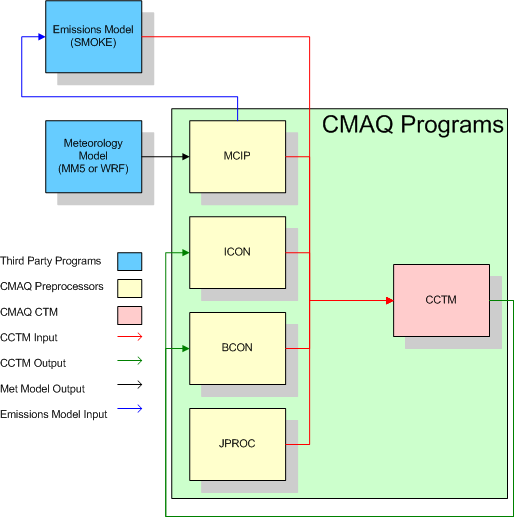
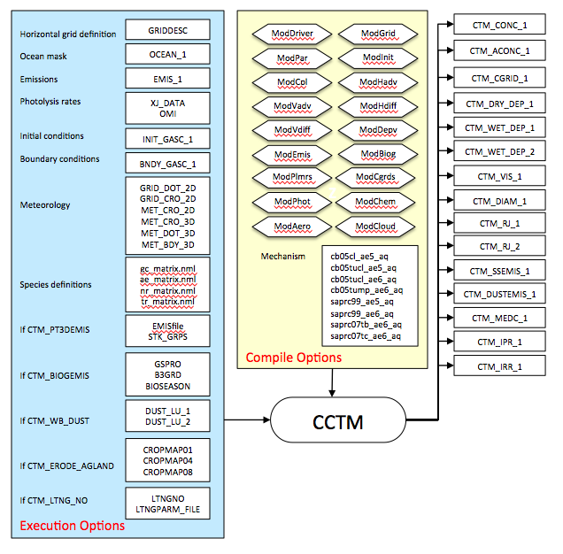
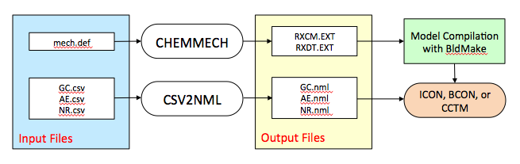
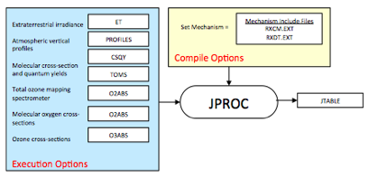
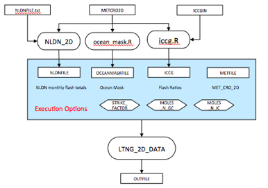

<!-- BEGIN COMMENT -->

[<< Previous Chapter](CMAQ_OGD_ch06_req_lib.md) - [Home](README.md) - [Next Chapter >>](CMAQ_OGD_ch08_input_files.md)

<!-- END COMMENT -->

<a id=Chapter_7></a>

# CMAQ Programs and Libraries #

Overview
--------

The core CMAQ programs that are needed to perform a basic air quality model simulation are [MCIP](#mcip), [ICON](#icon), [BCON](#bcon), and [CCTM](#cctm). The relationships among these programs are depicted within the green box in [Figure 7-1 CMAQ Core Programs](#Figure7-1). The blue boxes represent programs that are not part of the CMAQ distribution package but supply data necessary for an air quality simulation (emissions and meteorology data). The yellow boxes represent the standard CMAQ preprocessors: MCIP, ICON, and BCON. The red box represents the CMAQ chemistry-transport model (CCTM), the Eulerian air quality modeling component of CMAQ. Data flows between the CMAQ programs are represented in by arrows. The red arrows illustrate the flow of data from the CMAQ preprocessors and the emissions model to CCTM. The green arrows show the data feedbacks from CCTM to create initial and boundary conditions for nested simulations. The black arrow illustrates the connection between the meteorological model and MCIP. Finally, the blue arrow shows that the output from MCIP can be used to drive an emissions model.

A meteorological model,such as [WRF‑ARW](http://www.wrf-model.org), generates gridded meteorology for input to both CMAQ and the emissions model. These data are processed for input to CMAQ using MCIP.

An emissions model converts emissions inventories to gridded, hourly emissions formatted for CMAQ. The [SMOKE](http://www.smoke-model.org) emissions model is currently available for preparing emissions data for CMAQ.

CMAQ includes several "in-line" options to support coupling between meteorology and chemistry processes, and to facilitate operational air quality forecast modeling (see [Chapter 4](CMAQ_OGD_ch04_science.md)). The user can incorporate photolysis rate calculations and emissions processing during a CCTM simulation. There are several advantages of incorporating these processes directly in a CCTM simulation:

1. Photolysis rate calculations use the aerosol concentrations and meteorology from the CCTM simulation, simulating the feedbacks of the input emissions and resulting air quality on photochemistry
2. Emissions are meteorologically modulated at the synchronization (chemistry) time step rather than being linearly time-interpolated within each simulation hour
3. Disk space may be saved, because a 3‑D emissions file is no longer needed for elevated point sources
4. CMAQ can more easily be coupled with a meteorological model, enabling direct emissions modulation by the underlying, freshly computed meteorological variables


<a id=Figure7-1></a>



**Figure 7‑1.CMAQ core programs**

[MCIP](#mcip) is the first program in the CMAQ distribution package that a user should run when setting up a new simulation. MCIP is used to preprocess the data from a meteorological model for CMAQ and SMOKE.

[ICON](#icon) creates a binary netCDF initial conditions file for input to CCTM. Users have the option to create initial conditions data either from a text file of vertical concentration profiles or from an existing CCTM output file. ICON outputs initial conditions data that are configured for a specific modeling grid and chemical parameterization.

[BCON](#bcon) creates a binary netCDF lateral boundary conditions file for input to CCTM. Users have the option to create boundary conditions from either a text file of vertical concentration profiles or from an existing CCTM or larger-scale (e.g., global-scale) output file. BCON outputs boundary conditions data that are configured for a specific modeling grid and chemical parameterization. If derived from an existing CCTM or larger-scale output file, BCON produces dynamic boundary conditions that vary in time and space. When derived from vertical concentration profiles, BCON produces static boundary conditions for input to CCTM.

<!---[JPROC](#jproc) converts physical information about photoreactive molecules into clear-sky photolysis rate look-up tables for input to CCTM. The in-line photolysis approach allows photolysis rates to be adjusted by simulated gas and aerosol concentrations rather than by climatological values in the off-line approach. JPROC is not required when the in-line photolysis approach is selected.
--->
[CCTM](#cctm) is run last in the sequence of programs. All of the other CMAQ programs, and the emissions and meteorological models, are used to prepare the inputs to CCTM. By using data that are synchronized for a particular modeling time period, model grid, vertical layer configuration, and chemical parameterization, CCTM can produce estimates of pollutant concentrations, wet and dry deposition rates, and visibility metrics.

In addition to the core programs shown in [Figure 7‑1 CMAQ Core Programs](#Figure7-1), the CMAQ distribution package also includes utilities `($CMAQ_HOME/UTIL)` and post-processors `($CMAQ_HOME/POST)` for utilizing additional technical and diagnostic features in CMAQ. The CMAQ utility programs [CHEMMECH](#chemmech) [CSV2NML](#chemmech), [CREATE_EBI](#create_ebi), and [INLINE_PHOT_PREPROC](#inline_phot_preproc) are used to modify or prepare new chemical mechanisms for CMAQ. The CMAQ preprocessor [CALMAP](#calmap) creates maps of the crop calendar for use in estimating windblown dust emissions. The CMAQ post-processors are described in the [CMAQv5.1 documentation](https://www.airqualitymodeling.org/index.php/CMAQv5.1_Tools_and_Utilities) and are used to prepare CMAQ output data for analysis.

This chapter provides detailed descriptions of the CMAQ programs and utilities. Information about the third-party libraries used by CMAQ—such as I/O API, netCDF, and MPI are available in [Chapter 6](CMAQ_OGD_ch06_req_lib.md). When viewing the tables that list each program’s input and output files, recall that the various I/O API file formats shown are also described in [Chapter 6](CMAQ_OGD_ch06_req_lib.md).


<a id="BCON"></a>

## BCON

### Description

The program BCON prepares lateral chemical boundary conditions (BCs) for CCTM from either ASCII vertical profiles or from an existing CCTM output concentration (CONC) file. The BCs created by BCON can be static in both time and space (i.e., time-invariant with uniform concentrations in all boundary grid cells), dynamic in both time and space, or a combination of the two. The ASCII vertical profiles are primarily used to create static BCs. Dynamic BCs can be extracted from CONC files on either the same horizontal grid spacing (i.e., as a windowed modeling domain) or for a finer-resolution model grid (i.e., for a nested simulation), or they can be interpolated from a larger-scale CTM simulation (which is analogous to defining lateral BCs for WRF‑ARW).

There are two distinct modes of operation for BCON, and the mode used depends on the nature of the input data. When creating BCON executables, the user must specify whether the input data will be ASCII vertical profiles or a CONC file by selecting either “profile” or “m3conc”, respectively, for the setting of the *ModType* variable. This variable determines the input module to use when creating a BCON executable.

CCTM can also be forced with chemical boundary conditions downscaled from global chemistry models (GCMs), such as GEOS-Chem and MOZART. BCON does not support the processing of data from GCMs. BCs derived from GCMs must be calculated with custom codes or scripts that are not available in the CMAQ distribution package. The CAMx developers (Ramboll Environ) have codes available for extracting regional model BCs from both GEOS-Chem and MOZART. Visit the [Support Software section of www.CAMx.com](http://www.camx.com/download/support-software.aspx) to download these utilities.

### Files, configuration, and environment variables ###

[Figure 7‑2](#Figure7-2) shows the input and output files and configuration options for BCON. A distinction is made between the options that are invoked at compilation versus those invoked at execution of the program. When compiling BCON, the user specifies a chemical mechanism to configure the gas-phase chemistry and aerosol mechanism used to create the chemical BCs. Setting the *ModMech* and *Mechanism* variables in the BCON compile script configures the program to use a specific set of mechanism INCLUDE files to build an executable. Setting the *ModType* variable in the BCON compile script configures the program to input either a text file of static concentrations or a binary netCDF file of time-dependent concentrations for estimating BCs for CCTM. Separate BCON executables must be prepared for different mechanism and input file configurations.


<a id=Figure7-2></a>

  

**Figure 7‑2. BCON input and output files**


When BCON is run, it converts a data file of chemical ambient concentrations to BCs on a predefined model grid. Through the specification of the *ModInpt* variable in the BCON run script, BCON will input either an ASCII vertical profile file (BC_PROFILE) or an existing CCTM concentration file (CTM_CONC_1); the choice depends on how the user compiled the model. The BC input file provided by the user must have chemical speciation that is consistent with the mechanism configuration of the BCON executable. For example, if BCON was compiled to create BCs using the CB05 mechanism, the input BC profile data must be in terms of the CB05 mechanism. CMAQ is distributed with ASCII vertical profiles representing clean continental BCs for North America for the following chemical mechanisms: cb05e51_ae6_aq, saprc07tb_ae6_aq and racm2_aq6_aq. It is the user’s responsibility to generate BC inputs for other mechanism configurations.

The horizontal grid and vertical layer structures for BCON are defined at execution through the input of a grid description (GRIDDESC) file and a meteorology cross-point 3‑D (MET_CRO_3D) file, respectively. BCON interpolates between the input vertical layer structure and output layer structure if they are different.


#### BCON input files ####


<a id=Table7-1></a>

**Table 7‑1. BCON input files**

|**File Name**|**Format**|**Description**|
|-------------|--------|--------------------------------------------------------------|
|`BC_PROFILE`|`ASCII`|Vertical chemical profiles from which to derive boundary conditions; this file is created by the user; used only when the BC environment variable is set to “profile”|
|`CTM_CONC_1`|`GRDDED3`|CMAQ concentration file from which to derive boundary conditions; this file is output from CCTM; used only when the BC environment variable is set to “m3conc”|
|`MET_CRO_3D_CRS`|`GRDDED3`|Name and location of the coarse-grid MET_CRO_3D file that is required for creating the vertical grid structure if this structure changes between nested simulations; this file is output by MCIP|
|`MET_CRO_3D_FIN`|`GRDDED3`|Name and location of the fine-grid `MET_CRO_3D` file that is required if the vertical grid structure changes between nested simulations; this file is output by MCIP|
|`GRIDDESC`|`ASCII`|Horizontal grid description file for defining the model grid; this file is output by MCIP or can be created by the user|
|`LAYER_FILE`|`GRDDED3`|3-D cross-point meteorology `METCRO3D` file for defining the vertical layer structure of the model grid; this file is output by MCIP|
|`gc_matrix.nml`|`ASCII`|Namelist file for defining the gas-phase species that are input to the model through the boundary|
|`ae_matrix.nml`|`ASCII`|Namelist file for defining the aerosol species that are input to the model through the boundary|
|`nr_matrix.nml`|`ASCII`|Namelist file for defining the non-reactive species that are input to the model through the boundary|
|`tr_matrix.nml`|`ASCII`|Namelist file for defining the tracer species that are input to the model through the boundary|

#### BCON output files ####

<a id=Table7-2></a>

**Table 7‑2. BCON output files**

|**File Name**|**Format**|**Description**|
|--------------|-----------|------------------------------------------------------------------|
|`BNDY_CONC_1`|`BNDARY3`|Name and location of the gridded boundary conditions data output on the model grid defined by `GRID_NAME`|

The default location of the BCON output files is the `$CMAQ_DATA/bcon` directory, controlled by the `OUTDIR` variable in the run script. The default naming convention for all BCON output files uses the `APPL` and `GRID_NAME` environment variables in the file name. For boundary conditions created from existing `CCTM CONC` files, the Julian date is also used in the file name through the `DATE` environment variable. All of the file-naming variables for `BCON` outputs are set in the run script.

#### Compilation Configuration Variables ####

The configuration options listed here are set during compilation of the BCON executable. When these options are invoked they create a binary executable that is fixed to the specified configuration. To change these options you must recompile BCON and create a new executable.

-   `CopySrc`  
    Uncomment to copy the source code into a working build (BLD) directory. If commented, onlhy the compiled object and executable files will be placed in the BLD directory.
-   `MakeFileOnly`  
    Uncomment to build a Makefile to compile the executable. Comment out to both create a Makefile and compile.
-   `ModType: [default: module profile]`  
    Defines the format of the boundary conditions input files to be used by BCON.
    -   `m3conc`: input a `CCTM CONC` file; used for nested simulations or windows of a parent domain
    -   `profile`: input an ASCII vertical profiles file
    -   `tracer`: use the tracer namelist file to create BCs of tagged tracer species
-  `Mechanism: [default: cb05e51_ae6_aq]`  
    Specifies the gas-phase, aerosol, and aqueous-phase chemical mechanisms for which to create boundary conditions. The choices for the *Mechanism* variable are the mechanism directory names under the `$CMAQ_HOME/CCTM/src/MECHS` directory. Also see the [Mechanism Definitions Table](../Release_Notes/CMAQv5.2_Mechanisms.md)). Examples include:
    -   `cb6r3_ae6_aq`: CB6, revision 3 gas-phase mechanism, sixth-generation CMAQ aerosol mechanism with sea salt and speciated PM Other, `aqueous/cloud` chemistry
    -   `cb05e51_ae6_aq`: CB05 gas-phase mechanism with CMAQv5.1 updates, sixth-generation CMAQ aerosol mechanism with sea salt and speciated PM Other, `aqueous/cloud` chemistry
    -   `cb05tucl_ae6_aq`: CB05 gas-phase mechanism with active chlorine chemistry, updated toluene mechanism, sixth-generation CMAQ aerosol mechanism with sea salt and speciated PM Other, `aqueous/cloud` chemistry
    -   `cb05tump_ae6_aq`: CB05 gas-phase mechanism with active chlorine chemistry, updated toluene mechanism, mercury, and air toxics, sixth-generation CMAQ aerosol mechanism with sea salt and speciated PM, `aqueous/cloud` chemistry; this is the CMAQv5 multipollutant mechanism
    -   `saprc07tb_ae6_aq`: SAPRC-07 gas-phase mechanism with toluene updates and sixth-generation CMAQ aerosol mechanism
    -  `racm2_ae6_aq`: RACM2 gas-phase mechanism with toluene updates and sixth-generation CMAQ aerosol mechanism
-   `Tracer [default trac0] `  
    Specifies tracer species. Invoking inert tracer species in CMAQ requires defining the tracers using namelist files and compiling the CMAQ programs with these files. The setting for this module corresponds to the directory name in the $CMAQ_HOME/CCTM/src/MECHS directory that contains the namelist files for the tracer configuration. The default setting is to not use any tracers.
    - `trac[n]`

#### Execution Configuration Variables ####

The environment variables listed here are invoked during execution of the program and are set in the BCON run script.

-   `APPL [default: None]`
    BCON executable identifier. Must match APPL Variable setting in the BCON build script.
-   `CFG [default: None]`
    Configuration identifier for the BCON simulation.
-   `MECH [default: None]`
    CMAQ chemical mechanism. Must match Mechanism variable setting in the BCON build script.
-   `EXEC: [default: BCON_${APPL}_${EXECID}]`
    Executable to use for the simulation. The variable CFG is set in the BCON run script. The variable EXECID is set in the config_cmaq.csh configuration file.
-   `GRIDDESC: [default: $CMAQ_HOME/scripts/GRIDDESC1]`
    Grid description file for setting the horizontal grid definition.
-   `GRID_NAME: [default:CMAQ-BENCHMARK]`
    Name of the grid definition contained in the GRIDDESC file that specifies the horizontal grid for the current application of the model.
-   `IOAPI_ISPH: [default: 20]`
    I/O API setting for spheroid type. See I/O API documentation for [setsphere](https://www.cmascenter.org/ioapi/documentation/3.1/html/SETSPHERE.html) for more information.
-   `IOAPI_OFFSET_64: [default: NO]`
    I/O API setting for large time-step records. If your output time step is going to produce data that are greater than 2GB per time step, then this needs to be set to YES.
-   `LAYER_FILE:[default: none]`
    Name and location of a MET_CRO_3D file for specifying the vertical layer structure for the current application of the model.
-   `gc_matrix.nml: [default: none]`
    Gas-phase species namelist file. This file is used to configure the gas-phase species that will be output by BCON.
-   `ae_matrix.nml: [default: none]`
    Aerosol-phase species namelist file. This file is used to configure the aerosol-phase species that will be output by BCON
-   `nr_matrix.nml: [default: none]`
    Nonreactive species namelist file. This file is used to configure the nonreactive species that will be output by BCON
-   `tr_matrix.nml: [default: none]`
    Tracer species namelist file. This file is used to configure the tracer species that will be output by BCON
-   `OUTDIR: [default: $CMAQ_HOME/data/bcon]`
    Output data directory.
-   `BC:` Sets the input file type. The setting of this variable determines how the run script sets the input and output environment variables.
    -   `profile`: sets the output file name to include the tag “profile” in the name; uses the variable BC_PROFILE to point to an ASCII vertical profile file for input to BCON.
    -   `m3conc`: used for nested simulations; sets the output file name to include a start date in the name; uses the variable `CTM_CONC_1` to point to a CCTM CONC file for input to BCON.
-   `DATE:` Sets the Julian date to use in naming the BCON output file for nested runs.
-   `SDATE:[default: ${DATE}]` Julian start date for extracting boundary conditions from a CCTM CONC file for a nested simulation. If SDATE is not set, it will be set automatically from the CTM_CONC_1 file.
-   `STIME: [default: 000000 ]` Start time for extracting boundary conditions from a CCTM CONC file for a nested simulation. If STIME is not set, it will be set automatically from the CTM_CONC_1 file.
-   `RUNLEN: [default: 240000]` Number of hours of boundary conditions to extract from a CCTM CONC file for a nested simulation. If RUNLEN is not set, it will be set automatically from the CTM_CONC_1 file.

### Compiling and Running ###


#### Compile BCON ####


[Chapter 5](CMAQ_OGD_ch05_sys_req.md) provides an overview of how to install and compile the CMAQ pre-processor programs for a test simulation. Follow those steps (summarized below) to compile new versions of BCON.

1. Compile Bldmake, the CMAQ source code and compilation management program. This needs to be done only once—the first time CMAQ is installed.
-   Configure the BCON use the config_cmaq.csh script, which points to the available I/O API and netCDF libraries.
-   Configure the BCON build script for your application by setting the compilation configuration variables described above.
-   Invoke the build script to create an executable.

```
cd $CMAQ_HOME/PREP/bcon/scripts/
./bldit.bcon |& tee build.bcon.log
```

#### Run BCON ####

Set the run script settings according to the execution configuration variables described above. Run BCON to produce boundary conditions for the CCTM:

```
cd $CMAQ_HOME/PREP/BCON
./run.bcon |& tee bcon.log
```

<a id="calmap"></a>

## Calmap

### Description

The preprocessor program Calmap produces gridded planting start dates, planting end dates, and harvesting end dates for different crop types for estimating the impacts of agricultural activities on windblown dust emissions. The CMAQ windblown dust emissions module can optionally use the output from Calmap to simulate the effects of crop cycles on dust emissions.

### Files, configuration, and environment variables

[Figure 7-3](Figure7-3) shows that Calmap reads five input files to produce eight outputs, only three of which are used by the CCTM. Calmap uses the GRIDCRO2D file, produced by MCIP, to define the modeling grid. The BELD01 file points to a BELD3 “a” file of gridded land cover/land use data containing coverage for several different crop categories. The BELD3 “a” file is an input to the BEIS emissions model and can be [generated by the Spatial Allocator](https://github.com/CMASCenter/Spatial-Allocator/blob/master/docs/User_Manual/SA_ch03_vector.md#5-creating-inputs-to-smoke-biogenic-processing). The rest of the inputs to Calmap are crop calendar data for the United States that are packaged with CMAQv5. Calmap converts to the data to I/O API GRDDED3 files on the modeling grid defined in the GRIDCRO2D file. The CROPMAP01 file contains planting start dates for specific crops. The CROPMAP04 file contains planting end dates for specific crops. The CROPMAP08 file contains harvesting end dates for specific crops. Each of these files are input to the CCTM when the erodible agricultural land (CTM_ERODE_AGLAND) feature is turned on.

<a id=Figure7-3></a>


**Figure 7‑3. Calmap input and output files**

#### Calmap input files

**Table 7‑3. Calmap input files**

|**File Name**|**Format**|**Description**|
|-------------|----------|---------------------------------------------------------|
|GRID_CRO_2D|GRDDED3|Name and location of the time-independent 2-D cross-point meteorology file; output by MCIP|
|BELD01|GRDDED3|BELD land use “A” data file for calculating windblown dust emissions; produced with BELD land use tiles and the Spatial Allocator|
|CPCALED|ASCII|Calendar of agricultural activities by state|
|NCROP|ASCII|Number and names of crop species included in the crop calendar|
|USSTATE|ASCII|Two digit US state codes included in the crop calendar|

#### Calmap output files

**Table 7‑4. Calmap output files**

|**File Name**|**Format**|**Description**|
|-----------|---------|-------------------------------------------------------|
|CROPMAP01|GRDDED3|Name and location of the gridded planting start dates file.|
|CROPMAP02|GRDDED3|Name and location of the gridded ??? start dates file; not used by the CCTM.|
|CROPMAP03|GRDDED3|Name and location of the gridded ??? dates file; not used by the CCTM|
|CROPMAP04|GRDDED3|Name and location of the gridded planting end dates file.|
|CROPMAP05|GRDDED3|Name and location of the gridded ??? start dates file; not used by the CCTM|
|CROPMAP06|GRDDED3|Name and location of the gridded ??? start dates file; not used by the CCTM|
|CROPMAP07|GRDDED3|Name and location of the gridded harvesting end dates file.|

#### Execution Configuration Variables ####

The environment variables listed here are invoked during execution of the program and are set in the Calmap run script.

```
-   BASE: [default: $CMAQ_HOME/PREP/agdust/scripts] Base Calmap installation location.
-   GRID_CRO_2D: [default: none] Directory path and name of the GRID_CRO_2D file for defining the modeling grid.
-   BELD01: [default: none] Directory path and name of the BELD3 A file for defining the gridded land cover,land use in the modeling domain. Note that this is the same file used by the CCTM to compute dust emissions (DUST_LU_1).
-   CROPMAP01-08: [default: none] Directory path and names of Calmap output files. The CROPMAP01, CROPMAP04, and CROPMAP08 are the only files used by the CCTM for the dust calculation.
```

### Compiling and Running

#### Compile Calmap

Calmap is compiled with a Makefile. The configuration options in the Makefile include only the compiler and compiler flags to use for building the executable. The Makefile is located in the directory with the Calmap source code `$CMAQ_HOME/PREP/agdust/src`. To compile Calmap, source the config_cmaq.csh file and invoke the Makefile at the command line.

```
cd $CMAQ_HOME/PREP/agdust/src
source $CMAQ_HOME/config_cmaq.csh
./make |& tee make.calmap.log
```

To port Calmap to different compilers, change the compiler names, locations, and flags in the config.cmaq script.

#### Run Calmap ####

Set the run script settings according to the execution configuration variables described above. Run Calmap to produce crop calendar input for the CCTM inline windblown dust model:

```
cd $CMAQ_HOME/PREP/agdust/scripts
./run_calmap.csh |& tee run_calmap.log
```

--------

<a id=CCTM></a> 

## CCTM

### Description

CCTM is the Eulerian chemistry and transport component of CMAQ. It uses input data produced by the other CMAQ programs and from meteorological and emissions models. CCTM produces multiple output files for each simulation. The basic CCTM outputs include instantaneous and average hourly concentration files, wet and dry deposition files, and visibility estimates. Other CCTM outputs can include diagnostic aerosol and cloud files and processes analysis files.

CCTM contains several science configurations for simulating transport, chemistry, and deposition. All of the science configuration options in CCTM, such as the chemical mechanism to be used, are set when compiling the executable. The model grid and vertical layer structure for CCTM are set at execution. The important distinction between selecting the science configura­tion and the model grid, layer configuration is that CCTM does not need to be recompiled when changing model grids, layers but does need to be recompiled when new science options are invoked.

Optional output files are created when their associated processes are invoked in CCTM. For example, when CCTM is compiled with process analysis turned on, additional output files are created.

CCTM includes options for the in-line processing of emissions and photolysis rates. In-line refers to the handling of processes that had previously been accomplished outside of CCTM, such as emissions processing with SMOKE, with algorithms internal to CCTM. The benefits of in-line emissions processing include the integration of higher time-resolution meteorology in the computation of biogenic emissions and plume rise from point sources and the avoidance of the large data storage burden required for emissions data. The benefit of in-line photolysis rate calculations is the inclusion of predicted gas and aerosol concentrations in the rate calculations.

Both in-line emissions and photolysis are invoked through compile-time configuration options for CCTM. When CCTM is instrumented for in-line emissions calculations, a series of additional input files and environment variables are required at execution. The details of these additional inputs are provided below. In-line photolysis does not require any additional inputs as CCTM includes all of the photolysis rate data internal to the in-line instrumented version of the model.

### Files, configuration, and environment variables

[Figure 7‑4](#Figure7-4) shows the input and output files and configuration options for CCTM. A distinction is made between the options that are invoked at compilation time versus those invoked at execution of the program. When compiling CCTM, the user specifies a chemical mechanism to configure the gas-phase chemistry and aerosol mechanism used for the air quality calculations. Setting the *Mechanism* variable in CCTM compile script configures the program to use a specific set of mechanism INCLUDE files to build an executable. All of the science processes simulated by CCTM must also be selected during the compilation step for CCTM. Separate CCTM executables must be prepared for different mechanism and science configurations. During the execution step, or when CCTM is run, the user sets the horizontal and vertical grid definitions and the input files used for the simulation. Different spatial domains, vertical grid structures and input files can be used with a single CCTM executable, as long as the input files are consistent with the scientific configuration built into the executable. For example, with the gas-phase photochemical mechanism configuration built into a CCTM executable, different modeling domains can be simulated with the executable as long as the emissions and `IC/BC` files are consistent with the photochemical mechanism configuration built into the executable.

<a id=Figure7-4></a>



**Figure 7‑4. CCTM input and output files**

#### CCTM input files

<a id=Table7-5></a>

**Table7‑5. Required CCTM input files**

|**File Name**|**Format**|**Description**|
|-----------------------------|-----------|---------------------------------------------------|
|`GRIDDESC`|`ASCII`|Map projection and grid definitions|
|`OCEAN_1`|`GRDDED3`|Name and location of the time-independent 2-D file for defining the fraction of each model grid cell covered by open ocean|
|`EMIS_1`|`GRDDED3`|Name and location of the time-dependent 2-D or 3-D emission file speciated for a particular gas-phase chemical mechanism and PM model; output from an emission model, such as SMOKE or CONCEPT|
|`INIT_[GASC/AERO/NONR/TRAC]_1`|`GRDDED3`|Name and location of the time-dependent, single-time-step, 3-D initial conditions file speciated for a particular gas-phase chemical mechanism and PM model; output from ICON|
|`BNDY_[GASC/AERO/NONR/TRAC]_1`|`BNDARY3`|Name and location of the time-dependent, either single-time-step or multi-time-step, 3-D boundary conditions file speciated for a particular gas-phase chemical mechanism and PM model; output from BCON|
|GRID_CRO_2D|GRDDED3|Name and location of the time-independent 2-D cross-point meteorology file; output by MCIP|
|GRID_DOT_2D|GRDDED3|Name and location of the time-independent 2-D dot-point meteorology file; output by MCIP|
|MET_CRO_2D|GRDDED3|Name and location of the time-dependent 2-D cross-point meteorology file; output by MCIP|
|MET_DOT_3D|GRDDED3|Name and location of the time-dependent 3-D dot-point meteorology file; output by MCIP|
|MET_CRO_3D|GRDDED3|Name and location of the time-dependent 3-D cross-point meteorology file; output by MCIP|
|MET_BDY_3D|BNDARY3|Name and location of the time-dependent 3-D boundary meteorology file; output by MCIP|
|CSQY_DATA|ASCII|Absorption cross section and quantum yield data for calculating inline photolysis rates|
|OMI|ASCII|Ozone Mapping Instrument vertical ozone column data by latitude for different years|
|OPTICS_DATA|ASCII|Wavelength, Optical and Surface Albedo Parameters for CMAQ In-Line Photolysis calculation |
|gc_matrix.nml|ASCII|Namelist file for defining the gas-phase species that are input to the model through the boundary|
|ae_matrix.nml|ASCII|Namelist file for defining the aerosol species that are input to the model through the boundary|
|nr_matrix.nml|ASCII|Namelist file for defining the non-reactive species that are input to the model through the boundary|
|tr_matrix.nml|ASCII|Namelist file for defining the tracer species that are input to the model through the boundary|

<a id=Table7-6></a>

**Table 7‑6. Optional CCTM input files**

|File Name|Format|Description|
|---------------|--------|-------------------------------------------------------------------|
|XJ_DATA|ASCII|Name and location of the daily clear-sky photolysis rates file speciated for a particular gas-phase chemical mechanism; output from JPROC - only needed for offline photolysis configuration|
|STK_GRPS_nn|GRDDED3|Stack parameter file for calculating inline plume rise for point source emissions - nn refers to the sector ID number, where there could be multiple point source stack groups used in a single simulation; produced by the SMOKE program Elevpoint|
|STK_EMIS_nn|GRDDED3|Emissions for elevated point sources - nn refers to the sector ID number, where there could be multiple point source sectors used in a single simulation; produced by the SMOKE program Smkmerge|
|GSPRO|ASCII|Speciation profile file. Contains the factors that are used to separate aggregated inventory pollutant emissions totals into emissions of model species required by CCTM|
|B3GRD|GRDDED3|Normalized biogenic emissions for input to BEIS3; produced by the SMOKE program Normbeis3.|
|BIOSEASON|GRDDED3|Indicates the biogenic emissions factors to use for each day in a given year. This file can be created using the SMOKE utility program Metscan. The BIOSEASON file is time-dependent and usually contains data for an entire year (365 or 366 days). It uses one variable, SEASON, which is either 0 (grid cell should use winter factors for current day) or 1 (grid cell should use summer factors for current day.|
|SOILINP|GRDDED3|Biogenic NO soil input restart file; output by the previous day CCTM simulation.|
|DUST_LU_1|GRDDED3|BELD land use “A” data file for calculating windblown dust emissions; produced with BELD land use tiles and the Spatial Allocator|
|DUST_LU_2|GRDDED3|BELD land use “TOT” data file for calculating windblown dust emissions; produced with BELD land use tiles and the Spatial Allocator|
|MODIS_FPAR|GRDDED3|MODIS derived time-varying vegetation land cover data. Can be generated with the [Spatial Allocator Raster Tools](https://github.com/CMASCenter/Spatial-Allocator/blob/master/docs/User_Manual/SA_ch04_raster.md).|
|CROPMAP01|GRDDED3|Gridded planting start dates for estimating dust emissions from erodible cropland; produced by the CMAQ preprocessor Cropcal|
|CROPMAP04|GRDDED3|Gridded planting end dates for estimating dust emissions from erodible cropland; produced by the CMAQ preprocessor Cropcal|
|CROPMAP08|GRDDED3|Gridded harvesting end dates for estimating dust emissions from erodible cropland; produced by the CMAQ preprocessor Cropcal|
|LTNGNO|GRDDED3|Lightning NO emissions file with rate of production (moles/sec) for each model layer at each time step|
|NLDN_STRIKES|GRDDED3|Hourly observed lightning strikes (km<sup>-2</sup>) gridded to the CCTM domain.|
|LTNGPARMS_FILE|GRDDED3|Time-independent, gridded lightning parameters file that includes the regression parameters derived from historical NLDN observations and WRF predicted convective precipitations using Kain-Fritsch convective scheme, ocean masks, and the ratio of intercloud to cloud-to-ground flashes|
|BELD4_LU|GRDDED3|BELD4 land use file with fractional crop distributions gridded to the modeling domain|
|E2C_SOIL|GRDDED3|EPIC soil properties file for each crop type gridded to the modeling domain. This time-independent file contains the soil pH for each agricultural crop being modeled for the 1‑cm surface layer and 10-cm tilled layer|
|E2C_FERT|GRDDED3|EPIC crop type file gridded to the modeling domain. This file contains the initial soil ammonium concentrations for the first day of the simulation estimated by EPIC and the fertilizer application depth and rate|

#### CCTM output files

[Table 7-7](#Table7-7) lists the logical file names, formats, and descriptions of the output files that are produced by the base configuration of CCTM. Activating different science modules, in-line deposition, and in-line emissions processing produces additional output files from CCTM. [Table 7-8](#Table7-8) lists the logical file names, formats, and descriptions of the output files that are produced by optional configurations of CCTM.

<a id=Table7-7></a>

**Table 7‑7. CCTM base output files**

|File Name|Format|Description|
|-------------------|----------|-------------------------------------------------------------|
|CTM_CONC_1|GRDDED3|Hourly 3-D instantaneous gas- and aerosol-phase pollutant estimates|
|S_CGRID|GRDDED3|Simulation-ending 3-D full CGRID (gas- and aerosol-phase pollutants) concentrations for use as a restart file|
|A_CONC_1|GRDDED3|Hourly 2-D or 3-D integral average gas- and aerosol-phase pollutant estimates|
|CTM_DRY_DEP_1|GRDDED3|Hourly 3-D gas- and aerosol-phase dry deposition estimates|
|CTM_WET_DEP_1|GRDDED3|Hourly 3-D gas- and aerosol-phase wet deposition estimates|
|CTM_VIS_1|GRDDED3|Instantaneous top of the hour, hourly 3-D visibility metrics|

<a id=Table7-8></a>

**Table 7‑8. CCTM optional output files**

|File Name|Format|Description|
|---------|------|-----------|
|CTM_SSEMIS_1|GRDDED3|Hourly 2-D sea salt emissions; set the variable CTM_SSEMDIAG to “Y” in the CCTM to run script to write this file|
|CTM_WET_DEP_2|GRDDED3|Name and location of hourly 2-D cloud diagnostics file; set the variable CLD_DIAG to “Y” in the CCTM run script to write this file|
|CTM_DEPV_DIAG|GRDDED3|Hourly 2-D in-line deposition diagnostics file; output when in-line deposition is activated by setting CTM_ILDEPV to “Y” and the variable CTM_DEPV_FILE is set to “T” or “Y” in the CCTM run script|
|CTM_IPR\__[1-3]|GRDDED3|Hourly 2-D or 3-D integrated process rate (IPR) files; multiple files written when CCTM is configured to run with IPR|
|CTM_IRR\__[1-3]|GRDDED3|Hourly 2-D or 3-D integrated reaction rate (IRR) files; multiple files written when CCTM is configured to run with IRR|
|CTM_RJ\__[1-2]|GRDDED3|Hourly photolysis diagnostic output file; multiple files written when there are a large number of photolytic reactions in a chemical mechanism; set the variable CTM_PHOTDIAG to “Y” in the CCTM run script to write this file|
|B3GTS_S|GRDDED3|Hourly biogenic emissions file; output when in-line biogenic emissions processing is activated by setting CTM_BIOGEMIS to “Y” and the variable B3GTS_DIAG is set to “Y” in the CCTM run script|
|SOILOUT|GRDDED3|Hourly soil NO emissions file; output when in-line biogenic emissions processing is activated by setting CTM_BIOGEMIS to “Y”|
|CTM_DUST_EMIS_1|GRDDED3|Hourly 2-D dust emissions file; output when the CCTM dust module is activated by setting CTM_WB_DUST to “Y” and the variable CTM_DUSTEM_DIAG is set to “Y” in the CCTM run script|
|CTM_LTNG_DIAG1|GRDDED3|Hourly average 3-D lighting NO emissions file; output when the CCTM lightning module is activated by setting CTM_LTNG_NO to “Y” and the variable LTNGDIAG is set to “Y” in the CCTM run script|
|CTM_LTNG_DIAG2|GRDDED3|Hourly column toal NO lighting emissions file; output when the CCTM lightning module is activated by setting CTM_LTNG_NO to “Y” and the variable LTNGDIAG is set to “Y” in the CCTM run script|
|CTM_PT3D_DIAG|GRDDED3|Hourly 3-D point-source emissions file; output when in-line emissions processing is activated by setting CTM_PT3DEMIS to “Y” and the variable PT3DDIAG is set to “Y” in the CCTM run script|
|PLAY_SRCID_NAME|GRDDED3|Hourly 3-D layer fractions file; output when in-line emissions processing is activated by setting CTM_PT3DEMIS to “Y” and the variable PT3DFRAC is set to “Y” in the CCTM run script|
|CTM_DRY_DEP_MOS|GRDDED3||
|CTM_DRY_DEP_FST|GRDDED3||
|MEDIA_CONC|GRDDED3|Hourly mercury deposition output file; output when bidirectional mercury flux is activated by setting the variable CTM_HGBIDI to “Y” in the CCTM run script|
|CTM_VDIFF_DIAG|GRDDED3|Hourly vertical diffusion diagnostic data; activate by setting the variable VDFF_DIAG_FILE to "Y" in the CCTM run script|
|CTM_VSED_DIAG|GRDDED3|Hourly gravitational settling diagnostic data; activate by setting the variable VDFF_DIAG_FILE to "Y" in the CCTM run script|
|CTM_AOD_1|GRDDED3|Hourly aerosol optical depth estimates; activate by setting the variable CTM_AOD to "Y" in the CCTM run script|
|CTM_AVIS_1|GRDDED3|Hourly-averaged 3-D visibility metrics; set the variable CTM_AVISDIAG to “Y” in the CCTM run script to write this file|
|CTM_PMDIAG_1|GRDDED3|Hourly instantaneous 3-D aerosol diagnostics for conditions at the top of the hour; dp and sigmas for Aitken and accumulation mode aerosol species; set the variable CTM_PMDIAG to “Y” in the CCTM run script to write this file|
|CTM_APMDIAG_1|GRDDED3|Hourly average 3-D aerosol diagnostics; dp and sigmas for Aitken and accumulation mode aerosol species; set the variable CTM_APMDIAG to “Y” in the CCTM run script to write this file|


The default location of the CCTM output files is the `$CMAQ_HOME/data/cctm` directory, controlled by the `OUTDIR` variable in the run script. The default naming convention for all CCTM output files uses the `EXEC` and `APPL` environment variables in the file name. All of the variables for naming the CCTM outputs are set in the run script.

#### Compilation Configuration Variables

The configuration options listed here are set during compilation of the CCTM executable. When these options are invoked they create a binary executable that is fixed to the specified configuration. To change these options you must recompile CCTM and create a new executable.

Several of the CCTM science modules have more than one option.  Brief descriptions of these options are provided here.  For details on the science of the different options refer to the [CMAQ Release Notes](../Release_Notes/README.md).

The following five options are invoked by uncommenting the line in the CCTM build script.  Comment the line in the script using a "#" to turn the option off.

-   `CopySrc`  
    Uncomment to copy the source code into a working build (BLD) directory. If commented, onlhy the compiled object and executable files will be placed in the BLD directory.

-   `set ParOpt`  
    Build an executable for running on multiple processors. Invoking this command requires the availability of the MPI library/INCLUDE files.

-   `MakeFileOnly`  
    Uncomment to build a Makefile to compile the executable. Comment out to both create a Makefile and compile.

-   `set build_parallel_io`  
     Uncomment to build CMAQ with true parallel I/O feature (requires ioapi3.2 and pnetcdf)

-   `set build_twoway`  
    Uncomment to build WRF-CMAQ twoway - this cannot be set for stand-alone CMAQ

-   `set potvortO3`  
    Uncomment to build CMAQ with potential vorticity free-troposphere O3 scaling

The following configuration settings may have multiple options. Select one option in the CCTM build script.

-   `ModDriver: [default: driver/wrf]`  
    The CCTM generalized -coordinate driver module.
    - `driver/wrf`  
    use WRF-based scheme for mass-conserving advection; select this option when using WRF meteorology
    - `driver/yamo`  
    use Yamartino scheme for mass-conserving advection

-   `ModGrid: [default: Cartesian]`  
    The CCTM model grid configuration module. Currently only Cartesian coordinates are supported by CMAQ. Do not change this module setting.
    -   `grid/cartesian`

-   `ModInit: [default: init/yamo]`  
    The CCTM time-step initialization module that uses a Yamartino scheme for mass-conserving advection. Do not change this module setting.
    -   `init/yamo`

-   `ModCpl: [default: couple/gencoor_wrf]`  
    Mass coupling concentration converstion module options. Unit conversion and concentration coupling module.
    -   `couple/gencoor_wrf`  
    Coupling scheme compatible with the WRF-based advection scheme; select this option when ModDriver is set to *ctm_wrf*
    -  `couple/gencoor`  
    Coupling scheme compatible with the Yamartino advection scheme; select this option when ModDriver is set to *ctm_yamo*.  

-    `ModHadv: [default: hadv/yamo]`  
      Horizontal advection module.  Currently only the Yamartino global mass-conserving hoizontal advection scheme is supported.
     -   `hadv/yamo`

-   `ModVadv: [default: vadv/wrf]`  
    Vertical advection module.
    -   `vadv/wrf`  
    use the WRF omega calculation with the Piecewise Parabolic Method (PPM) to calculate vertical advection; this module should be used only with WRF meteorology
    -   `vadv/yamo`  
    use the global mass-conserving scheme to calculate vertical advection
-   `ModHdiff: [default: hdiff/multiscale]`  
    The only option in CMAQv5 for the horizontal diffusion module is *hdiff/multiscale*, which uses a diffusion coefficient based on local wind deformation. Do not change this module setting.
    -   `hdiff/multiscale`  
-   `ModVdiff: [default: vdiff/acm2]`  
    Vertical diffusion and surface exchange module. Do not change this module setting.
    -   `vdiff/acm2`  
    calculate vertical diffusion using the Asymmetric Convective Model version 2 (ACM2)
-   `ModDepv: [default: depv/m3dry]`  
    Deposition velocity calculation module. Do not change this module setting.
    -   `depv/m3dry`  
    CMAQ dry deposition velocity routine
-   `ModEmis: [default: emis/emis]`  
    CMAQ in-line anthropogenic and natural emissions module. In line emissions are activated in the CCTM run script. Do not change this module setting.
    -   `emis/emis`
-   `ModBiog: [default: biog/beis3]`  
Calculate biogenic emissions in-line with the BEIS3 model. Inline biogenic emissions are activated in the CCTM run script. Do not change this module setting.
    - `biog/beis3`
-   `ModPlmrs: [default: plrise/smoke]`  
Calculate in-line plume rise for large point sources using the Briggs algorithm as it is implemented in SMOKE. Inline emissions plume rise in controlled in the CCTM run script. Do not change this module setting.
    - `plrise/smoke`  
-   `ModCgrds: [default: spcs/cgrid_spcs_nml]`  
    CMAQ model species configuration module.
    -   `spcs/cgrid_spcs_nml`  
    namelist files used to configure CMAQ model species
    -   `spcs/cgrid_specs_icl`  
    use Fortran INCLUDE files used to configure CMAQ model species
-   `ModPhot: [default: phot/inline]`  
    Photolysis calculation module.
    -   `phot/inline`  
    calculate photolysis rates in-line using simulated aerosols and ozone concentrations
    -   `phot/table`  
    calculate clear-sky photolysis rates off-line using the CMAQ program JPROC; provide daily photolysis rate look-up tables to CCTM
-   `Mechanism: [default: cb05e51_ae6_aq`]  
    Chemistry mechanism for gas, aerosol, and aqueous chemistry. See the [CMAQ Mechanism Definitions Table](../Release_Notes/CMAQv5.2_Mechanisms.md) for a listing of the mechanism choices that are available in CMAQv5.2.
-   `Tracer [default trac0] `  
    Specifies tracer species. Invoking inert tracer species in CMAQ requires defining the tracers using namelist files and compiling the CMAQ programs with these files. The setting for this module corresponds to the directory name in the ``$CMAQ_HOME/CCTM/src/MECHS` directory that contains the namelist files for the tracer configuration. The default setting is to not use any tracers.
    - `trac[n]`
-   `ModGas: [default: gas/ebi]`  
     Gas-phase chemistry solver module.
     -  `smvgear`  
     use the SMVGEAR chemistry solver
     -  `ros3`  
     use the Rosenbrock chemistry solver
     -  `ebi`  
     use the Euler Backward Iterative solver
-   `ModAero: [default: aero6]`  
    CMAQ aerosol module.
    -   `aero6`  
    sixth-generation modal CMAQ aerosol model with extensions for sea salt emissions and thermodynamics; includes a new formulation for secondary organic aerosol yields
-   `ModCloud: [default: cloud/acm_ae6]`  
    CMAQ cloud module for modeling the impacts of clouds on deposition, mixing, photolysis, and aqueous chemistry.
    -   `cloud/acm_ae6`  
    ACM cloud processor that uses the ACM methodology to compute convective mixing with heterogeneous chemistry for AERO6
    -   `cloud/acm_ae6_mp`  
    ACM cloud processor that uses the ACM methodology to compute convective mixing with heterogeneous chemistry for AERO6 and air toxics; this is the multipollutant mechanism in CMAQv5
    -   `cloud/acm_ae6_kmt`  
    ACM cloud processor that uses the ACM methodology to compute convective mixing with heterogeneous chemistry for AERO6 and aqueous chemistry with kinetic mass transfer and Rosenbrock solver
    -   `cloud/acm_ae6i_kmti`  
    ACM cloud processor that uses the ACM methodology to compute convective mixing with heterogeneous chemistry for AERO6 and aqueous chemistry with kinetic mass transfer and Rosenbrock solver with an extension to simulate the aqueous phase formation of SOA in cloud droplets, see: [CMAQv5.1 Aqueous Chemistry](https://www.airqualitymodeling.org/index.php/CMAQv5.1_Aqueous_Chemistry)
-   `ModUtil: [default: util]`  
    CMAQ utility modules. Do not change this module setting.
    -  `util/util`
-   `ModPvO3: [default: pv_o3]`
    Potential vorticity parameterization for free-troposphere exhange of ozone. This option is configured using the potvorO3 variable in the CCTM build script. Do not change this module setting.
    - `pv_o3`
-   `ModPa: [default: procan/pa]`  
    Process analsis is controlled in the CCTM run script. Do not change this module setting.
     - `procan/pa`

#### Execution Configuration Variables

The environment variables listed below are invoked during execution of the CCTM and are set in the CCTM run script.

-   `PROC [default: mpi]`   
Sets if the CCTM will run in multi-processor or serial mode.
    - `mpi`  
    Use MPI multi-processor configuration. Additional configuration settings are required when selecting `mpi`. The CCTM must have been built to support MPI. The run script requires settings for the number of processors and other MPI configuration variables required by the Linux system.
    - `serial`  
    Run the CCTM in serial, single-processor mode.
-   `APPL [default: None]`  
    CCTM executable identifier. Must match APPL Variable setting in the CCTM build script.
-   `CFG [default: None]`  
    Configuration identifier for the CCTM simulation.
-   `MECH [default: None]`  
    CMAQ chemical mechanism. Must match Mechanism variable setting in the CCTM build script.
-   `EXEC [default: CCTM_$APPL_$EXECID]`  
    The name of the CCTM executable.

##### MPI Configuration

-   `NPCOL_NPROW [default: 1 1]`  
    The numbers of columns and rows for decomposing the modeling domain in an MPI configuration. The product of this pair of numbers must equal the total number of processors allocated to the CCTM simulation. For serial or single-processor MPI runs set to `1 1`. For multi-processor simulations, the number of columns (i.e, the first number in the pair) should be greater than or equal to the number of rows.  For example, for an 8 processor MPI simulation, set to `4 2`
-   `NPROCS [default: 1]`  
    Number of processors to allocate for the CCTM simulation; equal to the product of NPCOL x NPROW. For serial or single-processor MPI runs set to `1`, otherwise set to the product of the two numbers used in NPCOL_NPROW.

##### Timestep Configuration

-   `STDATE`  
    Simulation start date in Julian format (YYYYDDD)
-   `STTIME`  
    Simulation start time (HHMMSS)
-   `NSTEPS [default: 240000]`  
    Number of simulation time steps (HHMMSS)
-   `TSTEP [default: 010000]`  
    Simulation output time step interval (HHMMSS)
-   `YEAR `  
    Simulation year specified using 4 digits (YYYY)
-   `MONTH`  
    Simulation Month specified using 2 digits (MM)
-   `DAY`  
    Simulation Day specified using 2 digits (DD)
-   `YMD`  
    Year+Month+Day; automatically calculated by the script

##### CCTM Configuration Options

-   `LOGFILE [default: $BASE/$APPL.log]`  
    Uncomment to capture CCTM standard output to a log file; the LOGFILE variable sets the name and location of the log.
-   `GRID_NAME [default: CMAQ-BENCHMARK]`  
    Name of the grid definition contained in the GRIDDESC file that specifies the horizontal grid for the current application of the model.
-   `GRIDDESC [default: $CMAQ_HOME/scripts/GRIDDESC1]`  
    Grid description file for setting the horizontal grid definition.
-   `CTM_APPL [default: $APPL]`  
    CCTM log file naming extension.
-   `CONC_SPCS [if commented out, all species]`  
    Model species to be written to the CCTM CONC file.
-   `CONC_BLEV_ELEV [if commented out, all layers]`  
    Vertical model layer range for the CONC-file concentrations; this variable sets the lower and upper layers over which to output the CONC file.
-   `AVG_CONC_SPCS [if commented out, output all species]`  
    Model species for calculating integral average concentrations for each output time step. Options can be any of the standard output species that are written to the CCTM CONC file. The species in this list will be written to the ACONC output file.
-   `ACONC_BLEV_ELEV [default: if commented out, all layers]`  
    Vertical model layer range for integral average concentrations; this variable sets the lower and upper layers over which to calculate integral average concentrations. For example, setting this variable to “1 5” will produce integral average concentrations for model layers 1 through 5.
-   `AVG_FILE_ENDTIME [default: N]`  
    Change the time stamp of the ACONC file output time step from the default of the beginning of the hour to the end of the hour.
    - `Y`: Set the time stamp to the end of each hour.
    - `N`: Set the time stamp to the beginning of the hour.
-   `EXECUTION_ID`  
    The name of the CCTM executable; automatically set by the script.

##### Synchronization Time Step and Tolerance Options

-   `CTM_MAXSYNC [default: 720]`  
    Maximum synchronization time step in seconds
-   `CTM_MINSYNC [default: 60]`  
    Minimum synchronization time step in seconds
-   `SIGMA_SYNC_TOP [default: .70]`  
    Top sigma level thru which sync step determined
-   `CTM_ADV_CFL [default: .75]`  
    Maximum Courant–Friedrichs–Lewy (cfl) condition
-   `RB_ATOL [default: 1.0E-07]`  
    Global Rosenbrock (ROS3) chemistry solver absolute tolerance

##### Science Options

-   `CTM_WB_DUST [default: Y]`  
    Setting to calculate in-line windblown dust emissions in CCTM. Setting this variable to Y requires the availability of gridded land use input files that include the following BELD USGS land use classifications: shrubland, shrubgrass, and sprsbarren. See [Chapter 8](CMAQ_OGD_ch08_input_files.md#Table8-1) for a description of the DUST_LU_1 and DUST_LU_2 input files. Comment out variable or set to Y to turn on; set to N to turn off.
-   `CTM_ERODE_AGLAND [default: N]`  
    Setting to use optional erodible agricultural land classifications for computing windblown dust emissions from agricultural land. Setting this variable to Y requires the availability of gridded crop timing data that describe planting start dates, planting end dates, and harvesting end dates for 18 crop types. See [Chapter 8](CMAQ_OGD_ch08_input_files.md#Table8-1) for a description of the CROPMAP01, CROPMAP04, and CROPMAP08 input files. If CTM_WB_DUST is set to N, this setting will be ignored. Set to Y to turn on; comment out variable or set to N to turn off.
-    `CTM_WBDUST_BELD [default: BELD3]`  
    Landuse database for identifying dust source regions;  ignore if CTM_WB_DUST = N
    - `BELD3`  
    Use BELD3 landuse data
    - `BELD4`  
    Use BELD4 landuse data
-   `CTM_LTNG_NO [default: Y]`  
    Setting to activate lightning NO emissions. Setting this variable to Y requires additional variables to define the configuration of the lightning NO emissions calculation. See the settings for LTNGNO, LTNGPARAMS, NLDN_STRIKES, and LTNGDIAG below. Set to Y to turn on; comment out variable or set to N to turn off.
-   `CTM_WVEL [default: N]`  
    Setting to output the CCTM-calculated vertical velocities to the CONC file. Set to Y to turn on; comment out variable or set to N to turn off.
-   `KZMIN [default: Y]`  
    If KZMIN is set to Y, CCTM will read the urban land use fraction variable (PURB) from the GRID_CRO_2D meteorology file and use this information to determine the minimum eddy diffusivity in each grid cell. In CMAQv5, grid cells that are predominantly urban use a KZMIN value of 1.0 m<sup>2</sup>/s and non-urban cells use a value of 0.01 m<sup>2</sup>/s. If this variable is set to N, the PURB variable will not be used and a uniform KZMIN value of 1.0 m<sup>2</sup>/s will be used throughout the modeling domain.
-   `CTM_ILDEPV [default: Y]`  
    Calculate in-line deposition velocities. Comment out variable or set to Y to turn on; set to N to turn off.
-   `CTM_MOSAIC [default N]`  
    Calculate land use specific deposition velocities and fluxes.
-   `CTM_FST [default: N]`  
    Use MOSAIC method to get land-use specific stomatal flux.
-   `CTM_ABFLUX [default: N]`  
    Activate fertilizer ammonia bidirectional flux for in-line emissions and deposition velocities. If CTM_ILDEPV is set to N this variable is ignored. Setting this variable to Y requires four additional input files that include gridded fractional crop distributions (B4LU_file), soil properties (E2C_Soilfile), fertilizer conditions (E2C_Fertfile), and an agricultural soil initial conditions file (INIT_MEDC_1). Activation of this setting will produce additional variables in the output dry deposition file. See [Chapter 8](CMAQ_OGD_ch08_input_files.md#Table8-1) for a description of the required input files. Set to Y to turn on; comment out or set to N to turn off.
-   `CTM_HGBIDI [default: N]`  
    Activate mercury bidirectional flux for in-line emissions and deposition velocities. If CTM_ILDEPV is set to N this variable is ignored. Activation of this setting will produce additional variables in the output dry deposition file. Set to Y to turn on; comment out or set to N to turn off.
-   `CTM_SFC_HONO [default: Y]`  
    Calculate surface HONO interactions. If CTM_ILDEPV is set to N this variable is ignored. Comment out or set to Y to turn on; set to N to turn off.
-   `CTM_GRAV_SETL [default Y]`  
    Activate gravitational sedimentation for aerosols. Comment out or set to Y to turn on; set to N to turn off.
-   `CTM_BIOGEMIS [default: Y]`  
    Calculate biogenic emissions. Comment out or set to Y to turn on; set to N to turn off.  If this option is activated, several additional variables must be set (see the In-line biogenic emissions configuration settings)     
-   `CTM_PT3DEMIS [default: N]`  
    Calculate plume rise for elevated point sources. Set to Y to turn on; comment out or set N to turn off. If this option is activated several additional variables must be set (see the Inline emissions configuration settings) following variables must be set.

##### Process analysis options

-   `CTM_PROCAN [default: N]`  
    Activate process analysis in the CCTM. Set this to Y and use $CMAQ_DATA/pacp/pacp.inp to configure the integrated process rate and integrated reaction rate settings for the CCTM.  Additional process analysis output files will be created when this setting is activated.
-   `PA_BCOL_ECOL [default: None]`  
    Modeling grid domain column range for the process analysis calculations. Set to the two digits representing the beginning and ending column number bounding the process analysis domain.
-   `PA_BROW_EROW [default: None]`  
    Modeling grid domain row range for the process analysis calculations. Set to the two digits representing the beginning and ending row number bounding the process analysis domain.
-   `PA_BLEV_ELEV [default: None]`  
    Modeling grid domain layer range for the process analysis calculations. Set to the two digits representing the bottom and top layer numbers bounding the process analysis domain.

##### I/O Controls

-   `IOAPI_LOG_WRITE [default: Y]`  
    Set to T to turn on excess WRITE3 logging by the I/O API.
-   `FL_ERR_STOP [default: N]`  
    Set to T to configure the program to exit if inconsistent headers are found in the input files.
-   `PROMPTFLAG [default: N]`  
    Turn on I/O-API PROMPTFILE interactive mode. Set to T to require interactive prompts for different I/O API operations.  
-   `IOAPI_OFFSET_64 [default: N]`  
    I/O API setting for large time step records. If your output time step is going to produce data that are >2GB per time step, then this needs to be set to YES.

##### Aerosol Diagnostics Controls

-   `CTM_AVISDIAG [default: N]`  
    Output visibility diagnostics file. Set to Y to turn on; comment out or set to N to turn off.
-   `CTM_PMDIAG [default: N]`  
    Output aerosol diagnostics and properties file. Set to Y to turn on; comment out or set to N to turn off.
-   `CTM_APMDIAG [default: N]`  
    Output hourly average aerosol diagnostics and properties file. Set to Y to turn on; comment out or set to N to turn off.
-   `APMDIAG_BLEV_ELEV [default: None]`  
    Modeling grid domain layer range for the hourly average aerosol diagnostics and properties file. Set to the two digits representing the bottom and top layer numbers to bound the output domain.

##### Diagnostic Output Flags

-   `CTM_CKSUM [default: Y]`  
    Write science processes summaries to the standard output. Impacts run speed and log file output size. Comment out or set to Y to turn on; set to N to turn off.
-   `CLD_DIAG [default: N]`  
    Output an hourly wet deposition diagnostic file (CTM_WET_DEP_2) that includes convective wet deposition estimates. Set to Y to turn on; comment out or set to N to turn off.
-   `CTM_PHOTDIAG [default: N]`  
    Output in-line photolysis rates and associated data to diagnostic netCDF output files. The file CTM_RJ_1 contains gridded photolysis rates for O3 (JO3O1D) and NO2 (JNO2) that include both clear-sky and cloud effects, total downward irradiance at the surface (ETOT_SFC_W), aerosol optical depth (TAU_AERO_W), total optical depth (TAU_TOT_W), optical depth of ozone above the model domain (TAUO3_TOP_W), Rayleigh optical depth above the model domain (TAU_RAY_W), and surface albedo (ALBEDO_W). The file CTM_RJ_2 contains gridded photolysis rates for all other photolysis reactions in the selected chemical mechanism. Set to Y to turn on; comment out or set to N to turn off.
-   `CTM_SSEMDIAG [default: N]`  
    Output the calculated sea salt emissions to a diagnostic netCDF output file (CTM_SSEMIS_1). Set to Y to turn on; comment out or set to N to turn off.
-   `CTM_DUSTEM_DIAG [default: N]`  
    Output the in-line dust emissions to a diagnostic netCDF output file (CTM_DUST_EMIS_1). The diagnostic file includes not only the total dust emissions, but also dust emissions by land use category and dust model parameters, such as gridded erodible land use fractions. Set to Y to turn on; comment out or set to N to turn off.
-   `CTM_DEPV_FILE [default: N]`  
    Output an hourly diagnostic file (CTM_DEPV_DIAG) for the in-line deposition velocity calculations. If CTM_ILDEPV is set to N this variable is ignored. Set to Y to turn on; comment out or set to N to turn off.
-   `VDIFF_DIAG_FILE [default: N]`  
    Output a diffusion and aero gravitational sedimentation diagnostic file. Set to Y to turn on; comment out or set to N to turn off.
-    `CTM_AOD [default N]`  
    Output an aerosol optical depth (AOD) calculation diagnostics file. Set to Y to turn on; comment out or set to N to turn off.
-   `DISP [default: keep]`  
    Controls the maintenance of existing log files.
    -   `delete` delete output log if it already exists
    -   `keep` abort simulation if output log exists

##### Inline emissions configuration

-   `NPTGRPS [default: 1]`  
    The number of input point-source elevated emission sector file groups. A maximum of 9 sectors is allowed.

-   `STK_GRPS_## `  
    Directory path and file name of the stack groups file for sector ##, where ## = 01, 02,…,NPTGRPS. Each ## refers to one of the plume rise point-source sectors.

-   `STK_EMIS_##`  
    Directory path and file name of the point emissions file for sector ##, where ## = 01, 02,…,NPTGRPS. Each ## refers to the one of the plume rise point-source sectors.

-   `LAYP_STDATE [HHMMSS]`  
    Start date for calculating elevated-point-source emissions.

-   `LAYP_STTIME [HHMMSS]`   
    Start time for calculating elevated-point-source emissions.

-   `LAYP_NSTEPS [HHHHHH]`  
    Number of time steps for calculating elevated-point-source emissions.

-   `CTM_EMLAYS [default: max no of model layers]`  
    Number of emissions layers for calculating elevated-point-source emissions. If not set (commented out), the maximum number of model layers will be used.

-   `PT3DDIAG [default: N]`  
    Output the in-line 3-D point-source emissions to a diagnostic netCDF output file (CTM_PT3D_DIAG). Set to Y to turn on; comment out or set to N to turn off.

-   `PT3DFRAC [default: N]`  
    Output the in-line 3-D point-source layer fractions to a diagnostic netCDF output file (PLAY_SRCID_NAME). Set to Y to turn on; comment out or set to N to turn off.

-   `REP_LAYER_MIN [default: -1]`  
    Minimum layer number for reporting plume rise values to the plume rise diagnostics file. Set to `-1` or comment out to report all layers.

##### Lightning NOx configuration

[CMAQ Lightning NOx Module Documentation](../../CCTM/docs/Release_Notes/Lightning_NOx.md)

-   `LTNGNO [default:InLine]`  
    Setting to define whether the lightning emissions calculation will be in-line or off-line. This variable can be set to a gridded netCDF file of lightning NO emissions to use emissions calculated with a preprocessor outside of CCTM. Setting this variable to “inline” activates the in-line emissions calculation in CCTM and requires the LTNGPARMS variable (see below) to define the configuration of the in-line emissions.

-   `USE_NLDN [default: Y]`  
    Use hourly NLDN strikes file to compute inline lighing NO emissions. Activating this setting requires the NLDN_STRIKES input file.  Comment out or set to Y to turn on; set to N to turn off.

-   `LTNGPARAMS [default: Y]`  
    Use the lightning parameters configuration file to compute inline lightning NO emissions. When the variable LTNGNO is set to “inline”, this setting is used to define how the in-line emissions will be calculated. Commenting out this variable or setting it to Y will compute lightning NO from input hourly flash count observations. Setting this variable to N will compute lightning NO strictly from convective precipitation rates in the input meteorology data. When this variable is set to Y, an additional input lightning parameter file (LTNGPARMS_FILE) will need to be available that includes intercloud to cloud-to-ground flash ratios, scaling factors for calculating flashes using the convective precipitation rate, and the moles of NO per flash.

-  `NLDN_STRIKES [default: None]`  
    Hourly NLDN lightning strike netCDF FILE. Required when `LTNGNO` is set to Inline and `USE_NLDN` is set to Y; otherwise ignore this setting.

-  `LOG_START [default: 0.9]`  
    Convective precipitation (RC) value to transition the lightning NO emissions calculation from linear to log linear.

-   `LTNGDIAG [default: N]`  
    Output a lightning NO emissions diagnostics file. Set to Y to turn on; comment out or set to N to turn off.

-  `LTNGPARMS_FILE [default: None]`  
    Lightning parameters output netCDF file; ignore if LTNGPARAMS = N

-  `LTNGOUT [default: None]`  
    Lightning diagnostics output netCDF file; ignore if LTNGDIAG = N

##### In-line biogenic emissions configuration

-   `GSPRO [default: None]`  
    Directory path and file name for input ASCII speciation profiles.

-   `B3GRD [default: None]`  
    Grid-normalized biogenic emissions input netCDF file.

-   `BIOG_SPRO [default: None]`  
    Profile ID for speciating biogenic VOCs. This profile ID must be present in the GSPRO file.

-   `BIOSW_YN [default: Y]`  
    Use the frost dates switch file to determine whether to use winter or summer biogenic emissions. Comment out or set to Y to turn on; set to N to turn off.

-   `BIOSEASON [default: None]`  
    File name for the frost dates switch input netCDF file.

-   `SUMMER_YN [default: Y]`  
    Toggle for summer season normalized biogenic emissions. This variable is ignored if BIOSW_YN is set to Y. Comment out or set to Y to select summer season biogenic emissions factors; set to N to turn off.

-   `PX_VERSION [default: Y]`  
    Setting to indicate whether the Pleim-Xiu land-surface model was used for the input meteorology. If this setting is set to Y the input meteorology data must include soil moisture (SOILM), soil temperature (SOILT), and soil type (ISLTYP) variables for use in the calculation of soil NO emissions.

-   `INITIAL_RUN [default: N]`  
    Set to Y if this is the first time that biogenic NO soil emissions will be calculated. If there is a previously created file, set to N.

-   `SOILINP [default: None]`  
    Directory path and file name of biogenic NO soil emissions file. If INITIAL_RUN is set to N or F, the soil NO emissions file from the previous day’s simulation will be a required input file.

-   `B3GTS_DIAG [default: N]`  
    Write the inline biogenic emissions (mass units) to a diagnostic netCDF output file (B3GTS_S). Set to Y to turn on; comment out or set to N to turn off.

-   `B3GTS_S`  
    Diagnostic output netCDF file of biogenic emissions. This variable is ignored if B3GTS_DIAG is set to N.


##### Windblown dust emissions configuration


[CMAQ Windblown Dust Module Documentation](../Release_Notes/Windblown_Dust_Emis.md)
-   `DUST_LU_1`  
    Input BELD "A" landuse netCDF file gridded to the modeling domain. Used if `CTM_WBDUST_BELD` is set to BELD3.

-   `DUST_LU_2`  
    Input BELD "TOT" landuse netCDF file gridded to the modeling domain. Used if `CTM_WBDUST_BELD` is set to BELD3.

-   `MODIS_FPAR`  
    Input MODIS FPAR time-varying vegetation netCDF file gridded to the modeling domain.

-   `BELD4_LU`  
    Input BELD4 landuse netCDF file gridded to the modeling domain. Used if `CTM_WBDUST_BELD` is set to BELD4.

-   `CROPMAP01`  
    Input beginning planting dates netCDF file gridded to the modeling domain.

-   `CROPMAP04`  
    Input end planting dates netCDF file gridded to the modeling domain.

-   `CROPMAP08`  
    Input end harvesting dates netCDF file gridded to the modeling domain.


### Compiling and Running

#### Compile CCTM ####

[Chapter 5](CMAQ_OGD_ch05_sys_req.md) provides an overview of how to install and compile the CMAQ pre-processor programs for a test simulation. Follow those steps (summarized below) to compile new versions of CCTM.

1. Compile Bldmake, the CMAQ source code and compilation management program. This needs to be done only once—the first time CMAQ is installed.
-   Configure the CCTM build script to use the config_cmaq.csh script, which points to the available `I/O API` and `netCDF` libraries.
-   Configure the CCTM build script for your application by setting the compilation configuration variables described above.
-   Invoke the build script to create an executable:

```
cd $CMAQ_HOME/CCTM/scripts
./bldit.cctm |& tee build.cctm.log
```

#### Run CCTM ####

Set the run script settings according to the execution configuration variables described above. Run CCTM using the following command:

```
cd $CMAQ_HOME/CCTM/scripts
./run_cctm.csh |& tee run_cctm.log
```

--------

<a id=CHEMMECH></a>

## CHEMMECH and CSV2NML

### Description

The program CHEMMECH generates mechanism source code files for all chemical mechanism-dependent CMAQ programs. Using an ASCII mechanism definition file as input, the Fortran program CHEMMECH creates all of the Fortran files that define the gas-phase chemical mechanisms for the CMAQ programs. The C-Shell script CSV2NML converts a comma-delimited text file that defines the processes (e.g., input as emissions, input through boundary conditions, transport, deposition) impacting the concentrations of each model species to a NAMELIST file for input to the CMAQ programs. In combination the Fortran source and NAMELIST files define chemical mechanisms in the CMAQ programs.

Implementing new mechanisms created by CHEMMECH and CSV2NML in the CMAQ programs is a two-step process. CHEMMECH generates the mechanism RXNS source files that must be used in the compilation of CMAQ source code into an executable. CSV2NML generates species NAMELIST files that are input to the CMAQ programs during execution. Care must be taken to ensure that the RXNS and NAMELIST files are consistent with each other in order to correctly update or implement new mechanisms in CMAQ.

CHEMMECH reads in a mechanism definition (mech.def) text file that lists the stoichiometry and kinetics of a photochemical reaction mechanism. The program converts the mech.def file to two RXNS files, RXNS_DATA_MODULE.F90 and RXNS_FUNC_MODULE.F90 that get compiled with the CMAQ source code into a new executable. The source files created by CHEMMECH must be manually moved to the correct directory location in the CMAQ source code directories to be available during compilation of the CMAQ programs. The mechanism files for CMAQ are found in $CMAQ_HOME/CCTM/src/MECHS/$Mechanism, where $Mechanism is the unique ID of a chemical mechanism (e.g., cb05e51_aq6_aq).

CSV2NML reads in a series of CSV files that define the processes that impact the concentrations of all of the CMAQ species. The CSV files are converted to NAMELIST files that are invoked at execution of the various CMAQ programs. Environment variables in the run scripts for ICON, BCON, and CCTM must be set to point to the NAMELIST files for a particular mechanism.

See [Chapter 9](CMAQ_OGD_ch09_grid_defn.md) for details on how to update existing mechanisms or create new mechanisms in CMAQ.

### Files, configuration, and environment variables

[Figure 7‑5](#Figure5-4) shows the input and output files and configuration options for CHEMMECH and CSV2NML. The full set of mechanism files required by the CMAQ programs is generated in two steps. In the first step, the program CHEMMECH is run with the mechanism definition file, mech.def, provided as input. The resulting RXNS files are then input to the CMAQ build scripts to compile CMAQ with a new chemical mechanism configuration. CSV2NML is used to convert the species definition files from CSV format to NAMELIST files. The NAMELIST files are used as inputs to the CMAQ programs ICON, BCON, or CCTM to define the processes that will impact each model species. Three NAMELIST files define the processes for gas-phase species (GC.nml), aerosol species (AE.nml), and nonreactive species (NR.nml).

<a id=Figure7-5></a>


**Figure 7‑5. CHEMMECH and CSV2NML input and output files (Update this Image)**

To implement a new mechanism in CMAQ, start with a mechanism definition (mech.def) file and CSV species files from an existing mechanism in the model. Edit the mech.def file to include the new reactions, species, and reaction rates and provide this new mech.def file as input to CHEMMECH. Edit the CSV species files to include the new species and provide these files as input to CSV2NML. Detailed examples of updating an existing mechanism and adding a new mechanism to CMAQ are provided in [Chapter 9](CMAQ_OGD_ch09_grid_defn.md). Neither CHEMMECH nor CSV2NML requires horizontal grid, vertical layer, or temporal settings.

#### CHEMMECH input files

<a id=Table7-9></a>

**Table 7-9. CHEMMECH input files**

|**File Name**|**Format**|**Description**|
|---------------|------|------------------------------------------------------|
|MCFL (mech.def)|ASCII|CMAQ mechanism definition file; photochemical mechanism listing with both mechanistic and kinetic information about all reactions that compose a chemical mechanism|

#### CHEMMECH output files

<a id=Table7-10></a>

**Table 7‑10. CHEMMECH output files**

|File Name|Format|Description|
|------------|----------|-----------------------------------------------------|
|RXCM.EXT|ASCII|Mechanism common INCLUDE file; lists all of the chemical mechanism variables and parameters|
|RXDT.EXT|ASCII|Mechanism data INCLUDE file; chemical mechanism definition formatted as DATA blocks to be read in as CMAQ source code|
|SPCS.EXT|ASCII|Species INCLUDE file; not used|

The location of the CHEMMECH output files is set in the run script by the variable Opath. To compile a version of the CMAQ programs that use the INCLUDE files created by CHEMMECH, these output INCLUDE files need to be moved to a new directory under the `$CMAQ_HOME/models/mechs/release` directory. Point the CMAQ build scripts to this new directory through the “Mechanism” variable.

#### CSV2NML input files

Detailed descriptions of the formats of the files shown in [Table 7-11](#Table5-9) are provided in [Chapter 8](CMAQ_OGD_ch08_input_files.md). 

<a id=Table7-11></a>

**Table 7‑11. CSV2NML input files**

|**File Name**|**Format**|**Description**|
|--------|--------|--------------------------------------------------------------------------|
|GC.csv|ASCII|Gas-phase species process parameters. This file defines the source and sink processes that impact the concentrations of every gas-phase species in the chemical mechanism.|
|AE.csv|ASCII|Aerosol-phase species process parameters. This file defines the source and sink processes that impact the concentrations of every aerosol-phase species in the chemical mechanism.|
|NR.csv|ASCII|Nonreactive species process parameters. This file defines the source and sink processes that impact the concentrations of every nonreactive species in the chemical mechanism.|

#### CSV2NML output files

<a id=Table7-12></a>

**Table 7‑12. CSV2NML output files**

|**File Name**|**Format**|**Description**|
|--------|--------|--------------------------------------------------------------------------|
|GC.nml|ASCII|Gas-phase species process parameters. This file defines the source and sink processes that impact the concentrations of every gas-phase species in the chemical mechanism|
|AE.nml|ASCII|Aerosol-phase species process parameters. This file defines the source and sink processes that impact the concentrations of every aerosol-phase species in the chemical mechanism|
|NR.nml|ASCII|Nonreactive species process parameters. This file defines the source and sink processes that impact the concentrations of every nonreactive species in the chemical mechanism|

#### Execution Configuration Variables

The environment variables listed here are invoked at run time and are set in the CHEMMECH run script. The default run script is called MP.saprc99.csh.

-   `Xpath [default: $BASE]`  
    Executable directory path
-   `EXEC [default: CHEMMECH]`  
    Executable name
-   `Mechanism [default: None]`  
    Name of the output mechanism.
-   `Opath [default: ../exts]`  
    Output file directory path
-   `Mpath [default: ../exts]`  
    Mechanism definition file directory path
-   `MECHDEF [default: None]`  
    Mechanism definition file name
-   `MAPPING_ROUTINE [default: None]`  
-   `SPCSDATX [default: $Opath/SPECIES.ext]`  
    Name of output species INCLUDE file
-   `RXNS_DATA_MODULE [default: $Opath/RXNS_DATA_MODULE.F90]`  
    Name of output mechanism data Fortran file
-   `RXNS_FUNC_MODULE [default: $Opath/RXNS_FUNC_MODULE.F90]`  
    Name of output mechanism common Fortran file
-   `EQNS_KPP_FILE [default: None]`  
-   `SPCS_KPP_FILE [default: None]`  

### Compiling and Running

#### Compile Chemmech ####

To compile CHEMMECH, run the build script:

```
cd $CMAQ_HOME/UTIL/chemmech/scripts
./bldit_chemmech.csh |& tee bldit_chemmech.log
```

To port CHEMMECH to different compilers, change the compiler names, locations, and flags in the config_cmaq.csh script.

#### Run Chemmech ####

Set the run script settings according to the execution configuration variables described above. Run CHEMMECH using the following command:

```
cd $CMAQ_HOME/UTIL/chemmech/scripts
./run_chemmech.csh |& tee run_chemmech.log
```

#### CSV2NML usage

The CSV2NML script is configured to read in a CSV file from the command line and output a NAMELIST file that can be used with CMAQ. An example of how to use CSV2NML to create a gas-phase species NAMELIST file is include below:

```
cd $CMAQ_HOME/UTIL/nml/scripts
./csv2nml.csh GC.CSV
```

There is also a script to convert an existing namelist file to a CSV

```
cd $CMAQ_HOME/UTIL/nml/scripts
./nml2csv.csh GC.nml
```

--------

<a id=CREATE_EBI></a>

## CREATE_EBI

### Description

The program CREATE_EBI generates Fortran source code for the mechanism-dependent Euler Backward Iterative (EBI) solver. This utility program allows users to create new EBI solver code when mechanisms are modified or added to CMAQ. The source code generated by CREATE_EBI should be used to build versions of the CCTM that use the new or modified chemistry mechanisms.

See [Chapter 9](CMAQ_OGD_ch09_grid_defn.md)) for details on how to update existing mechanisms or create new mechanisms in CMAQ.

### Files, configuration, and environment variables

To implement a new mechanism in CMAQ, start with a mechanism definition (mech.def) file and CSV species files from an existing mechanism in the model. Edit the mech.def file to include the new reactions, species, and reaction rates and provide this new mech.def file as input to the program [CHEMMECH](#CHEMMECH). CHEMMECH will output a RXNS_DATA_MODULE.F90 file, which is used as input to CREATE_EBI.

#### CREATE_EBI input files

<a id=Table7-13></a>

**Table 7-13. CREATE_EBI input files**

|**File Name**|**Format**|**Description**|
|-----------------|-------|----------------------------------------------------------|
|RXNS_DATA_SRC.F90|ASCII|CMAQ mechanism reaction listing in Fortran 90 format; output from the program CHEMMECH|


#### CREATE_EBI output files

<a id=Table7-14></a>

**Table 7‑14. CREATE_EBI output files**

|File Name|Format|Description|
|---------------|-------------|-------------------------------------------------------|
|\*.F|ASCII F90|Fortran 90 source code for the CCTM EBI chemistry solver|
|RXNS_DATA_MODULE.F90|ASCII F90|Mechanism data Fortran source file; chemical mechanism definition formatted as DATA blocks to be read in as CMAQ source code|

The location of the CREATE_EBI output files is set in the run script by the variable OUTDIR. To compile a version of the CMAQ programs that use the F90 files created by CREATE_EBI, these output F90 files need to be moved to a new directory under the `$CMAQ_HOME/CCTM/src/gas` directory. Point the CMAQ build scripts to this new directory through the “Mechanism” variable.

#### Compilation Configuration Variables

-   `GC_NAME [default: None]`  
     Name identifier for gas phase mechanisms
     -  `CB6R3`  
    Carbon Bond version 6 revision 3
     -  `CB05E51`  
     Carbon Bond 05 with modifications for CMAQ version 5.1
     -  `CB05MP51`  
     Carbon Bond 05 multipollutant mechanism for CMAQ version 5.1
     -  `CB05TUCL`  
     Carbon Bond 05 with modified toluene and chlorine chemistry
     -  `CB05TUMP`  
     Carbon Bond 05 with modified toluene and multipollutant chemistry
     -  `SAPRC07TB`  
     SAPRC07 with modified toluene chemistry
     -  `SAPRC07TC`  
     SAPRC07 with modified toluene chemistry
     -  `SAPRC07TIC`  
     SAPRC07 with modified toluene chemistry
     -  `RACM2`  
     RACM2 chemistry
-   `AE_NAME [default: None]`  
    Name identifier for particle phase mechanisms
    - `AE6`  
    CMAQ aerosols version 6
    - `AE6I`  
    CMAQ aerosols version 6i
-   `AQ_NAME [default: AQ]`  
    Name identifier for the CMAQ aqueous phase mechanism

#### Execution Configuration Variables

The environment variables listed here are invoked at run time and are set in the CREATE_EBI run script.

-   `EXEC [default: CHEMMECH]`  
    Executable name
-   `GC_NAME [default: None]`  
    Name identifier for gas phase mechanisms
    -  `CB6R3`  
    Carbon Bond version 6 revision 3
    -  `CB05E51`  
    Carbon Bond 05 with modifications for CMAQ version 5.1
    -  `CB05MP51`  
    Carbon Bond 05 multipollutant mechanism for CMAQ version 5.1
    -  `CB05TUCL`  
    Carbon Bond 05 with modified toluene and chlorine chemistry
    -  `CB05TUMP`  
    Carbon Bond 05 with modified toluene and multipollutant chemistry
    -  `SAPRC07TB`  
    SAPRC07 with modified toluene chemistry
    -  `SAPRC07TC`  
    SAPRC07 with modified toluene chemistry
    -  `SAPRC07TIC`  
    SAPRC07 with modified toluene chemistry
    -  `RACM2`  
    RACM2 chemistry  
-   `AE_NAME [default: None]`  
    Name identifier for particle phase mechanisms
    - `AE6`  
    CMAQ aerosols version 6
    - `AE6I`  
    CMAQ aerosols version 6i
-   `AQ_NAME [default: AQ]`  
    Name identifier for the CMAQ aqueous phase mechanism
-   `OUTDIR [default: ../output]`  
    Output file directory path
-   `COPYRT_FLAG`
-   `CVS_HDR_FLAG`
-   `PAR_NEG_FLAG [default: F]`
    Include PAR negative stoichiometry.
    - `T` for Carbon Bond mechanisms
    - `F` for SAPRC and RACM mechanisms
-   `DEGRADE_SUBS`
-   `NO2EX_CYCLE`
-   `MECH_NO`  
    Mechanism name for nitric oxide
-   `MECH_NO2`  
    Mechanism name for nitrogen dioxide
-   `MECH_NO2EX`  
     SAPRC, RACM Mechanism name for excited nitrogen dioxide; not in Carbon Bond
-   `MECH_O3`  
     Mechanism name for ozone
-   `MECH_O3P`  
    Mechanism name for ground state oxygen atom
    - `O` for Carbon Bond mechanisms
    - `O3P` for SAPRC and RACM mechanisms
-   `MECHO_O1D`  
    Mechanism name for excited state oxygen atom
-   `MECH_OH`  
    Mechanism name for hydroxyl radical
-   `MECH_HO2`  
    Mechanism name for hydroperoxy radical
-   `MECH_HONO`  
     Mechanism name for nitrous acid
-   `MECH_HNO4`  
    Mechanism name for peroxynitric acid
    - `PNA` for Carbon Bond mechanisms
    - `HNO4` for SAPRC and RACM mechanisms
-   `MECH_PAN`  
    Mechanism name for peroxy acetyl nitrate
-   `MECH_C2O3`  
    Mechanism name for peroxy acetyl radical
    - `C2O3` for Carbon Bond mechanisms
    - `MECO3` for SAPRC and RACM mechanisms
-   `MECHO_NO3`  
    Mechanism name for nitrate radical
-   `MECH_N2O5`  
    Mechanism name for dinitrogen pentoxide

### Compiling and Running

#### Compile CREATE_EBI ####

To compile CREATE_EBI, invoke the build file at the command line:

```
cd $CMAQ_HOME/UTIL/create_ebi/scripts
./bldit.create_ebi.csh |& tee build.create_ebi.log
```

To port CREATE_EBI to different compilers, change the `COMPILER` variable in the bldit script.

#### Run CREATE_EBI ####

Set the run script settings according to the execution configuration variables described above. Run CREATE_EBI using the following command.
```
cd $CMAQ_HOME/UTIL/create_ebi/scripts
./run.create_ebi.csh |& tee run.create_ebi.log
```

---------

## ICON

### Description

The program ICON prepares chemical initial conditions (ICs) for CCTM from either ASCII vertical profiles or from an existing CCTM output concentration (CONC) file. ICON creates an output file with a single time step that represents the chemical conditions in each grid cell at the beginning of a CCTM simulation. The ICs can be either spatially uniform or variable across the model grid, depending on the source of the initial chemical concentration data. If deriving ICs from the ASCII vertical profiles, ICON can create only spatially uniform ICs *within* each model layer; it can create different ICs *across* model layers. From CONC files, ICON can extract spatially varying ICs, either on the same grid cell resolution, as a windowed modeling domain, or for a finer-resolution model grid (as for a nested simulation).

There are two distinct modes of operation for ICON, depending on the nature of the input data. When creating ICON executables, the user must specify whether the input data will be ASCII vertical profiles or a CONC file by selecting either “profile” or “m3conc”, respectively, for the setting of the *ModType* variable. This variable determines the input module to use when creating an ICON executable.

CCTM can also be forced with initial conditions downscaled from global chemistry models (GCMs), such as GEOS-Chem and MOZART. ICON does not support the processing of data from GCMs. ICs derived from GCMs must be calculated with custom codes or scripts that are not available in the CMAQ distribution package. The CAMx developers (Ramboll Environ) have codes available for extracting regional model ICs from both GEOS-Chem and MOZART. Visit the [Support Software section of www.CAMx.com](http://www.camx.com/download/support-software.aspx) to download these utilities.

### Files, configuration, and environment variables ###

[Figure 7‑6](#Figure7-6) shows the input and output files and configuration options for ICON. A distinction is made between the options that are invoked at compilation versus those invoked at execution of the program. When compiling ICON, the user specifies a chemical mechanism to configure the gas-phase chemistry and aerosol mechanism used to create the chemical ICs. Setting the *ModMech* and *Mechanism* variables in the ICON compile script configures the program to use a specific set of mechanism namelist files to build an executable. Setting the *ModType* variable in the ICON compile script configures the program to input either a text file of static concentrations or a binary netCDF file of time-dependent concentrations for estimating ICs for CCTM. Separate ICON executables must be prepared for different mechanism and input file configurations.

<a id=Figure7-6></a>


**Figure 7‑6. ICON input and output files**

When ICON is run, it converts a data file of chemical ambient concentrations to ICs on a predefined model grid. Through the specification of the *ModType* variable in the ICON run script, ICON will input either an ASCII vertical profile file (IC_PROFILE) or an existing CCTM concentration file (CTM_CONC_1); the choice depends on how the user compiled the model. The IC input file provided by the user must have chemical speciation that is consistent with the mechanism configuration of the ICON executable. For example, if ICON was compiled to create ICs using the CB05 mechanism, the input IC profile data must be in terms of the CB05 mechanism. CMAQ is distributed with ASCII vertical profiles representing clean continental ICs for North America for the following chemical mechanisms: cb05_ae6_aq, saprc07tb_ae6_aq, racm2_aq6_aq, and saprc99_ae6_aq. It is the user’s responsibility to generate IC inputs for other mechanism configurations.

The horizontal grid and vertical layer structures for ICON are defined at execution through the input of a grid description (GRIDDESC) file and a meteorology cross-point 3‑D (MET_CRO_3D) file, respectively. ICON interpolates between the input vertical layer structure and output layer structure if they are different.

#### ICON input files ####

<a id=Table7-15></a>

**Table 7‑15. ICON input files**

|**File Name**|**Format**|**Description**|
|-----------|-------|-----------------------------------------------------------------------|
|IC_PROFILE|ASCII|Vertical chemical profiles from which to derive initial conditions; this file is created by the user; used only when the IC environment variable is set to “profile”|
|CTM_CONC_1|GRDDED3|Name and location of the CMAQ concentration file from which to derive initial conditions; this file is output from CCTM; used only when the BC environment variable is set to “m3conc”|
|MET_CRO_3D_CRS|GRDDED3|Name and location of the coarse-grid MET_CRO_3D file that is required for creating the vertical grid structure if this structure changes between nested simulations; this file is output by MCIP|
|MET_CRO_3D_FIN|GRDDED3|Name and location of the fine grid MET_CRO_3D file that is required if the vertical grid structure changes between nested simulations; this file is output by MCIP|
|GRIDDESC|ASCII|Horizontal grid description file for defining the model grid; this file is output by MCIP or can be created by the user|
|LAYER_FILE|GRDDED3|3-D cross-point meteorology file for defining the vertical layer structure of the model grid; this file is output by MCIP|
|gc_matrix.nml|ASCII|Namelist file for defining the gas-phase species that are input to the model through the boundary|
|ae_matrix.nml|ASCII|Namelist file for defining the aerosol species that are input to the model through the boundary|
|nr_matrix.nml|ASCII|Namelist file for defining the nonreactive species that are input to the model through the boundary|
|tr_matrix.nml|ASCII|Namelist file for defining the tracer species that are input to the model through the boundary|

#### ICON output files ####

<a id=Table7-16></a>

**Table 7‑16. ICON output files**

|**File Name**|**Format**|**Description**|
|------------|-----------|---------------------------------------------------------------|
|INIT_CONC_1|`GRDDED3`|Name and location of the gridded initial conditions data output on the model grid defined by `GRID_NAME`|

The default location of the ICON output files is the `$CMAQ_DATA/icon` directory, controlled by the `OUTDIR` variable in the run script. The default naming convention for all ICON output files uses the `APPL` and `GRID_NAME` environment variables in the file name. For initial conditions created from existing `CCTM CONC` files, the Julian date is also used in the file name through the `DATE` environment variable. All of the file-naming variables for `ICON` outputs are set in the run script.

#### Compilation Configuration Variables ####

The configuration options listed here are set during compilation of the ICON executable. When these options are invoked they create a binary executable that is fixed to the specified configuration. To change these options you must recompile ICON and create a new executable.

-   `CopySrc`  
    Uncomment to copy the source code into a working build (BLD) directory. If commented, onlhy the compiled object and executable files will be placed in the BLD directory.
-   `MakeFileOnly`  
    Uncomment to build a Makefile to compile the executable. Comment out to both create a Makefile and compile.
-   `ModType: [default: module profile]`  
    Defines the format of the initial conditions input files to be used by ICON.
    -   `m3conc`: input a CCTM CONC file; used for nested simulations or windows of a parent domain
    -   `profile`: input an ASCII vertical profiles file
    -   `tracer`: use the tracer namelist file to create ICs of tagged tracer species
-  `Mechanism: [default: cb05e51_ae6_aq]`  
    Specifies the gas-phase, aerosol, and aqueous-phase chemical mechanisms for which to create initial conditions. The choices for the *Mechanism* variable are the mechanism directory names under the `$CMAQ_HOME/CCTM/src/MECHS` directory. Also see the [Mechanism Definitions Table](../Release_Notes/CMAQv5.2_Mechanisms.md)). Examples include:
    -   `cb6r3_ae6_aq`: CB6, revision 3 gas-phase mechanism, sixth-generation CMAQ aerosol mechanism with sea salt and speciated PM Other, aqueous/cloud chemistry
    -   `cb05e51_ae6_aq`: CB05 gas-phase mechanism with CMAQv5.1 updates, sixth-generation CMAQ aerosol mechanism with sea salt and speciated PM Other, aqueous/cloud chemistry
    -   `cb05tucl_ae6_aq`: CB05 gas-phase mechanism with active chlorine chemistry, updated toluene mechanism, sixth-generation CMAQ aerosol mechanism with sea salt and speciated PM Other, aqueous/cloud chemistry
    -   `cb05tump_ae6_aq`: CB05 gas-phase mechanism with active chlorine chemistry, updated toluene mechanism, mercury, and air toxics, sixth-generation CMAQ aerosol mechanism with sea salt and speciated PM, aqueous/cloud chemistry; this is the CMAQv5 multipollutant mechanism
    -   `saprc07tb_ae6_aq`: SAPRC-07 gas-phase mechanism with toluene updates and sixth-generation CMAQ aerosol mechanism
    -  `racm2_ae6_aq`: RACM2 gas-phase mechanism with toluene updates and sixth-generation CMAQ aerosol mechanism
-   `Tracer [default trac0] `  
    Specifies tracer species. Invoking inert tracer species in CMAQ requires defining the tracers using namelist files and compiling the CMAQ programs with these files. The setting for this module corresponds to the directory name in the $CMAQ_HOME/CCTM/src/MECHS directory that contains the namelist files for the tracer configuration. The default setting is to not use any tracers.
    - `trac[n]`

#### Execution Configuration Variables ####

The environment variables listed here are invoked during execution of the program and are set in the BCON run script.

-   `APPL [default: None]`  
    ICON executable identifier. Must match APPL Variable setting in the ICON build script.
-   `CFG [default: None]`  
    Configuration identifier for the ICON simulation.
-   `MECH [default: None]`  
    CMAQ chemical mechanism. Must match Mechanism variable setting in the ICON build script.
-   `EXEC: [default: ICON_${APPL}_${EXECID}.exe]`  
    Executable to use for the simulation. The variable CFG is set in the ICON run script. The variable EXECID is set in the config_cmaq.csh configuration file.
-   `GRIDDESC: [default: $CMAQ_HOME/scripts/GRIDDESC1]`  
    Grid description file for setting the horizontal grid definition.
-   `GRID_NAME: [default:CMAQ-BENCHMARK]`  
    Name of the grid definition contained in the GRIDDESC file that specifies the horizontal grid for the current application of the model.
-   `IOAPI_ISPH: [default: 20]`  
    I/O API setting for spheroid type. See I/O API documentation for [setsphere](https://www.cmascenter.org/ioapi/documentation/3.1/html/SETSPHERE.html) for more information.
-   `IOAPI_OFFSET_64: [default: NO]`  
    I/O API setting for large time-step records. If your output time step is going to produce data that are >2GB per time step, then this needs to be set to YES.
-   `LAYER_FILE:[default: none]`  
    Name and location of a MET_CRO_3D file for specifying the vertical layer structure for the current application of the model.
-   `gc_matrix.nml: [default: none]`  
    Gas-phase species namelist file. This file is used to configure the gas-phase species that will be output by BCON.
-   `ae_matrix.nml: [default: none]`  
    Aerosol-phase species namelist file. This file is used to configure the aerosol-phase species that will be output by BCON
-   `nr_matrix.nml: [default: none]`  
    Nonreactive species namelist file. This file is used to configure the nonreactive species that will be output by BCON
-   `tr_matrix.nml: [default: none]`  
    Tracer species namelist file. This file is used to configure the tracer species that will be output by BCON
-   `OUTDIR: [default: $CMAQ_HOME/data/bcon]`
    Output data directory.
-   `IC:`  
    Sets the input file type. The setting of this variable determines how the run script sets the input and output environment variables.
    -   `profile`: sets the output file name to include the tag “profile” in the name; uses the variable IC_PROFILE to point to an ASCII vertical profile file for input to ICON.
    -   `m3conc`: used for nested simulations; sets the output file name to include a start date in the name; uses the variable CTM_CONC_1 to point to a CCTM CONC file for input to ICON.
-   `DATE:`  
    Sets the Julian date to use in naming the ICON output file for nested runs.
-   `SDATE:[default: ${DATE}]`  
    Julian start date for extracting boundary conditions from a CCTM CONC file for a nested simulation. If SDATE is not set, it will be set automatically from the CTM_CONC_1 file.
-   `STIME: [default: 000000 ]`  
    Start time for extracting boundary conditions from a CCTM CONC file for a nested simulation. If STIME is not set, it will be set automatically from the CTM_CONC_1 file.

### Compiling and Running ###

#### Compile ICON ####

[Chapter 5](CMAQ_OGD_ch05_sys_req.md) provides an overview of how to install and compile the CMAQ pre-processor programs for a test simulation. Follow those steps (summarized below) to compile new versions of ICON.

1. Compile Bldmake, the CMAQ source code and compilation management program. This needs to be done only once—the first time CMAQ is installed.
-   Configure the ICON use the config_cmaq.csh script, which points to the available I/O API and netCDF libraries.
-   Configure the ICON build script for your application by setting the compilation configuration variables described above.
-   Invoke the build script to create an executable:

```
cd $CMAQ_HOME/PREP/icon/scripts
./bldit.icon |& tee build.icon.log
```

#### Run ICON ####

Set the run script settings according to the execution configuration variables described above. Run ICON to produce initial conditions for the CCTM:

```
cd $CMAQ_HOME/PREP/icon/scripts
./run.icon |& tee icon.log
```

--------

<a id=INLINE_PHOT></a>

## INLINE_PHOT_PREPROC

### Description

The program INLINE_PHOT_PREPROC generates absorption cross-section/quantum yield (CSQY) data files for the CCTM inline photolysis module. This utility program allows users to create new CSQY tables when reaction rate data are modified or added to CMAQ. The data tables generated by INLINE_PHOT_PREPROC should be used to create the photochemistry data tables needed for inline photolysis configurations of the CCTM.  

See [Chapter 9](CMAQ_OGD_ch09_grid_defn.md) for details on how to update existing mechanisms or create new mechanisms in CMAQ.

### Files, configuration, and environment variables

To implement new CSQY data in CMAQ, start with individual CSQY data files for each photolysis reaction in an applicable photochemical mechanism. Add to or modify these data to create the CCTM inline CSQY data table.

#### INLINE_PHOT_PREPROC input files

<a id=Table7-17></a>

**Table 7-17. INLINE_PHOT_PREPROC input files**

|**File Name**|**Format**|**Description**|
|--------------------|------|------------------------------------------------------------|
|RXNS_DATA_MODULE.F90|ASCII|CMAQ mechanism reaction listing in Fortran 90 format; output from the program CHEMMECH|
|CSQY_DATA_RAW|ASCII|Directory of photolysis reaction-specific absorption cross section and quantum yield data as a function of wavelength|
|WVBIN_FILE|ASCII|Wavelength bins for which to include CSQY data|
|FLUX_FILE|ASCII|Solar flux (photons/s/bin) by 0.05nm wavelength bin|
|WATER|ASCII|Water refractive indices by wavelength|
|INSOLUBLE|ASCII|Optical properties of soil aerosol material|
|DUST|ASCII|Optical properties of soil aerosol material|
|SOLUTE|ASCII|Optical properties of water soluble aerosol material|
|SOOT|ASCII|Optical properties of soot (BC) aerosol material|
|SEASALT|ASCII|Optical properties of seasalt aerosol material|

#### INLINE_PHOT_PREPROC output files

<a id=Table7-18></a>

**Table 7‑18. INLINE_PHOT_PREPROC output files**

|File Name|Format|Description|
|------------|---------|------------------------------------------------------------|
|CSQY_DATA|ASCII|Tabulated CSQY data as a function of temperature and wavelength bin|
|PHOT_OPTICS|ASCII|Wavelength, Optical and Surface Albedo Parameters for CMAQ In-Line Photolysis calculation.|

The location of the INLINE_PHOT_PREPROC output files is set in the run script by the variable OUTDIR. To compile a version of the CMAQ programs that use the files created by INLINE_PHO_PREPROC, copy the output files to a new directory under the `$CMAQ_HOME/CCTM/src/MECHS/$Mechanism` directory. Point the CMAQ build scripts to this new directory with the “Mechanism” variable.

#### Compilation Configuration Variables

-  `Mechanism: [default: cb05e51_ae6_aq]`  
    Specifies the gas-phase, aerosol, and aqueous-phase chemical mechanisms for which to create initial conditions. The choices for the *Mechanism* variable are the mechanism directory names under the `$CMAQ_HOME/CCTM/src/MECHS` directory. Also see the [Mechanism Definitions Table](../Release_Notes/CMAQv5.2_Mechanisms.md)). Examples include:
    -   `cb6r3_ae6_aq`: CB6, revision 3 gas-phase mechanism, sixth-generation CMAQ aerosol mechanism with sea salt and speciated PM Other, aqueous/cloud chemistry
    -   `cb05e51_ae6_aq`: CB05 gas-phase mechanism with CMAQv5.1 updates, sixth-generation CMAQ aerosol mechanism with sea salt and speciated PM Other, aqueous/cloud chemistry
    -   `cb05tucl_ae6_aq`: CB05 gas-phase mechanism with active chlorine chemistry, updated toluene mechanism, sixth-generation CMAQ aerosol mechanism with sea salt and speciated PM Other, aqueous/cloud chemistry
    -   `cb05tump_ae6_aq`: CB05 gas-phase mechanism with active chlorine chemistry, updated toluene mechanism, mercury, and air toxics, sixth-generation CMAQ aerosol mechanism with sea salt and speciated PM, aqueous/cloud chemistry; this is the CMAQv5 multipollutant mechanism
    -   `saprc07tb_ae6_aq`: SAPRC-07 gas-phase mechanism with toluene updates and sixth-generation CMAQ aerosol mechanism
    -  `racm2_ae6_aq`: RACM2 gas-phase mechanism with toluene updates and sixth-generation CMAQ aerosol mechanism
-   `COMPILER`  
    Compiler to use for building the program
    - `PGF90`
    - `INTEL`
    - `GFORT`

#### Execution Configuration Variables

The environment variables listed here are invoked at run time and are set in the CREATE_EBI run script.
-  `Mechanism: [default: cb05e51_ae6_aq]`  
    Specifies the gas-phase, aerosol, and aqueous-phase chemical mechanisms for which to create initial conditions. The choices for the *Mechanism* variable are the mechanism directory names under the `$CMAQ_HOME/CCTM/src/MECHS` directory. Also see the [Mechanism Definitions Table](../Release_Notes/CMAQv5.2_Mechanisms.md)). Examples include:
    -   `cb6r3_ae6_aq`: CB6, revision 3 gas-phase mechanism, sixth-generation CMAQ aerosol mechanism with sea salt and speciated PM Other, aqueous/cloud chemistry
    -   `cb05e51_ae6_aq`: CB05 gas-phase mechanism with CMAQv5.1 updates, sixth-generation CMAQ aerosol mechanism with sea salt and speciated PM Other, aqueous/cloud chemistry
    -   `cb05tucl_ae6_aq`: CB05 gas-phase mechanism with active chlorine chemistry, updated toluene mechanism, sixth-generation CMAQ aerosol mechanism with sea salt and speciated PM Other, aqueous/cloud chemistry
    -   `cb05tump_ae6_aq`: CB05 gas-phase mechanism with active chlorine chemistry, updated toluene mechanism, mercury, and air toxics, sixth-generation CMAQ aerosol mechanism with sea salt and speciated PM, aqueous/cloud chemistry; this is the CMAQv5 multipollutant mechanism
    -   `saprc07tb_ae6_aq`: SAPRC-07 gas-phase mechanism with toluene updates and sixth-generation CMAQ aerosol mechanism
    -  `racm2_ae6_aq`: RACM2 gas-phase mechanism with toluene updates and sixth-generation CMAQ aerosol mechanism
-   `USE_RXNS_MODULES [default: T]`
    Compatibility flag for CMAQ. Set to "T" for CMAQ version 5.1 and higher; set to "F" for older versions of CMAQ.
-   `WVL_AE_REFRAC [default: T]`
    Include spectral values of refractive indices for aerosol species. Only needed for CMAQv5.1 and higher; set to "F" for older versions of CMAQ.
-   `SPLIT_OUTPUT [default: T]`
    Split optical and CSQY output data to separate files. Only needed for CMAQv5.1 and higher; set to "F" for older versions of CMAQ.    

### Compiling and Running

#### Compile CREATE_EBI ####

To compile CREATE_EBI, invoke the build file at the command line:

```
cd $CMAQ_HOME/UTIL/create_ebi/scripts
./bldit.create_ebi |& tee build.create_ebi.log`
```

To port CREATE_EBI to different compilers, change the `COMPILER` variable in the bldit script.

#### Run CREATE_EBI ####

Set the run script settings according to the execution configuration variables described above. Run CREATE_EBI using the following command:

```
cd $CMAQ_HOME/UTIL/create_ebi/scripts
./run.create_ebi |& tee run.create_ebi.log
```

<a id=JPROC></a>

## JPROC

### Description

The program JPROC calculates daily clear-sky photolysis rates from look-up tables of molecular absorption cross-section and quantum yield (CSQY) data, and climatologically derived ozone-column and optical depth data. The outputs from JPROC are ASCII look-up tables of daily clear-sky photolysis rates for photochemical reactions in a selected gas-phase photochemical mechanism at different altitudes, latitudes, and hours from noon. The photochemical mechanism from which these rates are derived is selected during compilation of JPROC. The altitudes (meters), latitudes (degrees), and hour angles (from noon) for which the rates are derived are hardwired in the JPROC source code.

CCTM currently uses an in-line photolysis option that calculates photolysis rates using predicted ozone and aerosols. JPROC is notused for the default configuration of ModPhot set to  phot/inline). JPROC is required to produce daily photolysis rate look-up tables if CCTM is compiled with *ModPhot* set to phot/table.

### Files, configuration, and environment variables

[Figure 7‑7](#Figure7-7) shows the input and output files for JPROC. Some options are invoked at compilation, while others are invoked with execution of the program. When compiling JPROC, the user specifies a chemical mechanism to indicate the gas-phase chemistry for which to calculate photolysis rates. Setting the *Mechanism* variable in the JPROC compile script configures the program to use a specific set of mechanism INCLUDE files to build an executable. JPROC executables are hard-wired to a specific mechanism configuration.

<a id=Figure7-7></a>



**Figure 7‑7. JPROC input and output files**

While JPROC does not require any technical configuration at execution, such as domain specifications, there are several required and optional input files that the user must provide to the program. For the selected photochemical mechanism, the user must provide a set of molecular absorption CSQY data files that are consistent with the photolysis reactions in the mechanism. CMAQ is distributed with a full set of CSQY files for the Carbon Bond, SAPRC, and RACM photochemical mechanism versions supported by the model. If new mechanisms are added to CMAQ, the user must produce the appropriate CSQY data files for the added mechanism. The user also has the option of using the default atmospheric profiles contained in the PROFILES input file or using Total Ozone Mapping Spectrometer (TOMS) data to replace the climatologically derived ozone column data in the PROFILES file.

#### JPROC input files

<a id=Table7-19></a>

**Table 7‑19. JPROC input files**

|**File Name**|**Format**|**Description**|
|---------|--------|----------------------------------------------------------------------|
|ET|ASCII|Extraterrestrial radiation as a function of wavelength|
|PROFILES|ASCII|Seasonal vertical profiles of ozone concentrations, aerosol attenuation, temperature, air density and Dobson values|
|TOMS|ASCII|Total ozone column measurements from the Total Ozone Mapping Spectrometer instrument aboard the sun-synchronous polar orbiting Nimbus satellite|
|O2ABS|ASCII|Absorption CSQY data for molecular oxygen as a function of wavelength|
|O3ABS|ASCII|Absorption CSQY data for ozone as a function of wavelength|
|CSQY|ASCII (directory path)|Directory path containing absorption CSQY data for gas-phase photolysis reactions as a function of wavelength|

#### JPROC output files

<a id=Table7-20></a>

**Table 7‑20. JPROC output files**

|**File Name**|**Format**|**Description**|
|---------------|--------|----------------------------------------------------------------|
|`JTABLE_$Date`|`ASCII`|Daily clear-sky photolysis rates file|

The default location of the JPROC output files is the `$CMAQ_HOME/data/jproc` directory, controlled by the `OUTDIR` variable in the run script. The default naming convention for all JPROC output files uses the Date environment variable in the file name, which is aliased to the `STDATE` environment variable in the run script.

#### Compilation Configuration Variables

The configuration options listed here are set during compilation of the JPROC executable. When these options are invoked they create a binary executable that is fixed to the specified configuration. To change these options it is necessary to recompile JPROC and create a new executable.

-   `CopySrc`  
    Uncomment to copy the source code into a working build (BLD) directory. If commented, onlhy the compiled object and executable files will be placed in the BLD directory.
-   `MakefileOnly`
    Uncomment to build a Makefile to compile the executable. Comment out to create a Makefile and compile.
-  `Mechanism: [default: cb05e51_ae6_aq]`  
    Specifies the gas-phase, aerosol, and aqueous-phase chemical mechanisms for which to create initial conditions. The choices for the *Mechanism* variable are the mechanism directory names under the `$CMAQ_HOME/CCTM/src/MECHS` directory. Also see the [Mechanism Definitions Table](../Release_Notes/CMAQv5.2_Mechanisms.md)). Examples include:
    -   `cb6r3_ae6_aq`: CB6, revision 3 gas-phase mechanism, sixth-generation CMAQ aerosol mechanism with sea salt and speciated PM Other, aqueous/cloud chemistry
    -   `cb05e51_ae6_aq`: CB05 gas-phase mechanism with CMAQv5.1 updates, sixth-generation CMAQ aerosol mechanism with sea salt and speciated PM Other, aqueous/cloud chemistry
    -   `cb05tucl_ae6_aq`: CB05 gas-phase mechanism with active chlorine chemistry, updated toluene mechanism, sixth-generation CMAQ aerosol mechanism with sea salt and speciated PM Other, aqueous/cloud chemistry
    -   `cb05tump_ae6_aq`: CB05 gas-phase mechanism with active chlorine chemistry, updated toluene mechanism, mercury, and air toxics, sixth-generation CMAQ aerosol mechanism with sea salt and speciated PM, aqueous/cloud chemistry; this is the CMAQv5 multipollutant mechanism
    -   `saprc07tb_ae6_aq`: SAPRC-07 gas-phase mechanism with toluene updates and sixth-generation CMAQ aerosol mechanism
    -  `racm2_ae6_aq`: RACM2 gas-phase mechanism with toluene updates and sixth-generation CMAQ aerosol mechanism
-   `Tracer [default trac0] `  
      Specifies tracer species. Invoking inert tracer species in CMAQ requires defining the tracers using namelist files and compiling the CMAQ programs with these files. The setting for this module corresponds to the directory name in the $CMAQ_HOME/CCTM/src/MECHS directory that contains the namelist files for the tracer configuration. The default setting is to not use any tracers.
      - `trac[n]`

#### Execution Configuration variables

The environment variables listed here are invoked during execution of the program and are set in the JPROC run script.

-   `APPL [default: None]`  
    JPROC executable identifier. Must match APPL Variable setting in the JRPOC build script.
-   `CFG [default: None]`  
    Configuration identifier for the JPROC simulation.
-   `MECH [default: None]`  
    CMAQ chemical mechanism. Must match Mechanism variable setting in the JPROC build script.
-   `EXEC: [default: JPROC_${APPL}_${EXECID}]`  
    Executable to use for the simulation. The variable CFG is set in the JPROC run script. The variable EXECID is set in the config_cmaq.csh configuration file.
-   `STDATE`  
    Start Julian date (YYYYDDD) for computing clear sky photolysis rates.
-   `ENDATE`  
    End Julian date (YYYYDDD) for computing clear sky photolysis rates.

### Compiling and Running

#### JPROC compilation

[Chapter 5](CMAQ_OGD_ch05_sys_req.md) provides an overview of how to install and compile the CMAQ programs for the tutorial simulation. Follow the steps outlined in Chapter 5 (summarized below) to compile new versions of JPROC:

1.   Compile Bldmake, the CMAQ source code and compilation management program. This needs to be done only once—the first time CMAQ is installed.
-   Cnfigure the JPROC build script to use the config_cmaq.csh script, which points to the available I/O API and netCDF libraries.
-   Configure the JPROC build script for your application by setting the compilation configuration variables described above.
-   Invoke the build script to create an executable:

`cd $CMAQ_HOME/PREP/jproc/scripts`
`./bldit.jproc |& tee build.jproc.log`

#### Run JPROC ####

Set the run script settings according to the execution configuration variables described above. Run JPROC to produce offline clear-sky photolysis rates for the CCTM:

```
cd $CMAQ_HOME/PREP/jproc/scripts
./run.jproc |& tee run.jproc.log
```


--------

<a id=MCIP></a>

## MCIP

### Description

The Meteorology-Chemistry Interface Processor (MCIP) processes meteorological model output from either MM5 or WRF‑ARW model into I/O API-formatted files that are compatible with CMAQ and SMOKE. MCIP automatically determines whether an input file is generated by MM5 or WRF‑ARW by trying to open the file as a netCDF file. If the file can be read as netCDF, MCIP assumes the input is a WRF‑ARW dataset; otherwise, MM5 is assumed.

Many of the fields that are simulated by the meteorological model are not modified by MCIP for the emissions model and CCTM, and they are written to I/O API files. Fields that are required for the transformation to CMAQ’s generalized coordinate system are calculated within MCIP. The dry deposition velocities are no longer calculated by the current version of MCIP. CMAQv5 can now calculate all deposition velocities, MCIPv3.4 will be the last version of MCIP to calculate those velocities internally.

MCIP can extract both temporal and spatial subsets of the input meteorology files. The run script allows the user to specify the beginning and end dates/times of the MCIP simulation; these dates/times can fall anywhere within the range of the input meteorological time period, but must be consistent with the time granularity of the meteorological files. MCIP cannot perform temporal interpolations to artificially increase the temporal resolution of the meteorology fields. Two types of horizontal domain windowing are allowed with MCIP. The boundary trim option (“BTRIM”) uniformly trims grid cells off each of the four lateral boundaries of the input meteorology grid. The nonuniform trim option specifies an offset from the lower left corner of the input meteorology domain and the number of cells in the X and Y directions from the revised origin to extract from the input domain. More information about how to invoke these options is provided in the next section: [MCIP execution options](#MCIP execution options). MCIP also provides the capability to reconfigure the vertical layer structure in the input meteorology through interpolation from the input structure to an output structure defined through sigma coordinates in the run script. Commonly referred to as “layer collapsing,” this option should be exercised with caution as it can significantly impact the conservation of energy assumption inherent in the meteorology through its effects on the predicted wind fields.

### Files, configuration, and environment variables

[Figure 7‑8](#Figure7-8) shows the input and output files and configuration options for MCIP. All MCIP configurations are accomplished at execution (rather than at compile time) and via Fortran namelist variables, a distinction from the rest of the CMAQ programs. The user does not need to directly edit the MCIP namelist file. All configuration settings are contained in the MCIP run script, which automatically creates a new namelist file each time the script is executed.

<a id=Figure7-8></a>



**Figure 7‑8. MCIP input and output files**


#### MCIP Input Files

<a id=Table7-21></a>

**Table 7‑21. MCIP input files**

|**File Name**|**Format**|**Description**|
|------------|------------------------------|-----------------------------------------------------|
|InMetFiles|binary (MM5) or netCDF (WRF‑ARW)|List of MM5 or WRF‑ARW output files for input to MCIP|
|InTerFile|binary|MM5 Terrain file with fractional land use categories; used for calculating land-use-dependent vertical diffusivity. Not necessary with WRF‑ARW; this information is included in the WRF-ARW met file.|
|InSatFiles||GOES satellite cloud data|

#### MCIP Output Files

<a id=Table7-22></a>

**Table 7‑22. MCIP output files**

|**File Name**|**Format**|**Description**|
|---------|--------|------------------------------------------------------------------|
|GRIDDESC|ASCII|Grid description file with coordinate and grid definition information|
|GRID_BDY_2D|BNDARY3|Time-independent 2-D boundary meteorology file|
|GRID_CRO_2D|GRDDED3|Time-independent 2-D cross-point meteorology file|
|GRID_CRO_3D|GRDDED3|Time-independent 3-D cross-point meteorology file|
|GRID_DOT_2D|GRDDED3|Time-independent 2-D dot-point meteorology file|
|MET_BDY_3D|BNDARY3|Time-dependent 3-D boundary meteorology file|
|MET_CRO_2D|GRDDED3|Time-dependent 2-D cross-point meteorology file|
|MET_CRO_3D|GRDDED3|Time-dependent 3-D cross-point meteorology file|
|MET_DOT_3D|GRDDED3|Time-dependent 3-D dot-point meteorology file|
|mmheader|ASCII|Content of MM5 header including configuration information; not generated for WRF‑ARW input|

The default location of the MCIP output files is the `$CMAQ_HOME/data/mcip/$GridName` directory. Since the default file names do not have any information about the model grid that they are simulating, the name of the grid is set in the output directory path. The default naming convention for all MCIP output files uses only the APPL environment variable in the file name. All of the file-naming variables for the MCIP outputs are set in the run script.

#### Compilation Configuration

All model configuration options for MCIP are set during execution. System compiler options must be set in the provided Linux Makefile to build the program for different operating system/compiler combinations. Example compiler paths, flags, and library locations are provided in the default Makefile.

#### Execution Configuration Variables

The environment variables listed here are invoked during execution of the program and are set in the MCIP run script.

-   `APPL [default: None]`  
    Application name; scenario ID for file naming
-   `CoordName [default: None]`  
    Coordinate system name of the MCIP output grid that is written to the GRIDDESC file
-   `GridName [default: None]`  
    Model grid name of the MCIP output grid that is written to the GRIDDESC file
-   `DataPath [default: $CMAQ_DATA]`  
    Input/output data directory path
-   `InMetDir [default: None]`  
    Path of the input data directory containing the MM5 or WRF‑ARW output data files
-   `InTerDir [default: None]`  
    Path of the input data directory containing the MM5 TERRAIN or WRF Geogrid file
-   `InSatDir [default: None]`  
    Path of the input data directory containing GOES satellite files for using observed cloud cover data.
-   `OutDir [default: $CMAQ_HOME/data/mcip]`  
    Path of the MCIP output data directory
-   `ProgDir [default: $CMAQ_HOME/PREP/mcip/src]`  
    Working directory containing the MCIP executable
-   `WorkDir [default: $OutDir]`  
    Temporary working directory for Fortran links and the namelist file
-   `InMetFiles [default: None]`  
    List of input meteorology files, including the directory path for each file; without modifying MCIP, up to 300 meteorological model output files are allowed as input to a single MCIP execution
-   `InSatFiles [default: None]`  
    List of input GOES satellite cloud data files.
-   `IfTer [default: F]`  
    Binary flag indicating the availability of an input MM5 TERRAIN or WRF Geogrid file; options include T (true) or F (false)
-   `InTerFile [default: None]`  
    Name and location of input MM5 TERRAIN or WRF Geogrid file
-   `LPV: [default: 0]`  
    Compute and output potential vorticity. This must be activated to support the [CCTM O3 potential vorticity scaling](../ReleaseNotes/Potential_Vorticity_Scaling.md).
    -   `0`: Do not compute and output potential vorticity
    -   `1`: Compute and output potential vorticity
-   `LWOUT [default: 0]`  
    Output vertical velocities.
    -   `0`: Do not output vertical velocity
    -   `1`: Output vertical velocity
-   `LUVCOUT [default: 0]`  
    Output u- and v-component winds on C-grid.
    -   `0`: Do not output u- and v-component winds on C-grid
    -   `1`: Output u- and v-component winds on C-grid
-   `LSAT [default: 0]`  
    Use GOES satellite cloud observations to replace model-derived input on clouds
    -   `0`: No satellite data are available
    -   `1`: Use GOES observed cloud information to replace model-derived input
-   `MCIP_START [format: YYYY-MM-DD-HH:MM:SS.SSSS]`  
    Beginning date and time (UTC) of data to output from MCIP. The start date and time must be contained within the input data from MM5 or WRF‑ARW.
-   `MCIP_END [format: YYYY-MM-DD-HH:MM:SS.SSSS]`  
    End date and time (UTC) of data to output from MCIP. The end date and time must be contained within the input data from MM5 or WRF‑ARW.
-   `INTVL [default: 60]`  
    Output interval in minutes. This setting determines the amount of model time contained in each output time step. The output interval for MCIP can be less frequent than the incoming meteorological model output (e.g., process 30-minute data for CCTM from 15-minute WRF‑ARW output).
-   `CTMLAYS [default: “-1.0” ]`  
    Sigma values of the vertical layers in the 3-D MCIP output. Comma-delimited values for each sigma value must be in descending order starting at 1 and ending with 0. There are a maximum of 100 layers allowed. To use the all of the layers from the input meteorology without collapsing (or explicitly specifying), set CTMLAYS = ‑1.0.
-   `MKGRID [default: T]`  
    Determines whether to output static (GRID) meteorology files
-   `BTRIM [default: 5]`  
    The number of boundary points to remove on each of the four horizontal sides of the MCIP domain. Setting BTRIM = 0 will specify the maximum extent of the input meteorology domain. To remove the MM5 or WRF‑ARW lateral boundaries, set BTRIM = 5 (recommended).
    This setting affects the output MCIP horizontal domain by reducing the input meteorology domain by 2*BTRIM + 2*NTHIK + 1, where NTHIK is the lateral boundary thickness (from the BDY files). The extra point reflects the conversion from the grid points (dot points) to grid cells (cross points).
    For windowing a subset domain of the input meteorology, set BTRIM = -1; this setting causes BTRIM to be replaced by the information provided by X0, Y0, NCOLS, and NROWS (see below).
-   `X0 [used only if BTRIM = -1]`  
    The *x*-coordinate of the lower-left corner of the full MCIP cross-point domain (including the MCIP lateral boundary) based on the input MM5 or WRF‑ARW domain. X0 refers to the east-west direction.
-   `Y0 [used only if BTRIM = -1]`  
    The *y*-coordinate of the lower-left corner of the full MCIP cross-point domain (including the MCIP lateral boundary) based on the input MM5 or WRF‑ARW domain. Y0 refers to the north-south direction.
-   `NCOLS [used only if BTRIM = -1]`  
    Number of columns in the output MCIP domain (excluding MCIP lateral boundaries)
-   `NROWS [used only if BTRIM = -1]`  
    Number of rows in the output MCIP domain (excluding MCIP lateral boundaries)
-   `LPRT_COL [default: 0]`  
    Column cell coordinate for diagnostic outputs on the MCIP modeling domain
-   `LPRT_ROW [default: 0]`  
    Row cell coordinate for diagnostic outputs on the MCIP modeling domain
-   `WRF_LC_REF_LAT [default: -999.0]`  
    WRF Lambert Conformal reference latitude. Use this setting to force the reference latitude in the output MCIP data. If not set, MCIP will use the average of the two true latitudes. This setting is useful for matching WRF grids to existing MM5 grids.

### Compiling and Running

#### Compile MCIP

[Chapter 5](CMAQ_OGD_ch05_sys_req.md) provides an overview of how to install and compile the CMAQ programs for the tutorial simulation. Follow the steps outlined in Chapter 5 (summarized below) to compile new versions of **MCIP**.

MCIP is compiled with a Makefile. The configuration options in the Makefile include only the compiler and compiler flags to use for building the executable. The Makefile is located in the directory with the MCIP source code (`$CMAQ_HOME/PREP/mcip/src`). To compile MCIP, source the config_cmaq.csh file and invoke the Makefile at the command line:

```
cd $CMAQ_HOME/PREP/mcip/src/
source $CMAQ_HOME/config_cmaq.csh
./make |& tee make.mcip.log
```

To port MCIP to different compilers, change the compiler names, locations, and flags in the config_cmaq.csh script.

#### Run MCIP ####

Set the run script settings according to the execution configuration variables described above. Run MCIP to produce meteorology input data for the CCTM:

```
cd $CMAQ_HOME/PREP/mcip
./run.mcip |& tee run.mcip.log
```

---------


<a id=References_Chapter7></a>

## References for Chapter 7: CMAQ Programs and Libraries

Arya, P., 1984: Parametric relations for the atmospheric boundary layer. Bound.-Layer Meteor., 30, 57–73.  

Byun, D. W., and J. K. S. Ching, 1999: Science Algorithms of the EPA Models-3 Community Multiscale Air Quality (CMAQ) Modeling System. U. S. Environmental Protection Agency Rep. EPA‑600/R‑99/030, 727 pp. [Available from Office of Research and Development, EPA, Washington, DC 20460.]  

Hanna, S. R., G. A. Briggs, and R. P. Hosker, 1982: Handbook on atmospheric diffusion, U.S. DOE, DOE/TIC-11223, DE82002045, National Technical Info. Center, Springfield, VA.  

Hicks, B.B., 1985: Behavior of turbulence statistics in the convective boundary layer. J. Clim. Appl. Meteor., 24, 607–614.  

Irwin, J. S., 1979: Scheme for estimating dispersion parameters as a function of release height, EPA-600/4-79-062, Research Triangle Park, NC.  

Niewstadt, F. T. M., 1984: Some aspects of the turbulent stable boundary layer. Bound.-Layer Meteor., 30, 31–55.  

Pleim, J. E., A. Xiu, P. L. Finkelstein, and T. L. Otte, 2001: A coupled land-surface and dry deposition model and comparison to field measurements of surface heat, moisture, and ozone fluxes. Water Air Soil Pollut. Focus, 1, 243–252.  

Venkatram, A., 1988: Dispersion in the stable boundary layer. Chapter 5, in Lectures on Air Pollution Modeling, A. Venkatram and J. Wyngaard, Eds., American Meteorology Society, Boston, MA.  

Weil. J. C., 1988: Dispersion in the convective boundary layer. Chapter 4, in Lectures on Air Pollution Modeling, A. Venkatram and J. Wyngaard, Eds., American Meteorology Society, Boston, MA.  

Wesely, M. L., 1989: Parameterization of surface resistances to gaseous dry deposition in regional-scale numerical models. *Atmos. Environ.,* **23**, 1293–1304.  


<!-- BEGIN COMMENT -->

[<< Previous Chapter](CMAQ_OGD_ch06_req_lib.md) - [Home](README.md) - [Next Chapter >>](CMAQ_OGD_ch08_input_files.md)  
CMAQ Operational Guidance Document (c) 2016

<!-- END COMMENT -->
