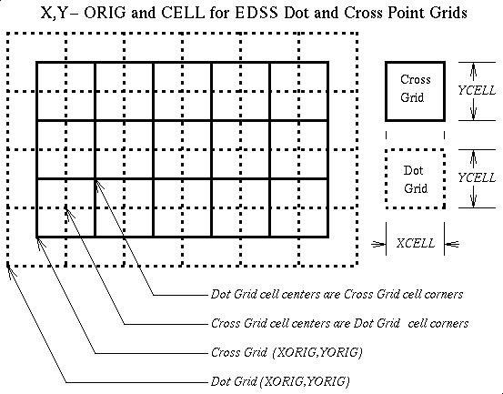

<!-- BEGIN COMMENT -->

[<< Previous Chapter](CMAQ_OGD_ch08_input_files.md) - [Home](README.md) - [Next Chapter >>](CMAQ_OGD_ch10_new_simulation.md)

<!-- END COMMENT -->

# Defining Grids, Layers, and Chemistry #

This chapter describes how to define new horizontal grids, vertical layers, and chemical mechanisms in CMAQ. These specifications apply to multiple programs in the CMAQ modeling system, including ICON, BCON, JPROC, and CCTM. When configuring new simulations, users must define the location, extent, and structure of the horizontal and vertical grids, and the chemical mechanism for representing pollutant chemical transformations. CMAQ contains several default options for these parameters that can be used as templates for setting up new configurations. Before deciding to create definitions for new grids and mechanisms, check to see whether the existing options are sufficient for your model simulation. If a predefined choice is not appro­priate, then follow the steps described in this section to create a new definition.

Once you have configured a simulation that is suitable for your purposes in terms of the horizontal grid, vertical layers, and chemical mechanism, proceed to [Chapter 10](CMAQ_OGD_ch10_new_simulation.md) to learn how to develop new model executables for running a CMAQ simulation.

Grids and coordinate systems
----------------------------

CMAQ is a three-dimensional Eulerian air quality model. The *domain* of a model run (the extent of its area of interest) is divided into three-dimensional cells (or [*voxels*](http://en.wikipedia.org/wiki/Voxel)), the boundaries of which (the *grid* of the domain) must be rigorously and consistently defined for all functional components of the model (e.g., chemistry, emissions, meteorology). Mathematical algorithms describing atmospheric transport and air/surface exchange govern the flow of material into and out of each grid cell. Mathematical algorithms describing chemical reactions and aerosol dynamics govern the production and loss of material contained in each grid cell.

Horizontal (or *2D*) and vertical components of a model run's grid are treated differently. The horizontal grid specification (setting the *x* and *y* dimensions) must be *regular*: the horizontal projection of each grid cell (sometimes referred to as a *pixel*) has the same resolution, and the boundaries of each pixel are time-invariant. By contrast, the vertical grid specification (setting the *z* dimension) need not be regular; it can vary in space and time.

After determining the horizontal and vertical extent of the domain of interest, a meteorological model must be run for a horizontal domain slightly larger than the CMAQ domain. A larger meteorology domain is necessary for distinguishing the meteorological boundary conditions from the CMAQ boundary conditions.

### Supported CMAQ Coordinate Systems

Specifications for CMAQ and MCIP grids are governed by [I/O API grid conventions](https://www.cmascenter.org/ioapi/documentation/all_versions/html/GRIDS.html). The choice of horizontal coordinate system, or map projection, for CMAQ is governed by the input emissions inventories and meteorological model fields, which must agree. [WRF/ARW](http://www.wrf-model.org) support the [Lambert Conformal](https://en.wikipedia.org/wiki/Lambert_conformal_conic_projection), [Polar Stereographic](https://en.wikipedia.org/wiki/Universal_polar_stereographic_coordinate_system), and [Mercator](https://en.wikipedia.org/wiki/Mercator_projection) projections, which can be directly passed to CMAQ.

### Horizontal Grids

Available horizontal grids for a given CMAQ run are defined at runtime by setting the GRIDDESC and GRID\_NAME environment variables to point to an existing grid definition file and to one of the grids defined in the file, respectively. Horizontal grids are defined by the [grid definition file (GRIDDESC)](https://www.cmascenter.org/ioapi/documentation/all_versions/html/GRIDDESC.html), which can be edited by the user (more below).

The extent of the horizontal grid used in CMAQ is limited by the size of the domain of the input meteorology. MCIP and the [I/O API Tools](https://www.cmascenter.org/ioapi/documentation/all_versions/html/AA.html#tools) can be used to *window* subsets of meteorology data. Choosing the appropriate horizontal grid scale and extent for a CCTM run is largely dependent on the issues to be addressed by the modeling. However, practical consideration should also be paid to the relationship between grid size, output file size, and execution times, i.e., output data volume and run times increase as the number of horizontal grid cells increase.

#### CMAQ horizontal grid conventions

Grid conventions are specified (at length) by the [I/O API](https://www.cmascenter.org/ioapi/documentation/all_versions/html/GRIDS.html). In summary, users should be aware that CMAQ uses both "cross-point" and "dot-point" grids.

<a id=Figure9-1></a>



"Cross-point" is often abbreviated *CRO*, as in `GRID_CRO_2D`. "Dot-point" is often abbreviated *DOT*, as in `MET_DOT_3D`. Similarly, the user should be aware of the grid's [projection](https://en.wikipedia.org/wiki/Map_projection) units. Usually meters, except when using [lat-lon coordinate systems](https://en.wikipedia.org/wiki/Geographic_coordinates#Geographic_latitude_and_longitude).

The terms associated with I/O API grid definitions are listed in [Table 9-1](#Table9-1).

<a id=Table9-1></a>

 **Table 9-1. I/O API Grid Type Terms** 

|Term|Definition|
|------------|-------------------------------------------------------------------------|
|origin|lower left corner of the cell at column=row=1|
|`X_ORIG`|X coordinate of the grid origin (in projection units)|
|`Y_ORIG` |  Y coordinate of the grid origin (in projection units)|
|`X_CELL`|horizontal resolution parallel to the X coordinate axis (in projection units)|
|`Y_CELL`|horizontal resolution parallel to the Y coordinate axis (in projection units)|
|`NCOLS`|number of grid columns, dimensionality in the X direction|
|`NROWS`|number of grid rows, dimensionality in the Y direction|

CMAQ is distributed with a GRIDDESC file that contains a definition for a 12-km grid covering California that uses a Lambert Conformal Conic projection. The definition of this grid is below.

- Coordinate: Lambert Conformal
- Latitude 0: 40.0
- Longitude 0: -97.0
- Standard Parallel 1: 33.0
- Standard Parallel 2: 45.0
- X origin = -2,376,000
- Y origin = -792,000
- Rows: 100
- Columns: 72
- dX = 12,000
- dY = 12,000
- Layers = 35

#### Creating or modifying horizontal grids

Creating a grid in CMAQ involves simply adding a few lines of text to the GRIDDESC file. Using a combination of the [I/O API GRIDDESC file format documentation](https://www.cmascenter.org/ioapi/documentation/all_versions/html/GRIDDESC.html) and existing grid definitions as examples, new grids can be defined for CMAQ by adding a coordinate and grid description to the GRIDDESC file. Set the GRID_NAME environment variable in the CMAQ run scripts to point to the name of the new grid.

The most common situation for creating a new CMAQ grid definition is encountered when using meteorology and/or emissions data that have not yet been modeled with CMAQ. WRF‑ARW outputs can be run through MCIP to generate a GRIDDESC file that can be input directly to both CMAQ and SMOKE. MCIP includes a set of variables for trimming boundary cells from the WRF output, windowing the WRF domain, and setting the reference latitude of the projection. A description of the MCIP variables is provided in [Chapter 7](CMAQ_OGD_ch07_programs_libraries.md). The MCIP variables for defining horizontal grids are provided below.

-   **BTRIM**: Sets the number of boundary points to remove on each of the four horizontal sides of the MCIP domain. Setting BTRIM = 0 will specify the maximum extent of the input meteorology domain. To remove the WRF‑ARW lateral boundaries, set BTRIM = 5 (recommended). For windowing a subset domain of the input meteorology, set BTRIM = -1; this setting causes BTRIM to be replaced by the information provided by X0, Y0, NCOLS, and NROWS (see below).

-   **X0**: The *x*-coordinate of the lower-left corner of the full MCIP cross-point domain (including the MCIP lateral boundary) based on the input WRF‑ARW domain. X0 refers to the number of grid cells in the east-west direction from the origin of the WRF domain to the origin of the MCIP cross-point domain. This setting is only used when BTRIM = -1.

-   **Y0**: The *y*-coordinate of the lower-left corner of the full MCIP cross-point domain (including the MCIP lateral boundary) based on the input WRF‑ARW domain. X0 refers to the number of grid cells in the north-south direction from the origin of the WRF domain to the origin of the MCIP cross-point domain. This setting is only used when BTRIM = -1.

-   **NCOLS**: Number of columns in the output MCIP domain (excluding MCIP lateral boundaries). This setting is only used when BTRIM = -1.

-   **NROWS**: Number of rows in the output MCIP domain (excluding MCIP lateral boundaries). This setting is only used when BTRIM = -1.

-   **WRF\_LC\_REF\_LAT**: WRF Lambert Conformal reference latitude. Use this setting to force the reference latitude in the output MCIP data. If not set, MCIP will use the average of the two true latitudes.

#### Example BTRIM Calculation

Figure 9-2 shows an example of how the BTRIM calculation works for windowing WRF data. The 12-km grid resolution WRF domain has a lower left corner that is offset from the projection center by 600,000 m West and 1,680,000 m South.  The CMAQ/MCIP output domain has an offset (lower left corner) that is 108,000 m East and 1,620,000 m South of the projection center.

The MCIP variables X0 and Y0 set the number of grid cells to "trim" from the WRF to domain to get to the MCIP domain lower left corner. Adding "1" in each of these calculations accounts for the addition of the MCIP lateral boundary.

```
`X0 = |(WRF X origin - MCIP X origin)|/(Grid Resolution) + 1`
`X0 = |(-600,000 - 108,000)|/12,000 + 1`
`X0 = 60`

`Y0 = |(WRF Y origin - MCIP Y origin)|/(Grid Resolution) + 1`
`Y0 = |(-1,680,000 - -1,620,000)|/12,000 + 1`
`Y0 = 6`
```

<a id=Figure9-2></a>


#### Further information on horizontal grids

-  If the meteorology data have already been processed by MCIP and the GRIDDESC file is missing, the grid definition of the input meteorology (and emissions) can be determined by using the netCDF utility *ncdump* to view the header of one of the I/O API files and then use that information to manually create a GRIDDESC file.
-   Horizontal grid dimensions should be no smaller than 30 rows and 30 columns.
-   External boundary thickness should be set to “1”.
-   A CMAQ grid should be smaller than its parent meteorology grid by at least four grid cells on a side, and preferably by six.
-   Horizontal grid spacing for the parent meteorology grid often has a 3:1 ratio, although other ratios have been employed.

CMAQ Vertical Layers
-----------
The vertical structure of CMAQ is inherited from the model used to prepare the meteorological information. WRF-ARW uses a sigma coordinate that is based upon surface pressure, not sea level pressure, and a pressure at the top boundary (e.g., 100 hecto-Pascals). The sigma coordinate is terrain following. Because WRF-ARW is a nonhydrostatic model, the vertical coordinate is time varying.

### Vertical layer resolution

Resolving the surface boundary layer requires high resolution (i.e., shallow vertical layers) near the surface for meteorological simulations. To determine mass exchange between the boundary layer and free troposphere, high resolution near the boundary layer top is also preferable. In addition, different cloud parameter­izations may perform differently depending on the layering structure. Layer definitions should be appropriate for the topographic features of the simulation domain. Aerodynamic resistance, which influences dry deposition velocities, is a function of layer thickness and the boundary layer stability. For emissions processing, the layer thickness affects the plume rise from major stacks. The vertical extent of the surface-based emission effects is determined by the thickness of the lowest model layer for CCTM. For consistency, CCTM should use the same vertical resolution as the meteorological model used to prepare the input data.

### Further information on vertical layers

-   CMAQ redefines the vertical coordinates to monotonically increase with height, a capability necessary to handle a generalized coordinate system.
-   Although MCIP may be used to reduce the number of vertical layers by collapsing layers, this is ***not recommended,*** as dynamical inconsistencies can develop and lead to misleading results. This is particularly true when cloud processes are important.
-   Increasing the number of vertical layers increases the CPU time and the computational complexity.
-   Computational limits arise from the Courant number limitation of vertical advection and diffusion processes. When using K-theory, a very shallow layer definition increases CPU time tremendously under the convective conditions.

### References for grid and vertical coordinate system topics

- [On The Definition of Horizontal and Vertical Grids and Coordinates for Models-3](https://www.cmascenter.org/ioapi/documentation/all_versions/html/GRIDS.html)
-   [Chapter 12 (MCIP) of the 1999 Models-3/CMAQ Science document](http://www.cmascenter.org/cmaq/science_documentation/pdf/ch12.pdf)
-   [Otte and Pleim 2009 (in GMD) on MCIP](http://www.geosci-model-dev.net/3/243/2010/gmd-3-243-2010.html)

CMAQ Chemical Mechanisms
------------------
The CMAQ modeling system accounts for chemistry in three phases: a gas phase, aerosols (solid or liquid), and an aqueous phase. Refer to the release notes to find the gas‑phase chemistry mechanisms available in each version of CMAQ. Several variations of the base gas-phase mechanisms, with and without chlorine, mercury, and toxic species chemistry, are distributed with CMAQ. The modularity of CMAQ makes it possible to create or modify the gas-phase chemical mechanism.

Gas-phase chemical mechanisms are defined in CMAQ through Fortran source files. Located in subdirectories of the $CMAQ_MODEL/CCTM/src/MECHS directory (each correspond­ing to a mechanism name), these files define the source, reaction parameters, and atmospheric processes (e.g., diffusion, deposition, advection) of the various mechanism species. The species definitions for each mechanism are contained in namelist files that are read in during execution of the CMAQ programs. The CMAQ mechanism configuration is more similar to the science module configuration than to the horizontal grid or vertical layer configuration in that the mechanism is defined at compilation, resulting in executables that are hard-wired to a specific gas-phase mechanism. To change chemical mechanisms between simulations, a new executable that includes the desired mechanism configuration must be compiled.

### Using predefined chemical mechanisms

To select a predefined mechanism configuration in CMAQ, set the *Mechanism* variable in the build scripts to the name of one of the mechanism directories located under $CMAQ_MODEL/CCTM/src/MECHS. Refer to the [CMAQv5.2 Photochemical Mechanisms release notes](https://github.com/USEPA/CMAQ/blob/5.2/CCTM/docs/Release_Notes/CMAQv5.2_Mechanisms.md) for the list of mechanisms available in CMAQv5.2.

### Creating or modifying chemical mechanisms

Creating or modifying mechanisms in CMAQ requires the use of the CMAQ chemical mecha­nism compiler, CHEMMECH, to produce the required Fortran source (F90) and namelist files. CHEMMECH translates an ASCII mechanism listing to the F90 and namelist files required by CMAQ. Like all of the CMAQ preprocessors, CHEMMECH is a Fortran program that must be compiled prior to use. Distributed with a Makefile for compilation and run scripts for execution, CHEMMECH reads a mechanism definition (mech.def) file and outputs the mechanism F90 and namelist files. See Chapter 7 for a description of CHEMMECH.

To modify an existing mechanism, copy the mech.def file that is contained in one of the existing mechanism directories to a new directory and modify the mech.def file accordingly. Provide this modified mechanism definition file to CHEMMECH as input to produce the mechanism F90 and namleist files needed to compile CMAQ.  

To invoke this new mechanism in CMAQ, set the *Mechanism* variable in the CMAQ build scripts to the name of the new mechanism directory and compile new executables.

To create a new mechanism for CMAQ, follow a procedure similar to the above for modifying mechanisms. Use an existing mech.def file as a template to format the new mechanism for inclusion in CMAQ. After formatting the mechanism in the form of the mech.def file, provide this file as an input to CHEMMECH to create the required mechanism input files for CMAQ. Move the resulting mechanism files to a new directory under $CMAQ_MODEL/CCTM/src/MECHS. To invoke this new mechanism, set the *Mechanism* variable in the CMAQ build scripts to the name of the new mechanism directory and compile new executables.

### Using species namelist files

The species namelist files define the parameters of the gas, aerosol, non-reactive, and tracer species simulated by the model. The CMAQ programs read the namelist files during execution to define the sources and processes that impact the simulated concentrations of each of the model output species. The namelist files can be used to apply uniform scaling factors by model species for major model processes. For example, emissions of NO can be reduced by 50% across the board by applying a factor of 0.5 to the emissions scalar column of the gas-phase species namelist file. Similarly, the boundary conditions of O<sub>3</sub> can be increased by 50% by applying a factor of 1.5 to the boundary conditions scalar column of the gas-phase species namelist file.

See [Chapter 8](CMAQ_OGD_ch08_input_files.md) for a description of the format of the namelist file.

When mechanisms are modified or created in CMAQ, new namelist files must be created that include the new species in the mechanism. As described above, the program CHEMMECH will generate namelist files from a mech.def mechanism definition file.  Alternatively, existing namelist files can be used as templates to guide the manual creation of new files.

### Further information on chemical mechanisms

-   The same chemical mechanism must be used for CCTM and all of the mechanism-dependent input processors that are part of the CMAQ system.
-   The Euler Backward Iterative (EBI) chemistry solver is mechanism-dependent. If a chemical mechanism is modified, then new EBI solver source code must be generated based on the mechanism definition. The CMAQ utility program CREATE_EBI reads the output from CHEMMECH to generate new EBI solver source code. 
-   The Rosenbrock and SMVGEAR solvers are mechanism-independent choices of chemistry solvers for the CCTM.
-   When adding new species to CMAQ, it is important to check that the sources of these new species into the modeling domain are accounted for correctly in the mechanism definition files. If species are added to the domain through the emissions files, the namelist files that define the mechanism species must contain these new species.

<!-- BEGIN COMMENT -->

[<< Previous Chapter](CMAQ_OGD_ch08_input_files.md) - [Home](README.md) - [Next Chapter >>](CMAQ_OGD_ch10_new_simulation.md)<br>
CMAQ Operational Guidance Document (c) 2016<br>

<!-- END COMMENT -->
