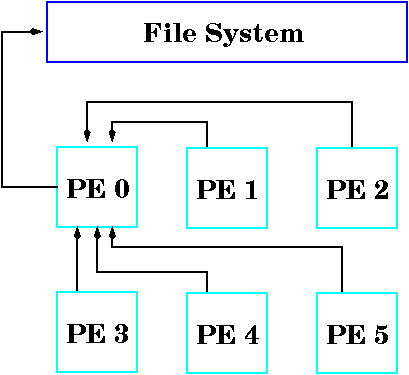

<!-- BEGIN COMMENT -->

[<< Previous Appendix](CMAQ_UG_appendixC_spatial_data.md) - [Home](../README.md) - [Next Appendix >>](CMAQ_UG_appendixE_configuring_WRF.md)

<!-- END COMMENT -->


# Appendix D: Parallel Implementation of CMAQ

## D.1 General Structure of data

There are a few approaches to parallelize an application, such as data-parallelism. Data-parallelism is a paradigm which decomposes data into "equal" sections and distributes them among allocated processors. Each processor works on the portion it owns. CMAQ parallel implementation is based on this methodology.

The CMAQ model operates on a 4D space (ncols, nrows, nlays, nspcs) and only the spatial domain is decomposed. When NPROCS processors are used to run CMAQ, NPCOL number of processors are assigned to the column dimension and NPROCS/NPCOL processors are assigned to the row dimension (NPROCS = NPCOL x NPROW). In the case that the column dimension is not divisible by NPCOL, the remainder is distributed equally to NPCOL processors. The same approach is applied to the row dimension. For example (illustrated in Figure D-1), given a 100 by 75 (column x row) data grid and six processors with three processors along the column dimension and two processors along the row dimension, the following subdomain sizes (NCOLS x NROWS) are assigned to each processor: 34 x 38 (processor 0), 33 x 38 (processors 1 and 2), 34 x 37 (processor 3), and 33 x 37 (processors 4 and 5).


**Figure D-1. Domain decomposition illustration**

## D.2 Interprocessor Communication

In some science processes such as advection, a processor requires data from neighboring processors (interprocessor communication) when the model runs on a distributed memory system. An interprocessor communication library, STENEX, was developed to provide a simple and robust interface to handle various kinds of near neighbor communication. Near neighbor is defined as processors which are adjacent to a given processor (blue block) in the eight major geographical directions: N, NE, E, SE. S, SW, W, and NW (Fig. D-2).


**Figure D-2. A depiction of near neighbor processors**

As an illustration of interprocessor data access (Fig. D-3), consider the following piece of code being executed on Processor 2 with a 2x2, 4-processor domain decomposition. It is clear that the calculation at the grid cell denoted by "X" requires data denoted by red dots which reside in near neighbor processors 0 and 3.

 DIMENSION DATA( NCOLS, NROWS )</br>

 DO J = 1, NROWS</br>
   DO I = 1, NCOLS</br>
       DATA(I,J) = A(I+2,J) * A(I, J-1)</br>
    END DO</br>
 END DO

 

 **Figure D-3. An example to show interprocessor data access is needed**

 To facilitate interprocessor communication as shown in the example above, "ghost" regions are used (extra space in the data structure), i.e. DIMENSION DATA (NCOLS+2, NROWS+1). The thickness of the ghost region depends of the amount of overlap that is required by the algorithm.

 The Stencil Exchange (SE) Library is designed in Fortran 90 using Object Oriented-base technology to handle various types of communication with the objective of hiding the management of the low-level data movement. SE addresses four types of communication and a brief description of each type is provided below.

 * interior to ghost region, which is indicated in light blue in Figure D-4. This particular type of communication is being used in various places such as HADV and HDIFF.


**Figure D-4. Interior to ghost region communication**

* sub-section data redistribution (Fig. D-5). This particular type of communication is being used in Process Analysis.


**Figure D-5. Sub-section data redistribution communication**


## D.3 Parallel I/O

All I/O operations in CMAQ are handled by the I/O API library. Furthermore, the I/O API library was designed for serial code. As a result, CMAQ cannot utilize any I/O functions contained in the in I/O API library (such as READ3 and WRITE3) directly in any parallel computing platform. 

CMAQv4.7.1 and later releases include a directory called 'PARIO' which was developed to bridge this gap. PARIO contains a smaller set of functions which are counterparts to equivalent functions in IOAPI but capable to run in parallel. The following I/O API routines have PARIO equivalents: READ3, INTERP3, WRITE3, CHECK3, OPEN3, CLOSE3, DESC3, M3ERR, M3EXIT, M3WARN. Each file name in the PARIO library has a "P" prefix to distinguish it from its counterpart in the I/O API library, e.g. POPEN3 and PINTERP3. Substitution with the PARIO subroutines is done at compilation through CPP flags. Note that the subroutine argument lists in any PARIO routine are identical to those in the I/O API counterpart routine.

On the output side, all processors are required to send their portion of data to processor 0, which will stitch together each sub-part and then output it to the file (Fig. D-8). This is considered a “pseudo” parallel I/O approach and this approach is being using in PARIO.



**Figure D-8. Combine all sub-domain data from each processor in an I/O processor**

In CMAQv5.2 and later versions, we have developed a true parallel I/O approach, referred to as PIO (Wong et. al.). PIO allows each processor to write their portion to the output file simultaneously (Fig. D-9).


**Figure D-9. True parallel I/O approach**

To invoke this feature users have to re-build CMAQ after building additional libraries not used with CMAQ traditionally as well as retaining the traditional libraries with the exception of the non-"mpi" IOAPI library downloaded in [Chapter 3](../CMAQ_UG_ch03_preparing_compute_environment.md). The additional libraries required by invoking this option include the PnetCDF library and the "mpi" version of the IOAPI library. It also requires installation of parallel file system, e.g. Lustre or BeeGFS, with sufficient I/O hardware such as disk drive and I/O sub-system to support parallel file system software.

**PnetCDF library**

The PnetCDF library is the parallel I/O implementation to complement the classic netCDF library. The PnetCDF library is available for download at https://parallel-netcdf.github.io/ users should find and follow the instructions for proper installation given on the website. Users should install a stand alone PnetCDF library using MPI Fortran 90 and C compilers. After successful installation, check the environment PATH & LD_LIBRARY_PATH to ensure that the paths have been updated to include the path of the PnetCDF libraries and bin. Note that users may have to set these paths manually if not set, and that these paths must be loaded every time a new shell is started. Note: users should not re-build their netCDF library at this point, within CMAQ the classic netCDF library and PnetCDF library interact as two stand alone libraries. 

**IOAPI library**

The I/O API library provides an interface between the netCDF libraries and CMAQ to handle input and output (I/O) calls throughout the CMAQ code. The latest version of the IOAPI library (version 3.2) is available for download at https://www.cmascenter.org/download/software/ioapi/ioapi_3-2.cfm?DB=TRUE   **Version Supported: IOAPI 3.2 tagged 20200828**

The general steps for installation of IOAPI libraries on a Linux system (with C-shell and GNU compilers) are below. These instructions are an example and we recommend using the latest release available at the time of your CMAQ installation.

This approach also requires installation of "mpi" I/O API libraries as shown below (note these steps should be followed after completing the steps in Chapter 3 section 3.2.3): 

```
setenv BIN Linux2_x86_64gfortmpi
```

Edit the file in the ioapi folder called Makeinclude.Linux2_x86_64gfortmpi to comment out all openMP options as CMAQ does not support openMP. Note: If users are using the ifort compiler you also need to remove -Bstatic flag within the ioapi/Makeinclude.Linux2_x86_64ifortmpi file as well.

```
OMPFLAGS = # -fopenmp 
OMPLIBS = # -fopenmp
```

In the top level IOAPI_3.2 directory run: 
```
make configure
make
```

After building the reqiured libraries, users must build CCTM. Before compilation of CCTM, users must turn on this feature by uncommenting the following line in bldit_cctm.csh at the model build step and link with I/O API 3.2.

```
#set MakefileOnly                      #> uncomment to build a Makefile, but do not compile;
#set build_parallel_io                 #> uncomment to build with parallel I/O (pnetcdf);
```

After building the BLD directory (where the Makefile lives), change to this directory and edit the Makefile to include PNETCDF and the correct I/O API BIN before compiling the code. An example of these edits are shown below: 

```
LIB = /home/CMAQ_PIO/CMAQ_libs
include_path = -I /home/CMAQ_PIO/CMAQ_libs/ioapi_3.2/Linux2_x86_64ifortmpi \
               -I /home/CMAQ_PIO/CMAQ_libs/ioapi_3.2/ioapi/fixed_src \
               -I $(LIB)/mpi/include -I.

 IOAPI  = -L/home/CMAQ_PIO/CMAQ_libs/ioapi_3.2/Linux2_x86_64ifortmpi -lioapi
 NETCDF = -L$(LIB)/netcdf/lib -lnetcdf -lnetcdff
 PNETCDF = -L$(LIB)/pnetcdf/lib -lpnetcdf
 LIBRARIES = $(IOAPI) $(NETCDF) $(PNETCDF)
```
 
Lastly, users must also edit the CCTM run script by inserting MPI: in front of the output file path as shown below:

  setenv CTM_CONC_1      "MPI:\$OUTDIR/CCTM_CONC_\${CTM_APPL}.nc -v"       #> On-Hour Concentrations
  
For further directions on installation of PIO or if you encounter difficulties using the PIO feature, please contact David Wong at wong.david-c@epa.gov

## D.4 Reference:

Wong, D.C., Yang, C.E., Fu, J.S., Wong, K., & Gao, Y. (2015). An approach to enhance pnetCDF performance in environmental modeling applications. Geosci. Model Dev., 8, 1033-1046.

<!-- BEGIN COMMENT -->

[<< Previous Appendix](CMAQ_UG_appendixC_spatial_data.md) - [Home](../README.md) - [Next Appendix >>](CMAQ_UG_appendixE_configuring_WRF.md) <br>
CMAQv5.5 User's Guide<br>

<!-- END COMMENT -->
