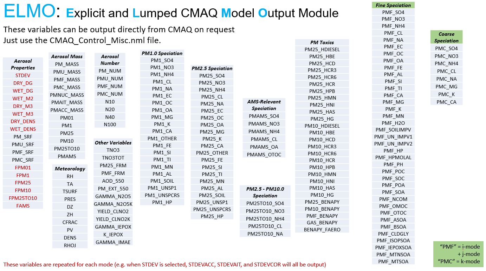

<!-- BEGIN COMMENT -->

[<< Previous Appendix](CMAQ_UG_appendixE_configuring_WRF.md) - [Home](../README.md) 

<!-- END COMMENT -->

* * *

# Appendix F: Explicit and Lumped Model Output (ELMO) 
The ELMO module makes aerosol diagnostic parameters as well as aggregated and highly processed aerosol metrics available directly in CMAQ output files rather than requiring follow-up post-processing steps. 

### F.1 Output concentration and diagnostic variables
The ELMO Module streamlines the definition, calculation, and maintenance of gas and particulate concentrations, as well as over 200 aggregate and diagnostic variables, listed in Fig. 1. 
With ELMO, aggregate and diagnostic variables are registered in the [ELMO_DATA.F][link_F_Data], their calculations are prescribed in [ELMO_PROC.F][link_F_Proc], and CMAQ calculates them online. 
Thus, CMAQ can output higher-level parameters without needing to run any particular post-processing tool. 
As a result, users may choose to limit their output to just the variables they are most interested in (perhaps just O<sub>3</sub> and PM2.5, for example). Or they may elect to output a more complex selection of scalar and aggregate variables. 
Post-processing is still needed to concatenate days of output together onto monthly, seasonal, or annual files. 

<a id=FigureF-1></a> 
**Figure F-1. Comprehensive list of diagnostic and aggregate variables currently available in ELMO. The table headings are just for presentation. They are not equivalent to ELMO Keywords, which are discussed in section F.4**


Concentrations of scalar variables like NO, NO2, O3, ASO4J, and others are available for output to ELMO files as well. An aggregate variable for total VOC has not been provided for CMAQv5.4 or v5.5 because differences among chemical mechanisms are so significant. This capabality will be added in a future CMAQ version.

### F.2 Relationship to previous CMAQ versions
Previously, aggregate parameters like PM<sub>2.5</sub> and Fine-mode Sulfate (ASO4I + ASO4J) were calculated offline through the COMBINE post-processing utility and documented via the species definition (SpecDef) input file for COMBINE, as depcited in Fig. F-2.  
CMAQ versions 5.4 and later, maintain the CONC and ACONC files - they are available for use identically to CMAQv5.3.3. However, PMDIAG and APMDIAG files have been eliminated. 

If a user would like to continue using the COMBINE workflow to aggregate PM variables, they may output necessary variables like FPM25ACC to ELMO files and use those with CONC output. 
Alternatively, a user may elect to rely exclusively on ELMO output files alone and set the CONC_SPCS and AVG_CONC_SPCS variables in the CMAQ runscript to just one variable (e.g. O3) to minimize their I/O time and storage space footprint. 

<a id=FigureF-2></a>   
**Figure F-2. Schematic of data workflow in v5.3 and v5.4 with ELMO. (Note that v5.5 workflow is idential to v5.4.)**

There are several distinct advantages to using ELMO over post-processing CONC and ACONC output with COMBINE:

- Definitions of products like PM25 mass, PMF (Fine PM mass), and PM10 mass automatically adjust as PM species are activated or deactivated by CMAQ users or chemical mechanisms are switched. There is no need to modify a SpecDef file to account for a new or eliminated species.  
   - Note that some of the diagnostic species defined in FINE_ORG, specifically those meant to provide an approximate distinction between primary and secondary or anthropogenic and biogenic organic aerosols, should generally only be used in a qualitative manner. 
A number of emitted compounds forming organic aerosols in the atmosphere can have both anthropogenic and biogenic sources so a quantitative attribution of organic aerosols to specific sources cannot be based on an analysis of concentrations alone and should use ISAM instead. 
Moreover, their interpretation may not be consistent across mechanisms (e.g. cb6r5_aero7 vs. cracmm1) depending on the assumptions made during emissions processing and the mapping of emitted species to CMAQ mechanism species in DESID.

- Complex properties like O:C, OM:OC, particle acidity, etc. can be calculated using species properties available within CMAQ. 
This resolves a potential vulnerability where, for example, the OM:OC of organic species may become out of sync between the SpecDef and the SOA_DEFN table within the model. This could have potentially led to errors in the calculation of OC (organic carbon). With ELMO, there is no such risk.  

- If a user is only interested in aggregate parameters like PM25 mass, they can avoid the I/O time and storage required saving the raw output of every PM variable and then post-processing with COMBINE. This can be particularly helpful when processing 3D data.

- New parameters are available that were not before like N10, N20, N40 and N100, the number of particles above 10, 20, 40 and 100 nm in diameter. AOD and extinction at 550 nm have also been supported as options; these were previously only available on the photolysis diagnostic file.  

- Keywords are available (see section F.4) to select groups of variables of interest. 

- Variables may be added to the ELMO_LIST table in ELMO_DATA.F and then prescribed in ELMO_PROC.F with greater ease.
 
ELMO has no significant quantitative impact on results, but there will be a noticeable positive impact on the time invested in post-processing aggregate PM components and storage volumes required for standard runs. 
There can be some slight numerical differences realized when one compares quantities averaged directly online with ELMO vs. calculated offline using averages. 
For example, total PM2.5 have some small deviations when it is calculated as the hourly average of the sum of species (online) versus the sum of hourly averaged species (offline).


### F.3 Prescribing features of ELMO output files
The interface for prescribing ELMO file properties is located in the [CMAQ Miscellaneous Control File](../CMAQ_UG_ch04_model_inputs.md#miscctrl). The following lines activate or deactivate instantaneous (CCTM_ELMO) and average (CCTM_AELMO) files, respectively:
```
&elmo_activate
  instant = .FALSE.
  average = .TRUE.
/
```
The layers to output for the instantaneous ELMO file can be modified with the Inst_Layer_Top and Inst_Layer_Bot variables:
```
&elmo_inst
  Inst_Layer_Top = 1
  Inst_Layer_Bot = 1
  Inst_Vars_Nml = 'DEFAULT' (See section G.4)
/
```
Likewise, the average ELMO file output layers are set in the elmo_avrg variable section:
```
&elmo_avrg
  Avrg_Layer_Top = 1
  Avrg_Layer_Bot = 1
  Avrg_Vars_Nml  = 'DEFAULT' (See section G.4)
/
```
Inst_Layer_Top and Avrg_Layer_Top may not exceed the total number of model layers. 

It is recommended to output all model layers if you are outputting variables for comparison to satellite column data like NO2. Aerosol Optical Depth (AOD_550) may be output as a surface (i.e. just layer 1) or for multiple layers (layer-dependent extinction multiplied by layer thickness). 
When 2D variables are output on a 3D ELMO file, ELMO will put real data in layer 1, and I/O-API missing values above layer 1. 


### F.4 Selecting ELMO output variables
All CMAQ scalar variables and all variables in Fig. F-1 are available for output on ELMO files. 
The [CMAQ Miscellaneous Control File](../CMAQ_UG_ch04_model_inputs.md#miscctrl) variables Inst_Vars_Nml and Avrg_Vars_Nml (shown in section F.3) control the variables output to the instantaneous and average ELMO files, respectively. 
Up to 1000 strings may be specified here. 
To avoid relying on intimidatingly long lists of variable names, ELMO uses Keywords that expand to groups of variables (often particularly meaningful or useful ones). 
In this way, ELMO improves transparency and reduces the risk of needing to rerun simulations to produce mistakenly omitted variables. 
The ELMO Keyword "DEFAULT" loads all scalar and aggregate variables that would have been generated by using the default COMBINE approach for CMAQv5.3.3 and previous. 
This and other ELMO keywords are defined in Table F-1.  

**Table F-1. Map of all ELMO Keywords to CMAQ species, ELMO variables, or other Keywords.  

|**ELMO Keyword**  |Variables and/or **Keywords**|  
|------------------|----------------------------------|
| **DEFAULT**      | **AMET**, **CUTOFF_FRACTIONS**, **MASS**, PM_NUM, PMF_NUM, PMC_NUM, **MET**, **CHEM**, **FINE_SPECIES**, **COARSE_SPECIES**, **PM25_SPECIES**, **SIZE**, **AMS**, **PM25TO10_SPECIES** |  
| **AMET**             | PMF_MASS, PMF_FRM, PMC_MASS, PMF_OC, PMF_EC, PMF_NA, PMF_CL, PMF_SO4, PMF_NO3, PMF_NH4, PM25, PM25_FRM, PM25_SO4, PM25_NO3, PM25_NH4, PM25_OC, PM25_EC, PMF_FE, PMF_AL, PMF_SI, PMF_TI, PMF_CA, PMF_MG, PMF_K, PMF_MN, PMF_SOILIMPV, PMF_UN_IMPV1, PMF_NCOM, PMF_UN_IMPV2, TNO3, PM_MASS, PMC_MASS, **MET**, Tsurf, AOD_550 |  
| **MASS**             | PMF_MASS, PMC_MASS, PM01, PM1, PM25, PM10, PM25TO10, PMU_MASS, PMAMS, PMAIT_MASS, PMACC_MASS |  
| **NUMBER**           | PM_NUM, PMF_NUM, PMC_NUM, N10, N20, N40, N100 |   
| **SIZE**             | **NUMBER**, DRY_DG<sup>#</sup>, WET_DG, STDEV, DRY_M3, WET_M3, WET_M2, DRY_DENS, WET_DENS |  
| **SURFACE**          | PM_SRF, PMU_SRF, PMF_SRF, PMC_SRF, WET_M2 |  
| **ORGANIC**          | **FINE_ORG**, PM1_OC, PM1_OA, PMAMS_OA, PMAMS_OTOC, PM25_OA |  
| **MET**              | TA, PRES, RH |  
| **CHEM**             | GAMMA_N2O5, GAMMA_N2O5K, YIELD_CLNO2, YIELD_CLNO2K, GAMMA_IEPOX, K_IEPOX, GAMMA_IMAE |  
| **FINE_SPECIES**     | PMF_SO4, PMF_NO3, PMF_NH4, PMF_CL, PMF_NA, PMF_EC, PMF_OC, PMF_OA, PMF_H2O, PMF_SOILIMPV, PMF_UN_IMPV1, PMF_UN_IMPV2, PMF_HP, PMF_HPMOLAL, PMF_PH, **FINE_ORG**, PMF_MASS |  
| **COARSE_SPECIES**   | PMC_MASS, PMC_SO4, PMC_NO3, PMC_NH4, PMC_NA, PMC_MG, PMC_K, PMC_CA |   
| **AMS_SPECIES**      | PMAMS, PMAMS_SO4, PMAMS_NO3, PMAMS_NH4, PMAMS_CL, PMAMS_OA, PMAMS_OTOC |  
| **PM1_SPECIES**      | PM1, PM1_SO4, PM1_NO3, PM1_NH4, PM1_CL, PM1_NA, PM1_EC, PM1_OC, PM1_OA, PM1_MG, PM1_K, PM1_CA, PM1_OTHER, PM1_FE, PM1_SI, PM1_TI, PM1_MN, PM1_AL, PM1_SOIL, PM1_UNSP1, PM1_UNSPCRS |  
| **PM25_SPECIES**     | PM25, PM25_SO4, PM25_No3, PM25_NH4, PM25_CL, PM25_NA, PM25_EC, PM25_OC, PM25_OA, PM25_MG, PM25_K, PM25_CA, PM25_OTHER, PM25_FE, PM25_SI, PM25_TI, PM25_MN, PM25_AL, PM25_SOIL, PM25_UNSP1, PM25_UNSPCRS, PM25_HP |  
| **PM25TO10_SPECIES** | PM25TO10, PM25TO10_SO4, PM25TO10_NO3, PM25TO10_NH4, PM25TO10_CL, PM25TO10_NA |  
| **OPTICAL**          | AOD_550, PM_EXT_550 |  
| **FINE_ORG**         | PMF_POC, PMF_SOC, PMF_POA, PMF_SOA, PMF_NCOM, PMF_OMOC, PMF_OTOC, PMF_ASOA, PMF_BSOA, PMF_CLDGLY, PMF_ISOPSOA, PMF_IEPOXSOA, PMF_MTNSOA, PMF_MTSOA, PMF_OC, PMF_OA |   
| **CUTOFF_FRACTIONS** | FPM01, FPM1, FPM25, FPM10, FPM25TO10, FAMS |  
| **TOXICS**           | PM25_HDIESEL, PM25_HBE, PM25_HCD, PM25_HCR3, PM25_HCR6, PM25_HCR, PM25_HPB, PM25_HMN, PM25_HNI, PM25_HAS, PM25_HG, PM10_HDIESEL, PM10_HBE, PM10_HCD, PM10_HCR3, PM10_HCR6, PM10_HCR, PM10_HPB, PM10_HMN, PM10_HNI, PM10_HAS, PM10_HG |  
| **SIMPLE**           | PM25, PM10 |  
| **AMS**              | PMAMS_CL, PMAMS_NH4, PMAMS_NO3, PMAMS_OA, PMAMS_SO4 |  
| **SAT**              | **SATMET**, **SATCONC** |  
| **SATMET**           | DENS, DZ, ZH, CFRAC, PV, PRES, TA |  
| **SATCONC**          | NO2, SO2, O3, CO, FORM, NH3, AOD_550 |  
| **ALLCONC**          | All CMAQ Internal Species |  

<sub>#</sup>As noted for red variables in Fig. F-1, several variables are populated for each aerosol mode including diameters, standard deviation, and density, etc.

The ELMO variables are defined in [ELMO_DATA.F][link_F_Data]. 
Before ELMO maps output variables to internal model species or meteorological inputs, ELMO recursively expands all Keywords to their members and then filters out duplicates. There is no disadvantage to specifying a variable twice in the CMAQ Control namelist. 


### F.5 ELMO Implementation in CMAQ
ELMO works by putting all of the diagnostic parameters first on the ELMO_LIST table in ELMO_DATA.F. There is also a list of ID numbers (integers) above that table which allow for a comprehensive order to be preserved while the order of the parameters in the table and their calculations in ELMO_PROC.F are allowed to move in sequence. The subroutine LOAD_ELMO (ELMO_PROC.F) is called from DRIVER and cycles through the list of selected variables as defined by the interface in the CMAQ Miscellaneous Control file.

For each variable, the recursive subroutine CALC_ELMO is called to execute the calculation. For many of the calculations, all that is required is an assignment from an already existing diagnostic variable (e.g. RH, STDEV_ACC). 
For the parameters which are linear combinations of CMAQ species or other parameters (e.g. fine-mode nitrate PMF_NO3 = ANO3I + ANO3J), they may be defined in the subroutine MAP_ELMO_COEFFS (in ELMO_PROC.F). 
Follow the example of existing variables to prescribe the species to be added, the inlet type to assume for collection, etc. New PM inlet types can be added via the ELMO_INLET table in ELMO_DATA.F. For more complicated variables like fine-mode acidity (PMF_PH) or the PM25 mass collected by a Federal Reference Method sampler (PM25_FRM), calculations appear directly in CALC_ELMO. For example, PMF_MASS is computed by referencing the information in AERO_DATA to identify all variables that are included in fine-mode particulates (excluding 'tracer' species, which by definition, don't contribute to the bulk particle mass in CMAQ). The following algorithm shows how the return variable, outval, is summed across all modes while neglecting aerosol inorganic and organic water.

```
 DO IMODE = 1,N_MODE
    IF ( AEROMODE( IMODE )%FINE_MASK ) THEN
         OUTVAL = OUTVAL + SUM( AEROSPC_CONC( :,IMODE ),
                  MASK=.NOT.AEROSPC(:)%TRACER)  - AEROSPC_CONC( AH2O_IDX,IMODE )
         IF ( AORGH2O_IDX .GT. 0 ) OUTVAL = OUTVAL
&              - AEROSPC_CONC( AORGH2O_IDX,IMODE ) ! ug m-3
    END IF
 END DO
```
 

<!-- BEGIN COMMENT -->

[<< Previous Appendix](CMAQ_UG_appendixE_configuring_WRF.md) - [Home](../README.md) <br>
CMAQv5.5 User's Guide<br>

<!-- END COMMENT -->

<!-- START_OF_COMMENT --> 

[link_F_Data]: ../../../CCTM/src/driver/ELMO_DATA.F
[link_F_Proc]: ../../../CCTM/src/driver/ELMO_PROC.F


<!-- END_OF_COMMENT -->

[link_F_Data]: https://github.com/USEPA/CMAQ/blob/main/CCTM/src/driver/ELMO_DATA.F
[link_F_Proc]: https://github.com/USEPA/CMAQ/blob/main/CCTM/src/driver/ELMO_PROC.F
