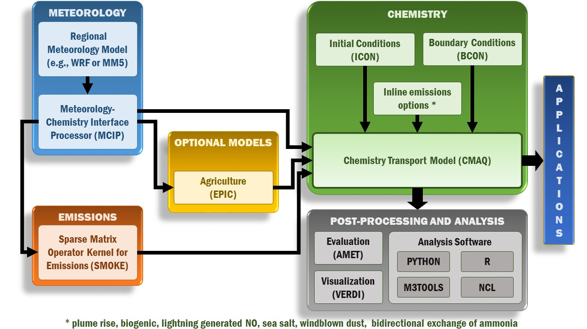

<!-- BEGIN COMMENT -->

[Home](README.md) - [Next Chapter >>](CMAQ_UG_ch03_input_and_output.md)

<!-- END COMMENT -->

# 2. Modeling System

## 2.1 Program Structure

**>>COMMENT<<** Here (and elsewhere), need to be consistent in what "CMAQ" means and "CCTM" means.  They seem to be synonymous here.  Elsewhere CCTM is the model, while CMAQ is the entire system. 

**>>COMMENT<<**  Ensure the list of utility programs is complete (EPIC?) and includes post-proc (e.g., AMET, VERDI).

**>>COMMENT<<** a system graphic would be helpful here

**>>COMMENT<<**  Sections 2.1 and 2.2  don't belong under the heading of "overview of components"

The CMAQ system is a suite of software programs that work in concert to estimate ozone, particulate matter, toxic compounds, and acid deposition throughout the troposphere.  As a framework for simulating the interactions of multiple complex atmospheric processes, CMAQ requires two primary types of inputs: meteorological information, and emission rates from sources of emissions that affect air quality.  
Weather conditions such as the changes in temperature, winds, cloud formation, and precipitation rates are the primary physical driving forces in the atmosphere.  These conditions are represented in air quality model simulations using output from regional-scale numerical meteorology models, such as WRF.  To obtain inputs on emissions, CMAQ relies on the open-source Sparse Matrix Operator Kernel Emissions (SMOKE) model to estimate the magnitude and location of pollution sources.

CMAQ is a suite of Fortran90 programs that work in concert to estimate tropospheric distributions and deposition of ozone, PM, toxic compound and acidic substances. The four main CMAQ programs are:

-   The initial conditions processor [ICON](#icon)
-   The boundary conditions processor [BCON](#bcon)
-   The Meteorology-Chemistry Interface Processor [MCIP](#mcip)
-   The CMAQ Chemistry-Transport Model [CCTM](#cctm)

Utility programs distributed with CMAQ include:

-   The code builder/manager [Bldmake](#bldmake)
-   The chemical mechanism compiler [chemmech](#chemmech)
-   EBI chemistry solver builder [create_ebi](#create_ebi)
-   The inline photolysis preprocessor [inline_phot_preproc](#inline_phot_preproc)
-   The namelist converter [nml](#nml)

The following sections describe the CMAQ system concept, followed by [details of the programs listed above](#summary-descriptions-of-the-major-cmaq-programs).

**>> Comment <<** Section 7 doesn’t really mention a couple of the input files: how to make the OCEAN file? Mention the GRIDDESC file and options to where to get this info (like MCIP)

The core CMAQ programs that are needed to perform a basic air quality model simulation are [MCIP](#mcip), [ICON](#icon), [BCON](#bcon), and [CCTM](#cctm). The relationships among these programs are depicted within the green box in [Figure 2-1 CMAQ Core Programs](#Figure7-1). The blue boxes represent programs that are not part of the CMAQ distribution package but supply data necessary for an air quality simulation (emissions and meteorology data). The yellow boxes represent the standard CMAQ preprocessors: MCIP, ICON, and BCON. The red box represents the CMAQ chemistry-transport model (CCTM), the Eulerian air quality modeling component of CMAQ. Data flows between the CMAQ programs are represented in by arrows. The red arrows illustrate the flow of data from the CMAQ preprocessors and the emissions model to CCTM. The green arrows show the data feedbacks from CCTM to create initial and boundary conditions for nested simulations. The black arrow illustrates the connection between the meteorological model and MCIP. Finally, the blue arrow shows that the output from MCIP can be used to drive an emissions model.

A meteorological model, such as [WRF‑ARW](http://www.wrf-model.org), generates gridded meteorology for input to both CMAQ and the emissions model. These data are processed for input to CMAQ using MCIP.

An emissions model converts emissions inventories to gridded, hourly emissions formatted for CMAQ. The [SMOKE](http://www.smoke-model.org) emissions model is currently available for preparing emissions data for CMAQ.

CMAQ includes several "in-line" options to support coupling between meteorology and chemistry processes, and to facilitate operational air quality forecast modeling (see [Chapter 4](CMAQ_UG_ch04_model_formulation.md)). The user can incorporate photolysis rate calculations and emissions processing during a CCTM simulation. There are several advantages of incorporating these processes directly in a CCTM simulation:

1. Photolysis rate calculations use the aerosol concentrations and meteorology from the CCTM simulation, simulating the feedbacks of the input emissions and resulting air quality on photochemistry
2. Emissions are meteorologically modulated at the synchronization (chemistry) time step rather than being linearly time-interpolated within each simulation hour
3. Disk space may be saved, because a 3‑D emissions file is no longer needed for elevated point sources
4. CMAQ can more easily be coupled with a meteorological model, enabling direct emissions modulation by the underlying, freshly computed meteorological variables

**Figure 2‑1.CMAQ core programs**

**>> Comment <<** Not sure that MCIP is the "first program…that a user should run".  There may be emissions-related programs that could/should be run earlier.

[MCIP](#mcip) is the first program in the CMAQ distribution package that a user should run when setting up a new simulation. MCIP is used to preprocess the data from a meteorological model for CMAQ and SMOKE.

[ICON](#icon) creates a binary netCDF initial conditions file for input to CCTM. Users have the option to create initial conditions data either from a text file of vertical concentration profiles or from an existing CCTM output file. ICON outputs initial conditions data that are configured for a specific modeling grid and chemical parameterization.

[BCON](#bcon) creates a binary netCDF lateral boundary conditions file for input to CCTM. Users have the option to create boundary conditions from either a text file of vertical concentration profiles or from an existing CCTM or larger-scale (e.g., global-scale) output file. BCON outputs boundary conditions data that are configured for a specific modeling grid and chemical parameterization. If derived from an existing CCTM or larger-scale output file, BCON produces dynamic boundary conditions that vary in time and space. When derived from vertical concentration profiles, BCON produces static boundary conditions for input to CCTM.

<!---[JPROC](#jproc) converts physical information about photoreactive molecules into clear-sky photolysis rate look-up tables for input to CCTM. The in-line photolysis approach allows photolysis rates to be adjusted by simulated gas and aerosol concentrations rather than by climatological values in the off-line approach. JPROC is not required when the in-line photolysis approach is selected.
--->
[CCTM](#cctm) is run last in the sequence of programs. All of the other CMAQ programs, and the emissions and meteorological models, are used to prepare the inputs to CCTM. By using data that are synchronized for a particular modeling time period, model grid, vertical layer configuration, and chemical parameterization, CCTM can produce estimates of pollutant concentrations, wet and dry deposition rates, and visibility metrics.

In addition to the core programs shown in [Figure 2‑1 CMAQ Core Programs](#Figure7-1), the CMAQ distribution package also includes utilities `($CMAQ_HOME/UTIL)` and post-processors `($CMAQ_HOME/POST)` for utilizing additional technical and diagnostic features in CMAQ. The CMAQ utility programs [CHEMMECH](#chemmech) [CSV2NML](#chemmech), [CREATE_EBI](#create_ebi), and [INLINE_PHOT_PREPROC](#inline_phot_preproc), and [JPROC](#jproc) are used to modify or prepare new chemical mechanisms for CMAQ. The CMAQ preprocessor [CALMAP](#calmap) creates maps of the crop calendar for use in estimating windblown dust emissions. The CMAQ post-processors are described in the [CMAQv5.2.1 documentation](https://github.com/USEPA/CMAQ/blob/5.2.1/POST/README.md) and are used to prepare CMAQ output data for analysis.

**>>Comment<<** Update or remove reference to chapter 6 from old User's document

This chapter provides detailed descriptions of the CMAQ programs and utilities. Information about the third-party libraries used by CMAQ—such as I/O API, netCDF, and MPI are available in [Chapter 6](CMAQ_OGD_ch06_req_lib.md). When viewing the tables that list each program’s input and output files, recall that the various I/O API file formats shown are also described in [Chapter 6](CMAQ_OGD_ch06_req_lib.md).

[Add graphic from CMAQ website?; Maybe graphic 4-6]

<!-- BEGIN COMMENT -->

[Home](README.md) - [Next Chapter >>](CMAQ_UG_ch03_input_and_output.md) 
CMAQ User's Guide (c) 2019 

<!-- END COMMENT -->
