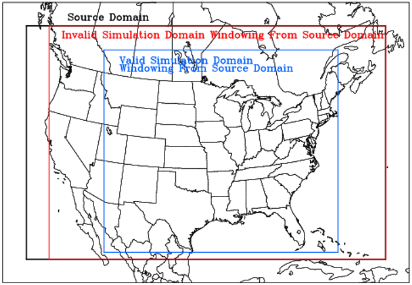

<!-- BEGIN COMMENT -->

 [<< Previous Chapter](CMAQ_UG_ch03_preparing_compute_environment.md) - [Home](README.md) - [Next Chapter >>](CMAQ_UG_ch05_running_a_simulation.md)

<!-- END COMMENT -->

# 4. Model Input Files

## 4.1 Introduction
This chapter provides basic information on the format and content of CMAQ input files.  It also provides information on using the pre-processing tools provided in the repository for preparing initial and boundary conditions and meteorology inputs.  Links are provided for  the emissions processing tools that are released through their own repository or website.  A list of CMAQ input files can be found in [Table 4-1](#Input_Table). Some CMAQ input files are in ASCII format while the majority of them are in the [Network Common Data Form (netCDF) format](http://www.unidata.ucar.edu/software/netcdf). CMAQ input and output files are self-describing netCDF-format files in which the file headers have all the dimensioning and descriptive information needed to define the resident data. Users should download the latest code for the NetCDF from the [NetCDF website](http://www.unidata.ucar.edu/software/netcdf). Compilation and configuration information for the NetCDF is available through the Unidata website.

All CMAQ input and output files are conformed to I/O API netCDF file format. Please refer to the [I/O API User's Manual](https://www.cmascenter.org/ioapi/documentation/all_versions/html) for details.

Full input datasets for 2016 over two domains are publically available to download from the CMAS Data Warehouse.  The input files are stored on Google Drive with metadata organized through Dataverse.  

|**Domain**|**Simulation Dates**|**Dataverse DOI**| 
|:--------------:|:----:|:--------:|
| Southeast US | July 1 - 14, 2016| https://doi.org/10.15139/S3/IQVABD |
| CONUS | Jan 1 - Dec 31, 2016 | https://doi.org/10.15139/S3/MHNUNE |


## 4.2 CMAQ Pre-processors 
[Figure 2-1](./images/Figure2-1.jpg) shows the relationship between CMAQ pre-processors and the main CMAQ program, the CMAQ Chemistry Transport Model (CCTM).  MCIP, ICON and BCON are included in the CMAQ repository and are used to create meteorological, initial conditions and boundary conditions inputs.  SMOKE, FEST-C and Spatial Allocator Tools are external software packages required for creating emissions inputs for CMAQ.  The following subsections provide more information on these software and point the user to additional sources of documentation. 

### 4.2.1 Meteorology-Chemistry Interface Processor (MCIP)

MCIP processes meteorological fields output by the WRF model into files that are compatible with the CCTM and SMOKE (an emissions processor that computes emissions inputs for CMAQ). The output files generated by MCIP are used by ICON and BCON and various other programs in CMAQ, so MCIP must be the first program run after installing the CMAQ source codes and initializing CMAQ environment variables. Configuration options for MCIP include the time periods over which to extract data from the meteorological model output files, horizontal grid definitions for output, and control for optional 3D output variables. MCIP can either process the full horizontal domain from WRF or a user-defined subset of that domain (that is, a "window").  Unlike many of the programs in the CMAQ program suite MCIP is compiled with a Makefile and then run with a run script. Instructions on how to compile and run MCIP are provided in the [README.md](../../PREP/mcip/README.md) file in the PREP/mcip folder.

Most of the fields that are simulated by WRF are not modified by MCIP for the CCTM and the emissions model, and they are "passed through" to the output. In additions, fields that are required to transform to CMAQ’s generalized coordinate system are calculated within MCIP. The dry deposition velocities are now calculated in the CCTM; MCIPv3.4 was the last version to calculate those velocities internally.


### 4.2.2 Initial Conditions Processor (ICON)

ICON generates a gridded netCDF file of the chemical conditions for all grid cells in the modeling domain for the initial time of a simulation. It can generate these initial conditions from either an existing CCTM output file or one of four ASCII files of vertically resolved concentration profiles distributed with CMAQ. Running ICON requires that the user already generated MCIP files for their target modeling domain. For both input file options, ICON will interpolate the data to the horizontal and vertical structure of the target domain as defined in the MCIP files. The species in the ICON output file are identical to those in the input (either CCTM output or ASCII profile) file.

Using an existing CCTM output file to generate initial conditions is applicable when interpolating initial conditions from a coarse to a fine grid domain, as may occur when setting up nested simulations (simulations with finer-resolution grids that cover part of coarser-resolution grids). This is the preferred mode of specifying initial conditions since the spatial concentration patterns derived from the coarser-resolution simulation can be considered a first approximation of the concentration fields over the finer-resolution subdomain at the beginning of the simulation.

The four ASCII files of vertically resolved concentration profiles [distributed with CMAQ](../../PREP/bcon/src/profile) represent annual average concentrations at a grid cell over the Pacific derived from a simulation with the hemispheric version of CMAQv5.3 beta2 for the year 2016. As such, these concentration profiles are reflective of conditions in a remote marine environment. The simulation was performed with the cb6r3m_ae7_kmtbr chemical mechanism and profiles for racm_ae6_aq, saprc07tc_ae6_aq, and saprc07tic_ae7i_aq were derived using the species mapping approach described in Step 3 of the [CMAQ Tutorial on creating Initial and Boundary Conditions from Seasonal Average Hemispheric CMAQ Output](./Tutorials/CMAQ_UG_tutorial_HCMAQ_IC_BC.md). If one of these ASCII profile files is used to generate initial conditions, the resulting concentration fields will be uniform over the modeling domain and will not be a realistic representation of conditions over the modeling domain. As a result, simulations initialized with profile-derived rather than CCTM-derived concentration fields may require longer spin-up periods before conditions simulated within the domain no longer are influenced by these unrealistic initial concentration fields.  

The configuration options for ICON include choosing whether the initial conditions are generated from an existing CCTM output file or from an ASCII profile, and defining the horizontal and vertical grids and time for which initial conditions are to be generated. Information on configuring ICON for the different kinds of input data, environment variables, input and output files, compiling and running ICON are provided in the [README.md](../../PREP/icon/README.md) file in the PREP/icon folder.

### 4.2.3 Boundary Conditions Processor (BCON)

BCON generates a netCDF file of the chemical conditions along the lateral boundaries of the modeling domain. BCON will generate an output file with chemical concentrations for all grid cells along the modeling domain's horizontal boundaries. It can generate these boundary conditions from either an existing CCTM output file or one of four ASCII files of vertically resolved concentration profiles distributed with CMAQ. Running BCON requires that the user already generated MCIP files for their target modeling domain. For both input file options, BCON will interpolate the data to the horizontal and vertical structure of the target domain as defined in the MCIP files. The species in the BCON output file are identical to those in the input (either CCTM output or ASCII profile) file. Depending on user specified options and/or input datasets, the boundary conditions generated by BCON can be time varying, time independent, and either spatially uniform or variable across the model boundaries.

Using an existing CCTM output file to generate boundary conditions is applicable when setting up windowed simulations (simulations with the same resolution that cover only a part of the outer domain) or nested simulations (simulations with finer-resolution grids that cover part of coarser-resolution grids). This is the preferred mode of specifying boundary conditions since the spatial concentration patterns derived from the coarser-resolution simulation will be spatially varying along the boundaries of the finer-resolution domain. Boundary conditions generated from CCTM output files will be either time varying or time independent.

The four ASCII files of vertically resolved concentration profiles [distributed with CMAQ](../../PREP/bcon/src/profile) represent annual average concentrations at a grid cell over the Pacific derived from a simulation with the hemispheric version of CMAQv5.3 beta2 for the year 2016. As such, these concentration profiles are reflective of conditions in a remote marine environment. The simulation was performed with the cb6r3m_ae7_kmtbr chemical mechanism and profiles for racm_ae6_aq, saprc07tc_ae6_aq, and saprc07tic_ae7i_aq were derived using the species mapping approach described in Step 3 of the [CMAQ Tutorial on creating Initial and Boundary Conditions from Seasonal Average Hemispheric CMAQ Output](./Tutorials/CMAQ_UG_tutorial_HCMAQ_IC_BC.md). If one of these ASCII profile files is used to generate boundary conditions, the resulting concentration fields will be uniform along the boundaries of the modeling domain and will not vary in time. Therefore, they are not a realistic representation of conditions along the domain boundaries and should only be used in cases where boundary conditions are not expected to affect the interpretation of model results. 

CMAQ can use boundary conditions derived from global chemistry models (GCMs). While BCON does not directly support processing of datasets from GCMs (other than the hemispheric version of CMAQ) in their native formats, users could develop their own custom codes to transform their GCM datasets into I/O API format, which would then allow these datasets to be input into BCON in the same way as an existing CCTM output file. 

The configuration options for BCON include choosing whether the boundary conditions are generated from an existing CCTM output file or from an ASCII profile, and defining the horizontal and vertical grids and time period for which boundary conditions are to be generated. Information on configuring BCON for the different kinds of input data, environment variables, input and output files, compiling and running BCON are provided in the [README.md](../../PREP/bcon/README.md) file in the PREP/bcon folder.

### 4.2.4 External Software Programs for Preparing CMAQ Inputs
The SMOKE and FEST-C modeling systems and the Spatial Allocator tools are used to create CMAQ emissions and land surface inputs. These systems are maintained by EPA and CMAS developers and are hosted and supported by the CMAS Center.  Links to documentation and software download for each system are provided below. 

**Emissions Processor (SMOKE)** 
[Sparse Matrix Operator Kerner Emissions (SMOKE) Modeling System](https://www.cmascenter.org/smoke/) is designed to create gridded, speciated, hourly emissions for input into CMAQ and other air quality models. SMOKE supports area, biogenic, mobile (both onroad and nonroad), and point source emissions processing for criteria, particulate, and toxic pollutants. For biogenic emissions modeling, SMOKE uses the Biogenic Emission Inventory System. SMOKE is also integrated with the on-road emissions model MOBILE6 and MOVES.

**Fertilizer Emissions Processor (FEST-C)**
The [Fertilizer Emission Scenario Tool for CMAQ (FEST-C)](https://www.cmascenter.org/fest-c/) system is used to generate agricultural-land nitrogen and soil information for CMAQ bi-directional NH<sub>3</sub> modeling. FEST-C contains three main components: Java interface, Environmental Policy Integrated Climate (EPIC) model, and SA Raster Tools. The interface guides users through generating required land use and crop data and EPIC input files and simulating EPIC, and extracting EPIC output for CMAQ. 

FEST-C is used to create the [E2C_LU](#e2c_lu), [E2C_SOIL](#e2c_soil), and [E2C_CHEM](#e2c_chem) files discussed later in this chapter. 

**Processing Spatial Data with the Spatial Allocator (SA)**
The [Spatial Allocator](https://www.cmascenter.org/sa-tools/) is a set of tools that helps users manipulate and generate data files related to emissions and air quality modeling. The tools perform functions similar to Geographic Information Systems (GIS), but are provided to the modeling community free of charge. In addition, the tools are designed to support some of the unique aspects of the file formats used for CMAQ, SMOKE and WRF modeling.

SA is used to generate the surf zone and open ocean file that is a required input for utilizing marine emissions and chemistry in CMAQ. This file is discussed later in this chapter under the [OCEAN_1: Sea spray mask](#ocean_1) section.

Additional information on processing data for CMAQ inputs is provided in [Appendix C](Appendix/CMAQ_UG_appendixC_spatial_data.md).

<a id=inputs></a>

## 4.3 CMAQ Input Files

[Jump to Table of Input Files](#Input_Table)<br>
[Jump to CCTM Output Files in Chapter 7](CMAQ_UG_ch07_model_outputs.md)

CMAQ requires a basic set of input files: initial condition file, which is created by ICON process or previous day output; boundary condition file, which is created by BCON process; emission files; and meteorological data created by MCIP using WRF and terrain data. Additional input files may be required based on specific run time options. CMAQ output files include a basic set of files with aerosol and gas-phase species concentrations, wet and dry deposition estimates, and visibility metrics, and an auxiliary set of output files for diagnosing model performance and in-line-calculated emissions.  Model outputs are discussed in [Chapter 7](CMAQ_UG_ch07_model_outputs.md).

Rather than forcing the user to deal with hard-coded file names or hard-coded unit numbers, the I/O API netCDF file format utilizes the concept of logical file names. The modelers can define the logical names as properties of a program, and then at run-time the logical names can be linked to the actual file name using environment variables. For programming purposes, the only limitations are that logical file names cannot contain blank spaces and must be at most 16 characters long. When a modeler runs a program that uses the I/O API format, environment variables must be used to set the values for the program’s logical file names. A complete list of CMAQ input is provided in [Table 4-1](#Input_Table).

This section describes each of the input files required by the various CMAQ programs. The section begins with a description of the grid definition file, GRIDDESC, which is used by several CMAQ programs, and then goes through a program-by-program listing of the CMAQ input file requirements. [Table 4-1](#Input_Table) lists the source, file type (e.g. ASCII, [GRDDED3](https://www.cmascenter.org/ioapi/documentation/all_versions/html/DATATYPES.html), [BNDARY3](https://www.cmascenter.org/ioapi/documentation/all_versions/html/DATATYPES.html), etc.), and temporal and spatial dimensions of each CMAQ input file.   Typical time step is 1 hour; however a user can specify a finer one, e.g. 20 minutes. In addition, typical thickness of a boundary file is 1, i.e. NTHIK = 1 but it can be any positive integer.

<a id=Input_Table></a>
<a id=Table4-1></a>
**Table 4-1. CMAQ input files.**  Note that when "Time-Dependence" is listed as "Hourly", it is shorthand for a time-varying file.  It is recommended that CMAQ use a time increment that is no longer than one hour.  However, CMAQ can be run with a Time Dependence that is shorter than hourly.

|**Environment Variable Name for File**|**File Type**|**Time-Dependence**|**Spatial Dimensions**|**Source**|**Required**|
|----------------------|-----------|-----------|----------|----------|---------|
|**General**|  | | |||
|[GRIDDESC](#griddesc) <a id=griddesc_t></a>|ASCII|n/a|n/a|MCIP|required|
|[gc_matrix_nml](#matrix_nml) <a id=matrix_nml_t></a>|ASCII|n/a|n/a|CMAQ repo|required|
|[ae_matrix_nml](#matrix_nml) <a id=matrix_nml_t></a>|ASCII|n/a|n/a|CMAQ repo|required|
|[nr_matrix_nml](#matrix_nml) <a id=matrix_nml_t></a>|ASCII|n/a|n/a|CMAQ repo|required|
|[tr_matrix_nml](#matrix_nml) <a id=matrix_nml_t></a>|ASCII|n/a|n/a|CMAQ repo|required|
|**Initial Conditions Inputs**|  | | ||
|[INIT_CONC_1](#init_conc_1) <a id=init_conc_1_t></a>|GRDDED3|Time-invariant | XYZ | ICON or CCTM |required|
|**Boundary Conditions Inputs**| | | | ||
|[BNDY_CONC_1](#bndy_conc_1) <a id=bndy_conc_1_t></a> |BNDARY3| Hourly |PERIM\*Z|BCON|required|
|**MCIP**| | | | |||
|[GRID_CRO_2D](#grid_cro_2d) <a id=grid_cro_2d_t></a>| GRDDED3 | Time-invariant | XY | MCIP|required|
|[GRID_BDY_2D](#grid_bdy_2d) <a id=grid_bdy_2d_t></a>| BNDARY3 | Time-invariant | PERIM\*Z | MCIP|required|
|[GRID_DOT_2D](#grid_dot_2d) <a id=grid_dot_2d_t></a>| GRDDED3 | Time-invariant | (X+1)\*(Y+1) | MCIP|required|
|[MET_BDY_3D](#met_bdy_3d) <a id=met_bdy_3d_t></a>| BNDARY3 | Hourly | PERIM\*Z | MCIP|required|
|[MET_CRO_2D](#met_cro_2d) <a id=met_cro_2d_t></a>| GRDDED3 | Hourly | XY | MCIP|required|
|[MET_CRO_3D](#met_cro_3d) <a id=met_cro_3d_t></a>| GRDDED3 | Hourly | XYZ | MCIP|required|
|[MET_DOT_3D](#met_dot_3d) <a id=met_dot_3d_t></a>| GRDDED3 | Hourly | (X+1)\*(Y+1)Z | MCIP|required|
|[LUFRAC_CRO](#lufrac_cro) <a id=lufrac_cro_t></a>| GRDDED3 | Time-invariant | XYL | MCIP|required|
|[SOI_CRO](#soi_cro) <a id=soi_cro_t></a>| GRDDED3 | Hourly | XYS | MCIP | optional (Contains soil moisture and soil temperature in layers. A two-layer representation of those fields is currently mirrored in MET_CRO_2D.)|
|[MOSAIC_CRO](#mosaic_cro) <a id=mosaic_cro_t></a>| GRDDED3| Hourly| XYM | MCIP|optional (Contains surface fields in mosaic land use categories if Noah Mosaic LSM was run in WRF. Can work with STAGE deposition in CCTM.)|
|[mcip.nc](#mcip) <a id=mcip_t></a>| netCDF | varies by field | varies by field | MCIP|required if IOFORM=2 (Currently not compatible with rest of CMAQ system.)|
|[mcip_bdy.nc](#mcip_bdy) <a id=mcip_bdyt></a>| netCDF | varies by field | varies by field | MCIP|required if IOFORM=2 (Currently not compatible with rest of CMAQ system.)|
|**Emissions Inputs**||||||
|[EmissCtrl_matrix_nml](#emissctrl) <a id=emissctrl_t></a>|ASCII|n/a|n/a|CMAQ repo|required|
|[GR_EMIS_XXX*](#emis_xxx) <a id=emis_xxx_t></a> | GRDDED3 | Hourly | XYZ | SMOKE|required|
|[STK_GRPS_XXX](#stk_grps) <a id=stk_grps_t></a> | GRDDED3 |Time-invariant|XY | SMOKE|required|
|[STK_EMIS_XXX](#stk_emis) <a id=stk_emis_t></a> | GRDDED3 | Hourly | XY | SMOKE|required|
|[NLDN_STRIKES](#nldn_strikes) <a id=nldn_strikes_t></a>| GRDDED3 | Hourly | XY |Must purchase data|optional for including NO from lightning|
|[LTNGPARMS_FILE](#ltngparm_file) <a id=ltngparm_file_t></a>| GRDDED3 | Time-invariant | XY |CMAS|required for including NO from lightning|
|**Biogenic and Land Surface Inputs**||||||
|[OCEAN_1](#ocean_1) <a id=ocean_1_t></a>| GRDDED3 | Time-invariant | XY |Spatial Allocator|required|
|[GSPRO](#gspro) <a id=gspro_t></a>| ASCII | Time-invariant | N/a | CMAQ repo|required for running CMAQ with online biogenics|
|[B3GRD](#b3grd) <a id=b3grd_t></a>| GRDDED3 | Time-invariant | XY | SMOKE|required for running CMAQ with online biogenics|
|[BIOSEASON](#bioseason) <a id=bioseason_t></a>|GRDDED3 |Time-invariant | XY | SMOKE|run-time option for running CMAQ with online biogenics|
|[E2C_LU](#e2c_lu) <a id=e2c_lu_t></a>| GRDDED3 | Time-invariant |XY|EPIC|required for running CMAQ with bidirectional NH3|
|[E2C_SOIL](#e2c_soil) <a id=e2c_soil_t></a>| GRDDED3 | Time-invariant | XY|EPIC|required for running CMAQ with bidirectional NH3|
|[E2C_CHEM](#e2c_chem) <a id=e2c_chem_t></a>| GRDDED3 | Daily |XY|EPIC|optional|
|[DUST_LU_1](#dust_lu_1) <a id=dust_lu_1_t></a>| GRDDED3 | Time-invariant | XY|Spatial Allocator|optional when running CMAQ with windblown dust|
|[DUST_LU_2](#dust_lu_2) <a id=dust_lu_2_t></a>| GRDDED3 | Time-invariant | XY|Spatial Allocator|optional when running CMAQ with windblown dust|
|**Photolysis** | | | |||
|[OMI](#omi) <a id=omi_t></a>| ASCII | Daily | n/a |CMAQ repo or create_omi|required|

*XXX - three-digit variable indicating emission stream number. Gridded and Inline Point emissions are numbered independently.

### 4.3.1 Windowing Capability
Under the assumption that all inputs utilize the same projection and grid resolution, CMAQ allows users to provide a gridded input files which covers a different geographic extent but are a proper super set of the simulation domain. Proper super set means that the simulated domain must be at least one grid cell smaller at all sides than the gridded input (see Figure 4-3-1 below). This capability excludes the chemical boundary condition file (BCFILE) which must be created for the simulated domain using the BCON program. This capability applies to meteorological data files, however, METBDY3D won't be used, and the meteorological boundary information will be extracted from METCRO3D directly. For point source files, CMAQ already can discern if a particular point source is within the simulation domain or not as long as the files also use the same projection.

<a id=Figure4-3-1></a> 

**Figure 4-3-1. Appropriate Windowing Domain illustration**

## 4.4 GRIDDESC and Species Namelist Files

<a id=griddesc></a> 
**GRIDDESC: Horizontal domain definition**

<!-- BEGIN COMMENT -->

[Return to Table 4-1](#griddesc_t)

<!-- END COMMENT -->

Used by: ICON, BCON, CCTM

The CMAQ grid description file (**GRIDDESC**) is an ASCII file that contains two sections: a horizontal coordinate section, and domain description section. The GRIDDESC file is generated automatically by MCIP; alternatively, GRIDDESC can be created using a text editor.

The horizontal coordinate section consists of text records that provide the coordinate-system name, the map projection, and descriptive parameters that define the projection.  This section is used to provide projection information that is used by a family of nested domains, where the coordinate-system name is shared by each of the domains. 

The grid description section consists of text records that indicate the grid name, related coordinate-system name (i.e., which GRIDDESC horizontal coordinate name that is defined in the previous section that is applied to this grid), and descriptive parameters for the coordinates of the lower-left corner of the grid, grid cell size, number of columns, and rows. There are at most 32 coordinate systems and 256 grids that can be listed in one of these files. These files are small enough to be archived easily with a study and have a sufficiently simple format that can easily be constructed "by hand."  The elements of the GRIDDESC files are typically included with the metadata for the output files in the CMAQ system.

An example of a GRIDDESC file is shown below:

` ' '`

` 'LAM_40N100W'`

` 2 30.0 60.0 -100.0 -100.0 40.0`

` ' '`

` 'M_32_99TUT02'`

` 'LAM_40N100W' 544000.0 -992000.0 32000.0 32000.0 38 38 1`

` ' '`

The horizontal coordinate section (first section) in this example GRIDDESC file defines a horizontal coordinate named “LAM_40N100W”. The coordinate definition is for a Lambert conformal grid, keyed by the first column of the coordinate description line, which corresponds to the numeric code for the various I/O API-supported grid types (2 = Lambert). The next three parameters (P_ALP, P_BET, and P_GAM) have different definitions for different map projections. For Lambert conformal, P_ALP and P_BET are the true latitudes of the projection cone (30°N and 60°N in the example), and P_GAM (100°W in the example) is the central meridian of the projection. The last two parameters, XCENT and YCENT, are the reference longitude and latitude for the domain, which are 100°W and 40°N in the example.

The second section in the example describes a domain named “M_32_99TUT02”. In this example, the coordinate named “LAM_40N100W” is referenced in the domain definition. The next two parameters in the domain definition (XORIG and YORIG) are the east-west and north-south offsets from XCENT and YCENT in meters. The next two parameters (XCELL and YCELL) are the horizontal grid spacing in meters for the X and Y directions (i.e., &#916;x and &#916;y). The next two parameters (NCOLS and NROWS) are the numbers of grid cells in the X and Y directions. The grid definition concludes with the number of boundary cells, NTHIK, which is typically set to 1. Note that the number of boundary cells for CMAQ differs from that used by WRF.

Additional information about the parameters in the GRIDDESC file can be found in the [I/O API Documentation](https://www.cmascenter.org/ioapi/documentation/all_versions/html/GRIDS.html).

<a id=matrix_nml></a>

**{gc|ae|nr|tr}_matrix.nml: Species namelist files**
<!-- BEGIN COMMENT -->
[Return to Table 4-1](#matrix_nml_t)
<!-- END COMMENT -->

Used by: CCTM, CHEMMECH

Namelist look-up tables for different classes of simulated pollutants are used to define the parameters of different model species during the execution of the CMAQ programs. Gas-phase (gc), aerosol (ae), non-reactive (nr), and tracer (tr) species namelist files contain parameters for the model species that are included in these different classifications. The species namelist files are used to control how the different CMAQ programs and processes handle the model species. The namelist files define the following processes for each model species:


-   Initial conditions – which initial condition species is the pollutant mapped to; if not specified, this will default to the species name.
-   IC Factor – if the pollutant is mapped to an initial condition species, uniformly apply a scaling factor to the concentrations.
-   Boundary conditions – which boundary condition species is the pollutant mapped to; if not specified, this will default to the species name.
-   BC Factor – if the pollutant is mapped to a boundary condition species, uniformly apply a scaling factor to the concentrations.
-   Deposition velocity – which (if any) deposition velocity is the deposition velocity for the pollutant mapped to; allowed velocities are specified within the model source code.
-   Deposition velocity factor – if the pollutant is mapped to a deposition velocity, uniformly apply a scaling factor to this velocity.
-   Scavenging - which (if any) species is the pollutant mapped to; Allowed scavenging surrogates are specified within the model source code ("[hlconst.F](../../CCTM/src/cloud/acm_ae6/hlconst.F)").
-   Scavenging factor - if the pollutant is mapped to a species for scavenging, uniformly apply a scaling factor to the scavenging rate.
-   Gas-to-aerosol conversion – which (if any) aerosol chemistry species does the gas phase pollutant concentration go into for transformation from the gas-phase to the aerosol-phase.  Allowed gas-to-aerosol surrogates are specified within the model source code ("[PRECURSOR_DATA.F](../../CCTM/src/aero/aero6/PRECURSOR_DATA.F)" and "[SOA_DEFN.F](../../CCTM/src/aero/aero6/SOA_DEFN.F)")
-   Gas-to-aqueous Surrogate – which (if any) cloud chemistry species does the gas pollutant concentration go into for simulating chemistry within cloud water. Allowed gas-to-aqueous surrogates are specified within the model source code and depends on the cloud model/aqueous chemistry being used (for example, for the acm_ae6, see "[AQ_DATA.F](../../CCTM/src/cloud/acm_ae6/AQ_DATA.F)").
-   Aerosol-to-aqueous Surrogate – which (if any) cloud chemistry species does the aerosol pollutant concentration go into for simulating chemistry within cloud water.  Allowed aerosol-to-aqueous surrogates are specified within the model source code and depends on the cloud model/aqueous chemistry being used (for example, for the acm_ae6, see "[AQ_DATA.F](../../CCTM/src/cloud/acm_ae6/AQ_DATA.F)").
-   Transport – is the pollutant transported by advection and diffusion in the model?
-   Dry deposition – Write the pollutant to the dry deposition output file?
-   Wet deposition – Write the pollutant to the wet deposition output file?
-   Concentration – Write the pollutant to the instantaneous concentration output file?

The namelist files contain header information that describe which class of species are contained in the file, the number of parameters contained in the file, headers describing the parameter fields, and then a series of rows with configuration parameters for every model species. [Table 4-2](#Table4-2) contains the namelist file format for the gas-phase (GC) species namelist file. The namelist files for the other species classifications (AE, NR, TR) are similar to the format shown in [Table 4-2](#Table4-2).

<a id=Table4-2></a>

**Table 4-2. GC species namelist file format**

| **Line**| **Column** |**Name** | **Type**| **Description** |**Options for Syntax**:|
|-----|-----|----------------------|----------|--------------------------------------------|----------------------------|
| 1 || File Type |String|String to delineate Gas Phase (GC), Aerosol (AE), Non-reactive (NR) and Tracer (TR) species namelist|{&GC_nml, &AE_nml, &NR_nml, &TR_nml}|
| 3 || Header ID | String |String to define data structure relating to namelist|{GC_SPECIES_DATA=, AE_SPECIES DATA= , NR_SPECIES_DATA= ,TR_SPECIES_DATA = }|
| 5 |1| SPECIES | String |CMAQ Species name, i.e. NO, HNO<sub>3</sub>, PAR; dependent on chemical mechanism|-|
||2| MOLWT| Integer |Species Molecular Weight|-|
|  |3| IC | String |IC surrogate species name for the CMAQ Species|{'Species name', ' '}|
|  |4| FAC | Integer |Scaling factor for the IC concentration|{Any real: default = -1 if IC is not specified}|
|  |5| BC | String |BC surrogate species name for the CMAQ Species|{'Species name', ' '}|
|  |6| FAC | Integer |Scaling factor for the BC concentration|{Any real: default = -1 if BC is not specified}|
| |7| DRYDEP SURR | String |Deposition velocity variable name for the CMAQ Species|{'Species name', ' '}|
| |8| FAC | Integer |Scaling factor for the deposition velocity|{Any real: default = -1 if SURR is not specified}|
| |9| WET-SCAV SURR | String |Wet Deposition Scavenging surrogate species|{'Species name', ' '}|
| | 10 | FAC | Integer |Scaling factor for Scavenging|{Any real: default = -1 if SURR is not specified}|
|| 11 | GC2AE SURR | String |Gas-to-aerosol transformation species|{'Species name', ' '}|
|| 12 | GC2AQ SURR | String |Gas-to-aqueous transformation species|{'Species name', ' '}|
|| 13 | TRNS | String |Transport Switch. _NOTE_: Instead of using one column labeled "TRNS" to turn/off both advection and diffusion for a pollutant, two separate columns labeled "ADV" and "DIFF" can be used to switch on/off advection and diffusion separately.|{YES/NO}|
|| 14 | DDEP | String |Dry deposition output file switch|{YES/NO}|
|| 15 | WDEP | Real |Wet deposition output file switch|{YES/NO}|
|| 16 | CONC | String |Concentration output file switch|{YES/NO}|


The namelist files for the other pollutant classes have similar configurations as the gas-phase species configuration shown in [Table 4-2](#Table4-2). For an example see this [link](../../CCTM/src/MECHS/cb06r3_ae7_aq/GC_cb6r3_ae7_aq.nml) to the GC namelist species file for the cb06r3_ae7_aq mechanism.

<a id=init_conc_1></a>

## 4.5 Initial Conditions Input

**INIT_CONC_1: Initial conditions**

<!-- BEGIN COMMENT -->
 
[Return to Table 4-1](#init_conc_1_t)

<!-- END COMMENT -->

Used by: CCTM

The initial concentrations of each species being modeled must be input to CMAQ. The initial conditions input file type is GRDDED3 and does not vary with time. The actual file data are organized in this manner: by column, by row, by layer, by variable. Initial conditions files have the same structure as concentration files, so the predicted concentrations from the last hour of day 1 can be used to initialize the following day’s simulation. This gives CMAQ users the flexibility to segment simulations in any way they choose.

<a id=bndy_conc_1></a>

## 4.6 Boundary Conditions Input

**BNDY_CONC_1: Boundary conditions**

<!-- BEGIN COMMENT -->

[Return to Table 4-1](#bndy_conc_1_t)

<!-- END COMMENT -->

Used by: CCTM

CMAQ boundary condition data are of the BNDARY3 file type. Produced by the boundary condition processor, BCON, CCTM reads these data and correlates them with the interior data using a pointer system. This pointer system designates the beginning location of the data in memory that start a new side of the domain (i.e., south, east, north, or west). Consult I/O API User Guide for a pictorial description.

Each species being modeled should be in the BNDY_CONC_1 file. If some modeled species are not contained in this file, the boundary condition for these species will default to the value 1 × 10e<sup>-30</sup>. The perimeter of the CMAQ domain is NTHIK cell wide (typically NTHIK = 1), where the number of boundary cells = NTHIK\*(2\*NCOLS + 2\*NROWS +4\*NTHIK).

## 4.7 Meteorological Inputs (Processed for the CMAQ System using MCIP)

<a id=grid_cro_2d></a>
<a id=grid_bdy_2d></a>
<a id=grid_dot_2d></a>
<a id=met_bdy_3d></a>
<a id=met_cro_2d></a>
<a id=met_cro_3d></a>
<a id=met_dot_3d></a>
<a id=lufrac_cro></a>
<a id=soi_cro></a>
<a id=mosaic_cro></a>
<a id=mcip></a>
<a id=mcip_bdy></a>

```
**_MCIP output files generated when IOFORM=1 (Models-3 I/O API)_**
- GRIDDESC:     Grid description used throughout the CMAQ System
- GRID_CRO_2D:  Time-invariant 2D fields (XY) at cell centers (cross points)
- GRID_BDY_2D:  Time-invariant fields from GRID_CRO_2D, but along domain lateral boundaries
- GRID_DOT_2D:  Time-invariant 2D fields (XY) at cell corners (dot points) and cell faces
- MET_CRO_2D:   Time-varying 2D fields (XY) at cell centers (cross points)
- MET_CRO_3D:   Time-varying 3D fields (XYZ) at cell centers (cross points)
- MET_BDY_3D:   Time-varying fields from MET_CRO_3D, but along domain lateral boundaries
- MET_DOT_3D:   Time-varying 3D fields (XYZ) at cell corners (dot points) and cell faces
- LUFRAC_CRO:   Time-invariant 3D fractional land use (XYL) at cell corners (cross points)
- SOI_CRO:      Time-varying 3D soil moisture and temperature (XYS) in model soil layers at cell centers
- MOSAIC_CRO:   Time-varying 3D surface fields by mosaic land use category (XYM) at cell centers

**_MCIP output files generated when IOFORM=2 (netCDF)_**
- GRIDDESC:     Grid description used throughout the CMAQ System
- mcip.nc:      All time-invariant and time-varying 2D and 3D fields (all dimensions)
- mcip_bdy.nc:  All required time-invariant and time-varying 2D and 3D fields along lateral boundaries
```

<!-- BEGIN COMMENT -->

[Return to Table 4-1](#grid_cro_2d_t)

<!-- END COMMENT -->

Used by: ICON, BCON, CCTM, and some optional programs

<a id=Table4-3></a>

**Table 4-3**  MCIP output variables used within the CMAQ system.  All fields are located at cell centers, except where noted in the Description.  The Dimensions are:  XY=horizontal, T=time-varying, Z=layers above ground, S=layers below ground, L=land use categories, M=mosaic land use categories.

|**Variable Name**|**Description**|**Units**|**Dimensions**|**File**|**Required**|
|--------|---------------|--------------|----------|------------|----------|
|LAT|latitude|degrees, where Northern Hemisphere is positive|XY|GRIDCRO2D and GRIDBDY2D, or mcip.nc and mcip_bdy.nc|yes|
|LON|longitude|degrees, where Western Hemisphere is negative|XY|GRIDCRO2D and GRIDBDY2D, or mcip.nc and mcip_bdy.nc|yes|
|MSFX2|squared map-scale factor|m<sup>2</sup> m<sup>-2</sup>|XY|GRIDCRO2D and GRIDBDY2D, or mcip.nc and mcip_bdy.nc|yes|
|HT|terrain elevation|m|XY|GRIDCRO2D and GRIDBDY2D, or mcip.nc and mcip_bdy.nc|yes|
|DLUSE|dominant land use|category|XY|GRIDCRO2D and GRIDBDY2D, or mcip.nc and mcip_bdy.nc|yes|
|LWMASK|land-water mask|1=land, 0=water|XY|GRIDCRO2D and GRIDBDY2D, or mcip.nc and mcip_bdy.nc|yes|
|PURB|urban percent of cell based on land coverage|percent|XY|GRIDCRO2D and GRIDBDY2D, or mcip.nc and mcip_bdy.nc|no, but refines vertical mixing in urban areas|
|LUFRAC|fraction of land use by category|1|XYL|LUFRACCRO or mcip.nc|yes|
|LATD|latitude|degrees, where Northern Hemisphere is positive (at cell corners)|XY|GRIDDOT2D or mcip.nc|no|
|LOND|longitude|degrees, where Western Hemisphere is negative (at cell corners)|XY|GRIDDOT2D or mcip.nc|no|
|MSFD2|squared map scale factor|m<sup>2</sup> m<sup>-2</sup> (at cell corners)|XY|GRIDDOT2D or mcip.nc|no|
|LATU|latitude|degrees, where Northern Hemisphere is positive (at cell west-east faces)|XY|GRIDDOT2D or mcip.nc|no|
|LONU|longitude|degrees, where Western Hemisphere is negative (at cell west-east faces)|XY|GRIDDOT2D or mcip.nc|no|
|MSFU2|squared map scale factor|m<sup>2</sup> m<sup>-2</sup> (at cell west-east faces)|XY|GRIDDOT2D or mcip.nc|yes|
|LATV|latitude|degrees, where Northern Hemisphere is positive (at cell south-north faces)|XY|GRIDDOT2D or mcip.nc|no|
|LONV|longitude|degrees, where Western Hemisphere is negative (at cell south-north faces)|XY|GRIDDOT2D or mcip.nc|no|
|MSFV2|squared map scale factor|m<sup>2</sup> m<sup>-2</sup> (at cell south-north faces)|XY|GRIDDOT2D or mcip.nc|yes|
|PRSFC|surface pressure|Pa|XYT|METCRO2D or mcip.nc|yes|
|USTAR|cell-averaged horizontal friction velocity|m s<sup>-1</sup>|XYT|METCRO2D or mcip.nc|yes|
|WSTAR|convective velocity scale|m s<sup>-1</sup>|XYT|METCRO2D or mcip.nc|yes|
|PBL|planetary boundary layer height|m|XYT|METCRO2D or mcip.nc|yes|
|ZRUF|surface roughness length|m|XYT|METCRO2D or mcip.nc|yes|
|MOLI|inverse Monin-Obukhov length|m<sup>-1</sup>|XYT|METCRO2D or mcip.nc|yes|
|HFX|sensible heat flux|W m<sup>-2</sup>|XYT|METCRO2D or mcip.nc|yes|
|LH|latent heat flux|W m<sup>-2</sup>|XYT|METCRO2D or mcip.nc|yes|
|RADYNI|inverse aerodynamic resistance|m s<sup>-1</sup>|XYT|METCRO2D or mcip.nc|yes|
|RSTOMI|inverse bulk stomatal resistance|m s<sup>-1</sup>|XYT|METCRO2D or mcip.nc|yes|
|TEMPG|skin temperature at ground|K|XYT|METCRO2D or mcip.nc|yes|
|TEMP2|2-m temperature|K|XYT|METCRO2D or mcip.nc|yes|
|Q2|2-m water vapor mixing ratio|kg kg<sup>-1</sup>|XYT|METCRO2D or mcip.nc|yes|
|WSPD10|10-m wind speed|m s<sup>-1</sup>|XYT|METCRO2D or mcip.nc|yes|
|WDIR10|10-m wind direction|degrees|XYT|METCRO2D or mcip.nc|no|
|GLW|longwave radiation at ground|W m<sup>-2</sup>|XYT|METCRO2D or mcip.nc|yes|
|GSW|solar radiation absorbed at ground|W m<sup>-2</sup>|XYT|METCRO2D or mcip.nc|yes|
|RGRND|solar radiation reaching the surface|W m<sup>-2</sup>|XYT|METCRO2D or mcip.nc|yes|
|RN|incremental (per output time step) nonconvective precipitation|cm|XYT|METCRO2D or mcip.nc|yes|
|RC|incremental (per output time step) convective precipitation|cm|XYT|METCRO2D or mcip.nc|yes|
|CFRAC|total column integrated cloud fraction|1|XYT|METCRO2D or mcip.nc|yes, if photolysis uses the table option in CCTM|
|CLDT|cloud layer top height|m|XYT|METCRO2D or mcip.nc|yes, if photolysis uses the table option in CCTM|
|CLDB|cloud layer bottom height|m|XYT|METCRO2D or mcip.nc|yes, if photolysis uses the table option in CCTM|
|WBAR|average liquid water content of cloud|g m<sup>-3</sup>|XYT|METCRO2D or mcip.nc|yes, if photolysis uses the table option in CCTM|
|SNOCOV|snow cover|1=yes, 0=no|XYT|METCRO2D or mcip.nc|yes|
|VEG|vegetation coverage|1|XYT|METCRO2D or mcip.nc|yes|
|LAI|leaf-area index|m<sup>2</sup> m<sup>-2</sup>|XYT|METCRO2D or mcip.nc|yes|
|WR|canopy moisture content|m|XYT|METCRO2D or mcip.nc|yes|
|SEAICE|sea ice|1|XYT|METCRO2D or mcip.nc|yes|
|SNOWH|snow height|m|XYT|METCRO2D or mcip.nc|yes|
|SOIM1|volumetric soil moisture in top cm|m<sup>3</sup> m<sup>-3</sup>|XYT|METCRO2D or mcip.nc|yes, but preferred to use from SOIM3D|
|SOIM2|volumetric soil moisture in top m|m<sup>3</sup> m<sup>-3</sup>|XYT|METCRO2D or mcip.nc|yes, but preferred to use from SOIM3D|
|SOIT1|soil temperature in top cm|K|XYT|METCRO2D or mcip.nc|yes, but preferred to use from SOIT3D|
|SOIT2|soil temperature in top m|K|XYT|METCRO2D or mcip.nc|yes, but preferred to use from SOIT3D|
|SLTYP|soil texture type|1|XYT|METCRO2D or mcip.nc|yes|
|WWLT_PX|soil wilting point from PX LSM|m<sup>3</sup> m<sup>-3</sup>|XYT|METCRO2D or mcip.nc|no, but used if available|
|WFC_PX|soil field capacity from PX LSM|m<sup>3</sup> m<sup>-3</sup>|XYT|METCRO2D or mcip.nc|no, but used if available|
|WSAT_PX|soil saturation from PX LSM|m<sup>3</sup> m<sup>-3</sup>|XYT|METCRO2D or mcip.nc|no, but used if available|
|CLAY_PX|clay from PX LSM|1|XYT|METCRO2D or mcip.nc|no, but used if available|
|CSAND_PX|coarse sand from PX LSM|1|XYT|METCRO2D or mcip.nc|no, but used if available|
|FMSAND_PX|fine-medium sand from PX LSM|1|XYT|METCRO2D or mcip.nc|no, but used if available|
|JACOBF|total Jacobian at layer face|m|XYZT|METCRO3D and METBDY3D, or mcip.nc and mcip_bdy.nc|yes|
|JACOBM|total Jacobian at layer middle|m|XYZT|METCRO3D and METBDY3D, or mcip.nc and mcip_bdy.nc|yes|
|DENSA_J|Jacobian-weighted total air density|kg m<sup>-2</sup>|XYZT|METCRO3D and METBDY3D, or mcip.nc and mcip_bdy.nc|yes|
|WHAT_JD|Jacobian- and density-weighted vertical contravariant velocity|kg m<sup>-1</sup> s<sup>-1</sup>|XYZT|METCRO3D and METBDY3D, or mcip.nc and mcip_bdy.nc|yes|
|TA| air temperature|K|XYZT|METCRO3D and METBDY3D, or mcip.nc and mcip_bdy.nc|yes|
|QV| water vapor mixing ratio|kg kg<sup>-1</sup>|XYZT|METCRO3D and METBDY3D, or mcip.nc and mcip_bdy.nc|yes|
|PRES| air pressure|Pa|XYZT|METCRO3D and METBDY3D, or mcip.nc and mcip_bdy.nc|yes|
|DENS| air density|kg m<sup>-3</sup>|XYZT|METCRO3D and METBDY3D, or mcip.nc and mcip_bdy.nc|yes|
|WWIND| vertical velocity|m s<sup>-1</sup>|XYZT|METCRO3D and METBDY3D, or mcip.nc and mcip_bdy.nc|yes|
|ZH|mid-layer height above ground|m|XYZT|METCRO3D and METBDY3D, or mcip.nc and mcip_bdy.nc|yes|
|ZF|full layer height above ground|m|XYZT|METCRO3D and METBDY3D, or mcip.nc and mcip_bdy.nc|yes|
|TKE|turbulent kinetic energy|J kg<sup>-1</sup>|XYZT|METCRO3D and METBDY3D, or mcip.nc and met_bdy.nc|no|
|PV|potential vorticity|m<sup>2</sup> K kg<sup>-1</sup> s<sup>-1</sup> x 10<sup>-6</sup>|XYZT|METCRO3D and METBDY3D, or mcip.nc and mcip_bdy.nc|no, but required for PV scaling|
|WWIND|vertical velocity|m s<sup>-1</sup>|XYZT|METCRO3D and METBDY3D, or mcip.nc and mcip_bdy.nc|no|
|CFRAC_3D|3D resolved cloud fraction|1|XYZT|METCRO3D and METBDY3D, or mcip.nc and mcip_bdy.nc|no, but used if available|
|QC|cloud water mixing ratio|kg kg<sup>-1</sup>|XYZT|METCRO3D and METBDY3D, or mcip.nc and mcip_bdy.nc|yes|
|QR|rain water mixing ratio|kg kg<sup>-1</sup>|XYZT|METCRO3D and METBDY3D, or mcip.nc and mcip_bdy.nc|yes|
|QI|ice mixing ratio|kg kg<sup>-1</sup>|XYZT|METCRO3D and METBDY3D, or mcip.nc and mcip_bdy.nc|no, but used if available|
|QS|snow mixing ratio|kg kg<sup>-1</sup>|XYZT|METCRO3D and METBDY3D, or mcip.nc and mcip_bdy.nc|no, but used if available|
|QG|graupel mixing ratio|kg kg<sup>-1</sup>|XYZT|METCRO3D and METBDY3D, or mcip.nc and mcip_bdy.nc|no, but used if available|
|QC_CU|subgrid cloud water mixing ratio from KF|kg kg<sup>-1</sup>|XYZT|METCRO3D and METBDY3D, or mcip.nc and mcip_bdy.nc|no; only output if available from WRF; for future development|
|QI_CU|subgrid cloud ice mixing ratio from KF|kg kg<sup>-1</sup>|XYZT|METCRO3D and METBDY3D, or mcip.nc and mcip_bdy.nc|no; only output if available from WRF; for future development|
|CLDFRA_DP|subgrid deep cloud fraction|1|XYZT|METCRO3D and METBDY3D, or mcip.nc and mcip_bdy.nc|no; only output if available from WRF; for future development|
|CLDFRA_SH|subgrid shallow cloud fraction|1|XYZT|METCRO3D and METBDY3D, or mcip.nc and mcip_bdy.nc|no; only output if available from WRF; for future development|
|UWIND|u-component of horizontal wind (cell corners)|m s<sup>-1</sup>|XYZT|METDOT3D or mcip.nc|no|
|VWIND|v-component of horizontal wind (cell corners)|m s<sup>-1</sup>|XYZT|METDOT3D or mcip.nc|no|
|UHAT_JD|contravariant-U x Jacobian x density|kg m<sup>-1</sup> s<sup>-1</sup> [cell faces; Arakawa-C grid]|XYZT|METDOT3D or mcip.nc|yes|
|VHAT_JD|contravariant-V x Jacobian x density|kg m<sup>-1</sup> s<sup>-1</sup> [cell faces; Arakawa-C grid]|XYZT|METDOT3D or mcip.nc|yes|
|UWINDC|u-component of horizontal wind (west-east cell faces)|m s<sup>-1</sup>|XYZT|METDOT3D or mcip.nc|yes|
|VWINDC|v-component of horizontal wind (south-north cell faces)|m s<sup>-1</sup>|XYZT|METDOT3D or mcip.nc|yes|
|SOIT3D|soil temperature|K|XYST|SOICRO or mcip.nc|yes|
|SOIM3D|soil moisture|kg kg<sup>-1</sup>|XYST|SOICRO or mcip.nc|yes|
|LUFRAC2|fractional land use in mosaic categories|1|XYM|MOSAICCRO or mcip.nc|no, but can be used with STAGE deposition|
|MOSCAT|mosaic land use categories|1|XYM|MOSAICCRO or mcip.nc|no, but can be used with STAGE deposition|
|LAI_MOS|leaf area index (by mosaic categories)|m<sup>2</sup> m<sup>-2</sup>|XYMT|MOSAICCRO or mcip.nc|no, but can be used with STAGE deposition|
|RAI_MOS|inverse of aerodynamic resistance (by mosaic categories)|m s<sup>-1</sup>|XYMT|MOSAICCRO or mcip.nc|no, but can be used with STAGE deposition|
|RSI_MOS|inverse of stomatal resistance (by mosaic categories)|m s<sup>-1</sup>|XYMT|MOSAICCRO or mcip.nc|no, but can be used with STAGE deposition|
|TSK_MOS|skin temperature (by mosaic categories)|K|XYMT|MOSCRO or mcip.nc|no, but can be used with STAGE deposition|
|ZNT_MOS|roughness length (by mosaic categories)|m|XYMT|MOSCRO or mcip.nc|no, but can be used with STAGE deposition|


## 4.8 Emissions Inputs
<a id=emis_xxx></a>

**EmissCtrl_matrix_nml: Emissions Control Namelist**
<a id=emissctrl></a>

<!-- BEGIN COMMENT -->

[Return to Table 4-1](#emissctrl_t)

<!-- END COMMENT -->

In addition to the options available in the RunScript, CMAQ now reads a dedicated namelist in order to apply comprehensive rules for reading and scaling emissions. The namelist, called the Emission Control Namelist is named "EmissCtrl.nml" by default and a separate version exists for every mechanism because these namelists are preloaded with likely rules linking emissions of important CMAQ primary species to their typical surrogate names as output by SMOKE. By default, this namelist is stored in each chemical mechanism folder (e.g. MECHS/cb6r3_ae7_aq) and is copied into the user's build directory when bldit_cctm.csh is executed. If the user modifies the name or location of this namelist, then the following command in the RunScript should be updated as well:
```
setenv EMISSCTRL_NML ${BLD}/EmissCtrl.nml
```

The Detailed Emissions Scaling, Isolation and Diagnostics (DESID) module included with CMAQv5.3 provides comprehensive customization and transparency of emissions manipulation to the user. The customization of emissions is accomplished via the Emission Control Namelist, which contains four sections of variables that modify the behavior of the emissions module. These include ***General Specs***, ***Emission Scaling Rules***, ***Size Distributions***, and ***Regions Registry***

* [Jump to DESID Tutorial](Tutorials/CMAQ_UG_tutorial_emissions.md) for step by step instructions on performing some basic manipulation of emission streams.
* [Jump to Emissions overview](CMAQ_UG_ch06_model_configuration_options.md) in Chapter 6 of this User's Guide.


**GR_EMIS_XXX: Emissions**

<!-- BEGIN COMMENT -->

[Return to Table 4-1](#emis_xxx_t)

<!-- END COMMENT -->

Used by: CCTM

CMAQ may accept emissions inputs from a variety of emissions models and preprocessors, as long as the input files created are compatible with I/O API format. The most commonly used software for preparing emissions inputs is the Sparse Matrix Operator Kernel Emissions (SMOKE) modeling system, which is a collection of programs that separately process and merge emissions data for each emissions stream for input to air quality models.

The emissions file provides primary pollutant emission rates by model grid cell and time. The file type is GRDDED3, and the units are in moles per second (moles s<sup>-1</sup>) for gas-phase species and grams per second (g s<sup>-1</sup>) for aerosol species. The file data are looped as follows: by column, by row, by layer, by variable, and by input time step. Elevated source emission rates may be provided to CCTM as vertically resolved emissions if the GR_EMIS_XXX file is 3D. The gridded emissions files should be assigned three-digit numeric suffixes to identify them. This suffix is used to link the emission filename to user-defined stream labels and other options (e.g. GR_EMIS_LAB_XXX, GR_EM_DTOVRD_XXX). Linking and modifying emissions streams is discussed further in [Chapter 6](CMAQ_UG_ch06_model_configuration_options.md).

Starting in CMAQv5.3, users can run with as many gridded emission files as desired, including zero files. Make sure the N_EMIS_GR runtime variable is set to reflect the number of gridded emission files.

<a id=stk_grps></a>

**STK_GRPS_XXX: Stack groups**

<!-- BEGIN COMMENT -->

[Return to Table 4-1](#stk_grps_t)

<!-- END COMMENT -->

Used by: CCTM – inline emissions version only

The XXX mark is unique and represents the stream identification. Make sure the N_EMIS_PT runtime variable is set to reflect the total number of inline emission streams.

The stack groups file is an I/O API file containing stack parameters for elevated sources. This file can be created using the SMOKE program ELEVPOINT. For additional information about creating the stack groups file, see the [ELEVPOINT documentation](https://www.cmascenter.org/smoke/documentation/4.0/html/ch06s03.html) in the SMOKE user’s manual.

<a id=stk_emis></a>

**STK_EMIS_XXX: Point source emissions**

<!-- BEGIN COMMENT -->

[Return to Table 4-1](#stk_emis_t)

<!-- END COMMENT -->

Used by: CCTM – inline emissions version only

The XXX mark is unique and represents the stream identification. Make sure the N_EMIS_PT runtime variable is set to reflect the total number of inline emission streams.

The elevated-point-source emissions file is an I/O API GRDDED3 file with emissions for point sources to be treated as elevated sources by CCTM. The emissions in this file are distributed through the vertical model layers using a plume-rise algorithm contained in CCTM. The elevated-point-source emissions file can be creating using SMOKE. For additional information about preparing point-source emissions for using the CMAQ inline plume rise calculation, see the [ELEVPOINT documentation](https://www.cmascenter.org/smoke/documentation/4.0/html/ch06s03.html) in the SMOKE user’s manual.

<a id=nldn_strikes></a>

**NLDN_STRIKES: Hourly observed lightning strikes**

<!-- BEGIN COMMENT -->

[Return to Table 4-1](#nldn_strikes_t)

<!-- END COMMENT -->

Used by: CCTM – lightning NO<sub>x</sub> version only

The NLDN lightning strikes file is used for calculating online NO emissions from hourly observed strike counts. (Hourly NLDN lightning strike data can be purchased from a private vendor.) This file contains the following variables interpolated to the modeling grid:

<a id=Table4-4></a>

 **Table 4-4** Variables in hourly observed lightning strike file.

|**Variable Name**|**Description**|**Units**|**Required**|
 |--------|-------------------|--------------|-----------|
 |LNT|hourly flash counts per sq. km.|km<sup>-2</sup>|yes|

<a id=ltngparm_file></a>

Use of lightning strike data in CMAQ simulations is discussed further in [Chapter 6](CMAQ_UG_ch06_model_configuration_options.md).

**LTNGPARMS_FILE: Lightning parameters file**

<!-- BEGIN COMMENT -->

[Return to Table 4-1](#ltngparm_file_t)

<!-- END COMMENT -->

Used by: CCTM – lightning NO<sub>x</sub> version only

The lightning parameters file is used for calculating online NO emissions from hourly observed strike counts. 
This file can be downloaded from the [CMAS Data Warehouse](https://drive.google.com/drive/folders/1R8ENVSpQiv4Bt4S0LFuUZWFzr3-jPEeY). 

This file contains the following variables interpolated to the modeling grid:

<a id=Table4-5></a>

**Table 4-5** Variables in lightning parameters file.

|**Variable Name**|**Description**|**Units**|**Required**|
|--------|---------------|--------------|-----------|
| SLOPE|linear equation parameter for estimating lightning flash count from hourly convective precipitation|unitless|yes|
|INTERCEPT| linear equation parameter for  lightning flash count from hourly convective precipitation|km<sup>-2</sup>*|yes|
|SLOPE_lg| logarithmic equation parameter for estimating lightning flash count from hourly convective precipitation|unitless|yes|
|INTERCEPT_lg| logarithmic equation parameter for estimating lightning flash count from hourly convective precipitation|km<sup>-2</sup>*|yes|
|ICCG_SUM| Ratio of intercloud to cloud-to-ground flashes during the summer season|unitless|yes|
|ICCG_WIN| Ratio of intercloud to cloud-to-ground flashes during the winter season|unitless|yes|
|OCNMASK| Land/water mask to remove spurious flashes over the ocean|unitless|yes|

*Regression equation generates flash counts (or log flash counts) per square km per cm convectic precipitation.

Use of lightning strike data in CMAQ simulations is discussed further in [Chapter 6](CMAQ_UG_ch06_model_configuration_options.md).

## 4.9 Biogenic and Land Surface Inputs

<a id=ocean_1></a>

**OCEAN_1: Sea spray mask**

<!-- BEGIN COMMENT -->

[Return to Table 4-1](#ocean_1_t)

<!-- END COMMENT -->

Used by: CCTM

The CMAQ sea spray emissions module requires the input of an ocean mask file (OCEAN). OCEAN is a time-independent I/O API file that identifies the fractional [0-1] coverage in each model grid cell allocated to open ocean (OPEN) or surf zone (SURF). The CCTM uses this coverage information to calculate sea spray emission fluxes from the model grid cells online during a CCTM run.

Additionally, CMAQ's gas-phase chemical mechanisms except cb6r3m_ae7_kmtbr contain an effective first order halogen mediated ozone loss over the ocean (where OPEN + SURF > 0.0). The OCEAN file is also required for this process. The cb6r3m_ae7_kmtbr mechanism contains more explicit marine chemistry, but also requires the OCEAN file.

See the [CMAQ Ocean File Tutorial](Tutorials/CMAQ_UG_tutorial_oceanfile.md) for step by step instructions on creating this file. 

<a id=gspro></a>
**GSPRO: Speciation profiles**
<!-- BEGIN COMMENT -->
[Return to Table 4-1](#gspro_t)
<!-- END COMMENT -->

Used by: CCTM – online biogenics emissions version only

The speciation profile file, GSPRO, contains the factors that are used to separate aggregated inventory pollutant emissions totals into emissions of model species in the form required by CMAQ. If only biogenic emissions are being calculated online in CMAQ, the GSPRO file used by CCTM needs to contain split factors only for the biogenic VOC emissions that are input in the B3GRD file. If other emissions sources are being calculated by CCTM, VOC split factors for these other sources must be included in the GSPRO file. The GSPRO file format is listed in the SMOKE user’s manual, see: [GSPRO documentation](https://www.cmascenter.org/smoke/documentation/4.0/html/ch08s05s02.html).

<a id=b3grd></a>
**B3GRD: Gridded, normalized biogenic emissions**
<!-- BEGIN COMMENT -->
[Return to Table 4-1](#b3grd_t)
<!-- END COMMENT -->

Used by: CCTM – online biogenics emissions version only

An I/O API GRDDED3 file of gridded, normalized biogenic emissions (in grams of carbon or nitrogen per hour, depending on the species) and leaf area index. The B3GRD file contains normalized emissions calculated with both summer and winter emissions factors. The B3GRD file is generated with the SMOKE program NORMBEIS3 using gridded land use data. For additional information about creating the B3GRD file, see the [NORMBEIS3 documentation](https://www.cmascenter.org/smoke/documentation/4.0/html/ch06s12.html) in the SMOKE users’ manual.

<a id=bioseason></a>
**BIOSEASON: Freeze dates**
<!-- BEGIN COMMENT -->
[Return to Table 4-1](#bioseason_t)
<!-- END COMMENT -->

Used by: CCTM – online biogenics emissions version only

The BIOSEASON switch file is an I/O API GRDDED3 file used to indicate which biogenic emissions factor to use on each day in a given year for every grid cell in the modeling domain. This file can be created using the Metscan utility program that is distributed with SMOKE. The BIOSEASON file is time-dependent and usually contains data for an entire year (365 or 366 days). It uses one variable, SEASON, which is either 0 (grid cell should use winter factors for current day) or 1 (grid cell should use summer factors for current day). For additional information about creating the BIOSEASON file, see the [Metscan documentation](https://www.cmascenter.org/smoke/documentation/4.0/html/ch05s03s10.html) in the SMOKE user’s manual.

<a id=e2c_lu></a>
**E2C_LU – Fractional crop distributions**
<!-- BEGIN COMMENT -->
[Return to Table 4-1](#e2c_lu_t)
<!-- END COMMENT -->

Used by: CCTM – bidirectional NH<sub>3</sub> flux version only

Land use data including fractional crop and tree distributions gridded to the modeling domain.  This data set is created when generating the land use data for EPIC simulations over the conterminous U.S. domain by the BELD4 Data Generation tool in the FEST-C interface.  Detailed information on the tool and FEST-C interface are available at https://www.cmascenter.org/fest-c/. 


<a id="e2c_soil"></a>
**E2C_SOIL – EPIC soil properties**
<!-- BEGIN COMMENT -->
[Return to Table 4-1](#e2c_soil_t)
<!-- END COMMENT -->

Used by: CCTM – bidirectional NH<sub>3</sub> flux version only

This 3-D file is created by the EPIC to CMAQ tool via the FEST-C interface.  It contains soil properties for Layer 1 (0 to 1 cm depth) and Layer 2 (1 cm to 100 cm depth) and for each crop in grid cells with agricultural land.  Additional information on the EPIC simulation and the FEST-C interface are available at https://www.cmascenter.org/fest-c/. 

<a id="e2c_chem"></a>
**E2C_CHEM – EPIC crop types and fertilizer application**
<!-- BEGIN COMMENT -->
[Return to Table 4-1](#e2c_chem_t)
<!-- END COMMENT -->

Used by: CCTM – bidirectional NH<sub>3</sub> flux version only

This is a 3-D daily file created by the EPIC to CMAQ tool via the FEST-C interface.  The tool extracts EPIC simulated soil chemistry information including fertilization for the Layer 1 and Layer 2 soil profiles along with plant growth information in each grid cell with agricultural land.  The FEST-C interface facilitates EPIC simulations for any CMAQ modeling domain over the conterminous U.S. area.  Additional information on the EPIC simulation and the FEST-C interface are available at https://www.cmascenter.org/fest-c/. 

<a id="dust_lu_1"></a>
**DUST_LU_1 – Gridded land cover/land use**
<!-- BEGIN COMMENT -->
[Return to Table 4-1](#dust_lu_1_t)
<!-- END COMMENT -->

Used by: CCTM – windblown dust version only

The gridded land cover/land use (LCLU) file is an I/O API GRDDED3 file of BELD3 data projected to the modeling domain. This file must contain the following LCLU variables to be compatible with the CMAQ dust module:

-   USGS_urban
-   USGS_drycrop
-   USGS_irrcrop
-   USGS_cropgrass
-   USGS_cropwdlnd
-   USGS_grassland
-   USGS_shrubland
-   USGS_shrubgrass
-   USGS_savanna
-   USGS_decidforest
-   USGS_evbrdleaf
-   USGS_coniferfor
-   USGS_mxforest
-   USGS_water
-   USGS_wetwoods
-   USGS_sprsbarren
-   USGS_woodtundr
-   USGS_mxtundra
-   USGS_snowice

These categories are used to determine dust source locations and canopy scavenging factors for estimating dust emission in the model. This file can be created for North America using the Spatial Allocator and BELD3 tiles. The DUST_LU_1 file corresponds to the “a” output file from the Spatial Allocator. See the chapters on [creating inputs to SMOKE biogenic processing](https://www.cmascenter.org/sa-tools/documentation/4.2/html/smoke_bio_inputs.html) and [generating BELD3 data for biogenic emissions processing](https://www.cmascenter.org/sa-tools/documentation/4.2/html/scripts_test.html) of the Spatial Allocator User’s Guide for details.

<a id="dust_lu_2"></a>
**DUST_LU_2 – BELD land use “TOT” data file**
<!-- BEGIN COMMENT -->
[Return to Table 4-1](#dust_lu_1_t)
<!-- END COMMENT -->

Used by: CCTM – windblown dust version only

The gridded land cover/land use (LCLU) file is an I/O API GRDDED3 file of BELD3 data projected to the modeling domain. This file must contain the following variables to be compatible with the CMAQ dust module:

-   FOREST

This variable is used in combination with the variables in the DUST_LU_1 file to determine canopy scavenging factors for estimating dust emission in the model. This file can be created for North America using the Spatial Allocator and BELD3 tiles. The DUST_LU_2 file corresponds to the “tot” output file from the Spatial Allocator. See the chapters on [creating inputs to SMOKE biogenic processing](https://www.cmascenter.org/sa-tools/documentation/4.2/html/smoke_bio_inputs.html) and [generating BELD3 data for biogenic emissions processing](https://www.cmascenter.org/sa-tools/documentation/4.2/html/scripts_test.html) of the Spatial Allocator User’s Guide for details. Please also note that the "tot" input file provided with the Spatial Allocator package prior to March 12, 2020 contained incorrect values for the FOREST variable. An updated file with Spatial Allocator input data containing the corrected "tot" files has been posted on the CMAS data warehouse and can be accessed at [this link](https://drive.google.com/file/d/1wUo0E45U6o_JNoxmnx1Cxv89LsvENTrI/view).

## 4.10 Photolysis Inputs

<a id=omi></a>

**OMI: Ozone Monitoring Instrument Column Data**

<!-- BEGIN COMMENT -->

[Return to Table 4-1](#omi_t)

<!-- END COMMENT -->

Used by: CCTM

OMI ozone column data by latitude and longitude for use in the photolysis calculations. CMAQ is distributed with ozone columns from 1978 to 2019 (CCTM/src/phot/inline/OMI_1979_to_2019.dat). The data are 22.5°x10° gridded ozone columns in Dobson units. The [create_omi](../../PREP/create_omi/README.md) tool under the PREP folder can be used to create a data file to support simulations after 2019 or a data file with a finer spatial resolution.

<!-- BEGIN COMMENT -->
 [<< Previous Chapter](CMAQ_UG_ch03_preparing_compute_environment.md) - [Home](README.md) - [Next Chapter >>](CMAQ_UG_ch05_running_a_simulation.md)
 
 CMAQ User's Guide (c) 2021<br>

<!-- END COMMENT -->
