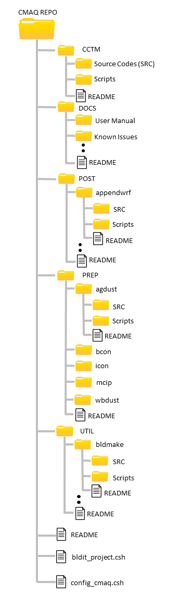

<!-- BEGIN COMMENT -->

[<< Previous Chapter](CMAQ_UG_ch04_model_inputs.md) - [Home](README.md) - [Next Chapter >>](CMAQ_UG_ch06_model_outputs.md)

<!-- END COMMENT -->

# 5. Compile and Run CMAQ

## 5.1 Introduction

During this chapter the user will learn about how to obtain the CMAQ source codes and how to set-up their CMAQ environment to complete a CMAQ simulation. It should be noted that before you can configure your CMAQ Environment, you must have the required hardware, software and data files required described in the chapter "Preparing to run".

## 5.2 Getting the CMAQ Source Code

CMAQ source code can be installed either using git or from tarballs downloaded from the git repository hosted by GitHub. Both options are described here.

### 5.2.1 Git Installation

In the directory where you would like to install CMAQ, issue the following command to clone the official EPA GitHub repository for CMAQv5.3:

`git clone -b 5.3 https://github.com/USEPA/CMAQ CMAQ_REPO`

Using the git clone option, CMAQ will install into the following directories:

```
CMAQ_REPO/CCTM
CMAQ_REPO/PREP
CMAQ_REPO/POST
CMAQ_REPO/UTIL
CMAQ_REPO/DOCS
```

### 5.2.2 Zip file Installation

Zip files of the CMAQ source code are available from the public GitHub repository. Click the button "Clone or download" from https://github.com/USEPA/CMAQ/tree/5.3 and select "Download ZIP" to download a Zip file of the CMAQv5.3 repository. Alternatively, you may download the Zip file from the [EPA CMAQ website](https://www.epa.gov/cmaq/access-cmaq-source-code).

Reference input/output data for testing the installation of the software are available from the CMAS Center; *data are not available through GitHub*. You must register/login to access the source codes and data from the CMAS Center.

In the directory where you would like to install CMAQ, unzip the model distribution file:

`unzip CMAQ-5.3.zip`

The following directories will be created:

```
CMAQ-5.3/CCTM
CMAQ-5.3/PREP
CMAQ-5.3/POST
CMAQ-5.3/UTIL
CMAQ-5.3/DOCS
```

The Git and Zip file installation options will produce slightly different subdirectories on your Linux system. The base installation directory using the git clone command will be `CMAQ_REPO`; the directory from the Zip file will be `CMAQ-5.3`. The subsequent instructions in this guide will be based on the git clone installation. For Zip file installations, replace CMAQ_REPO with CMAQ-v5.3 in the instructions that follow. The differences in the directory names highlights the difference in functionality between the two options. Cloning the repository gives the user access to the full repository and its history, while downloading the Zip file will only give access to version 5.3.

## 5.3 The CMAQ Repository Structure

After downloading the source codes the user is encouraged to look through the repository to familiarize themselves with the structure. A summarized image of the repository is shown below:



In this image it can be seen that there four main sub folders within the CMAQ repository. The first folder, CCTM, houses all the source codes (i.e. fortran/C programs) and scripts that drive the CMAQ Chemistry Transport Model (CCTM). The second folder, DOCS, contains all relevant documentation pertaining to the CMAQ program suite including the User Manual, Release Notes and Known issuse associated with the current release and a Develpers Guide for a general description of CMAQ's open-source collaboration workflow and step-by-step instructions for how to make code contributions through GitHub.

The third folder in the repository is the POST folder which contains several very useful tools for post-processing of the input/output data files. Each tool within the folder comes wth the source code, scripts and a README used to run the tool. A technical description of the tools within this folder can be found in [Chapter 7](CMAQ_UG_ch07_analysis_tools.md).

The fourth folder in the repository is the PREP folder which contains several pre-processing programs that can be run before the CCTM to prepare meteorology, initial conditions and boundary conditions inputs. Similar to the POST tools, documentation on compiling and running the programs is provided within each subfolder under PREP.

The last folder within the repository is the UTIL folder which contains useful utilities relating to the CMAQ program suite. An example is the bldmake utility which is used to compile the source code into executables when you use any of the build scripts in the CMAQ repository. Also included in this repository is a top level README file with an overview of the contents of the release and two additional C-Shell scripts, `bldit_project.csh` and `config_cmaq.csh`.  `bldit_project.csh` allows the user to extract the build and run scripts and compile the model outside of the repository, while `config_cmaq.csh` helps enforce consistent environment setting for the CMAQ project. Both these scripts will be discussed in the following sections.

## 5.4 Building CMAQ Outside of the Repository in a User-Specified Directory

When cloning the repository or unpacking the tar file of the CMAQ distribution, the top-level directory is recognized by the default build and run scripts as `CMAQ_HOME` (formerly M3HOME prior to CMAQv5.2). This directory is an arbitrary base location of the CMAQ installation on your Linux system for a specific application. If the user will build and run CMAQ within the repository folder structure, then `CMAQ_HOME` does not need to be set explicitly in the `bldit_project.csh` script. If, on the other hand, the user wishes to extract the build and run scripts and compile the model outside of the repository, then `CMAQ_HOME` will need to be specified in `bldit_project.csh`. Executing `bldit_project.csh` will automatically perform this extraction and create a CMAQ folder structure under the location now specified by `CMAQ_HOME`. To perform this operation modify the variable `CMAQ_HOME` in the `bldit_project.csh ` script to identify the folder that you would like to install the CMAQ package under. For example:

```
set CMAQ_HOME = /home/username/CMAQ_v5.3
```

Now execute the script:

```
./bldit_project.csh
```

It should be noted that from now on, the other CMAQ directories are referenced relative to CMAQ_HOME and it is where your CMAQ project will be run from. While this directory structure is convenient for the benchmark case and most CMAQ applications, other configurations are possible.

## 5.5 Initialization of CMAQ Environment

Consistency of configuration variables is critical for building CMAQ itself, not just its libraries. Accordingly CMAQ includes the configuration script `config_cmaq.csh` to help enforce consistent environment settings for CMAQ and its associated libraries [Appendix A](CMAQ_UG_appendixA_model_options.md) lists the `config_cmaq.csh` variables defined for the build process and suggests values to which to set those variables.

Note that for multiprocessor applications it is recommended that the Fortran MPI wrapper script mpif90 be specified for the Fortran compiler (myFC). Using this script, instead of a direct call to the Fortran compiler, will ensure that the full suite of MPI components (libraries and include files) for the compiler are included in the parallel build.

Use the following steps to initialize your CMAQ environment:

```
source config_cmaq.csh [compiler]
```

After running the above command it should be noticed now under CMAQ_HOME, the data file directory has been created and serves as a container for the input and output data for the model, and the lib directory contains links to the compiled binary library files required to build the CMAQ executables. The CMAQ scripts use the following environment variables to alias the locations of these directories:


`CMAQ_LIB   = $CMAQ_HOME/lib` (M3LIB before CMAQv5.2)<br>
`CMAQ_DATA  = $CMAQ_HOME/data` (M3DATA before CMAQv5.2)

If you encounter errors about libraries not being found, check the settings of the `config_cmaq.csh` script variables IOAPI, NETCDF, or MPI to ensure that they are correctly point to the locations of these libraries on your Linux system.

Sourcing the `config_cmaq.csh` script only needs to be invoked during a new installation of CMAQ to make sure the links to these libraries are working correctly. For every successive session, links to these libraries will automatically be created when you run any of the build or run scripts.

## 5.6 Compiling CMAQ Chemistry-Transport Model (CCTM)

After all required CMAQ inputs are generated using the preprocessors mentioned above the user is now ready to compile CCTM. CMAQ’s current coding structure is based on a modularity level that distinguishes from each other CCTM’s main driver, science modules, data estimation modules, and control/utility subroutines. Also distinguished from each other are the science models (including submodels for meteorology, emissions, chemistry-transport modeling) and the analysis and visualization subsystems.

**>>COMMENT<<** Right now these modules are NOT all discussed in Chapter 8.  Need to decide what we want to say here.

In CCTM, the process modules that affect the pollutant concentration fields are classified as listed below. Each bullet contains a description of the process followed by module name in parentheses. These modules, with the exception of gencoor, are discussed further later in [Chapter 8](CMAQ_UG_ch08_model_formulation.md).

Science Modules:

-  Horizontal advection (hadv)
-  Vertical advection (vadv)
-  Mass conservation adjustments for advection processes (adjc)
-  Horizontal diffusion (hdiff)
-  Vertical diffusion (vdiff)
-  Gas-phase chemical reaction solver (gas)
-  Aqueous-phase reactions and cloud mixing (cloud)
-  Aerosol dynamics and size distributions (aero)
-  Potential vorticity scaling for stratosphere/troposphere exchange (pv_o3)
-  Meteorology-chemistry coupling (twoway)

Control/Utility Modules:

-  Model data flow and synchronizing of fractional time steps (driver)
-  Model horizontal grid system (grid)
-  Unit conversion (couple)
-  Initialization (init)
-  MPI/parallelization (par)
-  CGRID configuration (cgrds)
-  Process analysis (procan)
-  Species namelist utilities (spcs)
-  Miscellaneous functions (util)

Data Estimation Modules:

-  Deposition velocity estimation (depv)
-  Photolytic rate computation (phot)

line Emissions Modules:

-  Calculate emissions (biogenics, dust, lightning, sea salt, plume rise) in-line (emis)
-  In-line BEIS3 biogenic emissions (biog)
-  In-line plume rise (plrise)

The CMAQ modularity makes it easy to modify or introduce a specific scientific process in CCTM. For example, the gas module contains several options for different gas-phase chemistry solvers that can be used to optimize model performance. Without the modular structure, changes to just one scientific process could entail having to modify source code throughout CCTM, thereby greatly increasing the risk of human error.

In addition to modifying individual scientific processes, the user has the option to specify which scientific processes that the user wants to include when building the model. 

**>>COMMENT<<** I don't think the above statement is correct. You can't omit any scientific process but you can choose a particular option for the scientific process if it offers more than one options.

These scientific options are split into build time options and run time options and can be configured in a multitude of ways. To modify any science options during build time, edit the `bldit_cctm.csh` script. The `bldit_cctm.csh` script also contains other information, such as the option to run in single or multiprocessor mode as well as debug mode. To see a complete list of optional settings reference [Appendix A](CMAQ_UG_appendix_A.md).

Once the `bldit_cctm.csh` script is configured to the user's preference, the user is ready to run the script to build the CCTM executable. To do this run the following commands:

```
cd $CMAQ_HOME/CCTM/scripts
source bldit_cctm.csh [compiler] [version] |& tee build_cctm.log
```

The bldit script invokes the CMAQ utility program [bldmake](../../UTIL/bldmake/README.md), which extracts source code from your CMAQ GIT repository, constructs a Makefile based on your selected options, and compiles the executable automatically.  Following normal termination of the script with the default configuration, the user will notice a BLD directory created. This is the location of the CCTM executable along with the relevant source codes and the Makefile needed to build the model. In this directory a few useful commands can be used to update the executable if any changes are made to the fortran source codes via the MakeFile. For example, if the user wants to recompile the source codes in debug mode instead of re-running the `bldit_cctm.csh` script the user can use the following commands:

```
cd BLD_CCTM_v53_[compiler][version]
make clean
make DEBUG=TRUE
```

In another example, if the user has made any changes to the source codes in the BLD directory and wanted to update the CCTM executable to reflect these changes the uesr can use the following commands:

```
cd BLD_CCTM_v53_[compiler][version]
make clean
make
```

## 5.7 Running CCTM

After setting up the CCTM executable the model is ready to be run. Much like the `bldit_cctm.csh` script, to modify any run time options edit the `run_cctm.csh` script referencing [Appendix A](CMAQ_UG_appendix_A.md) for a complete list of optional settings. After these settings have been configured use the following commands to run the script:


```
cd $CMAQ_HOME/CCTM/scripts
source run_cctm.csh |& tee run_cctm.log
```

To confirm that the model ran to completion view the run.[data].log file. For MPI runs, check each of the CTM_LOG_[ProcessorID]*.log files. A successful run will contain the following line at the bottom of the log(s):

```
>>----> Program completed successfully <----<<
```

Note: If you are running on multiple processors the log file for each processor is also moved from the $CMAQ_HOME/CCTM/scripts directory to the data output directory:

```
$CMAQ_DATA/output_CCTM_v53_[compiler]/[data_name]
```

and these log files have the name convention:

```
CTM_LOG_[ProcessorID].v53_[compiler]_[data_name]/_[RUNDATE].log
```

The output results will have been placed in the directory:

```
$CMAQ_DATA/output_CCTM_v53_[compiler]_[data_name]
```

and can include upto 23 netCDF-type files: ACONC, AOD_DIAG, APMDIAG, APMVIS, B3GTS_S, CGRID, CONC, DEPV, DRYDEP, DUSTEMIS, LTNGCOL, LTNGHRLY, MEDIA_CONC, PHOTDIAG1, PHOTDIAG2, PMDIAG, PMVIS, SOILOUT, SSEMIS, VDIFF, VSED, WETDEP1, and WETDEP2. The in-depth description about each of these files is described in [Chapter 6](CMAQ_UG_ch06_model_outputs.md).

Common errors in a CCTM simulation include the following:

-  Incorrect paths to input files. Look in the CCTM screen output (capture in your log file) for an Error message about an input file   not being found.
-  Incorrect MPI implementation. A series of MPI errors at the end of the log file often indicate that the MPI job was not submitted correctly.

Check the last few lines of the CCTM output log for messages to help diagnose why the simulation did not complete.


<!-- BEGIN COMMENT -->

[<< Previous Chapter](CMAQ_UG_ch04_model_inputs.md) - [Home](README.md) - [Next Chapter >>](CMAQ_UG_ch06_model_outputs.md)<br>
CMAQ User's Guide (c) 2019<br>

<!-- END COMMENT -->
