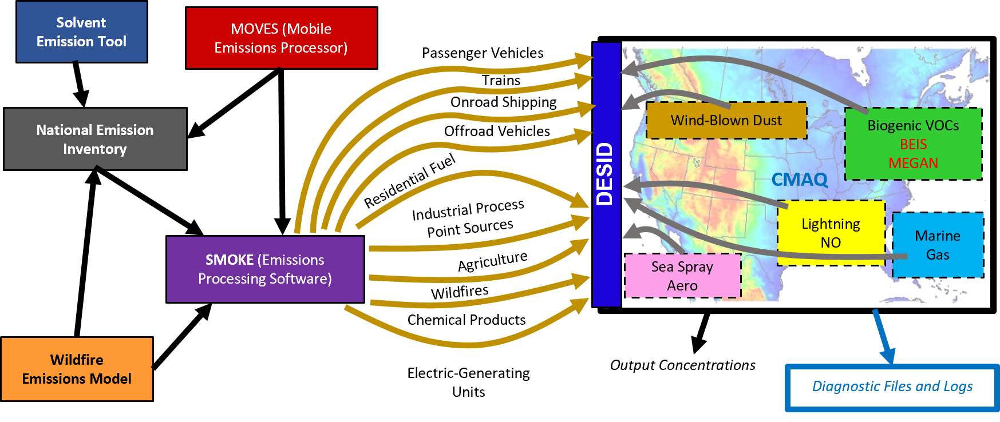
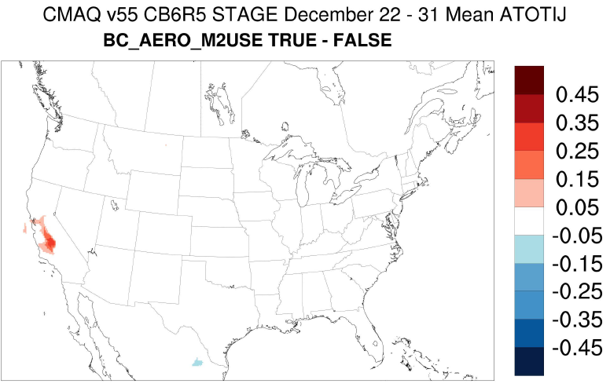
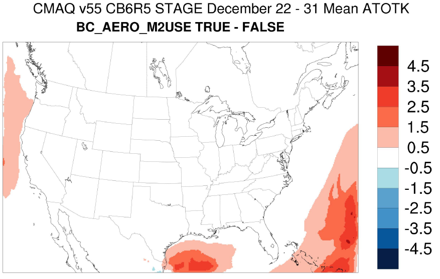

<!-- BEGIN COMMENT -->

[<< Previous Chapter](CMAQ_UG_ch05_running_a_simulation.md) - [Home](README.md) - [Next Chapter >>](CMAQ_UG_ch07_model_outputs.md)

<!-- END COMMENT -->

# 6. Model Configuration Options

<a id=Return_to_Top></a>

<!-- BEGIN COMMENT -->

## Table of Contents:

* [6.1 Introduction](#6.1_Introduction)
* [6.2 Numerical Approach](#6.2_Numerical_Approach)
* [6.3 Grid Configuration](#6.3_Grid_Config)
	* [6.3.1 Horizontal Domains and Lateral Boundaries](#6.3.1_Horizontal_Domains)
	* [6.3.2 Vertical Domains](#6.3.2_Vertical_Domains)
* [6.4 Science Configurations](#6.4_Science_Config)
* [6.5 Advection](#6.5_Advection)
* [6.6 Horizontal Diffusion](#6.6_Horizontal_Diff)
* [6.7 Vertical Diffusion](#6.7_Vertical_Diff)
* [6.8 Dry Deposition/Air-surface exchange](#6.8_Dry_Dep/Air)
	* [6.8.1 Dry Deposition - M3Dry](#6.8.1_Dry_Depm3dry)
	* [6.8.2 Dry Deposition - STAGE](#6.8.2_Dry_STAGE)
	* [6.8.3 Enhanced Ozone Deposition](#6.8.3_Enhanced_Ozone_Deposition)
* [6.9 Emissions](#6.9_Emissions)
	* [6.9.1 Emission Streams](#6.9.1_Emission_Streams)
	* [6.9.2 Online Emission Streams](#6.9.2_Online_Emission)
	* [6.9.3 Emission Compatibility](#6.9.3_Emission_Compatibility)
* [6.10 Gas Phase Chemistry](#6.10_Gas_Phase_Chem)
	* [6.10.1 Gas Phase Chemical Mechanisms](#6.10.1_Gas_Phase_Mech)
	* [6.10.2 Solvers](#6.10.2_Solver)
	* [6.10.3 Photolysis](#6.10.3_Photolysis)
	* [6.10.4 Nitrous Acid (HONO)](#6.10.4_HONO)
	* [6.10.5 CRACMM](#6.10.5_CRACMM)
* [6.11 Aerosol Dynamics and Chemistry](#6.11_Aerosol_Dynamics)
    * [6.11.1 Aerosol Boundary and Initial Conditions](#6.11.1_Aero_BC)
* [6.12 Aqueous Chemistry, Scavenging and Wet Deposition](#6.12_Aqueous_Chemistry)
* [6.13 Potential Vorticity Scaling](#6.13_Potential_Vort)
* [6.14 References](#6.14_References)

<!-- END COMMENT -->

<a id=6.1_Introduction></a>

## 6.1 Introduction

<!-- BEGIN COMMENT -->

[Return to Top](#Return_to_Top)

<!-- END COMMENT -->

As discussed in [Chapter 1](CMAQ_UG_ch01_overview.md), CMAQ is a multipollutant, multiscale air quality modeling system that estimates the transport and chemistry of ozone, PM, toxic airborne pollutants, and acidic and nutrient pollutant species, as well as visibility degradation and deposition totals. CMAQ includes state-of-the-art technical and computational techniques to simulate air quality from urban to global scales. It can model complex atmospheric processes affecting transformation, transport, and deposition of air pollutants using a system architecture that is designed for fast and efficient computing. (See [Appendix D](Appendix/CMAQ_UG_appendixD_parallel_implementation.md) for an introduction on how data-parallelism can be applied in the CMAQ system to increase computational efficiency.) This chapter presents a brief overview of the conceptual formulation of Eulerian air quality modeling and the science features in various components of the Chemistry-Transport Model (CTM) component of CMAQ, CCTM. 

<a id=6.2_Numerical_Approach></a>

## 6.2 Numerical Approach

<!-- BEGIN COMMENT -->

[Return to Top](#Return_to_Top)

<!-- END COMMENT -->

The theoretical basis for CMAQ’s formulation is the conservation of mass for atmospheric trace species. The general form of a chemical species equation derives from this conservation, so that changes in atmospheric concentrations of a species, C<sub>i</sub>, can mathematically be represented as

  

where the terms on the right-hand side of the equation represent the rate of change in C<sub>i</sub> due to advection, diffusion, cloud processes (mixing, scavenging, and aqueous-phase chemistry), dry deposition, and aerosol processes (phase partitioning, and aerosol dynamics). R<sub>gi</sub> represents the rate of change due to gas and heterogeneous chemical reactions, while E<sub>i</sub> is the emission rate for that species. The mass conservation for trace species and the aerosol dynamic equations for the various modes of the particulate size distribution in CMAQ are further formulated in generalized coordinates, where in the same formulation allows the model to accommodate the commonly used horizontal map projections (i.e., Lambert Conformal, Polar Stereographic, and Mercator) as well as different vertical coordinates (see Chapters 5 and 6 in Byun and Ching, 1999). The governing equation for CMAQ is numerically solved using the time-splitting or process splitting approach wherein each process equation is solved sequentially, typically with the process with the largest time-scale solved first. 

<a id=6.3_Grid_Config></a>

## 6.3 Grid Configuration

<!-- BEGIN COMMENT -->

[Return to Top](#Return_to_Top)

<!-- END COMMENT -->

CMAQ is a three-dimensional Eulerian air quality model. To solve the governing partial differential equations, the modeling domain (that is, the volume of the atmosphere over a geographic region of interest) is discretized with three-dimensional cells. The grid cells and lateral boundaries of the domain must be rigorously and consistently defined across the scientific components of the model, including chemistry, emissions, meteorology, and other peripheral scientific processors. In other words, all components of the CMAQ system must use the same map projections and horizontal grid spacing to maintain scientific consistency across the modeling domain. The number of grid cells in the west-east dimension is typically counted in "columns" or "NCOLS", and the number of grid cells in the south-north dimension is typically counted in "rows" or "NROWS". The vertical discretization is typically counted in "layers" or "NLAYS".

CMAQ uses a generalized coordinate system to map the physical space to the computational space; see Chapter 6 of Byun and Ching (1999). The generalized coordinates enable CMAQ to maintain mass consistency under different horizontal map projections (such as Lambert Conformal, Polar Stereographic, and Mercator) and under different vertical coordinate systems (such as terrain-following "sigma", height, and hybrid sigma-pressure). CMAQ supports modeling domains comprised of rectilinear cells, where the length of each _side_ of the cells in projected space is the same (such as &#916;x = &#916;y = 12&nbsp;km). By contrast, the vertical grid is generally irregular, such that the modeling layers are thinnest near the ground. The absolute dimensions of the horizontal grid (that is, the west-east and south-north extents of the computational domain) can differ.

In general, the characteristics of the CMAQ modeling domain (including the map projection, horizontal grid spacing, vertical grid type, and maximum areal coverage) are inherited from the meteorological model. Beginning with CMAQv5.3 and MCIPv5.0, the public release of CMAQ is only configured for meteorological data from the Weather Research and Forecasting (WRF) model. However, MCIP (which translates and prepares meteorological model data for CMAQ) can be expanded to process data from other meteorological models to be used within the CCTM.

<a id=6.3.1_Horizontal_Domains></a>

### 6.3.1 Horizontal Domains and Lateral Boundaries

<!-- BEGIN COMMENT -->

[Return to Top](#Return_to_Top)

<!-- END COMMENT -->

After determining the horizontal and vertical extent of the domain of interest, the meteorological model must be run for a horizontal domain slightly larger than the CMAQ domain. A larger meteorology domain is required so the boundary conditions in the WRF simulation will fall outside the CMAQ simulation domain. Because there is a blend of larger-scale driving data and scale-specific physics within the WRF lateral boundaries, these data are inappropriate to use in the CCTM, so they are usually removed in MCIP. The lateral boundaries for WRF are typically a "picture frame" of the outermost 5 cells of the WRF domain. These lateral boundaries are used to blend the influence of larger-scale meteorological driving data with the WRF simulation. In WRF, the lateral boundaries are calculated and included as part of the modeling domain. By contrast, the lateral boundaries for the CCTM are external to the modeling domain.

MCIP can be used to extract a subset of the WRF modeling domain (that is, a "window") to be used for the CCTM modeling domain. The window can be any rectangular area within the meteorological model's lateral boundaries, provided it contains a nominally large enough areal coverage.

Horizontal grids specifications for CMAQ are contained in the grid definition file (GRIDDESC), which is output by MCIP and can be edited by the user.  Further details on grid configuration are available in the [README.md][link_6.1] file in the PREP/mcip folder. If several domains have been used within a group, the horizontal domain for a given CMAQ run can be defined at runtime by setting the GRIDDESC and GRID_NAME environment variables to point to an existing grid definition file and to one of the grids defined in the file, respectively. 

<a id=6.3.2_Vertical_Domains></a>

### 6.3.2 Vertical Domains

<!-- BEGIN COMMENT -->

[Return to Top](#Return_to_Top)

<!-- END COMMENT -->

CMAQ can support multiple vertical coordinate systems via the generalized coordinate. Most of the grid transformation to maintain mass consistency in CMAQ occurs through the mathematical term, Jacobian; see Chapter 6 of Byun and Ching (1999) and Otte and Pleim (2010). In the CMAQ system, the Jacobian is calculated in MCIP. The vertical processes in the CCTM (such as mixing within the planetary boundary layer and convective mixing) must also be cast in a flexible coordinate system.

There are two options for vertical coordinates in the WRF model: terrain-following ("sigma"), and hybrid sigma-pressure. In both vertical coordinate systems, there is a "model top" employed (often called PTOP, or pressure at the top of the model) to limit the vertical extent of the modeling domain. The model top is usually set within the lower stratosphere (for example, 50&nbsp;hPa), but can be higher for some modeling applications. The sigma coordinate system allows the influence of the terrain to gradually diminish with height toward the model top. The sigma coordinate (technically called "eta" in the WRF system) has been used since WRF was initially released to the public in the late 1990s. The hybrid sigma-pressure coordinate was introduced in WRFv3.9 (released in 2017), and it uses a terrain-following coordinate in the lower part of the atmosphere which transitions to a constant pressure coordinate in the upper part of the atmosphere. The hybrid sigma-pressure coordinate is often used to reduce the presence of gravity waves in the model in steep and complex terrain, and to enable a higher model top to be used.

Beginning with CMAQv5.3 and MCIPv5.0, both the sigma and the hybrid sigma-pressure coordinates are supported. MCIPv5.0 was modified to calculate the Jacobian from the hybrid coordinate, and CMAQv5.3 has some scientific processes recast more generically so that both the sigma coordinate and the hybrid coordinate can be properly represented. CMAQ prior to v5.3 (and MCIP prior to v5.0) is not compatible with the hybrid coordinate system introduced in WRF 3.9.  If the hybrid coordinate is used in WRF (versions 3.9 or later), MCIPv5.0 must be used with CMAQv5.3.  See [Appendix E](Appendix/CMAQ_UG_appendixE_configuring_WRF.md) for notes on configuring WRF4.0 and later for use with CMAQv5.3. 

<a id=6.4_Science_Config></a>

## 6.4 Science Configurations

<!-- BEGIN COMMENT -->

[Return to Top](#Return_to_Top)

<!-- END COMMENT -->

CCTM contains several science configurations for simulating transport, chemistry, and deposition. All the science configuration options in CCTM, such as the chemical mechanism to be used, are set when building the executable. The model grid and vertical layer structure for CCTM are set at execution. The important distinction between selecting the science configuration and the model grid/layer configuration is that CCTM does not need to be recompiled when changing model grids/layers but does need to be recompiled when new science options are invoked.  The following sections describe how these science options can be utilized by configuring the `bldit_cctm.csh` and `run_cctm.csh` scripts.  For the remainder of this chapter these files will be referred to as simply BuildScript and RunScript.

<a id=6.5_Advection></a>

## 6.5 Advection

<!-- BEGIN COMMENT -->

[Return to Top](#Return_to_Top)

<!-- END COMMENT -->

In CCTM, the 3-dimensional transport by mean winds (or advection) is numerically represented by sequentially solving locally-one dimensional equations for the two horizontal and vertical components. CMAQ uses the piecewise parabolic method (PPM) (Colella and Woodward, 1984) for representing tracer advection in each of the three directions. This algorithm is based on the finite-volume sub-grid definition of the advected scalar. In PPM, the sub-grid distribution is described by a parabola in each grid interval. PPM is a monotonic and positive-definite scheme. Positive-definite schemes maintain the sign of input values, which in this case means that positive concentrations will remain positive and cannot become negative.

Mass consistency is a key desired attribute in tracer advection. Data consistency is maintained for air quality simulations by using dynamically and thermodynamically consistent meteorology data from WRF/MCIP. Mass inconsistencies can nevertheless arise either using different grid configurations (horizontal or vertical) or due to differing numerical advection schemes between the driving meteorological model and the CCTM. While inconsistencies due to the former can be eliminated through use of the same grid configurations (thus, layer collapsing is not recommended), some inconsistencies can still remain due to differing numerical representations for satisfying the mass-continuity equation between the driving meteorological model and the CCTM. These mass-inconsistencies manifest as first order terms (whose magnitude can often be comparable to tracer lifetimes if continuity is not satisfied with high accuracy) that can artificially produce or destroy mass during 3D tracer advection (e.g., Mathur and Peters, 1990).

CMAQ has two options that minimize mass consistency errors in tracer advection. In one scheme (designated “local_cons” in the BuildScript), first implemented in CMAQv4.5 and later improved for CMAQv4.7.1, CMAQ  advects air density and re-diagnoses the vertical velocity field according to the layer-by-layer mass continuity equation which guarantees that the CCTM advected density matches that derived from the driving meteorological inputs (e.g., Odman and Russell, 2000). Briefly, x- and y-advection are first performed (the order of these is reversed every step to minimize aliasing errors) to yield intermediate tracer and density fields. The intermediate density field is then subject to vertical advection with the PPM scheme such that it yields the WRF-derived density field at the end of the advection time-step. This scheme results in an estimated vertical velocity field that is minimally adjusted relative to the WRF derived field in the lower model layers but yields strict mass-consistent tracer advection in CMAQ.  A drawback to this approach is that erroneous noise in the diagnosed vertical velocity field accumulates toward the top of the model with non-zero velocity and mass flux across the top boundary.  The noise in the vertical velocity field causes excessive diffusion in upper layers.  Therefore, since CMAQv5.0, a scheme designated “wrf_cons”, that closely follows the vertical velocity calculation in WRF has been available.  This scheme solves the vertically integrated mass continuity equation such that the column integrated horizontal mass divergence is balanced by the net change in column mass (Skamarock et al, 2019).  An advantage of this scheme is that the diagnosed vertical velocity agrees more closely with the WRF vertical velocity field with zero velocity and mass flux across the upper model boundary.  Thus, the spurious velocity noise and excessive diffusion in the upper layer are eliminated.  The main drawback of this scheme is that mass conservation is not guaranteed so density must be updated from the meteorology inputs every timestep.  

The **“WRF_CONS”** option is the recommended configuration starting CMAQv5.3.

To invoke the "WRF_CONS" option in 3-D advection, set the following in the BuildScript within the CCTM Science Modules section:

```
set ModAdv = wrf_cons
```
To invoke the "LOCAL_CONS" option in 3-D advection, set the following in the BuildScript within the CCTM Science Modules section: 
```
set ModAdv = local_cons
```
***Note: The local_cons option is a legacy extension and can cause unexpected results when used.***

<a id=6.6_Horizontal_Diff></a>

## 6.6 Horizontal Diffusion

<!-- BEGIN COMMENT -->

[Return to Top](#Return_to_Top)

<!-- END COMMENT -->

The lack of adequate turbulence measurements has limited the development of robust model parameterizations for horizontal turbulent diffusion, a scale and resolution dependent problem. With the advent of very accurate minimally diffusive numerical advection schemes and need for high resolution modeling, horizontal diffusion algorithms are needed to balance the numerical diffusion inherent in advection schemes relative to the physical horizontal diffusion in the atmosphere. Currently in CMAQ, horizontal diffusion fluxes for transported pollutants are parameterized using eddy diffusion theory. The horizontal diffusivity coefficients are in turn formulated using the approach of Smagorinsky (1963) which accounts for local horizontal wind deformation and are also scaled to the horizontal grid size.

<a id=6.7_Vertical_Diff></a>

## 6.7 Vertical Diffusion

<!-- BEGIN COMMENT -->

[Return to Top](#Return_to_Top)

<!-- END COMMENT -->

The vertical diffusion model in CMAQ is the Asymmetrical Convective Model Version 2 (ACM2) (Pleim 2007a,b).  The ACM2 is a combined local and non-local closure PBL scheme that is implemented in CMAQ and WRF for consistent PBL transport of meteorology and chemistry.  Thus, it is recommended that the ACM2 option in WRF or MPAS also be used when preparing meteorology for CMAQ.  

There are two options for the ACM2 model in the BuildScript that are compatible with either the M3Dry or STAGE dry deposition options.  

When running m3dry dry deposition:

```
Set ModVdiff   = acm2_m3dry
```

When running STAGE dry deposition:

```
Set ModVdiff   = acm2_stage
```
<a id=6.8_Dry_Dep/Air></a>

## 6.8 Dry Deposition/Air-surface exchange

<!-- BEGIN COMMENT -->

[Return to Top](#Return_to_Top)

<!-- END COMMENT -->

Exchange of pollutants between the atmosphere and Earth's surface can be modeled as unidirectional exchange, commonly referred to as dry deposition, or bidirectional exchange where the direction of the flux depends on the relative concentration of the pollutant in the atmosphere and the surface (e.g. soil, plant stomata).  If the concentration in the atmosphere is greater than the concentration at the surface, then deposition occurs. If the concentration in the atmosphere is lower than the concentration at the surface, emission occurs.  CMAQ contains algorithms for modeling either of these situations.  The rate of exchange is controlled by surface characteristics such as vegetation type, leaf area index, and surface roughness as well as meteorological influences such as temperature, radiation, and surface wetness which are provided to CMAQ from the land surface model (LSM) in the driving meteorological model.

Currently, most chemicals in CMAQ are modeled as depositing only.  However, ammonia and mercury can be both emitted from the surface and deposited and are therefore modeled as bidirectional. Estimates of the soil and stomatal compensation concentrations needed to compute the bidirectional ammonia flux in CMAQ are derived from input provided by the Environmental Policy Integrated Climate (EPIC) agricultural ecosystem model that is executed using the Fertilizer Emission Scenario Tool for CMAQ (FEST-C, https://www.cmascenter.org/fest-c ) (Ran et al., 2011; Cooter et al., 2012). Information for surface concentrations of mercury are initially specified using land use specific tabular data and then by modeling the accumulation, transformation and evasion of mercury in the surface media (Bash 2010).

Starting with CMAQ v5.3, there are two options for calculating dry deposition/surface exchange which are invoked in the BuildScript as:

```
Set DepMod   = m3dry
```

or:

```
Set DepMod   = stage
```
Deetails of each module are provided in the sections below.

<a id=6.8.1_Dry_Depm3dry></a>


### 6.8.1 Dry Deposition - M3Dry

<!-- BEGIN COMMENT -->

[Return to Top](#Return_to_Top)

<!-- END COMMENT -->

The M3Dry option for dry deposition and ammonia bidirectional surface flux in CMAQv5.5 is the latest update of the dry deposition model that has been in CMAQ since its initial release and was originally based on the dry deposition model developed for the Acid Deposition and Oxidant Model (ADOM) (Pleim et al., 1984).  Changes from CMAQv5.4 involve only minor bug fixes.  Dry deposition is computed by electrical resistance analogy where concentration gradients are analogous to voltage, flux is analogous to current, and deposition resistance is analogous to electrical resistance (Pleim and Ran, 2011). In M3Dry, several key resistances, such as aerodynamic resistance and bulk stomatal resistance, and other related parameters, such as LAI, vegetation fraction, roughness length, friction velocity etc., are expected to be provided from the meteorological inputs. Use of common model elements and parameters with the land surface model in the meteorology model ensures consistency between chemical surface fluxes and meteorological surface fluxes (moisture, heat, momentum). While the M3Dry dry deposition model was designed to be used with the PX LSM option in WRF, any LSM can be used if the necessary parameters are output and then provided for input into CMAQ. It features consideration of subgrid land-use fractions through aggregation of key model parameters, such as LAI, veg fraction, roughness length and minimum stomatal conductance, to the grid cell level.  Dry deposition velocities and fluxes by landuse category for each grid cell can be computed and output for 13 major gas phase species by a postprocessor available on request.

Upgrades for version 5.3 include larger surface resistances for deposition to snow and ice and reduced resistance for deposition to bare ground for ozone with dependence on surface soil moisture content. The aerosol deposition has also been revised including a new dependence on LAI. The ammonia bidirectional surface flux from croplands has been substantially revised from earlier versions. The new version has close linkages with the EPIC agricultural ecosystem model. Daily values of all soil parameters needed to compute the available soil ammonia concentrations (soil ammonia content, soil moisture, soil texture parameters, soil pH, and Cation Exchange Capacity (CEC)) for each of 21 agricultural production types that are either rainfed or irrigated (42 types total) are input to CMAQ. Soil ammonia concentrations and soil pH are combined to derive the soil compensation concentration for the bidirectional flux calculation (Pleim et al., 2019).

The main upgrade for version 5.4 is the replacement of the aerosol dry deposition model with a new version that compares better to size-resolved observations, especially in forests, than the previous version and other models used in AQ modeling (Pleim et al 2022). The key innovations are dependence on leaf area index (LAI) for the vegetated part of the grid cell and two terms for inertial impaction for both macroscale obstacles (e.g., leaves and needles) and microscale obstacles (e.g., leaf hairs and microscale ridges). When the modally integrated form is applied in CMAQ, the accumulation mode deposition velocities increase by more than an order of magnitude in highly forested areas resulting in lower concentrations of PM2.5.


<a id=6.8.2_Dry_STAGE></a>

### 6.8.2 Dry Depostion - STAGE

<!-- BEGIN COMMENT -->

[Return to Top](#Return_to_Top)

<!-- END COMMENT -->

In CMAQ v5.3., a new tiled, land use specific, dry deposition scheme, the Surface Tiled Aerosol and Gaseous Exchange (STAGE), option has been developed to better estimate atmospheric deposition for terrestrial and aquatic ecosystem health and applications to evaluate the impact of dry deposition on ambient air quality. This new scheme explicitly supports Weather Research and Forecasting (WRF) simulations with a variety of land surface schemes (Noah, Pleim-Xiu, etc). The model resistance framework, [Figure 6-1](#Figure6-1), parameterizes air-surface exchange as a gradient process and is used for both bidirectional exchange and dry deposition following the widely used resistance model of Nemitz et al. (2001). Grid scale fluxes are estimated from sub-grid cell land use specific fluxes and are area weighted to the grid cell totals which are then output in the standard dry deposition file with positive values indicating deposition and negative values indicating evasion. 
The model resistances are largely estimated following Massad et al. (2010) with the following exceptions.  Deposition to wetted surfaces considers the bulk accommodation coefficient, following Fahey et al. (2017), and can be a limiting factor for highly soluble compounds.  The in-canopy resistance is derived using the canopy momentum attenuation parameterization from Yi (2008). Aerosol dry deposition includes parameterizations for deposition to water or bare ground surfaces (Giorgi 1986), and vegetated surfaces (Slinn 1982), using the characteristic leaf radius parameterization of Zhang et al. (2001). 
The ammonia bidirectional option follows the ammonia specific parameterizations of Massad et al. (2010). Mercury bidirectional exchange is also available and follows the parameterization of Bash (2010). In this modeling framework, it is possible to consider bidirectional exchange for any species by providing a parametrization or constant that sets the stomatal, cuticular, soil and/or water compensation point as a value greater than 0. The ammonia bidirectional exchange model has been found to capture the seasonality of satellite and in-situ observations ([Wang et al., 2020](https://doi.org/10.1029/2020GL090579)). In CMAQv5.4, the non-agriculture NH<sub>3</sub> emission potentials have been revised following recent observations ([Walker et al., 2022](https://doi.org/10.5194/bg-2022-133)).

STAGE ammonia bidirectional calculations rely on input files generated by EPIC and, except on the first simulation day, the results of the previous day's STAGE soil NH4 chemistry calculations that are stored in the previous day's `CCTM_MEDIA_CONC` output file. The following considerations apply when using the STAGE ammonia bidirectional module:

1.	Ammonia bidirectional exchange in STAGE was developed to track the mass balance of the soil NH4 because the CMAQ-STAGE estimate of NH3 evasion differs from EPIC. The discrepancy between CMAQ-STAGE simulations of the soil NH4 in the MEDIA_CONC and EPIC input files will diverge over time due to the differences that the parameterization of model evasion have on the soil mass balance. 
2.	Initialization of the bidirectional exchange soil NH4 on different dates will likely result in persistent model differences that can persist for months depending on the time of the initialization and environmental conditions.  
3.	When performing multiyear CMAQ simulations using the ammonia bidirectional flux module, Jan. 1st of each simulation year should be initialized solely from EPIC files (i.e. not use the December 31 `CCTM_MEDIA_CONC` file from the previous year) as current versions of EPIC used in FEST-C do not reasonably simulate multiyear runs and simulations are conducted for the calendar year. 


<a id=Figure6-1></a>


  
**Figure 6-1. STAGE resistance diagram (modified from Nemitz et al., 2001) with a table of variables descriptions.**

STAGE options in the RunScript:
```
setenv CTM_MOSAIC Y
```
Sets output for land use specific dry deposition and dry deposition velocities. Note: To retrieve the grid cell average from these files it should be area weighted by the land use fraction by summing the product of the land use fraction and the dry deposition/deposition velocity for each grid cell. 

```
setenv PX_VERSION   Y
setenv CLM_VERSION Y
setenv NOAH_VERSION Y 
```
Sets the correct soil hydrological properties and soil layer information needed to calculate soil NO emissions, NH<sub>3</sub> bidirectional exchange and O<sub>3</sub> deposition. These options are currently based on WRF 3.8.1 and earlier values for PX and CLM and WRF 4.0 for NOAH. If the land surface model is run with another look up table or parameterization, soil moisture will be constrained between saturation and residual water content from the parameterization in CMAQ. This is also the case for the m3dry deposition option, soil NO emissions, and windblown dust. 

In CMAQ v5.4 and beyond, the user can select one of three different aerosol deposition parameters within the STAGE deposition option. 

```
setenv CTM_STAGE_P22 N       
setenv CTM_STAGE_E20 Y       
setenv CTM_STAGE_S22 N       
```
CTM_STAGE_P22 is a tiled/land use specific [Pleim et al. (2022)](https://doi.org/10.1002/essoar.10510541.1) aerosol deposition option. CTM_STAGE_E20 is the tiled implementation of the [Emerson et al. (2020)](https://doi.org/10.1073/pnas.2014761117) aerosol deposition model. CTM_STAGE_S22 is the tiled version of [Shu et al. (2022)](https://doi.org/10.1016/j.atmosenv.2022.119343) aerosol deposition model (the same as the STAGE parameterization in CMAQ v5.3 STAGE). CTM_STAGE_E20 is the default option and will be used in model simulation unless one of the other options is specified. In v5.4, the user can modify land use and chemical species dependent variables used by STAGE by editing the [STAGE Control Namelist](CMAQ_UG_ch04_model_inputs.md#stagectrl_nml) to update model parameters without the need to recompile.

<a id=6.8.3_Enhanced_Ozone_Deposition></a>

### 6.8.3 Enhanced Ozone Deposition

The interaction of iodide in seawater with atmospheric ozone can enhance ozone deposition over seawater. CMAQ contains a scheme for enhanced ozone deposition over seawater ([Sarwar et al,. 2016](https://doi.org/10.1016/j.atmosenv.2016.06.072)). If the CTM_OCEAN_CHEM flag is set to N, then the model will not calculate the enhanced ozone deposition over seawater.  

<a id=6.9_Emissions></a>
## 6.9 Emissions

<!-- BEGIN COMMENT -->

[Return to Top](#Return_to_Top)

<!-- END COMMENT -->

CMAQ introduces emissions of trace gases and aerosols from a variety of important sources (e.g. electric generating utilities, vehicles, fires, trees, dust storms, farms, etc.). Some emissions are applied in the surface layer of the model grid, while others are applied at higher altitudes if, for example, they originate from point source like an elevated stack, or a large forest fire. Many sources that are related to local meteorology may be calculated online in CMAQ. However, most sources, especially anthropogenic ones, are preprocessed using software like the Sparse Matrix Operator Kerner Emissions (SMOKE) Modeling System. Once these external tools have calculated the offline emissions, they may merge them into larger aggregated files. We refer to emissions that are either calculated online or read into CMAQ from a file as emission "streams".

Because CMAQ represents both primary and secondary pollutants, emissions are processed for a subset of the species CMAQ treats. The emissions chemical speciation must be compatible with the chemical mechanism chosen for CMAQ (e.g. cb6r5_ae7_aq) because different mechanisms represent large compounds like functionalized hydrocarbons with different surrogates. The emissions mapping is carried out via the Detailed Emission Scaling, Isolation, and Diagnostic (DESID) Module.  
[Figure 6-2](#Figure6-2) illustrates the combination of data flowing from multiple types of emission streams into the CMAQ model system through the DESID interface. 
Mapping rules are prescribed in the DESID Chemical Mapping Control File, and default versions of this namelist file are provided for every chemical mechanism. 
If the user does not provide a Chemical Mapping Control File or the path to the file in the RunScript is incorrect, then zero emissions will be assumed for every stream. However, the configuration of various other scientific options in the RunScript  (e.g. correcting for biderectional emission of fertilizer emissions) may conspire to create non-physical values for the emission rates. If the user would like all emissions set to 0, it is recommended that they use the syntax outlined in Appendix B and the DESID tutorial to do so.  

<a id=Figure6-2></a>  
  
**Figure 6-2. Offline and online emission streams pass pollutant emission rates to the core CMAQ model through the DESID interface.**

CMAQv5.3 introduced DESID so that the process of mapping emissions species to CMAQ species would be more transparent and flexible (see [Appendix B: Emission Control with DESID](Appendix/CMAQ_UG_appendixB_emissions_control.md)). In fact, users can now toggle, modify, and augment emissions from all available streams in order to confidently customize their simulations to the science or policy questions they are asking CMAQ to help answer. For tutorials covering specific tasks, please see the [DESID tutorial page](Tutorials/CMAQ_UG_tutorial_emissions.md).  


<a id=6.9.1_Emission_Streams></a>

### 6.9.1 Emission Streams

<!-- BEGIN COMMENT -->

[Return to Top](#Return_to_Top)

<!-- END COMMENT -->

Depending on the nature of any stream and the information used to quantify its emissions, it may be treated as one of three types:

#### Online Streams:
CMAQ will calculate the emission rates from this source using information about local meteorology, land characteristics, etc. The streams that can be run online in CMAQ are: [biogenics (BEIS/MEGAN)](#BEIS/MEGAN),[ windblown dust](#Wind_Blown_Dust), [sea spray](#Sea_Spray), marine gas, and [lightning NO](#Lightning_NO).

#### Gridded Stream (offline):
CMAQ will read emission rates from an input file, which is organized into an array that is identical in shape to the CMAQ model grid. Typically, these rates are stored at hourly time points and are then interpolated within CMAQ to each time step. These files may be 2D to represent just the surface layer emissions or they may be 3D. If 3D, the file may have the same number or fewer number of layers as the CMAQ grid. Gridded emissions may be merged into a single stream or kept as separate types. Some common examples of Gridded emissions include:

- Mobile sources such as passenger vehicles, trains, ships, scooters, etc.
- Low-level point source emissions that are not large enough to be treated individually
- Residential heating
- Consumer product use (e.g. adhesives, personal care products, pesticides, etc.)
- Agricultural (e.g. burning, dust, animal waste, etc.)
- Road, Construction and mechanically generated dust
- Biogenic VOCs (if not calculated online with BEIS or MEGAN)

Users add Gridded emissions to a simulation via the RunScript. First the variable N_EMIS_GR must be set to the number of Gridded Streams to be used:

```
setenv N_EMIS_GR 3
```

The RunScript must also specify the location of the input files using three-digit suffixes for the stream number:

```
setenv GR_EMIS_001 /home/user/path-to-file/emiss_stream_1_${DATE}.nc
```


the short-name label to be used to refer to the Stream in logfiles:

```
setenv GR_EMIS_LAB_001 MOBILE
```

and if the stream contains data in a representative day fashion (i.e. data from 2016 maybe used to model emissions in 2019 since the diurnal pattern maybe the same for that stream): 

```
setenv GR_EM_SYM_DATE_001 F
```

Note: if GR_EM_SYM_DATE_XXX is not set, the default value for this variable is false. However, this default value can be changed using the environment variable EM_SYM_DATE like so: 
```
setenv EM_SYM_DATE T #This changes the internal default of GR_EM_SYM_DATE, if not set, to true. [Default value: F]
```
Users should be careful with this variable, as it changes the default value for all gridded streams. If both EM_SYM_DATE and GR_EM_SYM_DATE_XXX are present, GR_EM_SYM_DATE_XXX takes precedent for that individual stream. Example: if GR_EM_SYM_DATE_001 is F and EM_SYM_DATE is T, the emissions module will see that stream 001 is not a symbolic data type, however, stream 002, if not set, will indicate that stream 002 is of symblic data type.

If N_EMIS_GR is set 0, then CMAQ will run with no Gridded emissions even if the values for GR_EMIS_XXX and GR_EMIS_LAB_XXX are all set.

#### Point Stream (offline):
For these streams, emission rates and stack characteristics are provided for many individual sources on the same offline file. CMAQ uses the stack information to calculate important quantities online like the injection height which is influenced by local meteorology. A specific latitude/longitude pair is given for each source to locate it in the CMAQ grid. Sources outside the CMAQ grid domain are ignored by CMAQ; thus the same files may be used for a large domain and a nest within that domain. Some common examples of Point emissions include:

- Stacks (electric generation units, industrial sources, manufacturing, etc.)
- Forest fires
- Large prescribed fire events  

Users add Point emission streams to a simulation via the RunScript. First the variable N_EMIS_PT must be set to the number of Point Streams to be used:

```
setenv N_EMIS_PT 3
```
The RunScript must also specify the location of the input files using three-digit suffixes for the stream number:

```
setenv STK_EMIS_002 /home/user/path-to-file/point_emiss_stream_2_${DATE}.nc
```

The location to the "stack file" with static information about the properties of each source on the stream:

```
setenv STK_GRPS_002 /home/user/path-to-file/point_stack_groups_2.nc
```


the short-name label to be used to refer to the Stream in logfiles:

```
setenv STK_EMIS_LAB_002 POINT_FIRES
```

and if the stream contains data in a representative day fashion (i.e. data from 2016 maybe used to model emissions in 2019 since the diurnal pattern maybe the same for that stream): 

```
setenv STK_EM_SYM_DATE_002 F
```

Note: if STK_EM_SYM_DATE_XXX is not set, the default value for this variable is false. However, this default value can be changed using the environment variable EM_SYM_DATE like so: 
```
setenv EM_SYM_DATE T #This changes the internal default of STK_EM_SYM_DATE, if not set, to true. [Default value: F]
```
Users should be careful with this variable, as it changes the default value for all stack streams. If both EM_SYM_DATE and STK_EM_SYM_DATE_XXX are present, STK_EM_SYM_DATE_XXX takes precedent for that individual stream. Example: if STK_EM_SYM_DATE_001 is F and EM_SYM_DATE is T, the emissions module will see that stream 001 is not a symbolic data type, however, stream 002, if not set, will indicate that stream 002 is of symblic data type.

If N_EMIS_PT is set 0, then CMAQ will run with no Point emission streams even if the values for STK_EMIS_XXX, STK_GRPS_XXX and STK_EMIS_LAB_XXX are all set.

*Plume Rise* - Plume rise can be calculated online within CMAQ using the Briggs solution as it is implemented in SMOKE and documented in the SMOKE user guide [Chapter 4.3](https://www.cmascenter.org/smoke/documentation/5.0/html/ch04s03.html#sect_programs_elevpoint_briggs). It is required that emission files have been processed to include the necessary stack parameters (e.g. exit velocity, diameter, stack gas temperature, stack height, etc.) for anthropogenic point sources. Wildland fires require heat flux and are to estimate plume rise with Briggs using [the Pouliot-Godowitch method](https://www.cmascenter.org/smoke/documentation/5.0/html/ch04s06.html#sect_programs_laypoint_plume_rise_fires).

<a id=6.9.2_Online_Emission></a>

### 6.9.2 Online Emission Streams

<!-- BEGIN COMMENT -->

[Return to Top](#Return_to_Top)

<!-- END COMMENT -->

<a id=BEIS/MEGAN></a>
#### Biogenics
To calculate online biogenic emissions, CMAQ uses the [Biogenic Emission Inventory System (BEIS)](https://www.epa.gov/air-emissions-modeling/biogenic-emission-inventory-system-beis) and the [Model of Emissions of Gases and Aerosols from Nature (MEGAN)](https://bai.ess.uci.edu/megan). Before using the CMAQ online version of BEIS or MEGAN users should confirm that biogenic emissions are not already included in their emissions files from SMOKE to avoid double counting biogenic emissions.

#### BEIS

BEIS calculates emissions resulting from biological activity from land-based vegetative species as well as nitric oxide emissions produced by microbial activity from certain soil types. This biogenic model is based on the same model that is included in SMOKE. User documentation for BEIS can be found in [Chapter 4.19 of the SMOKE manual](https://www.cmascenter.org/smoke/documentation/5.0/html/). 

Speciation of biogenic emissions for BEIS is controlled by gspro_biogenics.txt under CCTM/src/biog/beis.

Running CMAQ with BEIS is controlled by the following RunScript flag:


```
setenv CTM_BIOGEMIS_BE Y
```

Running CMAQ with online BEIS requires a user-supplied, gridded normalized biogenic emissions input netCDF file, B3GRD.  This file is created with the [normbeis4](https://www.cmascenter.org/smoke/documentation/5.0/html/ch04s13.html) program in SMOKE prior to running the online biogenic option in CMAQ and contains winter and summer normalized emissions and Leaf Area Indices. [Starting with CMAQ v54](../Release_Notes/CMAQ-Release-Notes:-Emissions-Updates:-BEIS-Biogenic-Emissions.md#beis-updates), the selection of summer vs. winter normalized emission factors when using the BEIS online biogenic emission option in CMAQ is based on the 1 meter soil temperature following the WRF PX LSM representation of seasonality. The location of the B3GRD file is set in the RunScript:

```
setenv B3GRD /home/user/path-to-file/b3grd.nc
```

Additionally, when using the online biogenic option, the user must point to the SOILOUT file from one day’s simulation as the SOILINP file for the next day. The user must also decide whether to write over SOILOUT files from previous days or create a uniquely named SOILOUT file for each day. The latter approach is recommended if the user wishes to retain the capability to restart simulations in the middle of a sequence of simulations.

Set the NEW_START variable in the RunScript to TRUE if this is the first time that biogenic NO soil emissions will be calculated. If there is a previously created file, set to FALSE.  When NEW_START is set to FALSE, the directory path and file name of biogenic NO soil emissions file must be set in the RunScript:

```
setenv NEW_START FALSE
```

```
setenv BEIS_SOILINP /home/user/path-to-file/cctm_soilout.nc
```

#### MEGAN

MEGAN also calculates emissions resulting from biological activity from land-based vegetative species as well as nitric oxide emissions produced by microbial activity from certain soil types.  

Speciation of biogenic emissions for MEGAN is controlled by mechanism specific *.EXT files under CCTM/src/biog/megan3.

Running CMAQ with MEGAN is controlled by the following RunScript flag:


```
setenv CTM_BIOGEMIS_MG Y
```

Running CMAQ with online MEGAN requires user-supplied input netCDF files that can be created with the [MEGAN preprocessor](https://bai.ess.uci.edu/megan/data-and-code). Three files are required:


```
setenv MEGAN_CTS /home/user/path-to-file/CTS.nc
```

```
setenv MEGAN_EFS /home/user/path-to-file/EFS.nc
```

```
setenv MEGAN_LDF /home/user/path-to-file/LDF.nc
```

These files describe the canopy type, the emission factors for each MEGAN species, and the light dependent fraction of each grid cell. The user may also choose to set MEGAN_LAI to use a MEGAN-formatted leaf area index dataset that they might prefer. 


The MEGAN_SOILINP and MEGAN_SOILOUT functionality is the same as for BEIS (see above), with the addition of shortwave radiation and surface temperature values to the buffer files. 


<a id=Wind_Blown_Dust></a>
#### Windblown Dust
The amount of dust emitted from an arid surface depends on wind speed, surface roughness, moisture content of the soil, vegetation coverage, soil type and texture, and air density.  The main mechanism behind strong dust storms is called “saltation bombardment” or “sandblasting.” The physics of saltation include the movement of sand particles due to wind, the impact of these particles to the surface that removes part of the soil volume, and the release of smaller dust particles. Following the approach described in Foroutan et al. (2017) to represent these processes, CMAQ first calculates friction velocity at the surface of the Earth. Once this friction velocity exceeds a threshold value, saltation, or horizontal movement, flux is obtained. Finally, the vertical flux of the dust is calculated based on a sandblasting efficiency formulation - a vertical-to-horizontal dust flux ratio.

In its windblown dust emission calculations, CMAQ uses time-varying vegetation coverage, soil moisture and wind speed from the meteorological model, WRF. The vegetation coverage is used to adjust the erodible portion of “desert land” grid cells (discussed in the next paragraph) and its representation in  WRF can vary depending on the configuration. In WRFv4.1+, the Pleim-Xiu land-surface model (PX LSM) was modified to provide CMAQ vegetation fraction (VEGF_PX in WRF renamed VEG in MCIP) from either the old fractional land use weighting table lookup method (pxlsm_modis_veg = 0), or a new option where vegetation fraction is directly read from monthly MODIS satellite-derived vegetation coverage found in the wrflowinp_d0* file(s) (pxlsm_modis_veg = 1). This was done because in recent years WRF has provided high resolution (~1 km) monthly vegetation coverage that is more accurate than tables. Updates are backward compatible with older version of MCIP or WRF as long as VEG and VEGF_PX/VEGFRA are in those files. Using the MODIS data in WRF via the new PX vegetation option provides the dust model a more accurate representation of vegetation in regions where windblown dust most occurs. 

CMAQ windblown dust emissions are only computed for certain land use types defined as “desert” land, i.e. erodible, arid land. During the initial development of the CMAQ windblown dust module, three such “desert” land use types were defined and information about their fractional coverage was based on the Biogenic Emissions Landuse Database (BELD) and was provided to CMAQ through a separate input file. Later developments added the option to alternatively obtain land use information directly from MCIP (which in turn reflects the land use option selected for the WRF LSM, such as NCLD40 or MODIS), internally mapping “desert” types defined for the different WRF land use options to the three different BELD “desert” categories used in the CMAQ windblown dust algorithm. This supported the calculation of windblown dust emissions for areas outside North America where BELD is not available. As of version CMAQ version 5.4, the windblown dust module no longer supports reading a separate file with BELD land use data and always uses land use information contained in the MCIP files.

Users are strongly encouraged to enable the windblown dust module only for configurations using WRF version 4+. Windblown dust may only be enabled when using PX LSM input (setenv PX_VERSION Y), since other LSMs calculate soil properties at depths that are not consistent with assumptions in the windblown dust module.

The CMAQ windblown dust module is controlled by the following RunScript flag:

```
setenv PX_VERSION Y
setenv CTM_WB_DUST Y
```

Note that if this flag is set to N to indicate zero windblown dust emissions, users should set the CTM_EMISCHK variable in the RunScript to FALSE to avoid crashing CMAQ when it cannot find species it is looking for from dust emissions.

Alternatively, users can also edit the emission control file by commenting out the coarse and fine species expected for the windblown dust module. The following species are emitted by the Dust module and may be referenced in the emission control file [Table 6-1](#Table6-1):

<a id=Table6-1></a>
**Table 6-1. Aerosol Species Predicted by the Windblown Dust Module** 

|**Dust Surrogate Name** | **Default CMAQ Species** | **Description** |
| --------------- | ---------|--------------------------------------- |
| PMFINE_SO4      | ASO4     | Fine-mode Sulfate                      |               
| PMCOARSE_SO4    | ASO4     | Coarse-mode Sulfate                    |             
| PMFINE_NO3      | ANO3     | Fine-mode Nitrate                      |                       
| PMCOARSE_NO3    | ANO3     | Coarse-mode Nitrate                    |                       
| PMFINE_CL       | ACL      | Fine-mode Chlorine                     |                       
| PMCOARSE_CL     | ACL      | Coarse-mode Chlorine                   |                       
| PMFINE_NH4      | ANH4     | Fine-mode Ammonium                     |                       
| PMFINE_NA       | ANA      | Fine-mode Sodium                       |                       
| PMFINE_CA       | ACA      | Fine-mode Calcium                      |                       
| PMFINE_MG       | AMG      | Fine-mode Magnesium                    |                       
| PMFINE_K        | AK       | Fine-mode Potassium                    |                       
| PMFINE_POC      | APOC     | Fine-mode Organic Carbon               |                       
| PMFINE_PNCOM    | APNCOM   | Fine-mode Non-Carbon Organic Matter    |                       
| PMFINE_LVPO1    | ALVPO1   | Fine-mode Low-Volatility hydrocarbon-like OA |                       
| PMFINE_LVOO1    | ALVOO1   | Fine-mode Low-Volatility Oxygenated OA |                       
| PMFINE_EC       | AEC      | Fine-mode Black or Elemental Carbon    |                       
| PMFINE_FE       | AFE      | Fine-mode Iron                         |                       
| PMFINE_AL       | AAL      | Fine-mode Aluminum                     |                       
| PMFINE_SI       | ASI      | Fine-mode Silicon                      |                       
| PMFINE_TI       | ATI      | Fine-mode Titanium                     |                       
| PMFINE_MN       | AMN      | Fine-mode Manganese                    |                       
| PMFINE_H2O      | AH2O     | Fine-mode Water                        |                       
| PMCOARSE_H2O    | AH2O     | Coarse-mode Water                      |                       
| PMFINE_OTHR     | AOTHR    | Fine-mode Other                        |                       
| PMCOARSE_SOIL   | ASOIL    | Coarse-mode Non-Anion Dust             |             
| PMFINE_MN_HAPS  | AMN_HAPS | Fine-mode Air toxics Manganese         |        
| PMCOARSE_MN_HAPS| AMN_HAPS | Coarse-mode Air toxics Manganese       |      
| PMFINE_NI       | ANI      | Fine-mode Nickel                       |           
| PMCOARSE_NI     | ANI      | Coarse-mode Nickel                     |         
| PMFINE_CR_III   | ACR_III  | Fine-mode Trivalent Chromium           |           
| PMCOARSE_CR_III | ACR_III  | Coarse-mode Trivalent Chromium         |         
| PMFINE_AS       | AAS      | Fine-mode Arsenic                      |            
| PMCOARSE_AS     | AAS      | Coarse-mode Arsenic                    |          
| PMFINE_PB       | APB      | Fine-mode Lead                         |           
| PMCOARSE_PB     | APB      | Coarse-mode Lead                       |         
| PMFINE_CD       | ACD      | Fine-mode Cadmium                      |            
| PMCOARSE_CD     | ACD      | Coarse-mode Cadmium                    |          
| PMFINE_PHG      | APHG     | Fine-mode Mercury                      |
| PMCOARSE_PHG    | APHG     | Coarse-mode Mercury                    |
 
<a id=Sea_Spray></a>
#### Sea Spray
Because sea spray particles are emitted during wave breaking and bubble bursting at the ocean surface, the main factor affecting the emission rate is the wind speed. The temperature of the ocean also affects bubble bursting and subsequent emission rate of sea spray particles. Wave breaking is enhanced near the surf zone just offshore, and CMAQ accounts for this by increasing sea spray particle emission rates in the surf zone.

The current open ocean sea spray particle emission rate in CMAQ, as described in Gantt et al. (2015), is based on Gong (2003) with a temperature dependence derived from Jaeglé et al. (2011) and Ovadnevaite et al. (2014) and an adjustment of Θ from 30 to eight to account for higher accumulation mode emissions. The current surf zone sea spray particle emission rate in CMAQ as described in Gantt et al. (2015) is based on Kelly et al. (2010) with a reduction of the assumed surf zone width from 50 to 25 meters.
The CMAQ sea spray emissions module is controlled by the following RunScript flag:

```
setenv CTM_OCEAN_CHEM Y
```

Speciation of sea spray emissions is controlled by AERO_DATA.F under CCTM/src/aero. 
Note that CMAQ employing Carbon Bond 6 version r5 with DMS and marine halogen chemistry (cb6r5m_ae7_aq) slightly modifies the speciation of Sea Spray emissions by including bromide from Sea Spray emissions.

Note that if the CTM_OCEAN_CHEM flag is set to N to indicate zero sea spray emissions, users should set the CTM_EMISCHK variable in the RunScript to FALSE to avoid crashing CMAQ when it cannot find species it is looking for from sea spray. 

Alternatively, users can also edit the emission control file by commenting out the coarse and fine species expected for the sea spray module. The following species are emitted by the Sea Spray module and may be referenced in the emission control file [Table 6-2](#Table6-2):

<a id=Table6-2></a>
**Table 6-2. Aerosol Species Predicted by the Sea-Spray Aerosol Module** 

|**Sea Spray Surrogate Name** | **Default CMAQ Species** | **Description** |
| --------------- | ---------|--------------------------------------- |
| PMFINE_SO4      | ASO4     | Fine-mode Sulfate                      |               
| PMCOARSE_SO4    | ASO4     | Coarse-mode Sulfate                    |             
| PMFINE_CL       | ACL      | Fine-mode Chlorine                     |                       
| PMCOARSE_CL     | ACL      | Coarse-mode Chlorine                   |                       
| PMFINE_NA       | ANA      | Fine-mode Sodium                       |                       
| PMFINE_CA       | ACA      | Fine-mode Calcium                      |                       
| PMFINE_MG       | AMG      | Fine-mode Magnesium                    |                       
| PMFINE_K        | AK       | Fine-mode Potassium                    |                       
| PMCOARSE_SEACAT | ASEACAT  | Coarse-mode Sea Spray Cations          |      
| PMFINE_CR_VI    | ACR_VI   | Fine-mode Hexavalent Chromium          |                       
| PMFINE_NI       | ANI      | Fine-mode Nickel                       |           
| PMCOARSE_NI     | ANI      | Coarse-mode Nickel                     |         
| PMFINE_AS       | AAS      | Fine-mode Arsenic                      |            
| PMCOARSE_AS     | AAS      | Coarse-mode Arsenic                    |          
| PMFINE_BE       | ABE      | Fine-mode Beryllium                    |            
| PMCOARSE_BE     | ABE      | Coarse-mode Beryllium                  |          
| PMFINE_PHG      | APHG     | Fine-mode Mercury                      |
| PMCOARSE_PHG    | APHG     | Coarse-mode Mercury                    |
| PMFINE_PB       | APB      | Fine-mode Lead                         |           
| PMCOARSE_PB     | APB      | Coarse-mode Lead                       |         
| PMFINE_CD       | ACD      | Fine-mode Cadmium                      |            
| PMCOARSE_CD     | ACD      | Coarse-mode Cadmium                    |          
| PMFINE_MN_HAPS  | AMN_HAPS | Fine-mode Manganese (air toxic)        |        
| PMCOARSE_MN_HAPS| AMN_HAPS | Coarse-mode Manganese (air toxic)      |      
| PMFINE_BR       | ABR      | Fine-mode Bromine                      |                       
| PMCOARSE_BR     | ABR      | Coarse-mode Bromine                    |                       
| PMFINE_H2O      | AH2O     | Fine-mode Water                        |                       
| PMCOARSE_H2O    | AH2O     | Coarse-mode Water                      |                       

<a id=DMS_emission></a>
#### Dimethyl sulfide (DMS) and Halocarbon emissions

DMS and halocarbon emissions are needed for cb6r5m_ae7_aq. DMS emissions are also needed for cb6r5_ae7_aq and. DMS emissions are calculated using the monthly mean climatological DMS concentrations in seawater and halocarbon emissions are calculated using the monthly-average climatological chl-a concentrations derived from the Moderate Resolution Imaging Spectroradiometer (MODIS). Ocean file needs to include DMS and CHLO concentrations in seawater for cb6r5m_ae7_aq and DMS for cb6r5_ae7_aq. CTM_OCEAN_CHEM should be set to Y to include DMS and halocarbon emissions; otherwise CMAQ will not include any DMS or halocarbon emissions. The details of DMS emissions estimations method in CMAQ are described in Zhao et al. (2021) while the details of halocarbon emissions are described in Sarwar et al. (2015) and Sarwar et al. (2019). 


<a id=Lightning_NO></a>
#### Lightning NO
In retrospective applications over the continental U.S., National Lightning Detection Network (NLDN) lightning data or the scaled World Wide Lightning Location Network (WWLLNs) lightning data (Kang et al., 2022) can be used directly to generate NO produced by lightning in CMAQ. For real-time forecasts or other applications where lightning data are not available, lightning NO is produced based on statistical relationships with the simulated convective rainfall rate (Kang et al., 2019).

There are two options for including NO from lighting.  Both options require setting the CTM_LTNG_NO flag to Y in the RunScript.
```
setenv CTM_LTNG_NO Y
```


##### Option 1 - Inline NO with NLDN or WWLLNs Data -- user uses hourly NLDN or WWLLNs lightning strike netCDF file.  

Hourly NLDN lightning strike data can be purchased, and WWLLNs data is available at (https://dataverse.unc.edu/dataset.xhtml?persistentId=doi:10.15139/S3/NK3NCM  (instructions and metadata) and https://cmas-wwlln-lightning.s3.amazonaws.com/index.html#cmas-wwlln-lightning/  (Data folders)).


In addition to the hourly lightning strike netCDF file, this option requires a lightning parameters netCDF file.  This file contains  the intercloud to cloud-to-ground flash ratios, which are the scaling factors for calculating flashes using the convective precipitation rate, land-ocean masks, and the moles of NO per flash (cloud-to-ground and intercloud).  The lightning parameters file for a domain over the continental US at 12km horizontal resolution (12US1) can be downloaded from the [CMAS Data Warehouse](https://drive.google.com/drive/folders/1R8ENVSpQiv4Bt4S0LFuUZWFzr3-jPEeY).  This file can be regridded to support other domains within the continental US. 


For this option, set the following environment variables in the RunScript:

```
setenv LTNGNO INLINE
```
```
setenv USE_NLDN Y
```
```
setenv NLDN_STRIKES /home/user/path-to-file/nldn(or WWLLNs)_hourly_ltng_strikes.nc
```
```
setenv LTNGPARMS_FILE /home/user/path-to-file/LTNG_AllParms_12US1.nc
```

##### Option 2 - Inline NO without NLDN Data --  lightning NO is calculated within CCTM based on statistical relationships with the simulated convective rainfall rate.

This option also requires a lightning parameters netCDF file which contains the linear regression parameters for generating lightning NO.  The lightning parameters file for the continental US at 12km horizontal resolution can be downloaded from the [CMAS Data Warehouse](https://drive.google.com/drive/folders/1R8ENVSpQiv4Bt4S0LFuUZWFzr3-jPEeY). This file can be regridded to support other domains within the continental US. 

For this option, set the following environment variables in the RunScript:

```
setenv LTNGNO INLINE
```
```
setenv USE_NLDN N
```
```
setenv LTNGPARMS_FILE /home/user/path-to-file/LTNG_AllParms_12US1.nc
```

<a id=6.9.3_Emission_Compatibility></a>

### 6.9.3 Emission Compatibility for CMAQv5.3+

<!-- BEGIN COMMENT -->

[Return to Top](#Return_to_Top)

<!-- END COMMENT -->

<a id=PCSOA></a>
#### Potential Combustion SOA
Potential Combustion SOA (PCSOA) was added to CMAQv5.2 to account for missing PM2.5 from fossil-fuel combustion sources (Murphy et al., 2017).  PCSOA is not intended to be applied to non-fossil-fuel combustion sources such as residential wood combustion (RWC).  The new DESID option introduced in CMAQv5.3 introduces the ability to read multiple gridded emissions files, allowing RWC to be treated as an entirely separate emissions source from the rest of the gridded emissions.  Using DESID, PCSOA can be applied to the other gridded combustion sources, but should not be used for RWC. The CRACMM mechanism does not use PCSOA.  

[Jump to DESID Appendix](Appendix/CMAQ_UG_appendixB_emissions_control.md) for an introduction to using the Emissions Control Namelist for customization of emissions processing.

[Jump to DESID Tutorial](Tutorials/CMAQ_UG_tutorial_emissions.md) for step by step instructions on performing some basic manipulation of emission streams.

<a id=a-pinene></a>
#### &#945;-Pinene separated from other monoterpenes
If using chemical mechanism CB6r3 or CB6r5 and aerosol module AERO7 (cb6r3_ae7_aq or cb6r5_ae7_aq) with offline biogenic emissions, &#945;-pinene should be separated from all other monoterpenes. This will prevent overestimation in PM2.5 SOA as &#945;-pinene should not make SOA through nitrate radical reaction.  Users can use biogenic emission files created for older model versions by updating the emission control file to separate &#945;-pinene. No action is required for aerosol module AERO6 (any mechanism), in-line biogenics (any mechanism, any aerosol module), or aero7 with SAPRC mechanisms. See the [AERO7 overview release notes](https://github.com/USEPA/CMAQ/blob/5.3/DOCS/Release_Notes/aero7_overview.md) for further details. 

<a id=6.10_Gas_Phase_Chem></a>

## 6.10 Gas Phase Chemistry

<a id=6.10.1_Gas_Phase_Mech></a>

### 6.10.1 Gas Phase Chemical Mechanisms

<!-- BEGIN COMMENT -->

[Return to Top](#Return_to_Top)

<!-- END COMMENT -->

The CMAQ modeling system accounts for chemistry in three phases: a gas, particulate (solid or liquid), and aqueous-cloud phase. Refer to the release notes to find the gas‑phase chemistry mechanisms available in each version of CMAQ. Several variations of the base gas-phase mechanisms, with and without chlorine, DMS, mercury, and toxic species chemistry, are distributed with CMAQ. The modularity of CMAQ makes it possible to create or modify the gas-phase chemical mechanism.

Gas-phase chemical mechanisms are defined in CMAQ based on Fortran source files. Located in subdirectories of the CCTM/src/MECHS directory (each corresponding to a mechanism name), these files define the source, reaction parameters, and atmospheric processes (e.g., diffusion, deposition, advection) of the various mechanism species. The species definitions for each mechanism are contained in namelist files that are read in during execution of the CMAQ programs. The CMAQ mechanism configuration is more similar to the science module configuration than to the horizontal grid or vertical layer configuration in that the mechanism is defined at build time, resulting in executables that are hard-wired to a specific gas-phase mechanism. To change chemical mechanisms between simulations, a new executable that includes the desired mechanism configuration must be compiled.

#### Using predefined chemical mechanisms
To select a predefined mechanism configuration in CMAQ, set the *Mechanism* variable in the BuildScript to one of the mechanism names listed in [Table 6-3](#Table6-3). 

```
 set Mechanism = MECHANISM_NAME
```

Refer to the [README.md](../../CCTM/src/MECHS/README.md) under CCTM/src/MECHS for detailed information reactions and on model species names for each mechanism. 

Chemical mechanisms available with CMAQv5.5 can be found in [Table 6-3](#Table6-3). Atmospheric chemistry mechanisms of varying complexity are available to support diverse applications across scales and explore extensions for emerging problems and contaminants.

<a id=Table6-3></a>
**Table 6-3. Chemical Mechanisms Available with CMAQv5.5** 

|**Mechanism Name** | **Comment** |
| ----------------- | ---------------------------------------------------- |
| cb6r3_ae7_aq      | Carbon Bond 6 version r3 with aero7 treatment of SOA set up for standard cloud chemistry |
| cb6r5_ae7_aq      | Carbon Bond 6 version r5 with aero7 treatment of SOA set up for standard cloud chemistry |
| cb6r5_ae7_aqkmt2    | Carbon Bond 6 version r5 with aero7 treatment of SOA set up for expanded organic cloud chemistry version 2  |
| cb6r5m_ae7_aq     | Carbon Bond 6 version r5 with aero7 treatment of SOA and DMS and marine halogen chemistry set up for standard cloud chemistry  | 
| cb6r5hap_ae7_aq      | Carbon Bond 6 version r5 with air toxics and aero7 treatment of SOA set up for standard cloud chemistry | 
| racm2_ae6_aq      | Regional Atmospheric Chemistry Mechanism version 2 with aero6 treatment of SOA set up for with standard cloud chemistry |
| saprc07tic_ae7i_aq | State Air Pollution Research Center version 07tc with extended isoprene chemistry and aero7i treatment of SOA set up for with standard cloud chemistry | 
| saprc07tic_ae7i_aqkmt2 | State Air Pollution Research Center version 07tc with extended isoprene chemistry and aero7i treatment of SOA for expanded organic cloud chemistry version 2  |
| saprc07tc_ae6_aq | State Air Pollution Research Center version 07tc with aero6 treatment of SOA set up for with standard cloud chemistry  | 
| cracmm1_aq | Community Regional Atmospheric Chemistry Multiphase Mechanism version 1.0 | 
| cracmm1amore_aq | Community Regional Atmospheric Chemistry Multiphase Mechanism version 1.0 with AMORE isoprene chemistry  | 
| cracmm2 | Community Regional Atmospheric Chemistry Multiphase Mechanism version 2.0 | 
| 2DVBS           | The 2D-VBS mechanism is contributed by collaborators at Tsinghua University. It is built on top of SAPRC07 mechanism. This mechanism is available in a separate research branch of the CMAQ repo. Please contact Professor Bin Zhao (bzhao@mail.tsinghua.edu.cn) for more details. |

<a id=6.10.2_Solver></a>

### 6.10.2 Solvers

<!-- BEGIN COMMENT -->

[Return to Top](#Return_to_Top)

<!-- END COMMENT -->

To solve the photochemistry, the model uses one of three numerical methods or solvers. They differ by accuracy, generalization, and computational efficiency, i.e. model run times. Options include Euler Backward Iterative (EBI) solver (Hertel et al., 1993),  Rosenbrock (ROS3) solver (Sandu et al., 1997), and Sparse Matrix Vectorized GEAR (SMVGEAR) solver (Jacobson and Turco, 1994). The EBI solver is the default method for all chemical mechanisms except cb6r5m_ae7_aq because it is the fastest but is less accurate and must be _tailored_ for each mechanism. The dafault solver for cb6r5m_ae7_aq is ROS3 since it is faster than the EBI solver. The BuildScript defines which EBI solver to use as below.   

```
 set ModGas    = gas/ebi_${Mechanism} 
``` 
 
If a user creates new FORTRAN modules representing the photochemical mechanism or modifies the existing modules, they must create a new EBI solver by using the create_ebi utility. Documentation on compiling and running create_ebi is available under the [UTIL/create_ebi][link_6.10.1] folder. To examine if the newly created EBI solver is working properly, CMAQ results with the EBI solver can be compared to those obtained with the SMVGEAR or ROS3 solver for a few days. The remaining two solvers, SMVGEAR and ROS3, are more accurate and less prone to convergence errors. Both methods are labeled as “generalized” because they only require the mechanism’s namelist and FORTRAN modules representing the photochemical mechanism. Rosenbrock is preferred over SMVGEAR because it several times fasterr. To use either SMVGEAR and ROS3, the BuildScript defines ModGas as below. 

```
 set ModGas    = gas/smvgear
```   

or

```
 set ModGas    = gas/ros3
``` 

<a id=6.10.3_Photolysis></a>
 
### 6.10.3 Photolysis

<!-- BEGIN COMMENT -->

[Return to Top](#Return_to_Top)

<!-- END COMMENT -->

All the mechanisms include photolysis rates. The BuildScript has two options for calculating the rates.

```
 set ModPhot    = phot/inline
```   

or

```
 set ModPhot    = phot/table
``` 

The in-line method (Binkowski et al., 2007) is the preferred option because it includes feedbacks from meteorology in addition to predicted ozone and aerosol concentrations. Starting CMAQv5.5, the in-line methods includes options for calculating the aerosol optical properties used to calculated photolysis frequencies. The model RunScript toggles between the options using the environmental variable "AEROSOL_OPTICS". The table below summarizes these options: 

| **AEROSOL_OPTICS value**|**In-line Photolysis Method**|**Description**|
|:--------------:|:----:|:--------:|
|  1 | Tabular Mie | Adapts a look-up table and interpolation method for aerosol optical properteis described by Fast et al. (2006). The table is created in-line and saved to an ASCII file when NEW_START equals true or when the ASCII file is missing. The model run-script controls the location of the table by the line, "setenv MIE_TABLE ${SOMELOCATION}"". | 
| 2 | MieCalc | Solution to Mie Scattering Theory for a uniformly mixed sphere whose refractive index is a volume weighted average of the aerosol modal component's refractive indicies (Bohren et al., 1998). |  
| 3 | Fast Optics | The default option employed in Binkowski et al. (2007) uses case approximations of Mie Scattering Theory for a uniformly mixed sphere. |
| 4 | Core-shell + Tabular Mie | Option where the internal structure of an aerosol is represented as a by a black carbon core surrounded by a shell with a volume-averaged refractive index. If the black carbon component of the aerosol modal volume makes up more than one billionth of the modal volume the Coreshell method is used, otherwise an aerosol mode's optical properties are determined by Tabular Mie. |
| 5 | Core-shell + MieCalc | Option where the internal structure of an aerosol is represented as a by a black carbon core surrounded by a shell with a volume-averaged refractive index. If the black carbon component of the aerosol modal volume makes up more than one billionth of the modal volume the Coreshell method is used, otherwise an aerosol mode's optical properties are determined by MieCalc.|
| 6 | Core-shell + Fast Optics | Option where the internal structure of an aerosol is represented as a by a black carbon core surrounded by a shell with a volume-averaged refractive index. If the black carbon component of the aerosol modal volume makes up more than one billionth of the modal volume the Coreshell method is used, otherwise an aerosol mode's optical properties are determined by Fast Optics. |

**Selecting the value of AEROSOL_OPTICS is based on several factors**. _How important is light extinction by aerosols in determining photolysis frequencies_ and _how should the model represent the internal structure of aerosols for computing optical properties of aerosol?_ Aerosol concentrations may have large effects on photolysis where they are expected to be high such as fire episodes or polluted urban areas with large emissions of elemental carbon. To compute aerosol optical properties, the model may use an internal aerosol structure assuming a sphere with carbon core surrounded by a uniformly mixed shell. AEROSOL_OPTICS then has a value set to 4 through 6 where Core-shell (Bohren at al., 1998) is used. If such scenarios lack high emissions of elemental carbon, AEROSOL_OPTICS can equal 1 or 2 for more accurately calculating light absorption and scattering by aerosols. Tabular Mie and MieCalc options assume a uniformly mixed sphere to calculate aerosol optical properties. _How accurate do the computed properties need to be?_ If predicted optical properties are going to be compared to observations with large variability or small values such as aerosol scattering coefficient, asymmetry parameter, and absorption aerosol optical depth, the AEROSOL_OPTICS value should equal 2 or 4 that use exact solutions to Mie Scattering Theory. _What is the acceptable run-time of daily simulations?_ Exact solutions of Mie Scattering Theory increase model run-time. Option 2, MieCalc, can increase run-time between 50% to 100% while Core-shell options, 4 through 6, can increase run-time between 100% to 400%. The increase is measured against the oldest and default option, the Fast Optics. Tests indicate that the newest option, Tabular Mie, has similar run-times to Fast Optics but produces results closer to MieCal.


Three other ASCII files support the in-line method. **PHOT_OPTICS** describes the optical properties of clouds, aerosols, and the earth’s surface. The **OMI** file is used to determine how much light is absorbed by ozone above the model domain. Both files are included in the released version of CMAQ. Calculating photolysis rates uses one more file, the 
**CSQY_DATA_${Mechanism}** 
file, that depends on the mechanism used. It contains the cross sections and quantum yields of photolysis rates used by the mechanism. The files are provided for each mechanism in a released version of CMAQ. If a user creates a mechanism using new or additional photolysis rates, they have to create a new **CSQY_DATA_${Mechanism}** file. The [inline_phot_preproc utility][link_6.10.2_II] produces this file based on the Fortran modules describing the mechanism and data files describing the absorption cross-section and quantum yields described for each photolysis reaction. The CCTM RunScript sets values for each file's path through the environment variables OPTICS_DATA, OMI, and CSQY_DATA.

The phot/table build option uses look-up tables that contain photolysis rates under cloud free conditions based on a fixed meridional cross-section of atmospheric composition, temperature, density and aerosols. The values represent rates as a function of altitude, latitude and the hour angle of the sun on a specified Julian date. In model simulations, the method interpolates rates in the table for the date and corrects them to account for clouds described by the meteorology. Tables are dependent on the photochemical mechanism used. The [jproc utility][link_6.10.2] creates them based on the photochemical mechanism's FORTRAN modules. The CCTM RunScript sets the value for a table's path with the environment variable XJ_DATA.


<a id=6.10.4_HONO></a>
 
### 6.10.4 Nitrous Acid (HONO)

<!-- BEGIN COMMENT -->

[Return to Top](#Return_to_Top)

<!-- END COMMENT -->

In CMAQ, HONO is produced from emissions, gas-phase chemical reactions, and a heterogenous reaction on aerosol and ground surfaces. The contribution of emissions to HONO production is accounted for by including HONO emissions estimates from certain combustion sources. Each gas-phase chemical mechanism contains several gas-phase chemical reactions which also contributes to the HONO production. The heterogeneous production of HONO from the interaction of NO2 on aerosol surface is accounted for by including a heterogeneous reaction in the chemical mechanism. The heterogeneous production of HONO from the interaction of NO2 on ground surface is included in the air-surface exchange calculation and is controlled by the following RunScript flag:

```
setenv CTM_SFC_HONO Y 
```

CMAQ uses a default setting of Y to include the production of HONO from the heterogeneous reaction on ground surface. Ground surface areas for buildings and other structures for urban environments is assumed to be proportional to the percent urban area in any grid cell. This data is usually available via MCIP represented by the variable PURB, however, in some instances this data may not be available. If the data is not available, the model assumes the percent urban area to be 0.0 which will inhibit the heterogeneous reaction on buildings and other structures for urban environments causing lower predicted HONO.

The user can set it to N to exclude the heterogeneous production from the reaction. Note that the default setting for the inline deposition calculation (CTM_ILDEPV) flag is Y. If the flag is changed to N, then the production of HONO from the heterogeneous reaction on ground surface will not work properly. Additional description of the HONO chemistry in CMAQ can be found in Sarwar et al. (2008).

<a id=6.10.5_CRACMM></a>
### 6.10.5 CRACMM Version 1.0-2.0

<!-- BEGIN COMMENT -->

[Return to Top](#Return_to_Top)

<!-- END COMMENT -->

The Community Regional Atmospheric Chemistry Multiphase Mechanism (CRACMM) builds on the history of the Regional Atmospheric Chemistry Mechanism, Version 2 (RACM2) and aims to couple gas- and particle-phase chemistry by treating the entire pool of atmospheric reactive organic carbon (ROC) relevant to present-day emissions. CRACMM species were developed to represent the total emissions of ROC, considering the OH reactivity, ability to form ozone and secondary organic aerosol (SOA), and other properties of individual emitted compounds. The chemistry of CRACMM, which includes autoxidation, multigenerational oxidation, and the treatment of semivolatile and intermediate volatility compounds, was built using a variety of sources including literature and other mechanisms (RACM2, MCM, GECKO, and SAPRC18/mechgen). 

CRACMM is available in three versions: CRACMMv1 and CRACMMv1AMORE originally implemented in CMAQv5.4 and CRACMMv2 introduced in CMAQv5.5. The development of CRACMMv1 is described by Pye et al. (2023) and the application of CRACMMv1 within CMAQ to the northeast U.S. in summer 2018 as well as comparison with other mechanisms is presented by Place et al. (2023). CRACMMv1AMORE replaces the base isoprene chemistry of CRACMMv1 (which was ported from RACM2) with a graph theory-based condensation of a detailed isoprene mechanism developed by Prof. Faye McNeill's team at Columbia University (Wiser et al., 2023). CRACMMv2 is an update to both CRACMMv1 and CRACMMv1AMORE. Developments in CRACMMv2 targeted improvements to formaldehyde and resulted in updates in other systems as well (Skipper et al., 2024).

When selected as the gas-phase mechanism, use of CRACMM fully specifies CMAQ's aerosol treatment. CRACMM was designed as a multiphase mechanism and thus includes pathways to SOA and precursors to inorganic aerosol. The aero versioned by number no longer applies, and potential combustion SOA (pcSOA) is deprecated in CRACMM. Methane reaction with OH is considered and background methane is set to a fixed concentration of 1.85 ppm by default, roughly mathching global conditions in the later part of the 2010s. Year or location specific [methane concentrations](https://gml.noaa.gov/ccgg/trends_ch4/) could be used (see the end of the mechanism definition file to make the update). Emissions of methane on top of background levels can also be considered in CRACMMv2.

One feature of CRACMM is the specification of representative structures for all species in the mechanism. This information is available as metadata describing all gas, particulate, and nonreactive species. Metadata exists in (csv-separated) columns appended to the species namelist files and in a new species description file. The information is not used at runtime by the CMAQ simulation, but should be updated if CRACMM species are updated to facilitate communication of how mechanism species are conceptualized. The metadata is leveraged to determine conservation of mass across chemical reactions (see the CHEMMECH README in the UTIL directory), determination of species properties such as solubility, and to communicate how species are conceptualized. Supplemental code automatically processes the metadata into markdown files for the CMAQ code repository.

#### CRACMM Species Description File
CRACMM mechanisms have a species description file (located in MECHS/cracmm1_aq/cracmm1_speciesdescription.csv and MECHS/cracmm2/cracmm2_speciesdescription.csv) where the species in the mechanism are described. This file is a simple csv file with two values per line: 

- Species name (string): All the GC.nml, AE.nml, and NR.nml species excluding phase (V,A) and particle size mode (I,J,K) identifiers
- Description (string): string describing the species

The description should reflect the lumped nature of the category if the species is lumped. For example, the entry for HC10 is:

- HC10,Alkanes and other species with HO rate constant greater than 6.8x10-12 cm3 s-1

In the case of emitted species, the actual emitted individual species mapped to a mechanism species is based on a hierarchy of rules as described by Pye et al. (2023) with supporting code available on github at [USEPA/CRACMM](https://usepa.github.io/CRACMM/). For example, HC10 is one of the last species to be mapped to in the hierarchy and all semi and intermediate volatility compounds (S/IVOCs) as well as those with aromaticity or double bonds have already been mapped to other mechanism species. Consult the official hierarchy of emission mapping to get the full definition for emitted species.

Note that CRACMM mechanisms include some species that can partition between the gas and aerosol phase and thus have both a gas-phase component (in the GC.nml) and particulate component (in the AE.nml). Rather than entering the same description for each phase, species that have multiphase components should be entered once and the phase identifier (V prepended on a gas species in GC.nml (if used) or A prepended on a particulate species in AE.nml) should not be included. In addition, separate entries are not needed for a species existing in multiple size modes. For example, this is the entry describing the species OP3 which exists in the GC.nml as OP3 and in the particle as AOP3J:

- OP3,Semivolatile organic peroxide

As another example, this describes a species, that exists in the gas phase as VROCP3OXY2 and in the particle as AROCP3OXY2J: 

- ROCP3OXY2,Oxygenated ROC species with C* of 10+3 ug/m3 and O:C of 0.2

See information below about the python code to create markdown files and what characters will be recognized and autoformatted. In general, species that exist in two phases with the gas phase species identified as 'VROCname' and the particle as 'AROCname' will be automatically matched. Exceptions (currently AHOM-HOM, AELHOM-ELHOM, AOP3-OP3) can be manually added in the python code.

#### CRACMM Metadata in Species nml
All mechanisms in CMAQ use namelists to specify the gas-phase (GC.nml), particle phase (AE.nml), and nonreactive (NR.nml) species. In cracmm mechanisms, the namelists are appended with the following information:

- RepCmp (string):  Representative compound following IUPAC or other common nomenclature.
- ExplicitorLumped (E or L): indication if the species represents an individual, explicit compound (E) or aggregation of several structures and is thus lumped (L).
- DTXSID (string): if available, an identifier from the [EPA Chemicals Dashboard](https://comptox.epa.gov/dashboard/) for the RepCMP. If unavailable, use NA.
- SMILES (string): A [SMILES string](https://en.wikipedia.org/wiki/Simplified_molecular-input_line-entry_system) string for the RepCmp.

For example, here is the metadata for HC10:

- Decane,L,DTXSID6024913,CCCCCCCCCC

In general, molecular weights (MOLWT) in the namelists should match the representative compound (RepCmp) structure. If a species is highly aggregated and the representative structure is a very poor representation of the class, the molecular weight may be set independently of the RepCmp. When properties of mechanism species such as Henry's law coefficients or vapor pressures are needed, we recommend using OPERA algorithms (Mansouri et al.) which can be accessed in the EPA Chemicals Dashboard for a curated set of compounds or via the Chemical Transformation Simulator (CTS) (https://qed.epa.gov/cts/pchemprop/) for any SMILES string.

For species that exist in multiple phases, the metadata should only be specified in the GC.nml.

#### CRACMM supporting code archive
A supporting code archive is distributed at [USEPA/CRACMM](https://usepa.github.io/CRACMM/) to provide information that can be used by other models to implement CRACMM. This information includes documentation on how individual species map to the mechanism (available schematically and in python code), inputs to models such as Speciation Tool and SMOKE, and mapping of the SPECIATE database to CRACMM.

One of the python routines available in the archive combines the CRACMM species information from the CMAQ namelists and species description file to create the species markdown files in (MECHS/mechanism_information). The processor will automatically format the following strings in markdown if used in the species description file:

| Species Description File String | Converted String in Github Markdown Rendering |
| --- | ---|
| 'ug/m3' | '&#956;g m<sup>-3</sup>' |
| 'log10C' | 'log<sub>10</sub>C' |
| 'kOH'   | 'k<sub>OH</sub>' |
| 'cm3'   | 'cm<sup>3</sup>' |
| 's-1'   | 's<sup>-1</sup>' |
| '10-10' | '10<sup>-10</sup>' |
| '10-11' | '10<sup>-11</sup>' |
| '10-12' | '10<sup>-12</sup>' |
| '10-13' | '10<sup>-13</sup>' |
| '10-14' | '10<sup>-14</sup>' |
| '10-2'  | '10<sup>-2</sup>' |
| '10-1'  | '10<sup>-1</sup>' |
| '10+1'  | '10<sup>+1</sup>' |
| '10+2'  | '10<sup>+2</sup>' |
| '10+3'  | '10<sup>+3</sup>' |
| '10+4'  | '10<sup>+4</sup>' |
| '10+5'  | '10<sup>+5</sup>' |
| '10+6'  | '10<sup>+6</sup>' |

The python code creates the mechanism specific species markdown file based on the intersection of what exists in the namelists and species description file which is why the two CRACMM flavors share the same species description file.

In cases where a species exists in the gas and particle phase (e.g., AOP3J and OP3) the python code also checks that the molecular weights match across the phases and will print a warning (">>gas and particle molecular weights have an inconsistency<<") if they are not an exact match and will print ">>gas and particle molecular weights match<<" if they do match.


<a id=6.11_Aerosol_Dynamics></a>

## 6.11 Aerosol Dynamics and Chemistry

<!-- BEGIN COMMENT -->

[Return to Top](#Return_to_Top)

<!-- END COMMENT -->

Particulate Matter (PM) can be either primary (directly emitted) or secondary (formed in the atmosphere) and from natural or anthropogenic (man-made) sources. Secondary sources include gas-phase oxidation of SO<sub>2</sub> to sulfate, condensation of ammonia and nitrate, and oxidation of gas-phase VOCs such as isoprene, monoterpenes, aromatics, and alkanes. Cloud processes also contribute to the formation of PM; for example, aqueous oxidation of sulfur dioxide in cloud droplets is a significant pathway for production of particulate sulfate. CCTM represents PM size using three interacting lognormal distributions, or modes. Two modes (Aitken and accumulation) are generally less than 2.5 &#956;m in diameter while the coarse mode contains significant amounts of mass above 2.5 &#956;m. PM<sub>2.5</sub> and PM<sub>10</sub>, species aggregate metrics within the NAAQS, can be obtained from the model-predicted mass concentration and size distribution information.

The 6th generation CMAQ aerosol module (AERO6) was introduced in CMAQv5.0.2 and expanded the chemical speciation of PM. Eight new PM species were added to CMAQ in AERO6: Al, Ca, Fe, Si, Ti, Mg, K, and Mn. Four species that were explicitly treated in previous versions of CMAQ but were not modeled can now be treated as primary anthropogenic species: H<sub>2</sub>O, Na, Cl, and NH<sub>4</sub>. The PM emissions mass that remains after speciation into the new components is now input to the model as PMOTHER. AERO6 requires 18 PM emissions species: OC, EC, sulfate, nitrate, H<sub>2</sub>O, Na, Cl, NH<sub>4</sub>, NCOM, Al, Ca, Fe, Si, Ti, Mg, K, Mn, and Other (Reff et al., 2009).  AERO6 continued to be incrementally updated in CMAQ v5.1-5.2.1 (see https://www.epa.gov/cmaq/how-cite-cmaq or release notes for when specific updates occured).

The 7th generation aerosol module (AERO7) was introduced in CMAQv5.3 with modifications and updates to the speciation and prediction of organic aerosols. For computational efficiency, the 2-product style speciation for SOA species from traditional aromatic VOC precursors (alkanes, toluene, xylenes, and benzene) was replaced with four surrogate species with specific vapor pressures, following a VBS-style approaches used widely in models. In addition, the yield of organic aerosol from monoterpene reactions with OH and ozone was increased, and monoterpene organic nitrates were explicitly treated as a SOA source. The treatment of alpha-pinene was been made explicit in AERO7 in order to exclude alpha-pinene reactions with nitrate as a source of SOA. If users are employing online biogenic VOC emissions (via BEIS), then the alpha-pinene emissions will be treated correctly. If however, users are providing biogenic emissions to CMAQ from offline and only TERP is specified, we recommend scaling the alpha-pinene emissions to 30% of the total TERP emisisons and treating the remaining 70% of emitted TERP as TERP in CMAQ. This can be accomplished with the DESID emissions interface. AERO7 also includes consideration of water uptake to the organic particle phase (ORGH2O).

The CRACMM aerosol module is introduced in CMAQv5.4. Since CRACMM is a fully coupled gas and particle mechanism, the use of CRACMM for the gas phase automatically specifies the use of a specific aerosol treatment. See the chemistry section for more information on [CRACMM](#6.10.5_CRACMM).

Selection of the aerosol module (CRACMM, AERO7, or AERO6) is accomplished through selection of the chemical mechanism in the build script as described in section 6.10 and [Table 6-3](#Table6-3). Starting in CMAQv5.4, the bldit script will select the aerosol module by parsing the gas-phase mechanism string name. The aerosol microphysics (i.e. coagulation, condensation, new particle formation, deposition, etc.) are consistent for the three modules. The modules differ by the chemical species used to treat the PM constituents.

All aerosol mechanisms available in CMAQv5.5 are compatible with semivolatile primary organic aerosol (POA). For the nonvolatile POA configuration, mass is tracked separately in terms of its carbon (OC) and non-carbon (NCOM) content. With this approach in AERO6 and AERO7, mass can be added to the non-carbon species to simulate the aging of POA in response to atmospheric oxidants. Simon and Bhave (2012) document the implementation of the second-order reaction between primary organic carbon and OH radicals. The semivolatile POA configuration segregates POA into several model species based on a combination of volatility and oxidation state. In AERO6/7, there are five POA species at low oxidation state representing low volatility, semivolatile and intermediate volatility compounds (LVPO1, SVPO1, SVPO2, SVPO3, IVPO1). As the gas-phase species (e.g. VLVPO1) oxidize with OH they form species with higher oxidation state (i.e. LVOO1, LVOO2, SVOO1, SVOO2, SVOO3). The multigenerational aging chemistry for the semivolatile POA configuration is derived from the approach of Donahue et al. (2012) which takes into account the functionalization and fragmentation of organic vapors upon oxidation. The semivolatile POA configuration also includes the option (on by default) of potential secondary organic aerosol from combustion sources (pcSOA). This species is emitted as a VOC (pcVOC) and forms SOA after reaction with OH. The emissions of pcVOC may be zeroed out by the user for specific sources using the DESID emissions control file; zeroing out pcVOC emissions is recommended for biomass and wood burning sources.

CRACMM includes a series of semivolate and intermediate volatility compounds with alkane-like and oxygenated functionality that can represent semivolatile POA emissions as well as oxidation products (ROCALK and ROCOXY species). By default, volatility profiles are applied to POA emissions in CRACMM using the DESID module as in AERO6/7. In the future, semivolatile emissions will be directly propagated to the mechanism via the emissions processing infrastructure. CRACMM does not include heterogenous aging of nonvolatile POA, but POC and NCOM are available as tracer species that can be advected. pcSOA is not available in CRACMM and has been replaced by other SOA systems.

All aerosol modules use ISORROPIA v2.2 in the reverse mode to calculate the condensation/evaporation of volatile inorganic gases to/from the gas-phase concentrations of known coarse particle surfaces. ISORROPIA is also used in the forward mode to calculate instantaneous thermodynamic equilibrium between the gas and fine-particle modes. The mass transfer of all semivolatile organic species is calculated assuming equilibrium absorptive partitioning, although some nonvolatile species do exist (e.g. cloud-processed organic aerosol, oligomers, nonvolatile POA (if selected)).

CMAQ can output the reduction in visual range caused by the presence of PM, perceived as haze. CCTM integrates Mie scattering (a generalized particulate light-scattering mechanism that follows from the laws of electromagnetism applied to particulate matter) over the entire range of particle sizes to obtain a single visibility value for each model grid cell at each time step. More detailed descriptions of the PM calculation techniques used in CCTM can be found in Binkowski and Shankar (1995), Binkowski and Roselle (2003), and Byun and Schere (2006).

For easier comparison of CMAQ's output PM values with measurements, time-dependent cutoff fractions may be output by the model (e.g. Jiang et al., 2006). These include quantities for describing the fraction of each mode that would be categorized as PM<sub>2.5</sub> (i.e. PM25AT, PM25AC, and PM25CO) and PM<sub>1.0</sub> (i.e. PM1AT, PM1AC, and PM1CO) as well as the fraction of particles from each mode that would be detected by an AMS (i.e AMSAT, AMSAC, and AMSCO). There is also a surface interaction module in the multipollutant version of CMAQ that calculates the flux of mercury to and from the surface (rather than just depositing mercury).

Further discussion on the scientific improvements to the CMAQ PM treatment is available in the release notes.
    
<a id=6.11.1_Aero_BC></a>

### 6.11.1 Aerosol Boundary and Initial Conditions

<!-- BEGIN COMMENT -->

[Return to Top](#Return_to_Top)

<!-- END COMMENT -->

The Modal Aerosol approach in CMAQ uses three parameters to describe the population density of particles in size space (i.e. to parameterize the log-normal size distirbutions). These parameters are the zeroth moment (M0), which is also the Number concentration (N), the second moment (M2), which is proportional to bulk particle surface area (S), and the third moment (M3), which is proportional to bulk particle volume (V) and thus mass (M). The third moment is specified in the initial and boundary condition files in terms of the individual mass concentrations of each particle species in each mode. These mass concentrations are summed up to get M and then converted to M3. The values for M0 and M2 from the boundary and initial conditions are then used to calculate the mean diamter and standard deviation of all three log-normal modes. Each moment, M0, M2, and the speciated mass concentrations, are then transported throughout the model domain.

If number concentration is missing or zero from the boundary or initial conditions, then the mean diameter and standard deviation for that mode are set to a default and M0 and M2 are calculated based on these assumptions.  

If number concentration is present and nonzero, but M2 is missing or zero, then the modal standard deviation is set to a default and the diameter is calculated to be consistent with the total mass and number concentrations. The user may explicitly direct CMAQ to ignore the M2 concentration from the boundary conditions by setting an environment variable to false:
```
setenv BC_AERO_M2USE F  #(default: T)
setenv IC_AERO_M2USE F  #(default: T)
```
This may be an attractive option if the values of M2 have become corrupted or unstable to due to interpolation of boundary or initial conditions in space and time. The impact of this option on fine and coarse mode particle mass concentrations is shown below. There is a substantially larger impact on coarse particles than on fine particles, especially near the boundaries.


  
Deviation in total fine particle mass concentration in $\mu g \ m^{-3}$.

  
Deviation in total coarse particle mass concentration in $\mu g \ m^{-3}$.

The initial conditions are not expected to have such large impact on model results because model output data are used to begin every model restart (e.g. at the end of a day). It is expected that the user will give ample model spin-up time so that the impact of initial conditions issues is unlikely. 

It is recommended to set BC_AERO_M2USE to True if boundary conditions were created with CMAQv5.4 or later. If boundary or initial conditions were made with CMAQv5.3 or before, then the definition of M2 did not include semivolatile organic compounds and should not be trusted to be compatible with CMAQv5.5 and beyond. In this case, set BC_AERO_M2USE to False. 

Users may also specify if the boundary or initial conditions provided are applicable to wet or dry particle size distributions (i.e. is water included in the calculation of M2?). The following environment variable toggles this selection:
```
setenv BC_AERO_M2WET F  #(default: F, consistent with dry particle size distribution)
setenv IC_AERO_M2WET F  #(default: F, consistent with dry particle size distribution)
```
Unless specifically known otherwise, it is most often the case that M2 or particle surface area is calculated in terms of the dry particle size distribution.

<a id=6.12_Aqueous_Chemistry></a>

## 6.12 Aqueous Chemistry, Scavenging and Wet Deposition

<!-- BEGIN COMMENT -->

[Return to Top](#Return_to_Top)

<!-- END COMMENT -->

Clouds are an important component of air quality modeling and play a key role in aqueous chemical reactions, vertical mixing of pollutants, and removal of pollutants by wet deposition. Clouds also indirectly affect pollutant concentrations by altering the solar radiation, which in turn affects photochemical pollutants (such as ozone) and the flux of biogenic emissions. The cloud module in CMAQ performs several functions related to cloud physics and chemistry. Three types of clouds are modeled in CMAQ: sub-grid convective precipitating clouds, sub-grid nonprecipitating clouds, and grid-resolved clouds. Grid-resolved clouds are provided by the meteorological model and no additional diagnosis is performed by CMAQ for those clouds. For the two types of sub-grid clouds, the cloud module in CCTM vertically redistributes pollutants, calculates in-cloud and precipitation scavenging, performs aqueous chemistry calculations, and accumulates wet deposition amounts. Aqueous chemistry and scavenging is calculated for resolved clouds as well, using the cell liquid water content and precipitation from the meteorological model.

When liquid water content (LWC), represented as the sum of cloud water, rain water, and graupel, in a cell (or column average in the case of sub-grid clouds) exceeds a critical threshold of 0.01 gm<sup>-3</sup>, a call is made to the cloud chemistry module where in-cloud scavenging and wet deposition are calculated in addition to aqueous phase chemistry.  Accumulation and coarse mode aerosols are assumed to be instantaneously activated (i.e., nucleation scavenging), and Aitken mode particles (i.e., interstitial aerosol) are scavenged by the cloud droplets for the duration of cloud processing (Binkowski and Roselle, 2003).  Gas phase species that participate in aqueous chemistry are taken up into the cloud water according to their Henry’s Law coefficient, dissociation constants, and droplet pH.  For each cloud chemistry time step, dissolved gas and aerosol species and associated ions are deposited out of the system according to a scavenging rate that is based on precipitation rate, cloud/layer thickness, and total water content (i.e., the sum of cloud water, rain water, graupel, ice, and snow).  When the liquid water content does not exceed the threshold to call the cloud chemistry module (or for all species that do not participate in cloud chemistry), the wet deposition is calculated in a similar way in the “scavwdep” subroutine.  Using the same expression for the washout coefficient as in the aqueous chemistry module, aerosol species are subject to wet removal assuming they are incorporated into cloud/rain water as above; while the fraction of gas phase species’ concentrations subject to wet removal is a function of their effective Henry’s Law coefficients at a prescribed droplet pH of 4. Essentially what is represented in CMAQ is in-cloud scavenging (or “rainout”); though arguably some effects of below-cloud scavenging (or “washout”) may also be represented by including rain water in the LWC considered in calling/calculating cloud chemistry, as well as calculating aqueous chemistry and scavenging for the column (extending from the cloud top to the ground) in the case of sub-grid raining clouds.  Explicit treatment of below-cloud scavenging (e.g., impaction scavenging of below-cloud aerosols by rain drops and snow) is not implemented at this time.  

CMAQ’s standard cloud chemistry treatment (AQCHEM) estimates sulfate production from five sulfur oxidation pathways and also includes a simple parameterization to estimate secondary organic aerosol formation from the reactions of glyoxal and methylglyoxal with the hydroxyl radical. The distribution between gas and aqueous phases is determined by instantaneous Henry’s law equilibrium, and the bisection method is used to estimate pH (and the distribution of ionic species) assuming electroneutrality.  Beginning with CMAQv5.1 a new set of options for cloud chemistry (currently, KMT version 2 or "KMT2") was introduced that relies on the Kinetic PreProcessor (KPP), version 2.2.3 (Damian et al., 2002) to generate a Rosenbrock integrator to solve the chemical kinetics, ionic dissociation, wet deposition, and kinetic mass transfer (Schwartz, 1986) between the gas and aqueous phases in CMAQ clouds (Fahey et al., 2017). In addition to the five sulfur reactions in the standard cloud chemistry module, KMT2 replaces the simple in-cloud yield parameterization of SOA from glyoxal and methylglyoxal with a more mechanistic representation of the multi-step formation of oxalic acid/oxalate and other organic acids (assumed here to remain in the aerosol phase after cloud droplet evaporation) from the reactions of hydroxyl radical with glyoxal, methylglyoxal, glycolaldehyde, and acetic acid (Lim et al., 2005; Tan et al., 2009; Lim et al., 2013). KMT2 also includes in-cloud SOA formation from biogenic-derived epoxides (Pye et al., 2013) as well additional reactions for S, N, O-H, and C species (Leriche et al., 2013; Warneck, 1999; Lee and Schwartz, 1983).   

KMT2 can be significantly more computationally demanding than standard AQCHEM and may be thus better suited for research applications, particularly those investigating cloud/fog events or the evolution of species whose concentrations are potentially heavily influenced by cloud processing and not explicitly represented in the standard AQCHEM mechanism (e.g., oxalate).  For simulations where the primary focus is on simulating ozone or total PM<sub>2.5</sub> concentrations, especially for longer-term averages, standard AQCHEM would likely capture the most important cloud chemistry impacts (i.e., sulfate formation from the main aqueous oxidation pathways) and is significantly more computationally efficient.

To invoke the default AQCHEM cloud chemistry option, the BuildScript under the CCTM Science Modules section should be set as follows: 

```
set ModCloud  = cloud/acm_ae7
```

For the AQCHEM-KMT2 cloud chemistry option, use the following option in the BuildScript: 
```
set ModCloud  = cloud/acm_ae7_kmt2
```

AQCHEM-KMT2 should only be used in conjunction with the cb6r5_ae7 or saprc07tic_ae7i gas phase chemical mechanisms; i.e., in the BuildScript:

```
set Mechanism = cb6r5_ae7_aqkmt2
```
OR

```
set Mechanism = saprc07tic_ae7i_aqkmt2
```

For toxics/Hg simulations (using the gas phase “cb6mp_ae6_aq” mechanism), one may also invoke the complementary cloud chemistry routine that includes aqueous phase chemistry for some toxic species in addition to the default chemistry:

```
set ModCloud  = cloud/acm_ae6_mp
```

<a id=6.13_Potential_Vort></a>

## 6.13 Potential Vorticity Scaling

<!-- BEGIN COMMENT -->

[Return to Top](#Return_to_Top)

<!-- END COMMENT -->

Since cross-tropopause transport of O<sub>3</sub> can be a significant contributor to the tropospheric O<sub>3</sub> budget, accurately characterizing the fraction of O<sub>3</sub> in the troposphere, especially at the surface, that is of stratospheric origin is of interest in many model applications. This fraction varies spatially and seasonally in response to the tropopause height, and perhaps even more episodically, from deep intrusion events associated with weather patterns and frontal movement (e.g., Mathur et al., 2017). Potential vorticity (PV; 1 PV unit = 10<sup>6</sup> m<sup>2</sup> K kg<sup>-1</sup> s<sup>-1</sup>) has been shown to be a robust indicator of air mass exchange between the stratosphere and the troposphere with strong positive correlation with O<sub>3</sub> and other trace species transported from the stratosphere to the upper troposphere (Danielsen, 1968).  This correlation can be used to develop scaling factors that specify O<sub>3</sub> in the modelled upper troposphere/lower stratosphere (UTLS) based on estimated PV. CMAQ uses a dynamical PV-scaling parameterization developed by correlating model potential vorticity fields and measured O<sub>3</sub> (from World Ozone and Ultraviolet Radiation Data Centre) between 100-50mb over a 21-year period. This generalized parameterization, detailed in Xing et al. (2016), can dynamically represent O<sub>3</sub> in the UTLS across the Northern Hemisphere. The implementation of the new function significantly improves CMAQ's simulation of UTLS O<sub>3</sub> in both magnitude and seasonality compared to observations, which results in a more accurate simulation of the vertical distribution of O<sub>3</sub> across the Northern Hemisphere (Xing et al., 2016; Mathur et al., 2017).  It should be noted that to represent stratosphere-troposphere exchange of O<sub>3</sub>, appropriate vertical grid resolution near the tropopause should also be used with the PV scaling scheme.

To invoke the potential vorticity scaling of modeled O<sub>3</sub> in the upper layers (100-50mb), 
```
setenv CTM_PVO3 Y
```
should be specified in the RunScript.  Also, potential vorticity fields must be available in the METCRO3D files generated by MCIP. This is enabled by setting LPV = 1 in the MCIP runscript.

<a id=6.14_References></a>

## 6.14 References
Bash, J.O. (2010). Description and initial simulation of a dynamic bidirectional air-surface exchange model for mercury in Community Multiscale Air Quality model. J. Geophys. Res., 115, D06305, [doi:10.1029/2009JD012834](https://doi.org/10.1029/2009JD012834).

Binkowski, F.S., Arunachalam, S., Adelman, Z., & Pinto, J. (2007). Examining photolysis rates with a prototype on-line photolysis module in CMAQ. J. Appl. Meteor. and Clim., 46, 1252-1256. [doi:10.1175/JAM2531.1](https://doi.org/10.1175/JAM2531.1).

Binkowski, F.S., & Roselle, S.J. (2003). Models-3 Community Multiscale Air Quality (CMAQ) model aerosol component. 1. Model description. J. Geophys. Res., 108, 4183, [doi:10.1029/2001JD001409](https://doi.org/10.1029/2001JD001409).

Binkowski, F.S., & Shankar, U. (1995). The regional particulate model: Part I. Model description and preliminary results. J. Geophys. Res., 100, 26 191–26 209.

C.F. Bohren, D.R. Huffman, Absorption and Scattering of Light by Small Particles (second ed.), Wiley, New York (1998), p. 530. ISBN 0-471-29340-7, ISBN 978-0-471-29340-8.

Byun, D.W., & Ching, J.K.S. (1999). Science algorithms of the EPA models-3 Community Multiscale Air Quality (CMAQ) Modeling system. U. S. Environmental Protection Agency Rep. EPA 600/R 99/030, 727 pp. 

Byun, D., & Schere, K.L. (2006). Review of the governing equations, computational algorithms, and other components of the Models-3 Community Multiscale Air Quality (CMAQ) modeling system. Appl. Mech. Rev., 59, 51–77. [doi:10.1115/1.212863](https://doi.org/10.1115/1.2128636). 

Colella, P., & Woodward, P.L. (1984). The piecewise parabolic method (PPM) for gas-dynamical simulations. J. Comput. Phys., 54, 174–201.

Cooter, E.J., Bash, J.O., Benson V., & Ran, L.M. (2012). Linking agricultural management and air-quality models for regional to national-scale nitrogen deposition assessments. Biogeosciences, 9, 4023-4035.

Damian, V., Sandu, A., Damian, M., Potra, F., & Carmichael, G.R. (2002). The kinetic preprocessor KPP -- A software environment for solving chemical kinetics. Computers and Chemical Engineering, 26, 1567-1579.

Danielsen, E. F. (1968). Stratospheric-tropospheric exchange based on radioactivity, ozone and potential vorticity. J. Atmos. Sci., 25, 502–518.

Donahue, N.M., et al. (2012). A two-dimensional volatility basis set – Part 2: Diagnostics of organic-aerosol evolution. Atmospheric Chemistry and Physics, 12(2), 615-634.

Fahey, K.M., Carlton, A.G., Pye, H.O.T., Baek, J., Hutzell, W.T., Stanier, C.O., Baker, K.R., Appel, K.W., Jaoui, M., & Offenberg, J.H. (2017). A framework for expanding aqueous chemistry in the Community Multiscale Air Quality (CMAQ) model version 5.1. Geosci. Model Dev., 10, 1587-1605.

Fast, J. D., W. I. Gustafson Jr., R. C. Easter, R. A. Zaveri, J. C. Barnard, E. G. Chapman, G. A. Grell, and S. E. Peckham (2006), Evolution of ozone, particulates, and aerosol direct radiative forcing in the vicinity of Houston using a fully coupledmeteorology-chemistry-aerosol model,J. Geophys. Res.,111, D21305, doi:10.1029/2005JD006721

Foroutan, H., J. Young, S. Napelenok, L. Ran, K. W. Appel, R. C. Gilliam, and J. E. Pleim (2017), Development and evaluation of a physics-based windblown dust emission scheme implemented in the CMAQ modeling system, J. Adv. Model. Earth Syst., 9, 585–608, doi:10.1002/2016MS000823

Gantt, B., Kelly, J.T., & Bash, J.O. (2015). Updating sea spray aerosol emissions in the Community Multiscale Air Quality (CMAQ) model version 5.0.2. Geosci. Model Dev., 8, 3733-3746. [doi:10.5194/gmd-8-3733-2015](https://doi.org/10.5194/gmd-8-3733-2015).

Giorgi, F. (1986). A particle dry-deposition parameterization scheme for use in tracer transport models. J. Geophys. Res., 91(D9), 9794-9806.

Gong, S.L. (2003). A parameterization of sea-salt aerosol source function for sub- and super-micron particles. Global Biogeochem. Cy., 17. [doi: 10.1029/2003gb002079](https://doi.org/10.1029/2003gb002079).

Hertel O., Berkowicz, R., Christensen, J., & Hov, O. (1993). Test of two numerical schemes for use in atmospheric transport-chemistry models. Atmos. Environ., 27A, 2591–2611.

Jacobson, M., & Turco, R.P. (1994) SMVGEAR: A sparse-matrix, vectorized Gear code for atmospheric models. Atmos. Environ., 28, 2991–3003.

Jaeglé, L., Quinn, P.K., Bates, T.S., Alexander, B., & Lin, J.T. (2011). Global distribution of sea salt aerosols: new constraints from in situ and remote sensing observations. Atmos. Chem. Phys., 11, 3137–3157. [doi: 10.5194/acp-11-3137-2011](https://doi.org/10.5194/acp-11-3137-2011).

Jiang, W., Smyth, S., Giroux, É., Roth, H., & Yin, D. (2006). Differences between CMAQ fine mode particle and PM2.5concentrations and their impact on model performance evaluation in the lower Fraser valley. Atmos. Environ., 40, 4973–4985.

Kang, D., Hogrefe, C., Sarwar, G., East, J.D., Madden, J.M., Mathur, R., & Henderson, B.H. (2022). Assessing the Impact of Lightning NOx Emissions in CMAQ
Using Lightning Flash Data from WWLLN over the Contiguous United States. Atmosphere 2022, 13, 1248. [doi:10.3390/atmos13081248](https://doi.org/10.3390/atmos13081248).

Kang, D., Pickering, K., Allen, D., Foley, K., Wong, D., Mathur, R., & Roselle, S. (2019). Simulating lightning NOX production in CMAQv5.2: Evolution of scientific updates. Geosci. Model Dev. Discuss.,1-23. [doi:10.5194/gmd-2019-33](https://doi.org/10.5194/gmd-2019-33).

Kelly, J.T., Bhave, P.V., Nolte, C.G., Shankar, U., & Foley, K.M. (2010).Simulating emission and chemical evolution of coarse sea-salt particles in the Community Multiscale Air Quality (CMAQ) model. Geosci. Model Dev., 3, 257-273.  [doi: 10.5194/gmd-3-257-2010](https://doi.org/10.5194/gmd-3-257-2010).

Lee, Y.N. & Schwartz, S.E. (1983). Kinetics of oxidation of aqueous sulfur(IV) by nitrogen dioxide. In H.R. Pruppacher et al. (eds.), precipitation scavenging, dry deposition, and resuspension, version 1. Elsevier.

Leriche, M., Pinty, J.P., Mari, C., & Gazen, D. (2013). A cloud chemistry module for the 3-D cloud-resolving mesoscale model Meso-NH with application to idealized cases. Geosci. Mod. Dev., 6, 1275-1298.

Lim, H., Carlton, A.G., & Turpin, B.J. (2005). Isoprene forms secondary organic aerosol through cloud processing: model simulations. Environ. Sci. Technol., 39, 4441–4446.

Lim, Y.B., Tan, Y., & Turpin, B.J. (2013). Chemical insights, explicit chemistry, and yields of secondary organic aerosol from OH radical oxidation of methylglyoxal and glyoxal in the aqueous phase, Atmos. Chem. Phys., 13, 8651–8667.

Massad, R.S., Nemitz, E., Sutton, M.A. (2010). Review and parameterization of bi-directional ammonia exchange between vegetation and the atmosphere. Atmos. Chem. Phys., 10, 10359-10386.

Mathur, R. & Peters, L.K. (1990). Adjustment of wind fields for application in air pollution modeling, Atmos. Environ., 24(5), 1095-1106.

Mathur, R., Xing, J., Gilliam, R., Sarwar, G., Hogrefe, C., Pleim, J., Pouliot, G., Roselle, S., Spero, T. L., Wong, D. C., and Young, J. (2017) Extending the Community Multiscale Air Quality (CMAQ) modeling system to hemispheric scales: overview of process considerations and initial applications, Atmos. Chem. Phys., 17, 12449-12474, [doi: 10.5194/acp-17-12449-2017](https://doi.org/10.5194/acp-17-12449-2017).

Murphy, B.N., Woody, M.C., Jimenez, J.L., Carlton, A.M.G., Hayes, P.L., Liu, S., Ng, N.L., Russell, L.M., Setyan, A., Xu, L., Young, J., Zaveri, R.A., Zhang, Q., & Pye, H.O.T. (2017). Semivolatile POA and parameterized total combustion SOA in CMAQv5.2: impacts on source strength and partitioning. Atmospheric Chemistry and Physics, 17 (18), 11107-11133, [doi:10.5194/acp-17-11107-2017](https://doi.org/10.5194/acp-17-11107-2017).

Nemitz, E., Milford, C., Sutton, M.A. (2001). A two-layer canopy compensation point model for describing bi-directional biosphere-atmosphere exchange of ammonia. Q. J. Roy. Meteor. Soc.,127, 815-833.

Odman, M.T., & Russell, A.G. (2000). Mass conservative coupling of non-hydrostatic meteorological models with air quality models, in Air Pollution Modelling and Its Application XIII, edited by S.-E. Gryning and E. Batchvarova. Kluwer Academic/Plenum Publishers, New York, 651-660.

Ovadnevaite, J., Manders, A., de Leeuw, G., Ceburnis, D., Monahan, C., Partanen, A.I., Korhonen, H., & O'Dowd, C. D. (2014). A sea spray aerosol flux parameterization encapsulating wave state. Atmos. Chem. Phys., 14, 1837-1852.  [doi: 10.5194/acp-14-1837-2014](https://doi.org/10.5194/acp-14-1837-2014).

Place, B. K., Hutzell, W. T., Appel, K. W., Farrell, S., Valin, L., Murphy, B. N., Seltzer, K. M., Sarwar, G., Allen, C., Piletic, I. R., D'Ambro, E. L., Saunders, E., Simon, H., Torres-Vasquez, A., Pleim, J., Schwantes, R. H., Coggon, M. M., Xu, L., Stockwell, W. R., and Pye, H. O. T. (2023). Sensitivity of northeastern US surface ozone predictions to the representation of atmospheric chemistry in the Community Regional Atmospheric Chemistry Multiphase Mechanism (CRACMMv1.0), Atmospheric Chemistry and Physics, 23, 9173-9190, [doi:10.5194/acp-23-9173-2023](https://doi.org/10.5194/acp-23-9173-2023).

Pleim, J., Venkatram, A., Yamartino, R. (1984). ADOM/TADAP Model development program: The dry deposition module. Ontario Ministry of the Environment, 4.

Pleim, J.E. (2007a). A combined local and nonlocal closure model for the atmospheric boundary layer. Part I: Model description and testing. Journal of Applied Meteorology and Climatology, 46(9), 1383-1395.

Pleim, J.E. (2007b). A combined local and nonlocal closure model for the atmospheric boundary layer. Part II: Application and evaluation in a mesoscale meteorological model. Journal of Applied Meteorology and Climatology, 46(9), 1396-1409.

Pleim, J., & Ran, L. (2011). Surface flux modeling for air quality applications. Atmosphere, 2(3), 271-302.

Pleim, J. E., Ran, L., Appel, W., Shephard, M.W., & Cady-Pereira K. (2019). New bidirectional ammonia flux model in an air quality model coupled with an agricultural model. Journal of Advances in Modeling Earth Systems, 11, 2934-2957, [doi: 10.1029/2019MS001728](https://doi.org/10.1029/2019MS001728).

Pleim, J.E., Ran, L., Saylor, R.D., Willison, J. and Binkowski, F.S. (2022). A new aerosol dry deposition model for air quality and climate modeling. Journal of Advances in Modeling Earth Systems, 14(11), p.e2022MS003050, [doi: 10.1029/2022MS003050]( https://doi.org/10.1029/2022MS003050).

Pye, H.O.T., Pinder, R.W., Piletic, I.R., Xie, Y., Capps, S.L., Lin, Y.H., Surratt, J.D., Zhang, Z.F., Gold, A., Luecken, D.J., Hutzell W.T., Jaoui, M., Offenberg, J.H., Kleindienst, T.E., Lewandowski, M., & Edney, E.O. (2013). Epoxide pathways improve model predictions of isoprene markers and reveal key role of acidity in aerosol formation. Environ. Sci. Technol., 47(19), 11056-11064.

Pye, H. O. T., Place, B. K., Murphy, B. N., Seltzer, K. M., D'Ambro, E. L., Allen, C., Piletic, I. R., Farrell, S., Schwantes, R. H., Coggon, M. M., Saunders, E., Xu, L., Sarwar, G., Hutzell, W. T., Foley, K. M., Pouliot, G., Bash, J., & Stockwell, W. R. (2023). Linking gas, particulate, and toxic endpoints to air emissions in the Community Regional Atmospheric Chemistry Multiphase Mechanism (CRACMM), Atmospheric Chemistry and Physics, 23, 5043-5099, [doi:10.5194/acp-23-5043-2023](https://doi.org/10.5194/acp-23-5043-2023).

Ran, L., Cooter, E., Benson, V., & He, Q. (2011). Chapter 36: Development of an agricultural fertilizer modeling system for bi-directional ammonia fluxes in the CMAQ model. In D. G. Steyn, & S. Trini Castelli (Eds.), air pollution modeling and its application XXI. Springer, 213-219.

Reff, A., Bhave, P.V., Simon, H., Pace, T.G., Pouliot, G.A., Mobley, J.D., & Houyoux, M. (2009). Emissions inventory of PM2.5 trace elements across the United States. Env. Sci. & Technol. 43, 5790-5796.

Sandu, A., Verwer, J.G., Blom, J.G., Spee, E.J., Carmichael, G.R., & Potra, F.A. (1997). Benchmarking stiff ODE solvers for atmospheric chemistry problems. II: Rosenbrock solvers. Atmos. Environ., 31, 3459–3472.

Sarwar, G., Gantt, B.; Schwede, D.; Foley, K.; Mathur, R.; Saiz-Lopez, A. 2015. Impact of enhanced ozone deposition and halogen chemistry on tropospheric ozone over the Northern Hemisphere. Environmental Science & Technology, 49(15): 9203-9211.

Sarwar, G., Gantt, B., Foley, K., Fahey, K., Spero, T.L., Kang, D., Mathur, R., Foroutan, H., Xing, J., Sherwen, T., Saiz-Lopez, A. 2019. Influence of bromine and iodine chemistry on annual, seasonal, diurnal, and background ozone: CMAQ simulations over the Northern Hemisphere. Atmospheric Environment, 213: 395-404.

Sarwar, G., Roselle, R., Mathur, R., Appel, W., Dennis, R. L., & Vogel, B. (2008). A Comparison of CMAQ HONO Predictions with Observations from the Northeast Oxidant and Particle Study, Atmospheric Environment, 42, 5760-5770.

Schwartz, S.E. (1986). Mass transport considerations pertinent to aqueous-phase reactions of gases in liquid water clouds. In chemistry of multiphase atmospheric systems, NATO ASI Series, G6, 415-471.

Simon, H., & Bhave, P.V. (2012). Simulating the degree of oxidation in atmospheric organic particles. Environ. Sci. Technol., 46(1), 331-339.

Skamarock, W.C., Klemp, J.B., Dudhia, J., Gill, D.O., Liu, Z., Berner, J., Wang, W., Powers, J.G., Duda, M.G., Barker, D.M., & Huang, X.Y. (2019). A description of the advanced research WRF version 4. NCAR Technical Note, NCAR/TN–556+STR.

Skipper, T. N., D’Ambro, E. L., Wiser, F. C., McNeill, V. F., Schwantes, R. H., Henderson, B. H., Piletic, I. R., Baublitz, C. B., Bash, J. O., Whitehill, A. R., Valin, L. C., Mouat, A. P., Kaiser, J., Wolfe, G. M., St. Clair, J. M., Hanisco, T. F., Fried, A., Place, B. K., and Pye, H. O. T. (2024). Role of chemical production and depositional losses on formaldehyde in the Community Regional Atmospheric Chemistry Multiphase Mechanism (CRACMM), EGUsphere [preprint], [doi:10.5194/egusphere-2024-1680](https://doi.org/10.5194/egusphere-2024-1680).

Slinn, W.G.N. (1982). Predictions for particle deposition to vegetative canopies, Atmos. Environ., 16, 1785-1794.

Smagorinsky, J. (1963). General circulation experiments with the primitive equations. Mon. Wea. Rev., 91/3, 99-164.

Tan, Y., Perri, M.J., Seitzinger, S.P., & Turpin, B.J. (2009). Effects of precursor concentration and acidic sulfate in aqueous glyoxal-OH radical oxidation and implications for secondary organic aerosol. Env. Sci. Technol., 43, 8105–8112.

Warneck, P. (1999). The relative importance of various pathways for the oxidation of sulfur dioxide and nitrogen dioxide in sunlit continental fair weather clouds. Phys. Chem. Chem. Phys., 1, 5471-5483.

Wiser, F., Place, B. K., Sen, S., Pye, H. O. T., Yang, B., Westervelt, D. M., Henze, D. K., Fiore, A. M., and McNeill, V. F. (2023). AMORE-Isoprene v1.0: a new reduced mechanism for gas-phase isoprene oxidation, Geosci. Model Dev., 16, 1801-1821, [doi:https://doi.org/10.5194/gmd-16-1801-2023](https://doi.org/10.5194/gmd-16-1801-2023).

Xing, J., Mathur, R., Pleim, J., Hogrefe, C., Wang, J., Gan, C.M., Sarwar, G., Wong, D., & McKeen, S. (2016). Representing the effects of stratosphere-troposphere exchange on 3D O3 distributions in chemistry transport models using a potential vorticity based parameterization, Atmos. Chem. Phys., 16, 10865-10877,  [doi:10.5194/acp-16-10865-2016](https://doi.org/10.5194/acp-16-10865-2016).

Yi, C. (2008). Momentum transfer within canopies. J. App. Meteor. Clim., 47, 262-275.

Zhao, J., Sarwar, G., Gantt, B., Foley, K., Kang, D., Fahey, K., Mathur, R., Henderson, B. H., Pye, H. O. T., Zhang, Y., Saiz-Lopez, A. 2021. Impact of dimethylsulfide chemistry on air quality over the Northern Hemisphere, Atmospheric Environment, 244: 117961, 1-10.

<!-- BEGIN COMMENT -->

[<< Previous Chapter](CMAQ_UG_ch05_running_a_simulation.md) - [Home](README.md) - [Next Chapter >>](CMAQ_UG_ch07_model_outputs.md)
<br>
CMAQv5.5 User's Guide <br>

<!-- END COMMENT -->

<!-- START_OF_COMMENT -->

[link_6.1]: ../../PREP/mcip/
[link_6.10.1]: ../../UTIL/create_ebi/
[link_6.10.2]: ../../UTIL/jproc/
[link_6.10.2_II]: ../../UTIL/inline_phot_preproc/

<!-- END_OF_COMMENT --> 

[link_6.1]: https://github.com/USEPA/CMAQ/blob/main/PREP/mcip/
[link_6.10.1]: https://github.com/USEPA/CMAQ/blob/main/UTIL/create_ebi/
[link_6.10.2]: https://github.com/USEPA/CMAQ/blob/main/UTIL/jproc/
[link_6.10.2_II]: https://github.com/USEPA/CMAQ/blob/main/UTIL/inline_phot_preproc/
