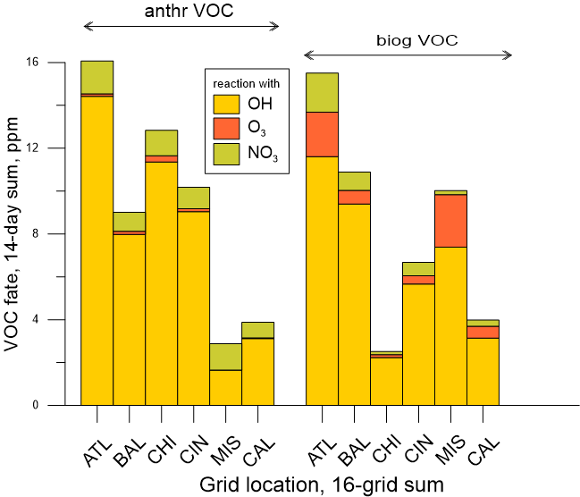
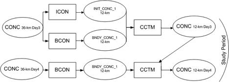

<!-- BEGIN COMMENT -->

[<< Previous Chapter](CMAQ_UG_ch08_analysis_tools.md) - [Home](README.md) - [Next Chapter >>](CMAQ_UG_ch10_HDDM-3D.md)

<!-- END COMMENT -->

# 9. Process Analysis and Budget

## 9.1 Introduction
Most applications of CMAQ, as well as other 3-D grid models, output concentration fields of chemical species of interest at selected time steps that reflect the cumulative effect of all processes (emissions, chemical reaction, transport, etc.) that act on the chemical species over the time period. Several features in CMAQ allow the user to better understand which processes impacted model predicted concentrations. These options provide information about specific chemical and physical processes to provide insight about contribution and uncertainty. Process Analysis (PA) is a technique for separating out and quantifying the contributions of individual physical and chemical processes to the changes in the predicted concentrations of a pollutant. PA does *not* have to be activated in a CMAQ simulation but including PA in a simulation during runtime provides additional information that can be useful in interpreting CMAQ results. PA has two components: Integrated Process Rate (IPR) analysis and Integrated Reaction Rate (IRR) analysis. IPR analysis quantifies the net change in species through physical processes of advection, diffusion, emissions, dry deposition, aerosol processes, and cloud processes. It also provides an estimate of the overall impact of chemical processes. IRR analysis allows the output of individual chemical reaction rates or user-specified combinations of chemical reactions and species cycling. The Budget Tool (section 9.7) is an optional ascii output that summarizes the domain-wide process changes gathered by the IPR analysis. 

As a tool for identifying the relative importance of individual chemical and physical processes, PA has many applications, including:

- Quantifying major contributors to the concentration of a chemical species at a grid cell. PA can be used to split out the contributions of multiple, complex processes that control species concentrations. PA is useful for species that have both production and decay processes occurring in the same time step, including cases where the final concentration may show little change, but individual decay and production rates may be large.

- Characterizing the chemical state of a particular grid cell.  PA with IRR can be used to calculate quantities such as the production of odd oxygen, the production of new radicals, the ozone production efficiency and the termination of radicals. (For example, see Tonnesen and Dennis, 2000.)

- Aiding model development. PA can help predict and evaluate the effect of modifications made to a model or process module.

- Identifying compensating or unresolved errors in the model or input data which may not be reflected in the total change in concentration. For example, if an error in the emissions input data causes the model to calculate negative concentration values in an intermediate step, this could be masked in the final predicted concentrations if compensated for by larger positive values resulting from the chemistry calculations.

PA variables are computed by saving the differential operators associated with each process or reaction, integrated over the model synchronization time step for the same variables that are used in solving the continuity equations within the model. For processes that are solved simultaneously in the same operator, PA uses mass balance to compute the contribution of each process.

A user activates PA during CMAQ runtime and includes a PA input file to specify whether IPR, IRR or both analyses are performed, and defining what variables are required for each analysis. The IRR parameters are highly customizable and can be easily modified but must be checked carefully before running the model to ensure that they correspond to the mechanism being used. A control file is distributed with CMAQ that corresponds to each chemical mechanism supported by that version of the model. This file can be used as distributed or modified to meet program specific objectives. The derivation of PA and format of input files specific to CMAQ incorporation is detailed in Gipson et al., (1999), and a further description of the science behind PA is provided in Tonnesen (1994) and Jeffries and Tonnesen (1994).

## 9.2 Use of Process Analysis

**Step 1: Activate Process Analysis and specify control files**

- setenv CTM_PROCAN Y:N

Set this variable to Y to indicate that you want process analysis to be activated. The default is N. If this is set to Y, then you must also specify the following two files:

 - setenv PACM_INFILE [filename]
 - setenv PACM_REPORT [filename]

PACM_INFILE is the input file that specifies the desired output information (read by pa_read.F).  Gipson et al., (1999), details the types of equations and operators that can be used, with a brief summary here in Table 1. A standard input file is distributed with CMAQ for each chemical mechanism supported by that version of the model. PACM_REPORT is the output file that displays how CMAQ translates the variables listed in PACM_INFILE, and lists the reactions (including reactants, products and yields) that will be used in calculating the IPR and IRR values. Users should check this file on the first iteration of a new PA simulation to ensure that CMAQ is interpreting the variables as the user intended.

The user can also specify an optional subdomain for the IPR/IRR output.  If these variables are not specified, the default domain is the entire CMAQ domain, however, the user may want to limit the portion of the domain where output is written because the files can get large. This is done using the variables:

-   setenv PA_BCOL_ECOL "[start] [end]"
-   setenv PA_BROW_EROW "[start] [end]"
-   setenv PA_BLEV_ELEV "[start] [end]"

where integers [start] and [end] are the starting and ending grid columns, rows, or vertical levels. These optional variables are used to specify the modeling grid domain column range, row range, and layer range for the process analysis calculations. Set to the two digits representing the start and end columns, rows and layer numbers bounding the process analysis domain. The user must be careful that the columns, rows, and levels are not outside of the current CMAQ domain.

**Step 2: Ensure that output files are being written and that the output variables have been correctly specified**

A PACM_REPORT file, with the name specified in Step 1, is output for every day of simulation, along with daily IRR or IPR files, depending on whether IRR or IPR was specified.  If there is a formatting error in the PACM_INPUT file, CMAQ will not run and the CMAQ log files must be checked to determine where the error occurred. The PACM_REPORT file will list the reactions that are used to interpret each of the reactions/families/cycles/operators specified by the user in the PACM_INPUT file.  For complex operations (such as those including families or cycles), the user must ensure that the output appropriately reflects the information provided in the process analysis input control file.

The output files are specified in the CMAQ runscript by:

-    setenv CTM_IPR_1 [filename] (....similarly for CTM_IPR_2 and CTM_IPR_3)

-    setenv CTM_IRR_1 [filename] (....similarly for CTM_IRR_2 and CTM_IRR_3)

IPR files are only created if IPR is turned on in the PACM_INFILE (IPR_OUTPUT specified), and IRR files are only created if IRR is specified (IRRTYPE = PARTIAL or FULL).  The number of output files created (whether 1,2 or 3) depends on the number of variables specified; for example, only one will be created for the sample input file delivered as part of the CMAQ release.

**Step 3: Post process output files**

The output files are in the same units as the concentration files and can be post-processed using the same utilities used to post-process the CMAQ concentration files. In particular the following utilities may be helpful:

-   combine (to combine multiple days in one file, to match density or layer height with IPR or IRR variables)
-   m3tproc (to sum up throughput over multiple days)
-   vertot (to sum up throughput over several layers, such as the PBL)
-   verdi (to view spatial heterogeneity in process throughput)

## 9.3 Description of the PACM_INFILE

The PA input file (PACM_INFILE) is the user-tailored file that controls the parameters that are calculated and output at each time step.  Depending on the specificity of the output, the file will need to be tailored to the chemical mechanism used in the simulation, because species names and reaction numbers vary among different mechanisms.  For example, components of oxidized nitrogen, such as organic nitrates, are represented by species NTR1 + NTR2 + INTR in CB6, but  by RNO3 in SAPRC07. In addition, if IRR outputs are specified by label, the user must ensure that the labels are appropriate for the mechanism being used.

The user can define families of similar pollutants, specify cycles, and reaction sums that can be used in subsequent IPR and IRR equations, which can simplify the specification of quantities.  DEFINE FAMILY is useful when the user wants to follow the sum of several different species, for example:

- DEFINE FAMILY NOX = NO + NO2

This will allow the user to specify operations of both NO and NO2 by using the user-specified family name NOX. Cycles are important because many species have reactions in which they decay and reform quickly.  In some cases, the production and loss terms may both be large and obscure the information that is desired.

- DEFINE FAMILY PANcyc = PAN

A user-specified name, PANcyc, can be used in place of PAN in further operations, to remove the effect of rapid reactions that recycle PAN rapidly.  Cycles (as well as other quantities) can also be defined with the RXNSUM statement:

- DEFINE RXNSUM CLNO3cyc      = <CL28\> - <CL30\>

This will store the net throughput of the reaction labeled CL28 minus reaction labeled CL30 (i.e. in CMAQ-CB6, the net production of species CLNO3) in a user-specified variable named CLNO3cyc.

**Table 9-1. Parameters used in PACM_INFILE**

|**First string**| **Second string** |**Third string**|**Remainder of line**|
|:-------------|:----------------------------|:-----|:-----------------------------|
|DEFINE FAMILY|[descriptor]|=|list of chemicals separated by + |
|DEFINE CYCLE|[descriptor]|=|chemical name|
|DEFINE RXNSUM|[descriptor]|=|list of reactions separated by +|
|IPR_OUTPUT|[chemical/family name]| = |physical process names and/or CHEM |
|IRR_OUTPUT|  FULL:PARTIAL:NONE     |
|IRR_OUTPUT|[descriptor]| = |reaction label, combination of species reactions, etc.|

## 9.4 Parameters for IPR

Each line for IPR output begins with IPR_OUTPUT, followed by the chemical species or the species family for which output is desired and the processes to be output.  If the processes are omitted, then the default is all processes.  The available processes are listed in Table 9-2.  In the sample file, for example:

IPR_OUTPUT O3    =  CHEM+DDEP+CLDS+AERO+TRNM;

specifies that the output includes the change in species O3 over the time step for the net sum of
all chemistry processes, the net dry deposition, the net change in concentration due to clouds, aerosol
processes, and total transport.  If the species is a family name instead of a species name, the outputs
will be calculated for the sum of each species in the family.

**Table 9-2. Allowable parameters for process outputs**

|**LPROC**|**process**| **Description**|
|:-------|:-----|:---------|
|1|XADV| X-direction horizontal advection|
|2|YADV| Y-direction horizontal advection|
|3|ZADV| vertical advection|
|4|HDIF| horizontal diffusion|
|5|VDIF| vertical diffusion|
|6|EMIS| emissions contribution to concentration|
|7|DDEP| dry deposition of species|
|8|CLDS| change due to cloud processes; includes aqueous reaction and removal by clouds and rain|
|9|PVO3| potential vorticity contribution to O3 mixing between the upper troposphere and stratosphere|
|10|CHEM| net sum of all chemical processes for species over output step|
|11|COND| change in aerosol species due to condensation|
|12|COAG| change in aerosol species due to coagulation|
|13|NPF| change in aerosol species due to new particle formation|
|14|GROW| change in aerosol species due to aerosol growth|
|1+2|HADV| total horizontal advection|
|1+2+3|MADV| Horizontal and vertical advection|
|4+5|TDIF| Total diffusion of species|
|1+2+3+4+5| TRNM|Total mass-conserving transport of species|
|11+12+13+14|AERO| change due to aerosol processes|

## 9.5 Parameters for IRR

The specification for parameters in IRR output begins with IRR_OUTPUT followed by a user-defined name for the quantity and an equation specifying how it is to be calculated. The operators used in constructing these equations are explained in more detail in Gipson et al. (1999), and a brief summary of the allowable operators is included in Table 9-3.  The equation could include a reaction label or an operator for a chemical species or family.  For example:

IRR_OUTPUT NewClrad = 2.0*<CL1\> + <CL2\> + <CL8\> + <CL25\>

would sum the throughput of reactions labeled CL2, CL8, and CL25 and 2 times the throughput of reaction labeled CL1. The sum for each time step and each grid would be in the variable NewCLrad defined by the user.

**Table 9-3. Allowable operators for Integrated Reaction Rate outputs**

|**Operator**          | **Description**|
|:------|:----|
|PROD[x] {FROM [y] {AND/OR [z]}} | sum of throughput from all reactions where species (or family) x is a product.  Optional qualifiers limit to reactions were species y or z are reactants|
|NETP[x] {FROM [y] {AND/OR [z]}} | similar to PROD but only uses reactions where net production is greater than zero|
|LOSS[x]  {AND/OR[y]}| All loss of species/family x; could be limited to only reactions where both x and y or x or y are lost|
|NETL[x] {AND/OR [y]} | similar to LOSS but only uses reactions where net loss of x {and/or y} is greater than zero|
|NET[x]| the net of the production and loss for all reactions in which x is a product or reactant|
|cyclename[POSONLY:NEGONLY]| calculates the net impact of a cycle defined earlier.  Using optional qualifiers will output values only if the net is positive or negative.

## 9.6 Example IRR applications

IRR can be endlessly customized to examine many different processes and combinations of processes.  Below are two examples of how IRR can be used.

**Example 1: Examine fate of VOC reactions**.  In this example, we have defined a family "aVOC" to be the sum of all (mostly) anthropogenic VOCs used in CMAQ-CB6 (Luecken et al., 2019), and then quantified the loss of the family through reaction with the oxidants OH, O3 and NO3:

- DEFINE FAMILY aVOC = FORM +ALD2 +ALDX +PAR +ETHA +PRPA +MEOH +ETOH +ETH +OLE
 +IOLE +ACET +TOL +XYLMN +GLYD +GLY +MGLY +KET +CRON +NTR1 +OPEN +CAT1 +CRES
 +XOPN +NAPH + TO2 + BZO2 + XLO2 + ROR + XPRP + ROOH;
- IRR_OUTPUT aVOCwithOH = LOSS[aVOC] AND [OH];
- IRR_OUTPUT aVOCwithO3 = LOSS[aVOC] AND [O3];
- IRR_OUTPUT aVOCwithNO3 = LOSS[aVOC] AND [NO3];

We have summed the throughputs over 2 weeks (July 1-14, 2011), within the first level of the model, and compared these three output pathways at four locations throughout the U.S. Figure 9-1 shows the sum through each of these processes at 6 different grid areas, including 4 urban areas and 2 rural areas.  This figure also includes the corresponding fate for the largely biogenic VOCs, although note that some VOCs, such as formaldehyde and ethanol can be both anthropogenic and biogenic.

**Figure 9-1.  Relative contribution of oxidation pathways for VOCs using Process Analysis**

**Example 2: Quantify the major contributors to the production of HNO3**.  In this example, we develop output variables to represent the total production of HNO3 in CMAQ-CB6 and the individual reactions which contribute to this total production:

- IRR_OUTPUT HNO3prod = PROD[HNO3];
- IRR_OUTPUT HNO3fromOHNO2 = <R45\>;
- IRR_OUTPUT HNO3fromhetNTR = <HET_NTR2>;
- IRR_OUTPUT HNO3fromN2O5 = <HET_N2O5IJ> +<HET_N2O5K> +<HET_H2NO3PIJA>
      +<HET_H2NO3PKA>;
- IRR_OUTPUT HNO3fromNO3 = PROD[HNO3] FROM [NO3];
- IRR_OUTPUT HNO3frCLNO3= <HET_CLNO3_WAJ>;

In this case, we have summed up all throughput over the first 15 levels of the model (approximating the PBL) and over the same 14-day time period.  Figure 9-2 shows the relative contribution of processes to the total HNO3 formation at three grids.  In this case, at the two more urban grids, the reaction of OH+NO2 dominates the formation of HNO3 in summer, while at the rural grid cell (Missouri), the heterogeneous hydrolysis of alkyl nitrates is predominant.

**Figure 9-2. Relative contribution of HNO3 formation pathways at three grid locations**

## 9.7 Budget Tool

The existing Process Analysis module outputs process rates for variables or families of variables on a gridded domain. 
The Budget Tool outputs as a text file (CCTM_BUDGET_xxx.txt), the domain-wide process rates and total abundance change for every variable or family requested by the user in the CMAQ_Control_Misc.nml file. 
Output is produced for every output time step (generally hourly). Units for both gases and particles are in kilograms per output time step.

The output produced by the Budget Tool is quite powerful when applying or developing CMAQ. It can be used to better understand the large-scale source and loss pathways of individual trace species or families of species. For example, the fraction of a species that is transported out of the domain versus lost by dry or wet deposition is immediately accessible as a function of output time step. Additionally, one can use this output to diagnose potential errors if, for example, the Budget Tool reports emissions or chemical production of a species and the developer knows it should not be possible. Figure 9-3 illustrates process rates for O3 for an annual simulation of 2016. The top bar of each pair dileneates the rates by season of the year, while the bottom bar shows the contribution split between day and night.

To activate (or deactivate) the Budget Tool calculation and output, set the variable Budget_Diag to .TRUE. (or .FALSE.) in the &Budget_Options section of the CMAQ_Control_Misc.nml namelist. Here the user may also choose the variables they would like to output data for. The default is 'ALL' CMAQ species, including transported, non-transported, reactive, and non-reactive species. 
Alternatively or additionally, a list of species may be given, including names of chemical families, defined by the user in the &Chemical_FamVars section of the CMAQ_Control_Misc.nml file. 
Lastly, if an aerosol species name is provided (e.g. 'ASO4', 'AEC') without the suffix denoting an aerosol mode, the Budget Tool will provide the sum of the process changes across all modes.

**Figure 9-3. Contribution of model processes to O3 production and loss during a CMAQ simulation of the U.S. for 2016**

## 9.8 References

Gipson, G.L. (1999). Chapter 16: Process analysis. In science algorithms of the EPA models-3 Community Multiscale Air Quality (CMAQ) Modeling System. EPA/600/R-99/030.

Jeffries, H. E., & Tonnesen, S. (1994). A comparison of two photochemical reaction mechanisms using mass balance and process analysis. Atmos. Env., 28(18), 2991-3003.

Luecken, D.J., Yarwood, G., & Hutzell, W.H. (2019). Multipollutant modeling of ozone, reactive nitrogen and HAPs across the continental US with CMAQ-CB6. Atmospheric Environment, 201, 62-72.

Tonnesen, S., & Jeffries, H.E. (1994). Inhibition of odd oxygen production in the carbon bond four and generic reaction set mechanisms. Atmospheric Environment, 28(7), 1339-1349.

<!-- BEGIN COMMENT -->

[<< Previous Chapter](CMAQ_UG_ch08_analysis_tools.md) - [Home](README.md) - [Next Chapter >>](CMAQ_UG_ch10_HDDM-3D.md) 
CMAQv5.5 User's Guide  

<!-- END COMMENT -->
