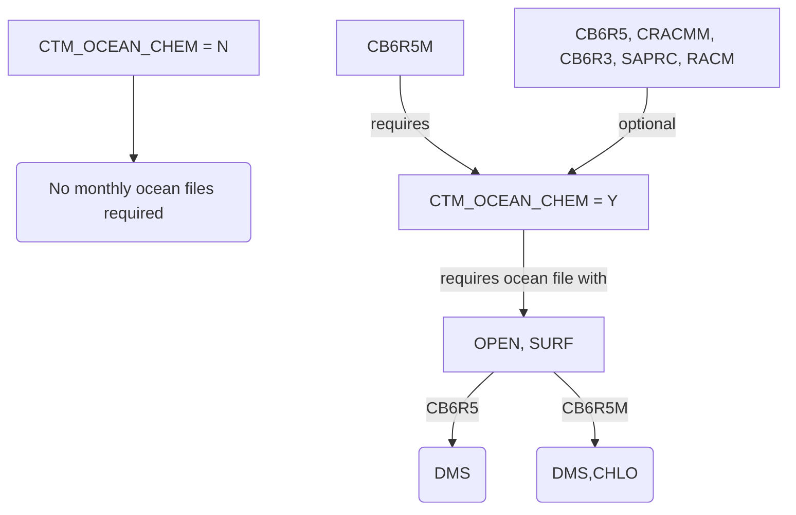

## CMAQ Tutorial ##
### Creating an OCEAN file for input to CMAQ ###
Purpose: This tutorial describes how to create an ocean mask file that defines the fraction of each grid cell covered by open ocean or surf zone in the CMAQ modeling domain and for adding the variables DMS and CHLO to the ocean file.

------------

The CMAQ sea spray emissions module requires the input of an ocean mask file (OCEAN). OCEAN is a time-independent I/O API file that identifies the fractional [0-1] coverage in each model grid cell allocated to open ocean (OPEN) or surf zone (SURF). The CCTM uses this coverage information to calculate sea spray emission fluxes from the model grid cells online during a CCTM run.

Additionally, CMAQ's gas-phase chemical mechanisms except cb6r5m_ae7_aq contain an effective first order halogen mediated ozone loss over the ocean (where OPEN + SURF > 0.0) and also require the OCEAN file. The cb6r5m_ae7_aq mechanism contains bromine, iodine and DMS chemistry, and also requires the OCEAN file with two additional variables: DMS (monthly mean climatological DMS concentrations in seawater) and CHLO (monthly mean climatological chlorophyll concentration). The cb6r5_ae7_aq mechanism contains DMS chemistry and requires the OCEAN file with DMS (monthly mean climatological DMS concentration in seawater). 



If your domain includes ocean, OPTION 1 is recommended. However, if your modeling domain does not contain any ocean, or you wish to bypass the CMAQ sea spray module and the reaction of ozone with oceanic halogens, follow OPTION 2 or 3.

## OPTION 1: Create OCEAN file from shapefile of domain

### STEP 1: Download the Spatial Allocator</strong>

The Spatial Allocator (SA) tool can be downloaded from the CMAS Center at the following link: https://www.cmascenter.org/sa-tools/. Login and follow the download and installation instructions.

### STEP 2: Create the OCEAN file

If your domain is in the U.S., there is a shapefile included with the SA tool in the data directory (surfzone_poly_st.shp). If your domain is outside the U.S., you will need a shapefile of your domain. See the surfzone_poly_st.shp for a template of the attributes required by the Spatial Allocator for generating an OCEAN file.

Using the sample script `alloc_srf_zone_to_oceanfile.csh` (located in the **scripts** directory of the SA tool) as a guide, customize a script to run the SA executable on your machine.

The default alloc_srf_zone_to_oceanfile.csh script is shown below. To customize this script for a new domain, set the `GRIDDESC` variable to point to an I/O API grid description file that includes the new domain definition. Set `OUTPUT_GRID_NAME` to the name of the new grid as defined in the GRIDDESC file. If needed, change the `OUTPUT_FILE_MAP_PRJN` variable to the projection definition for the new domain.

```
#! /bin/csh -f
#******************* Allocate Shapefiles Run Script **************************
# Allocates a polygon shapefile's data to an I/O API gridded file
#*****************************************************************************

setenv DEBUG_OUTPUT Y

# Set executable
setenv EXE "$SA_HOME/bin/32bits/allocator.exe" #change this to 64bits instead of 32bits if you have a 64bit machine

# Set Input Directory
setenv DATADIR $SA_HOME/data
setenv OUTPUT $SA_HOME/output

# Select method of spatial analysis

setenv MIMS_PROCESSING ALLOCATE

setenv TIME time

#set "data" shapefile parameters
setenv GRIDDESC $DATADIR/GRIDDESC.txt

#set parameters for file being allocated
setenv INPUT_FILE_NAME $DATADIR/surfzone/surfzone_NC_SC
setenv INPUT_FILE_TYPE ShapeFile
setenv INPUT_FILE_MAP_PRJN "+proj=lcc,+lat_1=33,+lat_2=45,+lat_0=40,+lon_0=-97"
setenv INPUT_FILE_ELLIPSOID "+a=6370000.0,+b=6370000.0"
setenv ALLOCATE_ATTRS TYPE
setenv ALLOC_MODE_FILE ALL_AREAPERCENT

#Set this to SURF_ZONE to create the variables needed for CMAQ OCEANfile
setenv ALLOC_ATTR_TYPE  SURF_ZONE

# Set name and path of resulting shapefile
setenv OUTPUT_FILE_TYPE IoapiFile
setenv OUTPUT_GRID_NAME NC4KM
setenv OUTPUT_FILE_MAP_PRJN "+proj=lcc,+lat_1=33,+lat_2=45,+lat_0=40,+lon_0=-97"
setenv OUTPUT_FILE_ELLIPSOID "+a=6370000.0,+b=6370000.0"
setenv OUTPUT_FILE_NAME $OUTPUT/ocean_file_${OUTPUT_GRID_NAME}.ncf

#echo "Allocating surf zone data to CMAQ OCEANfile"
$TIME $EXE
```

Run the script and check the output directory designated in the run script for the new OCEAN file.

### STEP 3: Add DMS and CHLO to the OCEAN file

This section uses a Jupyter Notebook. Jupyter Notebooks can be run on cloud-based systems like SageMaker, Binder, Google Colab, or any linux system with Jupyter installed (https://jupyter.org/install).

The Jupyter notebook CMAQ_DMS_ChlorA.ipynb (located in the [PYTOOLS][link_1] directory) can be used to add DMS and CHLO to the existing OCEAN file. See the tool’s [README][link_2] for instructions on how to configure an environment for this notebook. The notebook requires setting the following 6 variables: dom, ocnintmpl, ocnouttmpl, gdpath, overwrite, getlatestchlo.

Variable “dom” is the output domain which can be defined as follows (12US1 is the output domain name):
dom = '12US1'

Variable “ocnintmpl” is the  location of the existing OCEAN file containing OPEN and SURF. The notebook will add DMS and CHLO to this file:
ocnintmpl = f’/work/MOD3DATA/2016_12US1/surface/12US1_surf.ncf’

Variable “ocnouttmpl” is the location of the new OCEAN files to be created by the notebook:
ocnouttmpl = f'output/{dom}/OCEAN_%m_L3m_MC_CHL_chlor_a_{dom}.nc'

Variable “gdpath” is the path of an IOAPI file using the domain. For most cases, the path of the existing ocean file (ocnintmpl) can be used. 
gdpath = ocnintmpl

The notebook creates many intermediates files. Variable “overwrite” is used to control the intermediate files. Assigning it “False” will keep the existing intermediate files which is faster when re-processing files for a domain. Otherwise, assign it “True”.  In most cases, users can keep it as “False”.
overwrite = False

The notebook obtains monthly mean climatology from NASA which is controlled by a variable “getlatestchlo”. If it is set to “False”, then it uses a previously downloaded climatology from NASA. If it is set to “True”, then it downloads the latest climatology from NASA. In most cases, users can keep it as “False”.
getlatestchlo = False

Once these variables are set, then users can execute the script to generate ocean files for the domain. It will create 12 monthly ocean files; each file will contain OPEN, SURF, DMS and CHLO. Check the output directory (ocnouttmpl) designated in the script. Month-specific ocean file needs to be used in the CMAQ model for DMS and halogen chemistry.

## OPTION 2: Run without an OCEAN input file in CMAQv5.3 and later
If your modeling domain does not contain any coastal area, you can run CMAQ without an OCEAN input file. This will turn off both sea-spray emissions and the first-order decay of ozone over the ocean. To do this, set the run script option "CTM_OCEAN_CHEM" to "N" or "F". 

If using cb6r5_ae7_aq and you prefer not to use DMS chemistry, the m3fake approach below can be adapted to create a DMS variable with zero values.

## OPTION 3: Zero Out Sea-Spray Emissions in CMAQv5.2 or earlier

Even if your modeling domain does not contain areas of sea spray emissions, you need to provide an OCEAN file to the CCTM. You can create a dummy OCEAN file for domains with no sea spray sources or if you prefer to set sea spray emissions to zero. Copy and run the following I/O API Tool m3fake script to create an OCEAN file containing zeros for the open ocean and surf zone coverage fractions. Using this file will effectively configure a CCTM simulation with zero sea spray emissions.  

Note that you will need the [I/O API Tools](www.cmascenter.org/ioapi) installed and compiled on your Linux system to use this script.

```
#!/bin/csh -f

# m3fake script to create a dummy ocean file

setenv GRIDDESC $CMAQ_HOME/data/mcip/GRIDDESC
setenv GRID_NAME SE52BENCH
setenv OUTFILE $CMAQ_HOME/data/ocean/ocean_file.dummy.$GRID_NAME.ncf
m3fake << EOF
Y
2
SE52BENCH
1
0
2
OPEN
1
open ocean fraction 
1
5
0.
SURF
1
surf zone fraction
1
5
0.

OUTFILE
EOF
```

After running the script, check for the output file designated in the above script and use it in place of the OCEAN file in the CCTM.


<!-- START_OF_COMMENT --> 

[link_1]: ../../../PYTOOLS/
[link_2]: ../../../PYTOOLS/dmschlo/

<!-- END_OF_COMMENT -->

[link_1]: https://github.com/USEPA/CMAQ/blob/main/PYTOOLS/
[link_2]: https://github.com/USEPA/CMAQ/blob/main/PYTOOLS/dmschlo/