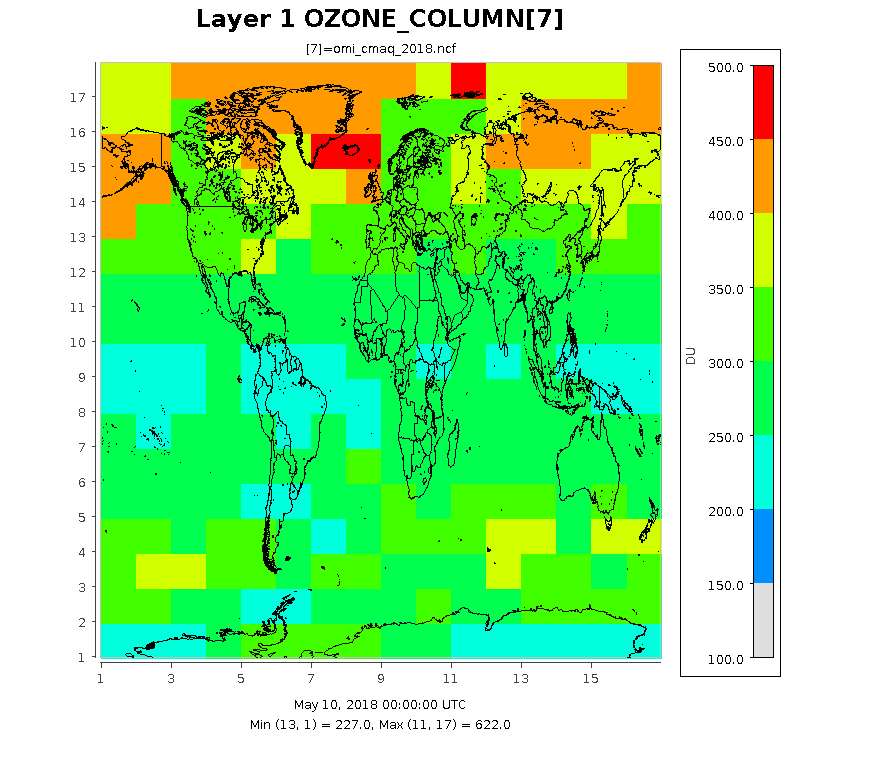

# create_omi 

This tool creates the OMI input file describing how total ozone column density varies over the globe and time.
The file supports CMAQ model's in-line calculation of photolysis rates. Creating the OMI file involves processing 
observations from satellites, ASCII files for the latitude/longitude distribution of the ozone column for a calendar 
day. The tool also creates IOAPI files for visualizing observations and the OMI file's data. They can 
differ because the tool interpolates observations to horizontal resolution of the OMI file. The resolution is 
an option specified by the run-script.

### Compiling create_omi

Compiling requires a **FORTRAN** compiler, **netcdf** and **IOAPI**. 
If the requirements are met, a user has the below options.  

   1. Option One:  
      - Copy src directory.
      - Go into the new directory and modify create_omi.makefile, _the_Makefile_, to define the compiler, library and include paths for netcdf and
        IOAPI for the case(s) needed.
      - Set the environment variable _compiler_ to intel, pgi or gcc based on the user's 
   preference.  
      - Type "make clean" then type "make -f create_omi.makefile".  
      
   2. Option Two, _requires the bldmake utility for the CMAQ model_: 
       - Execute $CMAQ_HOME/bldit_project.csh with EXT_create_omi option set to Y.
       - Change directory to $CMAQ_HOME/PREP/create_omi.
       - Type bldit_create_omi.csh _compiler_. 
       - If you wish to recompile create_omi, go into the created build directory, type "make.it clean".
       
### Using create_omi for creating an OMI file

#### Satellite Inputs

To create an OMI file, data for total ozone column density is required. The create_omi tool can use daily ASCII files from two 
sources via the wget or curl command.  

      
   1. NASA TOMS ftp site:  
      - https://acd-ext.gsfc.nasa.gov/anonftp/toms/omi/data/Level3e/ozone
      - Lat/Lon resolution determined from first data file read
      - expected filename structure, _L3e_ozone_omi_YYYYMMDD.txt_
      - expected data format
        a. (a) with descriptive information
        b. (12x,i6) in second and third lines giving the number of latitude and longitude points 
        c. (1x,25i3) in remaining line sgiving total ozone total

   2. NASA OPeNAP website: 
       - http://acdisc.gsfc.nasa.gov/opendap/HDF-EOS5/Aura_OMI_Level3/OMTO3d.003
       - requires creating an account and local _cookies_ 
       - Lat/Lon resolution is assumed to be 1 by 1 degree ot 180 latitude by 360 longitude points
       - expected filename structure, _OMI.full.YYYYMMDD.ascii_ or _OMI.ozone.YYYYMMDD.ascii_
       - expected data format, comma-space 
         a.  character string then total ozone column versus longitude at fixed latitude
          
       
Both sources were lasted accessed in May of 2020.

The scripts directory contains an example for getting data from the NASA TOMS website, _scripts/get_toms_data.q_.
When obtaining data files, we recommend getting files bracketing the desire peroid by several days because 
observations may not available within given latitude/longitude ranges. The omission can occur because of the 
satillite's orbit, polar night, or equipment failure. To go around the problem, create_omi uses 
the last available observation or the mean value for a location, in respective presidence. For robust and more useful
output files, several months of data are suggested.

After downloading data, the get data script checks the downloaded files for \*\*\* strings and replaces each with the string "  0" (two blanks) which denotes a missing value. Sometimes, the former string passes through quality control procedures. The script uses the below commands to make corrections.

                  grep -l "\*\*\*" L3e_ozone_omi_*.txt
                  sed 's/\*\*\*/  0/g' L3e_ozone_omi_YYYYMMDD.txt > tmp.txt
                  mv -f tmp.txt L3e_ozone_omi_YYYYMMDD.txt

Alternatively, a user can search the downloaded files and use a text editor to replace the bad data strings. 
      
#### Running create_omi  

The script subdirectory includes a run-script, _scripts/run_create_omi.csh_. 
A user should Copy and modify the script before running it. The script sets several environment 
variables that are runtime options. The below table lists and describes these options. Note that
the Defaults values were used to create the OMI file the CMAQ repository under CCTM/src/phot/inline and that 
the output data is centered and symmetric about the equator. The create_omi tool assumes that all the data files have the same
Lat/Lon resolution.

##### Runtime Options

|Option         |Description                                            | Default Value |  
|:--------------|:------------------------------------------------------|:----:|
| OMI_FILE_LIST | List of data files to process, sorted by calendar date     | omi_file.txt |
| PREV_DATE     | Replace missing observation with last previous observation | True |
| NLAT_OMI      | Number of latitude points in output. Value should be odd and equal or greater than 17 | 17 |
| NLON_OMI      | Number of longitude points in output. Value should be odd and equal or greater than 17 | 17 |
| LAT_BORDER    | Degrees between the first latitude point from adjacent pole. Value cannot be less than observation | 10 |
| FULL_FILES    | Produce ASCII and IOAPI files at full lat/lon resolution of observations. Not used by the CMAQ model. | False |
| OMI_FULL_DAT  | OMI data (ASCII) at Lat/Lon Resolution of Observations | omi_full.dat |
| OMI_FULL_NCF  | OMI data in IOAPI format for visualization at Lat/Lon Resolution of Observations | OMI_FULL_NCF |
| OMI_CMAQ_DAT  | Processed OMI file (ASCII) for the CMAQ model  | omi_cmaq.dat |
| OMI_CMAQ_NCF  | Processed OMI file in IOAPI format for visualization | OMI_CMAQ_NCF |

####  Example Images extracted from IOAPI files.  

The following images show the ozone column at three different resolution for the same date. The images were created form output
files by using eighteen months of data from the TOMS ftp site.

1.   10 by 22.5 degree Lat/Lon Resolution (default values) currently used in OMI data file under **CCTM/src/phot/inline**.

2.   1 by 1 degree Lat/Lon Resolution as determined by the settings in _scripts/cmaq_omi_env.q_.

2.   0.25 by 0.25 degree Lat/Lon Resolution taken from the OMI_FULL_NCF file.

