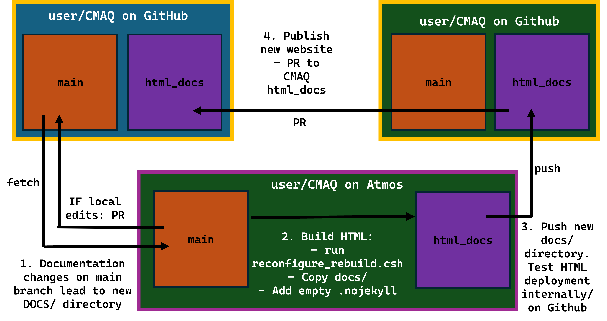

# Sphinx Usage Guide - CMAQ Documentation

**Edited** from the [CRACMM Sphinx Usage Guide](https://github.com/USEPA/CRACMM/blob/CRACMMdocs/sphinx/README.md)

This page provides documentation for the process of using Sphinx to build HTML for the CRACMM website. It is primarily intended for CRACMM developers at the EPA. Others may or may not find the information presented here useful.

[Sphinx](https://www.sphinx-doc.org/en/master/) is a software written in Python that is used to create HTML files based on already existing files. It is typically used to create websites that document software and it can be used in combination with GitHub's [Pages](https://pages.github.com/) utility to publish a website based on a GitHub repository. This page explains how Sphinx is used to create a GitHub site for the CRACMM repository using Sphinx.

## Table of Contents
* [Repository Setup](#repository-setup): Instructions on repository expectations and how to setup your two forks for maintaining CMAQ's website.

* [Environment Setup](#environment-setup): Instructions on how to create a Python environment designed to run Sphinx on the CMAQ repository.

* [Building HTML](#building-html): Workflow summary and process for creating updated HTML pages from a newly updated DOCS/ directory and managing your forks.

* [SPHINX File Descriptions](#sphinx-file-descriptions): An overview of the project-critical files included within the SPHINX/ directory.

* [Helpful Resources](#helpful-resources): Links to websites and resources containing helpful instructions and tips for getting started, debugging, and improving a sphinx-built, Github Pages held website. 

## Repository Setup

These steps for maintaining CMAQ's Sphinx-built HTML hosted on Github Actions assume you are managing a fork of the CMAQ repository with two branches, *main* and *html_docs*. The documentation_updates branch being your workspace for updating the CMAQ markdown, configuring sphinx, and building HTML; html_docs branch being the host space for newly built HTML pages.

Critical files for maintaining the website pages are held within the SPHINX/ directory of html_docs, and can be found [here](https://github.com/USEPA/CMAQ/tree/html_docs). Copy this directory from your html_docs branch to your documentation_updates branch.

'''
mkdir {*main*}/SPHINX/
<!---IMPORTANT: Remove front slash if copying from MARKDOWN!-->
mdkir {*main*}/SPHINX/\_build/
'''

'''
cp -r {*html_docs*}/SPHINX/* {*main*}/SPHINX/
'''

To build HTML, must make copies of markdown documentation into the new SPHINX/ workspace

'''
cd {*main*}/
cp -r UTIL/ SPHINX/source/
cp -r PYTOOLS/ SPHINX/source/
cp -r PREP/ SPHINX/source/
cp -r POST/ SPHINX/source/
cp -r DOCS/ SPHINX/source/
cp -r CCTM/ SPHINX/source/
'''

## Environment Setup

1. From where you manage virtual environments, create a python virtual environment for building sphinx. Ensure python version 3.11 by specifying in the environment creation command.

'''
cd {environment_space}
python3.11 -m venv ./Sphinx_Environment
'''

2. Activate the environment in your shell, upgrade to latest pip version.

'''
source Sphinx_Environment/bin/activate.csh
pip install --upgrade pip
'''

3. Install required libraries from the SPHINX/ directory in your local html_docs branch.

'''
pip install -r {*html_docs*}/SPHINX/sphinx_requirements.txt
'''

## Building HTML

1. Fetch and make documentation edits within your main branch. PR to CMAQ main branch documentation as necessary. Once working with an appropriately updated DOCS/ folder, move on to step 2.

**Note** if making a PR to CMAQ:*main*, remove docs/ and SPHINX/ and any extra files (.ipynb_checkpoints) from workspace _and_ git cache:
'''
git rm -rf docs/
git rm -rf SPHINX/
'''

OR, add following lines to your *main*/.gitignore:

'''
SPHINX/
docs/
<!---IMPORTANT: Remove front slash if copying from MARKDOWN!-->
\*.ipynb_checkpoints
'''

2. Locally, enter your main branch SPHINX/ directory (see [Repository Setup](#repository-setup)) and run reconfigure_rebuild.csh. This will create a new docs/ directory.

'''
cd {*main*}/SPHINX/
./reconfigure_rebuild.csh
'''

When copying the HTML build in docs/, must add an empty .nojekyll file to new location. To remove cached data from previous builds, make a clean docs/ directory in your html_docs branch.

'''
git rm -rf {*html_docs*}/docs/
mkdir {*html_docs*}/docs
'''

'''
cp -r {*main*}/docs/* {*html_docs*}/docs/
touch {*html_docs*}/docs/.nojekyll
'''

3. May test functionality of new HTML pages on internal HTML servers or by pushing to user-owned html_docs branch and deploying the build from the Github Pages space of this branch.

4. Once website changes have been reviewed, submit a PR to CMAQ:html_docs branch with clean, updated repository.

## SPHINX File Descriptions
* **rebuild.csh**: C-shell script that rebuilds the HTML files deployed by Github Pages. Processes in the file include interface commands and calls to python scripts that, in order:
    - copies a fresh, uncached version of DOCS/ into the source directory
    - deletes old files from the build directory (if existing)
    - calls Comment_Deleter.py (see file description below)
    - builds new HTML using sphinx, writing build warnings to build_warnings.txt
    - replaces (or creates) docs/ directory with new website build at top-level of repository
    
* source/**conf.py**: Configures the sphinx build; comments within file detail the developed configuration.

* source/**index.md**: The CMAQ Website home page. This markdown file does not exist in the main CMAQ repository. Aside from the file header and general info. at top of file, a combination of myst, markdown, and restructured-text is used. Six home page icons and the global toctree (top-level menu of the primary sidebar) are created.

* **Comment_Deleter.py**: Deletes comments from CMAQ's Github markdown documentation to host a second, separate version of the documentation that will be hosted within HTML. Commentary of script included within.

* **sphinx_requirements.txt**: Python libraries and versions used to deploy the current website pages. See [Environment Setup](#environment-setup) for use.

* **Makefile / make.bat**: Files required by the sphinx software to generate the HTML appropriately; should not need changed.

* source/**\_static/**: Logo and icon files used throughout website.

* source/**\_templates/sbt-sidebar-nav.html**: An edited version of the Pydata theme sidebar, commentary within. Additional custom sidebar files (previously used) included in this directory, not currently in use.

* source/**license.md**: Must make sure it was transferred in earlier steps.

* **build_warnings.txt**: Sphinx's outputted warnings for the HTML pages hosted in the docs/ directory after rebuild.csh is run. Consult internal and sphinx documentation for interpretting these warnings. Clicking through the HTML on local servers or through your personal Github Pages is the best way to test website functionality.

## Helpful Resources
### General Software Documentation 
* [Sphinx](https://www.sphinx-doc.org/en/master/): Homepage for Sphinx. Lots of useful deatils across the website describing how to use various Sphinx features.

* [GitHub Pages](https://pages.github.com/): Main page for GitHub Pages help. Gives some simple tutorials on how to get a Pages website up and running and has a "Pages Help" button in the upper right corner for more specific issues. 

* [MyST Parser](https://myst-parser.readthedocs.io/en/latest/): Homepage for MyST Parser. Covers all sorts of functionality of the software throughout the website.

* [MyST NB](https://myst-nb.readthedocs.io/en/latest/): Homepage for MyST NB. Discusses the extra functionality of the Sphinx extension that is not included in the MyST Parser extension.

* [Sphinx New Tab Link](https://github.com/ftnext/sphinx-new-tab-link/tree/main): GitHub page for the `sphinx-new-tab-link` extention. The readme in the root directory is helpful for explaining how to use the extension.

### Task Specific Documentation and tutorials
* [Publishing to GitHub Pages](https://youtu.be/zSZpCrwgVOM?si=XS-v_kxJ4FwPHfOi&t=440): If the website has not yet been published, this YouTube tutorial does a great job explaining how to publish your Sphinx generated HTML using GitHub Pages.

* [Sphinx Directives](https://www.sphinx-doc.org/en/master/usage/restructuredtext/directives.html): Sphinx functionality that exists beyond the ability of markdown files' syntax uses a series of "directives". Normally these would be contained within the comments of a ReStructured Text (rst) file, the native file format of Sphinx. This page details the directive options available if additional directives are desired with development of the website after the time of writing.

* [Built-in Sphinx Extensions](https://www.sphinx-doc.org/en/master/usage/extensions/index.html): This page provides a list of all built-in Sphinx extensions and allows you to navigate to the description of each one. It also describes how ot find other extensions.

* [PyData Sphinx Theme](https://pydata-sphinx-theme.readthedocs.io/en/stable/index.html): Documentation for the website's theme; project-specific configuration and debugging guide.

* [Sphinx Design](https://sphinx-design.readthedocs.io/en/pydata-theme/): A guide for working with MyST and Sphinx friendly directives for creating grids (CMAQ homepage), cards, dropdowns, badges, and buttons.

* Staring Fresh with Sphinx: Since the Sphinx project for CRACMM has already been set up, the links below will not likely be useful. However, understaning the basics of how to start a Sphinx project might become handy to some people, especially in the case that a new sphinx project needs to be created. 
    * [Sphinx Getting Started Tutorial](https://www.sphinx-doc.org/en/master/usage/quickstart.html)
    * [YouTube Sphinx Tutorial](https://www.youtube.com/watch?v=nZttMg_n_s0)

To return to the Table of Contents, click [here](#table-of-contents).

